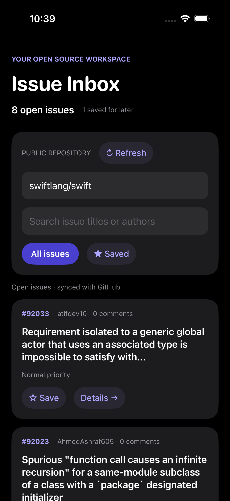
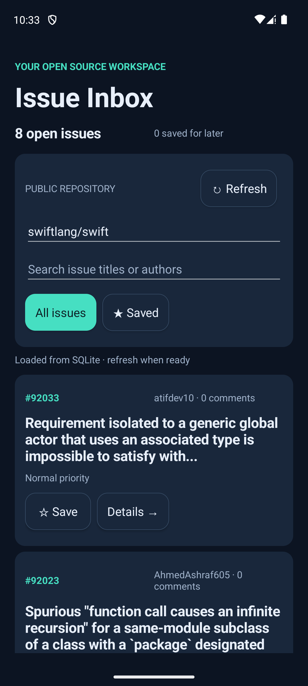

<p align="center">
  
</p>

# Osprey Programming Language

Osprey is a functional language with inferred types, algebraic effects, fiber
concurrency, and a choice of brace or ML layout syntax.

Osprey compiles through LLVM to native binaries, WebAssembly, and C ABI libraries for iOS and Android applications. Osprey is alpha software.

## Language features

- **One language, two flavors** — Default (`.osp`) uses braces, `fn`, and
  parenthesized calls; ML (`.ospml`) uses layout, currying, and whitespace
  application. Both lower to the same program representation before type
  checking and code generation.
- **Inferred types** — algebraic data types and pattern matching express state
  and failure without requiring every type annotation.
- **Algebraic effects** — typed operations and lexical handlers separate an
  operation from its implementation.
- **Isolated fiber concurrency** — fibers communicate through typed channels
  without a separate `async fn` kind.
- **Selectable memory management** — native builds support the default
  non-reclaiming allocator, tracing garbage collection (`--memory=gc`) and
  Perceus reference counting (`--memory=arc`).
- **Native, WebAssembly, iOS and Android output** — mobile applications link compiled Osprey logic through a generated C interface. C code remains outside Osprey's memory-safety guarantee.

Effect operation inputs and outputs are checked statically, and the compiler rejects unhandled effect operations at program entry. Resumable effects are supported on the host `native` target. WebAssembly and mobile C ABI targets reject unsupported operations, including `resume`, before emitting an artifact.

Each file selects its flavor by extension, a source marker, or `--flavor` for a single-file build. Project modules can import files written in either flavor; the mobile example combines an ML application with a small Default C ABI entry file.

## Example

Default flavor:

```osprey
type Lookup = Found { value: int } | Missing

fn doubleFound(result) = match result {
  Found { value } => Success((value * 2) ?: value)
  Missing => Error("value not found")
}

match doubleFound(Found { value: 21 }) {
  Success(value) => print("result: ${value}")
  Error(message) => print("error: ${message}")
}
```

ML flavor:

```osprey-ml
adder : int -> int -> Result<int, MathError>
adder a b = a + b

addTen = adder 10
answer = addTen 32 ?: 0
```

Executable language tests live in [`tests/`](tests/).

## The same app on iOS and Android

[Issue Inbox](examples/mobile/README.md) is a working reactive application built from shared Osprey modules. Osprey defines the screen tree, state transitions, GitHub requests and decoding, SQLite statements, offline cache, search, bookmarks, issue details, local notes, and priorities. SwiftUI and Android hosts provide native rendering, networking, and SQLite execution.

<p align="center">
  
  
</p>

iPhone 17 Pro simulator (left) and Pixel 7 Android emulator (right), running the same Osprey application. The signed iOS app was also installed, launched, and smoke-tested on a physical iPhone 16. Android ARM64 smoke and live GitHub checks passed; Android x86-64 was compiled and packaged. See the [run commands and validation record](examples/mobile/README.md#validation).

## Installation

Osprey invokes `clang` to compile and link native programs. Install LLVM/clang
before installing the compiler.

```bash
# macOS
xcode-select --install
brew install nimblesite/tap/osprey

# Debian/Ubuntu; lld is also used for WebAssembly
sudo apt-get install -y clang llvm lld
brew install nimblesite/tap/osprey

# Windows
scoop bucket add nimblesite https://github.com/Nimblesite/scoop-bucket
scoop install osprey
```

Homebrew's LLVM package is keg-only. If Osprey cannot find clang, add
`$(brew --prefix llvm)/bin` to `PATH` or set
`OSPREY_CC=$(brew --prefix llvm)/bin/clang`.

See the [installation guide](https://www.ospreylang.dev/docs/installation/) for
platform-specific verification and troubleshooting.

## Build and test

```bash
make build
make test
make lint
make ci
make install
```

The compiler binary is written to `target/release/osprey`.

```bash
osprey program.osp --check
osprey program.osp --compile -o program
osprey program.osp --run
osprey program.osp --target=wasm32 --compile -o program.wasm
osprey examples/mobile/inbox --target=ios --compile -o libInbox.a
osprey examples/mobile/inbox --target=android-arm64 --compile -o libInbox.a
```

The WebAssembly target supports a portable runtime subset, with file access supplied by the WASI host and a defined browser bridge. Fibers, built-in HTTP/WebSocket operations, processes, general C FFI, and resumable effects are rejected. See the [WebAssembly specification](docs/specs/0022-WebAssemblyTarget.md) and [`examples/wasm/`](examples/wasm/).

The [iOS](docs/specs/0038-iOSTarget.md) and [Android](docs/specs/0039-AndroidTarget.md) targets emit an archive and C header for the platform application to link. They require their matching SDK/NDK and runtime builds. The mobile example includes these build steps. Mobile C ABI builds currently support the default allocator, which retains general allocations for the process lifetime.

## Documentation

- [Language and engineering specifications](docs/specs/)
- [Website documentation](website/src/docs/)
- [VS Code extension](vscode-extension/README.md)
- [Contributing guide](CONTRIBUTING.md)
- [Release process](docs/RELEASING.md)

The specifications define intended behavior. Individual chapters identify
implementation gaps. The [feature status page](website/src/status.md) summarizes
implementation limits.
