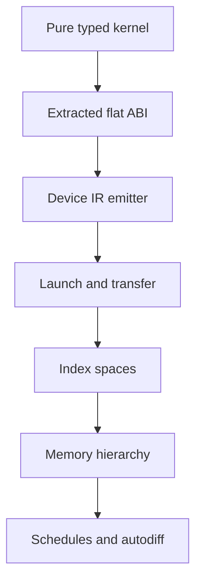

# Plan 0023 — GPU Computation: Surface Completion & Device Backends

**Subsystem:** `crates/osprey-types` + `crates/osprey-codegen` + `compiler/runtime` (+ CLI target drivers)
**Status:** **NOT SHIPPED. No GPU execution exists.** Stages 1–2 (typed
surface, purity checking, CPU host backend, eleven built-ins, differential
corpus) are done bar two items delegated to other plans. Stage 3 (kernel
extraction, `[GPU-KERNEL-EXTRACT]`) has **landed for lambda kernels** —
`crates/osprey-codegen/src/gpu_kernel.rs`, differentially gated against the
retained inlined lowering — with three kernel shapes that still decline,
listed below. Stages 4–7 — *every* device backend — are unstarted. Until
stage 4 lands, this feature runs entirely on the CPU and nothing in it may be
described as GPU-accelerated.
**Spec:** [0034-GPUComputation.md](../specs/0034-GPUComputation.md)
**Sibling plan:** [0025 — GPU graphics library
backends](0025-gpu-graphics-backends.md) owns `examples/graphics/`
(Metal + D3D12 + the shared shader library) and converges with this plan at
stage 6.

## Summary

The GPU surface is a language feature, not a library: `GpuBuffer<T>` in the
type system, kernel purity proven by the effect checker (fail-closed), and a
host execution backend whose fused loops over dense unboxed buffers define
the reference semantics device backends must reproduce byte-for-byte. Kernel
extraction has since made each kernel a real, first-order, capture-free
function — the artifact a device emitter consumes. What remains is everything
between an extracted kernel and a running device: an IR emitter, a launch and
transfer path, effect-selected execution, portability backends, and the
differentiation features (autodiff, schedules) the roadmap ends at.

## Read this first: `gpu*` does not touch a GPU

Nothing in the shipped `gpu*` surface runs on graphics hardware. `gpuMap` is a
`for` loop on the CPU, `gpuDevice()` returns the string `"host"`, and no code
path in the compiler or runtime talks to a driver. `[GPU-BACKEND-HOST]` is the
only backend that exists; `[GPU-BACKEND-DEVICE]` is stage 4 and unstarted.

The names are a *dispatch surface* — the shape a kernel must have to be
offloadable later. They are not a claim about where the work happens. Anything
that reads otherwise (a make target, a demo header, a README line) is a
documentation defect; fix it where you find it.

### What that costs, measured

Measured July 2026 on an M-series Mac, release build, default memory backend:

| Workload | Result |
| --- | --- |
| Per checked arithmetic op inside a kernel | **~18 ns** (~60–70 cycles) |
| `examples/graphics` fragment scene, 2 × `gpuMap` + `gpuZipWith` + blit over 64 000 px | **76 ms/frame → 13 fps** |
| Same scene as a Metal fragment shader, 1920×1200 drawable | **103 fps** |

The middle row is the honest ceiling of the host backend for anything
per-pixel. The dominant cost is *not* buffer overhead or the FFI blit (2
ms/frame, measured separately) — it is that every `+`, `*` and `intDiv` inside
a kernel is a checked, `Result`-returning operation, at roughly 60–70 cycles
each. A kernel doing 40 arithmetic ops per element therefore costs ~700 ns per
element before anything else.

Two consequences that shape the stages below:

- **Stage 3 (kernel extraction) was expected to pay for itself on the host
  backend alone** — an extracted kernel with a concrete scalar signature is
  what lets the optimiser see the body as straight-line code instead of an
  inlined chain of `Result` branches. **That payoff has not been measured.**
  The stage landed with a correctness gate (byte-identical output under both
  lowerings) and no performance gate. Re-running the table above under
  `OSPREY_GPU_KERNELS=extract` versus `inline` is an open item; until it is
  run, claim only the structural result (a first-order kernel ABI exists),
  never a speedup.
- **No amount of surface work closes a 13 → 103 fps gap.** Only stage 4/6
  (real device backends) does. Do not accept host-backend micro-optimisation
  as progress toward the performance claims in this plan.

### The graphics bridge already exists — and is a different plan

`examples/graphics/` is a working Osprey → GPU bridge (Metal on macOS,
Direct3D 12 on Windows) that deliberately **bypasses `gpu*`**, because `gpu*`
cannot reach the GPU. It proves the boundary works — FFI, a real drawable,
103 fps — so stage 6 is wiring extracted kernels into a compute pipeline, not
starting from nothing. It does not run in CI: it needs a display and it is not
in the differential corpus.

Its design, its verification status and the convergence point where `gpuMap`
emits these shaders instead of the examples hand-writing them are owned by
[plan 0025](0025-gpu-graphics-backends.md). Do not duplicate that material
here; this plan only consumes its conclusion: the host half of a Metal
backend is solved, the device half is stage 3 output plus an MSL emitter.

## What works today

- `GpuBuffer<T>` with the scalar element restriction `[GPU-BUFFER-ELEM]`
  enforced at call sites (`builtin_constraints.rs`), and the `Gpu#<lltype>`
  owner-tag scheme propagating element `LType`s through lets, pipes,
  parameters and returns (`crates/osprey-codegen/src/gpu.rs`,
  `types.rs::owner_name`).
- Eleven built-ins: `toGpu`, `fromGpu`, `gpuLength`, `gpuMap`, `gpuFold`,
  `gpuZipWith`, `gpuIota`, `gpuGet`, `gpuScan`, `gpuFilter`, `gpuDevice` —
  each with a docs entry (parity-tested) and spec ID. `toFloat`
  (`[BUILTIN-TOFLOAT]`) is the scalar conversion that makes float pipelines
  expressible.
- Two list-free buffer constructions: buffer literals
  `[GPU-BUFFER-LITERAL]` (a literal `toGpu` argument stores straight into the
  dense buffer) and iterator fusion `[GPU-BUFFER-FUSE]` (`toGpu` consumes an
  `Iterator<T>`, replaying the pending map/filter stages inside the fill
  loop). Both emit zero `osprey_list_*` calls.
- Kernel purity `[GPU-KERNEL-PURE]` via the static effect discharge
  machinery (`effect_rows.rs::gpu_kernel_verdict`), fail-closed, with
  rejection fixtures in `examples/failscompilation/`.
- Dense-buffer C runtime (`compiler/runtime/gpu_runtime.c`) working under
  all three memory backends and wasm32; ARC reclaims buffers with zero
  leaks.
- Kernel extraction `[GPU-KERNEL-EXTRACT]`
  (`crates/osprey-codegen/src/gpu_kernel.rs`, 407 LOC): an inline lambda
  kernel is lifted to a module-scope `@__gpu_kernel_N` with a flat scalar
  signature — captures become **leading uniform parameters**, no environment
  pointer, no closure cell — and the host loop calls it per element. Verified
  in the emitted IR: `fn(v) => v - mean` becomes
  `define double @__gpu_kernel_N(double %$p0, double %$p1)`; `mlkernels`'s
  `matVec` capture set becomes
  `@__gpu_kernel_3(i64 %$p0, i8* %$p1, i8* %$p2, i64 %$p3)`, buffer handles
  included, ordered by identifier. Extracted-kernel counts per suite today:
  buffers 21, combinators 9, gamedev 20, mlkernels 78, raster 11, stress 13.
  Three kernel shapes still decline — see stage 3's checklist.
- Every kernel FORM `[GPU-KERNEL-FORM]` names now compiles: named functions,
  inline lambdas, block-bodied lambdas, capturing closures, and recursive
  unannotated helpers, the last by monomorphisation
  (`crates/osprey-codegen/src/monofn.rs`) rather than by inlining.
- Scalar element types survive every host/device crossing: runtime lists
  carry an element-typed owner tag (`List#double`) exactly as buffers do, so
  `toGpu`/`fromGpu` round-trip floats and bools losslessly and a flat list
  literal normalises to the runtime layout whenever it escapes the scope that
  knows its shape.
- Both lowerings are retained and differentially gated: `OSPREY_GPU_KERNELS`
  selects `extract` (default) or `inline`, any other value is a compile error
  (`OSPREY_GPU_KERNELS=nope: expected 'extract' or 'inline'`), and
  `run_test_corpus.sh` re-dispatches the twelve `tests/core/gpu` programs
  under the opposite lowering into `$RESULTDIR/altmode` and requires
  byte-identical stdout (`GPU_MODE_MIN=12`). `test_cache_key` in
  `osprey-cli/src/main.rs` hashes the switch, so the two modes cannot share a
  cached binary.
- Differential corpus: six suites × two flavors in `tests/core/gpu/`
  (`buffers`, `combinators`, `mlkernels`, `gamedev`, `stress`, `raster`) —
  **100 cases** (15/18/17/21/16/13), up from 34, covering round-trips, all ten
  data combinators, dot/matvec/relu/softmax/gradient descent, fixed-point
  particles/collision/palette work, fragment-shaped raster rendering, checked
  arithmetic at both sides of every i64 boundary, float accumulation ordering,
  and million-element workloads with closed-form expected values. Twins emit
  identical IR; goldens are byte-exact under default/GC/ARC and wasm32
  (`GOLDEN_MIN` 172/119).

## Defects the expanded corpus exposed — now fixed

All four are fixed and pinned by `tests/core/gpu/scalar_contracts` and
`tests/core/gpu/flavor_parity`. They are kept here because each names a
contract a device backend inherits.

1. **`fromGpu` on a float or bool buffer could not be read back**
   (`[GPU-BUFFER-TO-LIST]`) — FIXED. The root cause was language-wide, not
   GPU-specific: a runtime `List<T>` stores every element as a uniform `i64`
   word and nothing recorded what the word meant, so `listGet([1.5], 0)`
   handed back IEEE-754 bits typed as an `int` and `forEachList` printed
   them. Runtime list handles now carry the same element-typed owner tag
   buffers do (`List#double`, `crates/osprey-codegen/src/collections.rs`),
   `types.rs::owner_name` gives `List<T>` that tag so it survives parameters,
   returns and fields, and `fromGpu` copies the buffer's element type onto
   the list it builds.
2. **`toGpu(list-value)` lost the element tag** (`[GPU-BUFFER-FROM-LIST]`) —
   FIXED by the same tag: `to_gpu` reads the element type from either list
   representation. A worse defect sat underneath it — a list *literal*
   returned from a function, stored in a record field or passed to a
   non-inlined callee kept its flat `{ length, data }` layout while the
   receiver, which sees only `List<T>`, handed that header to the list
   runtime: `fn xs() = [1, 2, 3]` then `toGpu(xs())` gave garbage, and the
   float twin **segfaulted**. Every escape now normalises to the runtime
   layout (`crates/osprey-codegen/src/listlit.rs::escaping`).
3. **`-9223372036854775808` was accepted in Default and rejected in ML** —
   FIXED. The ML lexer emits the `i64::MIN` magnitude as its own token, which
   the parser folds under a unary minus and rejects anywhere else — the rule
   the Default frontend already had. The related juxtaposition defect is fixed
   too: a `-` spaced from what precedes it and glued to the digits that follow
   is a negative literal ARGUMENT (`gpuIota -3`), not subtraction, so the twins
   parse alike. Default's own precedence was the mirror defect —
   `-7 |> gpuIota()` parsed as `-(7 |> gpuIota())`, because the grammar bound
   `|>` tighter than unary; unary now binds tighter, matching ML.
4. **Kernel element typing was order-sensitive within one expression**
   (`[GPU-KERNEL-ELEM-TYPING]`) — FIXED. Call arguments are now checked
   against the callee's signature: non-lambda arguments are inferred and
   linked to their slots first, then each lambda is inferred with the
   parameter type those links pinned
   (`crates/osprey-types/src/expr.rs::positional_arg_types`). Both
   `fn(x, y) => t * x * y` and `fn(x, y) => x * y * t` compile, and
   `gpuFold(0.0, fn(a, v) => a + v)` no longer needs annotations. What
   remains is plan 0022's F10 proper: a NAMED context-free function
   (`fn plus(a, b) = a + b`) defaults at its own definition, where no call
   site is in sight.

Open, and the reason `tests/core/gpu/kernel_frontier` and
`tests/core/gpu/scalar_contracts` are not yet green:

- **A named context-free numeric function cannot serve a float slot** (F10,
  [plan 0022](0022-arithmetic-totality-audit.md)). Deferring the default needs
  a numeric class, because the two overloads differ in *shape*: checked
  `Result<int, MathError>` versus total `float`.
- **An empty list literal has no element type in codegen.** `toGpu([])` tags
  the buffer bare, so `gpuGet(toGpu([]), 0) ?: 9.5` reads the Result slot as
  an `int`. Lambdas and `let`s publish their inferred types by source position
  (`ProgramTypes::lambdas` / `lets`); list literals do not, because
  `Expr::List` carries no position. The fix is to give it one and publish the
  same way — an AST change, not a GPU one.
- **ML cannot spell a block-bodied lambda**, so `kernel_frontier`'s Default
  case has no twin: layout is suppressed inside brackets, and the body opens
  inside `gpuMap (…)`.

## Spec statements the corpus falsified — now corrected

The corrections below have been applied to
`docs/specs/0034-GPUComputation.md`; they are kept as the record of why.

- **`[GPU-KERNEL-FORM]`'s first implementation gap was stale.** A block-bodied
  lambda with an internal `let` works as a kernel and always did —
  `gpuMap(fn(x) => { let y = t * x  y + t })` over `[1.0, 2.0, 3.0]` prints
  the correct `sum=18.0 g0=4.0`. The bullet is deleted; the ML twin
  limitation replaces it.
- **`[GPU-KERNEL-FORM]`'s second gap is now implemented, not scoped.** A
  recursive unannotated helper is monomorphised per instantiation
  (`crates/osprey-codegen/src/monofn.rs`), so the annotations are optional.
  Only an unresolvable *return* type still fails closed.
- **`[GPU-SCAN]` never defined its `initial` parameter** and **`[GPU-IOTA]`
  never defined `n <= 0`.** Both are now normative in the spec:
  `result[0] = combine(initial, src[0])`, and a non-positive `n` yields an
  empty buffer.

## Gaps delegated to other plans

- **Numeric defaulting for named context-free functions (F10)** —
  [plan 0022](0022-arithmetic-totality-audit.md) (spec
  `[GPU-KERNEL-ELEM-TYPING]`). The lambda half is fixed here.
- **Positions on list literals**, so an empty literal's inferred element type
  reaches codegen — an AST/`ProgramTypes` change with no GPU-specific part.
- **ML block-bodied lambda bodies** (layout inside brackets) —
  [0023-LanguageFlavors.md](../specs/0023-LanguageFlavors.md).

## Design decisions carried from the research foundation

The scholarly grounding lives in the spec's References section
(`[GPU-RESEARCH]`). The *decisions* that research produced are recorded
here because they shape the remaining stages:

- **Device sublanguage, not device ADTs.** Every production functional GPU
  language (Futhark, Accelerate) restricts device data to a regular,
  first-order scalar sublanguage; ADTs, closures and pattern matching stay
  in host code and at kernel boundaries. Representing sum types on SIMT
  hardware is an open research frontier — Osprey's ADT advantage is a
  host/boundary feature by design, and `[GPU-BUFFER-ELEM]` is that
  decision made normative.
- **Backend substrate — decision checkpoint at stage 4 kickoff.** Osprey
  emits textual LLVM IR and hands it to clang (no LLVM linkage), and the
  wasm32 target already works as a sibling link driver
  (`crates/osprey-cli/src/wasm.rs`). The incremental device path follows
  that shape: NVPTX via clang plus a CUDA-driver launch shim. The
  strategic alternative is an MLIR pipeline (`gpu` → `nvgpu` → `nvvm`),
  which is how Mojo gets tensor-core/TMA access without hand-written PTX
  and is the only studied route to Blackwell-class features (`tcgen05`,
  TMEM) through a portable stack. Track NVIDIA's open-source CUDA Tile IR
  (`cuda-tile`) and Triton's in-tree Gluon DSL as evidence of where the
  tile abstraction is heading. Choose at stage 4 kickoff; do not commit in
  the spec.
- **Effect classification is the stage-5 design.** Dex distinguishes
  parallelism-destroying `State` from the parallelism-preserving,
  monoidal `Accum` effect; Xie et al. (ICFP 2024) give the formal account
  of which handler shapes commute with parallel evaluation — the theory
  closest to Osprey's handlers. The `Gpu` selection effect (stage 5) and
  any future accumulation effect must be designed against that work, not
  ad hoc.
- **Associativity is a documented contract, not a checked one.**
  `gpuFold`/`gpuScan` document backend-dependent results for
  non-associative combines (the Futhark position). Verifying associativity
  is out of scope for every stage below.
- **Performance thresholds are gates, not aspirations.** Stage 4 does not
  promote its build flag until within 2× of Futhark/CUDA on stencil and
  reduction micro-benchmarks. The longer-term bar: close on hand-written
  CUDA for memory-bound kernels and win where Mojo has measured gaps —
  the ORNL study (Godoy et al., SC-W 2025) found Mojo at ~87% of CUDA on
  a memory-bound stencil, with no fast-math option, weak AMD atomics, and
  no POD structs in GPU memory.
- **Algorithm/schedule separation is the stage-7 shape.** The functional
  combinator program is the algorithm; scheduling (tiling, fusion, memory
  placement) becomes an optional, typed, separate layer per
  Halide/TVM/Exo — never annotations smeared through kernel code.
- **Competitive snapshot (July 2026, re-verify before any public claim):**
  Mojo 1.0 is still in beta (beta 2, June 2026), its compiler is closed
  until Fall 2026, and `match`/enums are deferred to 1.x releases. Typed
  GPU programming has active venue appetite (Prism/Bundl at PLDI 2026,
  Kuiper at ARRAY 2025, linear-logic AD at POPL 2026) — publishing the
  device sublanguage's type-and-effect rules is a credibility play worth
  its own milestone.

## The distance to "the language people build the next CUDA on"

That is the stated ambition. Stated as engineering rather than marketing: CUDA
is a device code generator, an explicit memory hierarchy, a multi-dimensional
index space, and a launch API — and Osprey today has **none of the four**. It
has the thing that comes before them, which is a kernel that is provably pure,
typed from its buffer, and now compiled as a first-order function with no
environment. That is real progress and it is roughly one quarter of the
distance to a first device execution, not to parity.

Where the current design already commits to the right shape:

- **Purity is proven, not promised.** `[GPU-KERNEL-PURE]` is discharged by the
  effect checker and fails closed. Every offload decision downstream rests on
  it, and no competitor with a library-shaped GPU surface can make it.
- **The element restriction is the device sublanguage.** `[GPU-BUFFER-ELEM]`
  is the Futhark/Accelerate discipline made normative before any device code
  exists, so no accepted program will have to be un-accepted later.
- **The buffer layout is already the transfer layout.** Dense, unboxed,
  contiguous — a device copy is a `memcpy`, not a marshalling pass.
- **The extracted ABI is the emitter's input.** Uniforms then element slots,
  scalar return, no environment pointer: a PTX/AIR/SPIR-V emitter walks that
  signature directly.
- **The host backend is the oracle.** Every backend is held byte-for-byte to
  it, and the `extract`/`inline` differential proves the harness can actually
  hold two code generators to one golden.

Where it will have to change — name these before promising anything:

- **One dimension.** Every combinator is rank-1 over a flat buffer. Real GPU
  work is `(x, y, z)` blocks and grids; a matrix today is a flat buffer plus
  an index kernel (`mlkernels`'s `matVec` literally does this). Multi-
  dimensional index spaces are a **surface change**, not a backend change, and
  the longer the corpus encodes flat indexing the more expensive it gets.
- **Transfer is invisible.** `toGpu`/`fromGpu` are a copy on the host today.
  Once a device exists they become the host↔device boundary, and a program
  that calls them in a loop is a program that is memory-bound by accident.
  Making the cost visible — in the type, in an effect, or in a diagnostic —
  is a design decision that has not been made.
- **No memory hierarchy.** Shared/local memory, tiling and coalescing are what
  separates a working kernel from a fast one. Stage 7's schedule layer is the
  intended home; nothing about the current surface expresses it.
- **Reductions are semantically host-ordered.** `gpuFold`/`gpuScan` document
  backend-dependent results for non-associative combines, but the corpus now
  *pins* left-to-right traversal (`horner`, `subI`, the float-ordering case).
  A parallel device reduction will change those numbers. Either the goldens
  become associativity-restricted or the device backend must run a sequential
  fallback for non-associative combines — decide at stage 4, not after.
- **Kernels that decline extraction have no device story.** A closure cell is
  a host pointer; a builtin-by-name is an intrinsic. The host backend runs
  both correctly. A device backend must **reject** them with a diagnostic that
  names the kernel, never silently offload.

Concrete milestones, in dependency order: `[GPU-BACKEND-DEVICE]` behind the
existing host lowering → one device IR emitter fed by `[GPU-KERNEL-EXTRACT]`
→ explicit host/device transfer → multi-dimensional index spaces → memory
hierarchy via schedules. Stages 4–7 below are those milestones with gates
attached.

## Remaining stages

4. **First device target — NVPTX.** Kernel IR compiled to PTX, a
   CUDA-driver launch path in the runtime behind a build flag, buffer
   transfer using the existing dense layout (which was chosen as the
   staging layout for exactly this moment). Gated on the 2× benchmark
   threshold above.
5. **Effect-selected execution.** A `Gpu` effect whose handler chooses the
   execution strategy per lexical region; `gpuDevice()` reports the
   handler's choice; a test handler pins `"host"` so CI is deterministic
   with no GPU attached. This is the construct competitors bolt on as
   library calls — the headline language feature.
6. **Portability targets.** Metal (macOS CI can actually execute it) and
   WebGPU/WGSL beside the existing wasm target.
7. **Autodiff and schedules.** Differentiable kernels
   (Elliott's categorical AD; Dex's parallelism-preserving AD; Slang.D's
   differentiable type discipline) and the optional schedule layer.

Stages ratchet: each keeps `make ci` green and the differential harness
byte-exact, and later stages must not change the meaning of programs
accepted by earlier stages (`[GPU-ROADMAP]`).

## Start here — the next session's work order

**Stages 1–2 are complete except for the items delegated to other plans**, and
**stage 3 has landed for lambda kernels.** Do not re-open either here.

Three things are worth a short session before stage 4 starts, in this order:

1. **Measure what extraction bought.** Re-run the fps/per-op table under
   `OSPREY_GPU_KERNELS=extract` and `=inline`. The stage was justified by a
   host-backend speedup that has never been measured. If there is none, say so
   in this plan and keep extraction anyway — its value is the device ABI.
2. **De-duplicate `gpu_kernel::returned`.** `deslop` cluster #48 pairs it with
   the identical `sig.2`/`sig.3` reconstruction inside
   `closure.rs::cell_call`. The repo sits at exactly 5.0% against a 5.00%
   ceiling, so this is one of the cheapest ways to buy headroom.
3. **Fix the two tag/read-back defects** (defects 1 and 2 above). They are
   small, they are in `crates/`, and every device backend inherits them.

**Then stage 4 or stage 6 — nothing else on this page reaches a GPU.** Stage 6
(Metal) is closer on this hardware, because [plan
0025](0025-gpu-graphics-backends.md) has already solved the window, the
drawable, the shader-library loading and the uniform ABI; the missing half is
an MSL emitter over stage 3's extracted kernels plus a compute dispatch. Stage
4 (NVPTX) is the wider payoff and needs the substrate decision made first.

Landmines previous sessions hit:

- Unannotated recursive functions fail closed **only when their signature is
  not inferable** ("annotate its parameters and return type", `genfn.rs`
  re-entry guard) — an unannotated recursive `fn triangular(n)` kernel is
  fine; one taking a `GpuBuffer<int>` is not. Generic functions are inlined,
  never emitted, so a recursive one with no inferred signature has no call
  target.
- Twins must emit identical IR (`cargo test -p osprey-cli --test
  cross_flavor_ir_equiv`), so a construct only one flavor's parser accepts
  cannot enter the corpus. This is what keeps block-bodied lambda kernels out
  even though they work.
- Goldens are byte-exact under default/GC/ARC **and** wasm32. Wasm goldens run
  under `make wasm`, not `make ci` — run both. `make wasm` also *builds*
  `libosprey_runtime_wasm.a`; without it every wasm golden fails at once and
  `TEST_CORPUS_WASM_SKIPPED` reads 0 instead of 53.
- `GOLDEN_MIN` (172 native / 119 wasm) counts *programs*, not test cases —
  adding a `test(...)` to an existing suite does not move it. Never lower it.
  `GPU_MODE_MIN` (12) counts the `tests/core/gpu` programs re-run under the
  opposite kernel lowering; adding a seventh suite raises it to 14.
- **A new kernel lowering must be cache-keyed.** `test_cache_key` hashes
  `OSPREY_GPU_KERNELS`; without that the harness compares one cached binary to
  itself and the differential silently passes forever. Falsify any new mode
  gate by breaking it on purpose once and watching it fail.
- The deslop duplication ceiling is 5.00% and the repo is **at** it (5.0%,
  3367/67685 LOC): any new combinator in `gpu.rs` must reuse
  `kernel_of`/`scalar_acc_init`, and any new lifted-call helper must reuse
  `closure.rs` rather than restating it.
- Float `/` returns `Result<float, MathError>` — kernels need `?:`. ML twins:
  no braces in constructor patterns (`Success value`), lambdas are `\x => …`,
  parenthesize match-arm and pipe continuations, and **parenthesize a negative
  literal argument** (`gpuIota (-4)`) or juxtaposition reads it as subtraction.
- A builtin passed by name as a callback needs a value form in
  `expr.rs::call_builtin_with_values`, or it emits `call @name` to a symbol
  that is never defined and fails at *link* time with no source location.
- A statement followed by a line starting with `(` parses as a **call**:
  `let d = 5` then `(d + 1) ?: d` becomes `5(d + 1)`. Write `d + 1 ?: d`.
- Debug builds emit **no `DISubprogram`** for a lifted kernel, matching
  `closure::emit_closure_fn`. Stepping into a kernel under lldb will not work
  until [plan 0012](0012-osprey-debugger.md) closes the lambda-debug-info gap.

## TODO checklist

### Stage 1 — typed surface + host backend

- [x] `GpuBuffer<T>` type, `[GPU-BUFFER-ELEM]` call-site enforcement,
      `Gpu#` owner-tag element recovery.
- [x] `toGpu`/`fromGpu`/`gpuLength`/`gpuMap`/`gpuFold` + docs entries.
- [x] `[GPU-KERNEL-PURE]` fail-closed purity proof reusing static effect
      discharge; fixtures `gpu_kernel_impure.ospo`,
      `gpu_kernel_unprovable.ospo`, `gpu_buffer_element_not_scalar.ospo`.
- [x] Dense-buffer C runtime under default/GC/ARC + wasm32, zero ARC leaks.
- [x] `tests/core/gpu/buffers` twins + goldens; IR-equivalent flavors.

### Stage 2 — surface completion

- [x] `gpuZipWith` (`[GPU-ZIPWITH]`), `gpuIota` (`[GPU-IOTA]`), `gpuGet`
      (`[GPU-GET]`, `Result`-typed OOB), `gpuScan` (`[GPU-SCAN]`),
      `gpuFilter` (`[GPU-FILTER]` via `osprey_gpu_take` compaction).
- [x] `gpuDevice` (`[GPU-DEVICE]`) host introspection.
- [x] Corpus expansion: `combinators`, `mlkernels`, `gamedev`, `stress`,
      `raster` suites × 2 flavors; `GOLDEN_MIN` 172 native / 119 wasm. Since
      deepened to 100 cases across the six suites (15/18/17/21/16/13), every
      source file under the 500-LOC cap, twins carrying identical case counts
      and sharing one golden.
- [x] Buffer literals `[GPU-BUFFER-LITERAL]` — a literal `toGpu` argument
      stores straight into the dense buffer at constant indices
      (`gpu.rs::buffer_literal`). `toGpu([1.0, 2.0, 3.0, 4.0])` emits one
      `osprey_gpu_alloc` plus four stores: no `osprey_list_*`, no `malloc`, no
      loop. `buffers` twins now also pin the list-*value* path.
- [x] `Iterator` → `GpuBuffer` fusion `[GPU-BUFFER-FUSE]` — `toGpu` accepts an
      `Iterator<T>` wherever it accepts `List<T>` and replays the pending
      map/filter stages inside the fill loop (`expr.rs::fuse_gpu_source`
      retargets the scheme's container, keeping the element variable so the
      `GpuBuffer<T>` return stays linked; `gpu.rs::fuse_iterator` lowers it).
      `range(0, 100) |> map(dbl) |> toGpu()` emits zero `osprey_list_*` calls.
      A `filter` stage publishes the kept prefix via `osprey_gpu_take`; an
      inverted range yields an empty buffer. Covered by `combinators`
      `fusionCase`.
- [x] Float pipeline seed — `toFloat` landed (plan 0004,
      `[BUILTIN-TOFLOAT]`); `stress` `floatChurnCase` seeds from
      `gpuIota(8) |> gpuMap(toFloat)`. Required closing a latent hole: a
      builtin passed *by name* as a callback emitted `call @toFloat` to a
      symbol never defined, failing at link time with no source location.
      `expr.rs::call_builtin_with_values` now lowers `print`, `toString`,
      `toFloat` and `abs` to value forms at the callback site.
- [ ] Kernel-form gaps (plan 0002). Re-measured; the two halves differ:
      - Block-bodied lambda kernels **already work in Default** —
        `gpuMap(fn(x) => { let d = x * 2 ?: 0  d + 1 ?: d })` and `|x| => { … }`
        both run. Only the brace-only `fn(x) { … }` (no `=>`) is rejected.
        The blocker is the ML parser, which has no multi-statement lambda body,
        so the construct cannot enter the corpus without drifting
        `cross_flavor_ir_equiv`. Next step is ML-parser support, not Default
        grammar work.
      - Recursive helpers need annotations **only when their signature is not
        inferable** — `fn triangular(n)` as a kernel runs; `fn walk(src, w, i)`
        taking a `GpuBuffer<int>` fails closed. Generic functions are lowered
        by inlining (`genfn.rs::try_inline`), never emitted as symbols, so a
        recursive generic with an uninferred signature has no call target and
        the guard must fail. Closing it means real monomorphization — a
        name-mangled copy per instantiation with the self-call bound to it.
        Four annotations in `raster` and three in `stress` stay load-bearing
        until then; the other 29 (raster) and 15 (stress) were redundant and
        have been removed.
      - Fixed meanwhile: nine builtin docs examples used the rejected
        `fn(x) { … }` spelling, and four were also semantically wrong (`x * 2`
        is checked arithmetic, so `map`/`forEach` printed `Success(2)` where
        the comment claimed `2`; `filter`/`gpuZipWith` did not compile). All
        nine now run and match their stated output.
- [ ] Kernel element typing (plan 0022 F10). Re-measured; narrower than "int
      defaulting". Let-polymorphism is fine (`fn id(x) = x` instantiates at
      three types). `+` is the problem: in `fn add(a, x) = a + x` it resolves
      to the int operation with no numeric constraint, so `gpuFold(0.0, add)`
      gives `cannot unify int with float` and `gpuFold(0, add)` gives
      `cannot unify int with Result<int, MathError>` (checked int `+` returns a
      `Result`; the combine slot wants `(v, t) -> v`). Both need a numeric
      constraint on the operators — plan 0022 F10, not a GPU-surface change.

### Stage 3 — kernel extraction

The mechanism is `crates/osprey-codegen/src/gpu_kernel.rs`; `gpu.rs` shrank
486 → 460 as `kernel_of`/`kernel_elem_ltype` moved into it, `iter.rs` gained
one `Callback::Extracted` variant and one `invoke` arm, and `expr.rs` hoisted
the lambda return adaptation into `fit_lambda_return` so the inline and
extracted paths cannot drift.

- [x] Spec ID `[GPU-KERNEL-EXTRACT]` in 0034 defining the extracted ABI —
      uniforms (sorted by identifier) then element slots, scalar return, no
      environment pointer, the decline cases, determinism, and the
      differential guarantee.
- [x] Harness mode diffing extracted-kernel output against the inlined
      host-loop output for the whole `tests/core/gpu/` corpus.
      `dispatch_batch` is parameterised by result dir; the twelve programs
      re-run into `$RESULTDIR/altmode` under the opposite lowering and are
      compared byte-for-byte, floor `GPU_MODE_MIN=12`, under every memory
      backend and on wasm32. Falsified once with a deliberately invalid mode
      (12/12 `GPU-KERNEL-MODE-MISMATCH`), then reverted.
- [x] Closure captures lowered to explicit kernel parameters. Verified in the
      emitted IR for both named acceptance cases: `meanCase`'s
      `fn(v) => v - mean` → `@__gpu_kernel_N(double %$p0, double %$p1)` with
      the folded mean as the leading operand; `gradStep`'s
      `fn(x, y) => 2.0 * (w * x - y) * x` → a three-parameter kernel with `w`
      leading. Multi-capture ordering is sorted-by-identifier, and a captured
      `GpuBuffer` handle is admissible as a uniform (`matVec` →
      `@__gpu_kernel_3(i64, i8*, i8*, i64)`).
- [x] Generic kernels are monomorphised rather than inlined: an unannotated
      `fn twice(x) = x * 2.0` passed to `gpuMap` emits
      `define double @__gpu_kernel_0(double %$p0)` and a call to it.
- [ ] **Extract *every* combinator kernel.** Not done — three shapes still
      take the inlined lowering, each for a stated reason, each safe (the
      pre-extraction lowering produces the same values):
      - **Closure cells** (`Callback::Local`/`Value`). A let-bound lambda that
        was materialised as a cell resolves through `fn_ptr_locals`, and a cell
        *is* the captured environment this ABI forbids. Five indirect
        `call double %rN(…)` sites survive in `mlkernels.test.osp` today.
        Closing this means either lifting the cell's body at its binding site
        or teaching the ABI a uniform-pack — a real design decision, and the
        one that decides whether a device backend can offload such a kernel or
        must reject it.
      - **Builtins passed by name** (`gpuMap(toFloat)` in `stress`). No symbol
        exists to call; an intrinsic lowers to its per-element value form.
        A device emitter must therefore know the intrinsics itself.
      - **Bodies reaching host-only state** — a free name in `cell_slots`,
        `lambdas`, `fn_ptr_locals` or `call_aliases`, a non-scalar/non-buffer
        capture, or a `Result`/Fiber parameter slot. `admissible` declines
        rather than emit `call @f` to an undefined symbol, which would fail at
        link time with no source location.
      A **named function** kernel is deliberately not lifted and is *not* a
      gap: the host loop already calls its emitted symbol, which is the
      extracted form. That is why `raster`'s named kernels are IR-identical
      under both modes while its eleven lambda kernels are not.
- [ ] Measure the host-backend payoff under `extract` versus `inline` and
      record it in "What that costs, measured". Unmeasured today.
- [ ] Remove the `gpu_kernel::returned` / `closure::cell_call` clone
      (`deslop` cluster #48, 31 nodes) — one shared helper for
      `sig.2`/`sig.3` return reconstruction.
- [ ] Lifted kernels carry no `DISubprogram`, so they are invisible to lldb.
      Deliberate (it matches `closure::emit_closure_fn`) and owned by
      [plan 0012](0012-osprey-debugger.md).

### Stage 4 — first device target (NVPTX)

- [ ] Backend-substrate decision checkpoint: clang/NVPTX sibling driver
      (wasm-shaped) vs MLIR `gpu`→`nvgpu`→`nvvm`; record the decision and
      its benchmark evidence here.
- [ ] PTX emission for extracted kernels behind a build flag.
- [ ] CUDA driver launch + transfer shim in `compiler/runtime/` using the
      existing dense staging layout; no API surface change.
- [ ] CI story with no GPU: device path compiles everywhere, executes where
      hardware exists, host diff remains the source of truth.
- [ ] **Decline-to-offload diagnostic.** Every kernel shape stage 3 declines
      to extract (closure cell, builtin-by-name, host-bound body) must be
      rejected by name at the launch site, never silently run on the host
      inside a region the program believes is on the device.
- [ ] **Non-associative reduction decision.** The corpus pins left-to-right
      `gpuFold`/`gpuScan` traversal. Either restrict device reduction to
      associative combines (checked how?) or run a sequential device fallback.
      Decide before PTX emission, not after the goldens break.
- [ ] Benchmark gate: within 2× of Futhark/CUDA on stencil + reduction
      micro-benchmarks before the flag is promoted; record numbers in
      `benchmarks/`.

### Stage 5 — effect-selected execution

- [ ] `Gpu` effect + handler-selected execution strategy per region;
      design reviewed against Xie et al. (ICFP 2024) handler-commutation
      results.
- [ ] `gpuDevice()` reports the innermost handler's selection; host
      default with no handler.
- [ ] Purity interaction specified: kernels stay pure; *scheduling* is the
      effectful part ([GPU-DEVICE] example becomes real).
- [ ] Rejection fixtures: selecting an unknown device; performing `Gpu`
      inside a kernel.

### Stage 6 — portability targets

- [ ] Metal backend (runnable in macOS CI). The window/drawable/FFI half is
      already proven by [plan 0025](0025-gpu-graphics-backends.md) — the
      missing half is compiling stage-3 extracted kernels to MSL and
      dispatching them as a compute pipeline, so `gpuMap` itself reaches the
      GPU instead of a demo shader hand-written beside it. That plan's stage 5
      is the same convergence point seen from the other side; write the
      emitter once.
- [ ] WebGPU/WGSL backend paired with the wasm32 target. Plan 0025's SPIR-V
      backend and this one share a target: WGSL and SPIR-V are the same
      device sublanguage with two spellings.
- [ ] Multi-dimensional index spaces before, not after, the second backend —
      every backend written against rank-1 buffers has to be revisited.
- [ ] Differential harness extended so every backend must match the host
      goldens byte-for-byte.

### Stage 7 — autodiff and schedules

- [ ] Autodiff design spike: Elliott (ICFP 2018) categorical core +
      Paszke et al. (ICFP 2021) parallelism-preserving accumulation +
      Slang.D differentiable-type safety; produce a design doc before any
      surface.
- [ ] Optional typed schedule layer (Halide/Exo separation) — algorithm
      untouched, schedules separate and checkable.
- [ ] Publish the device sublanguage's type-and-effect rules
      (PLDI/ICFP/ARRAY workshop) once stages 3–5 are implemented.

### Cross-cutting (every stage)

- [ ] Every new builtin: scheme in `builtins.rs`, docs entry, spec ID,
      corpus coverage in both flavors, `GOLDEN_MIN` ratchet bump.
- [ ] `make ci` green at each stage boundary: clippy, coverage floors,
      deslop ceiling, IR-equivalent twins, three memory backends + wasm32.
- [ ] `docs/messaging.md` GPU qualification updated whenever a stage
      changes what may truthfully be claimed.
