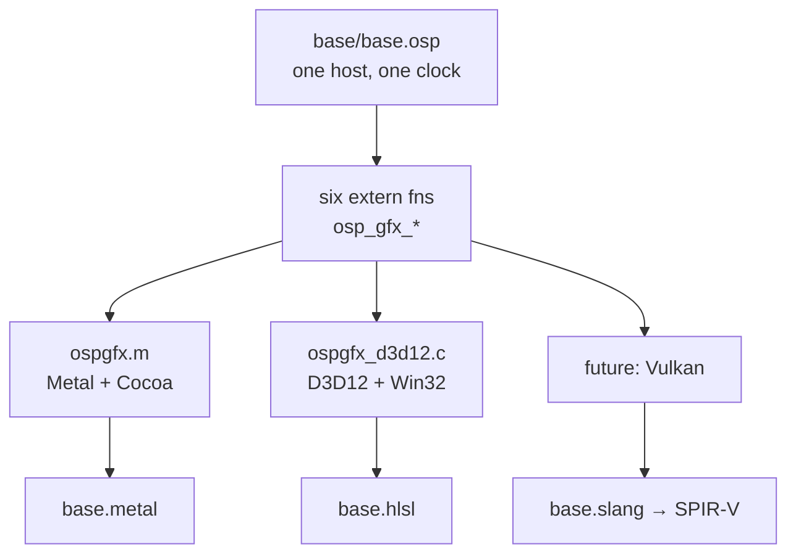

# Plan 0025 — GPU Graphics Backends: one shader library, many device APIs

**Subsystem:** `examples/graphics/` (shader libraries + platform bridges) +
`Makefile` (per-OS build recipes) + `crates/osprey-cli/tests/graphics_scenes.rs`
(the drift guard)
**Status:** **macOS/Metal ships and is observed working. Windows/D3D12 is
written but has never been compiled, linked or run** — not on the machine that
wrote it, not anywhere. Vulkan/SPIR-V is unstarted. The convergence with
`gpu*` (stage 5 below) is unstarted and is the reason this plan exists at all.
**Spec:** none yet. `examples/graphics/README.md` is the current contract; a
spec is owed once a second backend is verified (stage 3).
**Sibling plan:** [0023 — GPU computation](0023-gpu-computation.md) owns the
`gpu*` language surface and kernel extraction. This plan owns the *device
plumbing*. They meet at stage 5.

## Summary

`examples/graphics/` is the only place in the repository where Osprey code
causes a GPU to execute instructions. It does that by *not* using `gpu*`: an
Osprey host program drives a window through six extern C functions, and a
hand-written fragment shader does the per-pixel work. Osprey is the host
language and the GPU is the rasteriser.

The arrangement's whole value is one sentence: **the Osprey sources are
byte-identical on every platform.** `base/base.osp` and the three `scene.osp`
entries are not ported, not `#ifdef`-ed and not conditionally compiled. A scene
names a shader file and a fragment entry inside it; each backend resolves that
name into its own dialect. Everything else in this plan exists to keep that
true as backends multiply.

## The invariant: two shader libraries, one program

`base.metal` (453 lines) and `base.hlsl` (443 lines) are the same program in
two dialects — section for section, helper for helper, entry for entry. One
`Uniforms` block, one `osp_vertex`, three named fragment entries
(`osp_fragment`, `osp_fragment_opal`, `osp_fragment_character`) the bridge
selects between by name. `base.metal` carries the design prose; `base.hlsl`
records only what HLSL does differently, so the pair is not 400 lines of
duplicated commentary.

Nothing in either toolchain can check that they agree. That is what
`crates/osprey-cli/tests/graphics_scenes.rs` is for — six tests, and the two
that matter here **derive** their expectations rather than listing them:

- `the_hlsl_library_declares_every_constant_the_metal_one_does` tokenises both
  files with comments stripped, collects every screaming-snake identifier, and
  diffs the sets. Adding a constant to `base.metal` and forgetting `base.hlsl`
  fails without anyone remembering to update a list.
- `every_declaration_of_the_uniform_layout_agrees` pins **four** independent
  declarations of one layout — `OspGfxUniforms` in `ospgfx.m`, the same struct
  in `ospgfx_d3d12.h`, `Uniforms` in `base.metal`, and the cbuffer in
  `base.hlsl` — plus both bridges' six exports and both fixed-point scales.

Two transcription hazards are load-bearing enough to have their own test and
their own comment, because both compile cleanly when wrong:

1. **cbuffer packing.** A `float slot[24]` inside an HLSL constant buffer gets
   one 16-byte register *per element* — 384 bytes — and would read `slot[1]`
   out of the bridge's `slot[4]`, silently and wrongly. It is declared
   `float4 uniformSlotPack[OSP_GFX_SLOTS / 4]` (96 bytes, byte-for-byte the C
   array) and unpacked once by `loadUniforms()`, so helper signatures still
   match Metal's. A `#if (OSP_GFX_SLOTS % 4) != 0 / #error` guards the
   divisibility the argument rests on, and
   `the_hlsl_constant_buffer_cannot_quietly_unpack_itself` guards the guard.
2. **Matrix convention.** Metal's `float2x2` takes **columns** and multiplies a
   column vector on its right; HLSL's takes **rows** and needs `mul`.
   `rotationFromTurns` is transposed accordingly. Get it wrong and every scene
   spins backwards at full frame rate.

Pixel-for-pixel identity across platforms is **not** claimed and must not be.
The arithmetic is transcribed operation for operation, but fxc and Metal's
compiler fold, reassociate and schedule independently. "Indistinguishable",
never "bit-equal".

## What works today

- **The Metal backend.** `ospgfx.m` — Cocoa window + `CAMetalLayer`, the flat C
  ABI (`osp_gfx_open`, `osp_gfx_set`, `osp_gfx_set_milli`, `osp_gfx_draw`,
  `osp_gfx_ticks`, `osp_gfx_close`), `newLibraryWithSource:` at open time.
  Measured at 103 fps on a 1920×1200 drawable for the same scene the `gpu*`
  host backend renders at 13 fps.
- **The Osprey host.** `base/base.osp` holds the fixed-point trigonometry, the
  per-scene oscillator and grade tables and the frame loop, exactly once.
  `kali/`, `opal/`, `character/` are one-file projects importing
  `graphics::SceneBase`; each names `../base` as a second source root because
  Default Osprey cannot import across standalone scripts ([MODULES-MODEL],
  [MODULES-ENTRYPOINT]).
- **Authored grade lives in Osprey, not the shader.** The Kali scene's
  falloff, palette step and depth, exposure, core gain, floor and sharpness,
  saturation, vignette, gamma and trap clamp arrive in thousandths over FFI.
  An offscreen A/B render at matched uniforms was byte-identical, which is the
  bar that refactor had to clear. What stays in the shader is mathematics, the
  loop trip counts (they must be compile-time constants to unroll), and the
  fixed palette identity of a composition.
- **The drift guard**, `crates/osprey-cli/tests/graphics_scenes.rs`, 487 LOC,
  six tests. It was mutation-checked: eleven deliberate mutations (slot count
  24→32, a constant renamed out of the HLSL, the cbuffer unpacked to a
  `float[]`, a lost `OSP_GFX_API` export, `res` dropped from `ospgfx.m` and
  from `base.metal`, a moved host table, a renamed HLSL entry, a dropped
  scale constant, a reworded diagnostic, an undone `log2(e)` fold) and every
  one was detected.
- **`make graphics SCENE=…` splits by `$(OS)`.** The macOS recipe is unchanged
  apart from `-Wall -Werror` becoming the overridable `$(GFX_WARN)`.

## What is written but unverified

`base.hlsl`, `ospgfx_d3d12.h`, `ospgfx_d3d12_setup.c`, `ospgfx_d3d12.c` and the
Makefile's `Windows_NT` branch have **never been compiled, linked or run**.
They were written on macOS with no MSVC, no Windows SDK, no mingw-w64 and no
fxc or dxc. Every one of those files says so at the top, `README.md` says so
under "Verification status", the Makefile branch says so in a comment, and the
test file's module doc says so. Do not remove those notices for tidiness; they
are the only thing standing between "transcribed" and "works".

The shape of what was written, for whoever verifies it:

- **Three files, not one.** D3D12 bring-up is several times Metal's code for
  the same picture; written as one file it measured 751 LOC against the
  repository's 500-LOC cap. `ospgfx_d3d12.h` is the uniform ABI and context,
  `_setup.c` (490 LOC) is everything built once, `.c` (241 LOC) is the six
  exports and the frame path. **`_setup.c` is 490 of 500 — the next feature
  added there needs a fourth file, not another function.**
- **Uniforms are root constants**, 28 DWORDs written straight into the command
  list: no upload heap, no per-frame resource lifetime. A
  `typedef char osp_gfx_root_constants_fit[… <= 64 ? 1 : -1];` fails to
  *compile* if the slot count ever outgrows the root-signature budget, rather
  than failing at pipeline creation with an opaque validation message.
- **Every HRESULT goes through `osp_gfx_ok`**, which prints the call and code
  to stderr and returns 0, so the bring-up chain short-circuits with `&&` and
  failure paths return NULL/0 exactly as `ospgfx.m` does. No stubs.
- **The scene sources are untouched, and that is enforced.** `base/base.osp`
  still says `fn shaderPath() = "examples/graphics/base.metal"` on Windows; the
  bridge swaps the extension itself (`OSP_GFX_SHADER_EXT ".hlsl"`, taken from
  the *file name* only, so dotted directories resolve correctly). A test pins
  both halves.
- **`GetCPUDescriptorHandleForHeapStart`** is the one C binding that
  historically diverges between MSVC and mingw-w64. It was **not** papered over
  with `WIDL_EXPLICIT_AGGREGATE_RETURNS`: `D3D12_CPU_DESCRIPTOR_HANDLE` is a
  single pointer-sized field, so it returns in a register under the x64 ABI and
  both toolchains' default bindings return it by value; setting that macro
  would have broken mingw. Called once, cached, reasoning in a comment. **If
  the Windows build fails, this is the first line to suspect anyway.**
- **No WARP fallback.** `D3D12CreateDevice(NULL, …)` asks for the default
  hardware adapter, so a GPU-less runner fails rather than degrading.
  Deliberate and documented.

## The Windows CI job that would settle it

Steps 1–4 need no display and no GPU; step 5 needs a desktop session **and** a
D3D12 adapter. This is the acceptance criterion for stage 2 below.

1. **Every shader entry point through fxc** — fxc *is* `D3DCompile`, so this
   checks exactly what the bridge does at run time:
   `fxc.exe -nologo -T vs_5_0 -E osp_vertex -Fo check.cso examples\graphics\base.hlsl`,
   then `-T ps_5_0` for `osp_fragment`, `osp_fragment_opal` and
   `osp_fragment_character`.
2. **Build the bridge, warnings fatal**, in the MSYS2 UCRT64 shell:
   `gcc -shared -O2 -Wall -Werror -o examples/graphics/ospgfx.dll examples/graphics/ospgfx_d3d12.c examples/graphics/ospgfx_d3d12_setup.c -Wl,--out-implib,examples/graphics/libospgfx.dll.a -ld3d12 -ldxgi -ld3dcompiler -ldxguid -luser32`
3. **Type-check and link the unchanged scenes.**
   `osprey.exe examples/graphics/{kali,opal,character} --check`, then
   `osprey.exe examples/graphics/kali --compile` — `--compile` is what
   exercises `// @link: ospgfx` against step 2's import library.
4. **Run the drift guard:**
   `cargo test -p osprey-cli --test graphics_scenes`
5. **Open a window and draw** — the only step that proves the backend, and the
   only one that can catch the cbuffer packing or the matrix transpose:
   `PATH="$PWD/examples/graphics:$PATH" timeout 20 osprey.exe examples/graphics/kali --run`.
   The scene runs until its window closes, so it needs the timeout, and it
   prints its own frame count and rate on the way out. Zero frames means
   `osp_gfx_open` refused and said why on stderr.

Steps 1–4 belong in ordinary CI as soon as a Windows runner exists. Step 5 does
not: it needs hardware and a session, so it is a manual or self-hosted gate.

## Stages

Each stage keeps `make ci` green and must not change a single byte of
`base/base.osp` or any `scene.osp`. That constraint is the deliverable.

### Stage 1 — Metal backend and the shared-library invariant ✅

Landed. Acceptance: `make graphics SCENE=kali|opal|character` opens a window
and renders; `graphics_scenes.rs` passes; the derived-constant and
uniform-layout tests fail when either library drifts.

### Stage 2 — verify the D3D12 backend

Run the five steps above on real Windows, fix what they find, and replace the
"unverified" notices in all five files, the README and the test module doc with
what was actually observed. Gate: step 5 renders `kali` for twenty seconds and
reports a non-zero frame rate; steps 1–4 run in CI on every PR.

Expect the fixes to be in the two hazards named above plus HLSL spelling
choices that could not be tested from macOS (`(float3)0.0` splats and `(float)i`
casts were used over `float3(0.0)`/`float(i)` precisely because the
constructor-call spelling is accepted less consistently across shader
compilers — that guess may be wrong in either direction).

### Stage 3 — write the spec

One spec section per invariant, with IDs, once two backends are verified:
`[GFX-ABI]` (the six exports and both fixed-point scales), `[GFX-SHADER-LIB]`
(one library per backend, named entries, the no-drift rule), `[GFX-UNIFORMS]`
(the layout and its four declarations), `[GFX-HOST-PORTABLE]` (the scene
sources never learn which API is underneath). Gate: every ID has implementing
code that references it and a test that fails when it is violated — the same
bar every other spec in `docs/specs/` meets.

### Stage 4 — Vulkan/SPIR-V third backend

A third backend is what proves the pattern generalises rather than being a
macOS/Windows coincidence, and it is the one that runs on Linux CI *and* feeds
plan 0023's WebGPU target (WGSL and SPIR-V are one device sublanguage with two
spellings).

The open decision is the source language. Transcribing a third dialect by hand
scales badly and doubles the drift surface each time; the alternatives are
authoring in one language and compiling down (Slang or `glslang`/`shaderc` from
a common source), or generating all dialects from an Osprey-side description —
which is stage 5 arriving early. **Do not start the transcription until that
choice is made.** Gate: `kali` renders under Vulkan with the scene sources
unchanged, and the constant-set test extends to three libraries without
becoming a three-way manual list.

### Stage 5 — convergence: `gpu*` emits the shader

The end state, and the reason this is a plan rather than an examples folder.
Today a scene hand-writes MSL/HLSL and Osprey merely pushes uniforms. The
convergence point is that [plan 0023](0023-gpu-computation.md) stage 3's
extracted kernels — first-order, scalar-signatured, capture-free, purity-proven
— are *emitted* as MSL/HLSL/SPIR-V, and `base.metal` becomes generated output
rather than authored source.

What each side must bring:

- From plan 0023: a device IR emitter over the extracted-kernel ABI, and a
  decision about kernels that decline extraction (a closure cell has no device
  representation — reject by name, never silently run on the host).
- From this plan: the uniform-slot protocol is already exactly a kernel's
  uniform parameter list, which is the fortunate part. What is missing is a
  per-pixel index space (`gpuMap` is rank-1 over a flat buffer; a fragment
  shader is rank-2 over a drawable), and a way to express "this buffer is the
  drawable" without a copy.
- Shared: whichever of MSL/HLSL/SPIR-V the emitter targets first must be the
  one whose hand-written library is *verified*, so the generated output can be
  diffed against a known-good reference frame rather than trusted.

Gate: one scene's fragment body written as an Osprey kernel, compiled to the
platform shader, rendering a frame byte-identical to the hand-written shader's
at matched uniforms — the same A/B bar the grade refactor cleared.

## Landmines

- **`examples/graphics/` is not in the differential corpus and not in CI.** It
  needs a display. A change here is verified by running it, or it is not
  verified. `make -n graphics` only proves the recipe expands.
- **`_setup.c` is at 490 of 500 LOC.** Split before adding, not after.
- **`GFX_WARN=-Wall` drops `-Werror`** deliberately, because unverified code
  plus fatal warnings is a bad first-run experience. Do not make it
  unconditional once the backend is verified — put `-Werror` back.
- **Windows `make graphics` requires the MSYS2 UCRT64 shell.** Native
  PowerShell gets a one-line pointer to the README instead of a broken recipe;
  keep it that way. The MSVC `cl /LD` route works but needs an MSVC-targeting
  driver (`OSPREY_CC=clang-cl`) because `-lospgfx` only resolves `ospgfx.lib`
  under that target.
- **A shader error is otherwise invisible** — the bridge compiles the library
  at run time, so a typo surfaces as a window that refuses to open.
  `make _graphics-shader` exists to turn that into a build failure, and it
  *skips quietly* when the toolchain is absent. A silent skip is not a pass.
- **Four independent declarations of one uniform layout** (two bridges, two
  shader libraries) and no compiler checks any of them against another. Change
  one, run `graphics_scenes.rs`, always.

## TODO checklist

### Stage 1 — Metal + the invariant

- [x] `ospgfx.m`: Cocoa window, `CAMetalLayer`, the six-symbol flat C ABI.
- [x] `base.metal`: one library, one `Uniforms`, one `osp_vertex`, three named
      fragment entries selected by name at open time.
- [x] `base/base.osp` as the single host; three one-file scene projects.
- [x] Authored grade moved from the shader into Osprey, A/B render
      byte-identical at matched uniforms.
- [x] `graphics_scenes.rs` drift guard, mutation-checked (11/11 detected).
- [x] `make graphics SCENE=…` with an up-front `xcrun metal` shader check.

### Stage 2 — D3D12 verification

- [x] `base.hlsl` transcribed entry for entry, with the `float4` cbuffer
      packing, its `#error` divisibility guard, and the transposed
      `rotationFromTurns`.
- [x] Three-file bridge (`ospgfx_d3d12.h` / `_setup.c` / `.c`), six exports,
      identical semantics and encodings, root-constant uniforms with a
      compile-time budget assertion, every HRESULT through `osp_gfx_ok`.
- [x] Makefile `Windows_NT` branch + fxc entry-point check + PowerShell
      pointer; macOS recipe unchanged.
- [x] Tests extended to police both backends from derived sets, not lists.
- [ ] **Nothing above has been compiled, linked or run.** Execute CI steps 1–5
      on Windows.
- [ ] Steps 1–4 wired into CI on a Windows runner.
- [ ] **Propagate frame-path failures (branch review P1.13).** In
      `ospgfx_d3d12.c`, `Present`, the fence wait, frame reset/close, and the
      final queue drain currently discard their status: draw still returns
      success and close can release GPU-owned resources after an unsuccessful
      drain. Return status from submit/frame, propagate through draw/close,
      never reset or free after a failed drain, and add injected
      `Present`/`Signal`/timeout failure tests before calling the bridge
      implemented.
- [ ] **Make the drift guard structural and bidirectional (branch review
      P2.9).** `graphics_scenes.rs` compares export names/text fragments and
      shader constants Metal-to-HLSL only, so HLSL-only drift passes. Derive
      complete normalized signatures from one canonical ABI and compare
      constant sets in both directions with an explicit backend-only
      whitelist.
- [ ] Replace the "unverified" notices in `base.hlsl`, `ospgfx_d3d12.h`,
      `ospgfx_d3d12_setup.c`, `ospgfx_d3d12.c`, the Makefile branch, the README
      and `graphics_scenes.rs`'s module doc with observed results.
- [ ] Restore `-Werror` as the default once step 2 passes.
- [ ] Decide on a WARP software-adapter fallback — required if step 5 is ever
      to run on a hosted runner.
- [ ] `vscode-extension/test/suite/extension.test.ts:2025` still names
      `examples/graphics/scene.metal`, a file that no longer exists. One-line
      comment fix, outside this folder.

### Stage 3 — spec

- [ ] `[GFX-ABI]`, `[GFX-SHADER-LIB]`, `[GFX-UNIFORMS]`, `[GFX-HOST-PORTABLE]`
      in a new `docs/specs/` entry, each referenced from the implementing code.
- [ ] `README.md` reduced to a how-to-run guide once the contract lives in the
      spec.

### Stage 4 — Vulkan/SPIR-V

- [ ] Source-language decision: hand-transcribe, author-once-and-compile
      (Slang/`shaderc`), or generate from Osprey. Record the decision and why.
- [ ] Third backend: Vulkan surface + swapchain + SPIR-V pipeline behind the
      same six exports.
- [ ] `kali` renders on Linux with the scene sources unchanged.
- [ ] The constant-set and uniform-layout tests extend to three libraries
      without a manual three-way list.

### Stage 5 — convergence with `gpu*`

- [ ] Device shader emitter over plan 0023's extracted-kernel ABI, targeting
      the verified backend first.
- [ ] Rank-2 index space for per-pixel kernels; a drawable expressible as a
      buffer without a copy.
- [ ] One scene's fragment body written as an Osprey kernel, rendering a frame
      byte-identical to the hand-written shader at matched uniforms.
- [ ] `base.metal` becomes generated output; the hand-written library is kept
      as the differential reference, not deleted.

### Cross-cutting

- [ ] Any new backend keeps `base/base.osp` and every `scene.osp`
      byte-identical — the invariant, and the first thing to check in review.
- [ ] `docs/messaging.md` says GPU *computation* is host-only. This plan is the
      exception that proves it: Osprey hosting a GPU shader is real and may be
      described; `gpu*` reaching a GPU is not, and must not be conflated.
