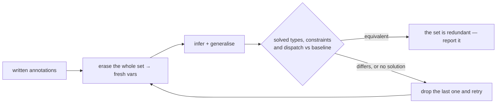

# Type System

- [Hindley-Milner Inference](#hindley-milner-inference)
- [Generics and Variance](#generics-and-variance)
- [Built-in Types](#built-in-types)
- [Result Preservation](#result-preservation)
- [Function Types](#function-types)
- [Record Types](#record-types) — including [anonymous records](#anonymous-records--type-record-anon) and [tuples](#tuples--type-tuple)
- [Union Types](#union-types)
- [Collection Types](#collection-types)
- [Built-in Error Types](#built-in-error-types)
- [The `any` Type](#the-any-type--type-any)
- [Type Annotations](#type-annotations--type-annotation-check)
- [Redundant Annotations](#redundant-annotations--type-annotation-redundant)

## Hindley-Milner Inference

Osprey uses Hindley-Milner inference over the canonical AST produced by either
surface syntax ([FLAVOR-BOUNDARY]). Examples show both surfaces where their
spellings differ.

Type annotations are optional everywhere they can be inferred:

```osprey
fn identity(x)         = x                       // <T>(T) -> T
fn add(a, b)           = a + b                   // (int, int) -> int
fn greet(name)         = "Hello, " + name        // (string) -> string
fn makeUser(n, a)      = User { name: n, age: a }  // (string, int) -> User
fn getName(u)          = u.name                  // (User) -> string
fn twice(f, x)         = f(f(x))                 // <T>((T) -> T, T) -> T
fn compose(f, g)       = fn(x) => f(g(x))        // <A,B,C>((B)->C,(A)->B) -> (A)->C
```

```osprey-ml
identity x       = x                        // <T>(T) -> T
add (a, b)       = a + b                     // (int, int) -> int
greet name       = "Hello, " + name          // (string) -> string
makeUser (n, a)  =
    User
        name = n
        age = a                             // (string, int) -> User
getName u        = u.name                    // (User) -> string
twice (f, x)     = f (f x)                   // <T>((T) -> T, T) -> T
compose (f, g)   = \x => f (g x)             // <A,B,C>((B)->C,(A)->B) -> (A)->C
```

`add` follows [ARITH-CHECKED](0013-ErrorHandling.md#arithmetic--arith-checked): integer `+ - *` return `int`. With a `float` operand, the integer is promoted and the IEEE-754 operation returns plain `float`.

Record fields and foreign declarations include types as part of their syntax;
annotations on bindings and functions constrain the inferred type. An
annotation that constrains nothing — one inference would have derived anyway —
is a defect the compiler reports
([TYPE-ANNOTATION-REDUNDANT](#redundant-annotations--type-annotation-redundant)).

A polymorphic function is monomorphised independently at each call site:

```osprey
let i = identity(42)        // identity<int>
let s = identity("hello")   // identity<string>
```

```osprey-ml
i = identity 42          // identity<int>
s = identity "hello"     // identity<string>
```

### Reporting a Partly Inferred Type — [TYPE-RENDER-HOLES]

Inference does not always reach a single ground type, and what a tool reports
in that case is part of the language's contract. A slot the checker proved
nothing about is written `_`, the type-level hole. Every slot it did prove is
written normally, so a partial answer still carries its proven part.

```osprey
fn bothArms(f) = if f { Success { value: 1 } } else { Error { message: "e" } }
// reported: fn bothArms(f: bool) -> Result<int, _>
```

Reporting is a property of the canonical AST, so both surfaces report the same
signature for the same program ([FLAVOR-IR-EQUIV]).

The payload is `int` in both arms, so it is reported. The error side is open:
`Error { message }` fixes only the message, leaving `E` free to unify with
whichever error type a call site supplies, so `-> Result<int, string>`,
`-> Result<int, Error>` and `-> int` all check
([Result Preservation](#result-preservation)). A hole is the only honest
spelling for that slot.

A declared record is reported by its **name and its row** together:

```osprey
type Box<T> = { value: T }
fn boxed() = Box { value: 1 }
// reported: fn boxed() -> Box { value: int }
```

Either half alone loses something. The row alone drops the name its author
wrote — and for a record declared with `type`, the row is not even an
annotation they may write back. The name alone drops the instantiation: a
record carries no type arguments, so `Box<int>` cannot be reconstructed from
`Box`, and the `int` the checker proved simply disappears. Saying both costs
nothing.

Two spellings are forbidden. A tool must not print the checker's internal
variable name — `t5` is private, its number is an artefact of one inference run
and it moves when an unrelated line is edited. A tool must not substitute
`Unit`, which is a positive claim the checker itself refutes: annotating
`bothArms` with `-> Unit` fails to unify. Where a type is nothing but a hole
there is nothing to report, and the slot is left as the author wrote it —
bare — rather than decorated with `_`.

A hole is a reporting spelling, not syntax. The annotation grammar has no
wildcard, so `_` written in a type position is read as an ordinary nominal name
like any other capitalized-or-not identifier, and it unifies only where the slot
was already free. `-> Result<int, _>` therefore happens to check on `bothArms`,
while `fn f(x: int) -> _ = x` is rejected — `cannot unify _ with int` — exactly
as a misspelled type name would be. A reported signature containing a hole is
not guaranteed to be a valid annotation, and reporting one is not a suggestion
to write it down: an annotation the checker can prove adds no information and is
redundant ([Type Annotations](#type-annotations--type-annotation-check)).

### Rows and Record Type Unification — [TYPE-ROW]

A **row** is an unordered set of `name: type` fields. It is the one structure
behind every product in the language: a named record, an anonymous record, a
tuple, and a union variant's payload are all rows, and they unify by the same
rule. Field order is irrelevant in declaration, construction and matching.

A row is **closed** (it has exactly these fields) or **open** (it has at least
these fields, written `..`). Two closed rows unify iff they carry the same field
names and each corresponding field type unifies. An open row unifies with any
row that carries its named fields.

```
unify(R1, R2) :=
    if closed(R1) and closed(R2) and names(R1) ≠ names(R2) then FAIL
    if open(R1) and names(R1) ⊄ names(R2) then FAIL
    else for each f ∈ names(R1) ∩ names(R2): unify(typeOf(R1, f), typeOf(R2, f))
```

Open rows appear only in patterns ([Structural
patterns](0007-PatternMatching.md#structural-patterns--pattern-structural)) and
in `any` narrowing ([TYPE-ANY](#the-any-type--type-any)). A declared `type` is
always closed.

> **Status:** closed-row unification is implemented and is what makes two
> identically-shaped records interchangeable today. Open rows exist exactly
> where this section places them — a `..`-opened structural pattern and `any`
> narrowing — and nowhere in type annotations.

### Polymorphic Variables vs `any`

Inference produces polymorphic variables (`<T>`, `<A>`, …), not `any`. The `any` type is opt-in; see [The `any` Type](#the-any-type--type-any).

## Generics and Variance

**Implementation status:** Declared generics, declaration-site variance, generic effects, generic function values and explicit call-site type arguments are implemented in both flavors. Plan 0015 is retired. [PR #237](https://github.com/Nimblesite/osprey/pull/237) merged on 2026-09-10 after all 14 required checks passed on `38098b7f73f3bd744454d15952475424489632ab`, including native default/GC/ARC corpora, Windows, WebAssembly, Rust/C/editor coverage and integration tests. The contract is pinned by `generics_apply_tests.rs`, `generics_decl_tests.rs`, `generics_variance_tests.rs`, `generic_effects_tests.rs`, the paired generics runtime corpus and explicit-application rejection fixtures. A fresh check during retirement passed all 37 call-site type-application checker tests.

> **Flavor layer — shared core.** Both surfaces lower to the same
> variance-carrying `TypeParam` nodes ([FLAVOR-BOUNDARY]); the ML spellings are
> specified in [ML Flavor Syntax](0024-MLFlavorSyntax.md#generics-flavor-ml-generics).

`[TYPE-GENERICS-DECL]` **Type declarations bind type parameters; constructions
may pin them explicitly.** `type Pair<T, U> = …` binds `T`/`U` across every
variant field. A construction site may apply explicit type arguments —
`Pair<int, string> { first: 1, second: "a" }` — which unify with the
instantiation the fields would otherwise infer; an argument that contradicts a
field is a type error.

`[GENERICS-CTOR-ARITY]` **Explicit constructor type arguments must match the
declaration's arity.** `Box<int> { v: 1 }` against `type Box<T>` is well-formed;
`Box<int, string> { v: 1 }` is rejected with
`takes 1 type argument(s), got 2`. Writing the arguments out is a contract with
the declaration, so a count mismatch is an error rather than a silently ignored
annotation.

`[TYPE-GENERICS-FN]` **Functions bind type parameters with `fn name<T, …>`.**
A binder makes every use of `T` in the signature the SAME inference variable;
without it, `T` in an annotation names a nominal type. The binder is
load-bearing exactly when a parameter must relate two or more positions
(`fn pick<T>(first: T, second: T)` pins both arguments to one type) or when a
caller must pin an otherwise-unconstrained variable. HM inference is
unchanged: unannotated functions stay implicitly polymorphic, and a
polymorphic function is monomorphised independently at each call site.
Variance markers are **not** permitted on function binders (variance is
declaration-site on types and effects only — [TYPE-VARIANCE-DECL]).

```osprey
fn pick<T>(first: T, second: T) = first
let n = pick(10, 20)
let s = pick("left", "right")
```

```osprey-ml
pick<T> : (T, T) -> T
pick (first, second) = first
n = pick (10, 20)
s = pick ("left", "right")
```

In the ML flavor the binder lives on the signature line (`pick<T> : …`); a
binding without a signature cannot declare type parameters.

`[TYPE-GENERICS-APPLY]` **A call site may apply type arguments explicitly.**
`identity<int>(5)` pins the callee's declared binders positionally, left to
right, and the written arguments unify with the instantiation the value
arguments and the expected type would otherwise infer. This is the direct
spelling of what an annotated binding (`let x: int = identity(5)`) can only say
indirectly. An expected result type can also pin a binder absent from the
parameters: `let xs: List<int> = empty()` fixes `T` for
`fn empty<T>() -> List<T> = []`. Explicit type arguments are the only spelling
that can pin a phantom binder absent from both parameter and result types.

```osprey
fn identity<T>(x: T) -> T = x
fn pick<T, U>(first: T, second: U) -> T = first
print("${identity<int>(5)} ${pick<int, string>(1, "two")}")
```

```osprey-ml
identity<T> : T -> T
identity x = x
print "${identity<int> 5}"
```

The form is recognised when the `<` immediately follows the callee name and the
matching `>` immediately precedes the call's argument list — `(` in the Default
flavor, the juxtaposed argument in ML. Everywhere else `<` is the comparison
operator, so `a < b` and `f(a) < g(b)` are unaffected; a relational chain that
would otherwise read as type application must parenthesise.

Applying type arguments is a contract with the declaration, checked the same way
[GENERICS-CTOR-ARITY] checks a construction site:

- The count must equal the callee's declared binder count. `identity<int, string>(5)`
  against `fn identity<T>` is rejected with
  `function \`identity\` takes 1 type argument(s), got 2`.
- A callee that declares no binders — an unannotated function, a lambda, a
  parameter holding a function value — takes no type arguments, and is rejected
  with the same diagnostic at count 0.
- A written argument that contradicts the value arguments or the expected type is
  a type error, not a silently ignored annotation: `identity<int>("text")`
  reports `cannot unify int with string`.
- Variance markers are not permitted, exactly as on the binder itself
  ([TYPE-VARIANCE-DECL]): `identity<out int>(5)` is rejected.

A generic function used as a VALUE is specialised wherever its ABI can be
fixed: by a consuming slot, by a call alias, or — when a generic function
returns a lambda — at each call site of the binding, which is inlined and
specialised there. `fn pick() = |x| => x` followed by `let f = pick()`
therefore serves `f(7)`, `f("os")` and `f(2.5)` from one binding. A lambda so
returned may close over the producing call's parameters
(`fn constly(v) = |x| => v`); those are evaluated **once**, at the binding, so
the call's effects happen as often as the source performs it, not once per
instantiation.

One shape has no ABI to fix and is rejected rather than guessed: a
still-generic lambda used as a bare value, with no call site to specialise
against — `print("${mk(1)}")` for `fn mk(x) = |y| => x`. The compiler answers
`a closure value with a still-generic type`. This is a permanent restriction,
not a missing feature: one runtime closure has one representation, and lowering
an unresolved type variable as a machine word would read a `string` or `float`
instantiation as an integer.

`[TYPE-VARIANCE-DECL]` **Type parameters declare variance at the declaration
site**: `out T` (covariant — `T` only flows out), `in T` (contravariant — `T`
only flows in), unannotated (invariant — exact match). `out` and `in` are
contextual keywords, reserved only inside type-parameter lists
([Lexical Structure](0002-LexicalStructure.md#keywords)).

```osprey
type Feed<out T> = Feed { supply: T } | Dry
type Gate<in T>  = Gate { admit: (T) -> bool } | Open
```

```osprey-ml
type Feed out T =
    Feed
        supply : T
    Dry
type Gate in T =
    Gate
        admit : T -> bool
    Open
```

`[TYPE-VARIANCE-POSITIONS]` **Variance is position-checked.** Walking a
declaration's field (or effect-operation) types: fields and function results
are OUTPUT positions; function parameters flip the polarity (INPUT); a nested
constructor's argument composes the position with that constructor's declared
variance (an invariant argument position demands both directions, so only
invariant parameters may sit there). A covariant parameter in an input
position, or a contravariant parameter in an output position, is a compile
error. Effect operations check the same way: operation parameters are inputs,
operation results outputs ([Algebraic Effects](0017-AlgebraicEffects.md#generic-effects)).

`[TYPE-VARIANCE-ASSIGN]` **Variance directs assignability structurally, and
the leaves match exactly.** Plain HM unification is untouched — every
well-typed expression keeps a principal type. At *assignment sites* (call
arguments, annotated bindings, return positions), a variance-declared
constructor's arguments are matched directionally: covariant (`out`)
arguments recurse expected-accepts-actual, contravariant (`in`) arguments
recurse with the roles flipped, invariant arguments unify exactly. The
recursion continues only through **same-name** variance-declared constructors
and bottoms out in **exact unification**.

`[TYPE-VARIANCE-COERCION]` **The language's one coercion applies at direct
value sites only, never inside a constructor argument.** A bare `T` satisfies a
`Result<T, E>` slot (an implicit `Success`); the inverse never holds anywhere.
That coercion changes the value's REPRESENTATION, and nothing rebuilds a
container's contents, so it cannot reach through an argument position:
`Feed<int>` does **not** satisfy a `Feed<Result<int, MathError>>` slot, under
`out T`, under `in T`, or unannotated. Function payloads match exactly for the
same reason, so a `Feed<(int) -> Result<int, Error>>` does not match a
`Feed<(int) -> int>` slot — while a *directly* assigned function value still
matches assignably, its parameters flipped and its return coerced
(`(Result<int, E>) -> bool` satisfies an `(int) -> bool` slot).

**Consequence, stated so no one has to re-derive it:** because that coercion is
the only subtyping the language has, and it is barred from argument positions,
`out T`, `in T` and an unannotated parameter accept and refuse **exactly the
same programs** at assignment sites today. A variance marker's observable effect
is [TYPE-VARIANCE-POSITIONS] — where the parameter may be written — not which
assignments type-check. The directional recursion above is nonetheless
normative: it is what a future representation-PRESERVING subtype relation would
travel through, and the day one exists the three markers stop agreeing.

Built-in constructors' declared variance: `Result<out T, out E>`,
`List<out T>`, `Fiber<out T>`, `Map<K, out V>` (keys invariant); `Channel<T>`
and `Ptr` are invariant. Function types are structurally contravariant in
parameters and covariant in returns.

## Built-in Types

Primitive spellings are case-sensitive.

| Type             | Description                                                        |
| ---------------- | ------------------------------------------------------------------ |
| `int`            | 64-bit signed integer (LLVM `i64`)                                 |
| `float`          | 64-bit IEEE 754 (LLVM `double`)                                    |
| `string`         | UTF-8 encoded                                                      |
| `bool`           | `true` \| `false`                                                  |
| `Unit`           | The single value `()`; the return type of a function with no result|
| `any`            | Erased compatibility value; no runtime type tests                  |
| `Result<T, E>`   | Error-handling sum type (see [Error Handling](0013-ErrorHandling.md)) |
| `List<T>`        | Immutable sequential collection                                    |
| `Map<K, V>`      | Immutable key/value collection                                     |
| `Iterator<T>`    | Opaque range pipeline (see [Iterators](0010-LoopConstructsAndFunctionalIterators.md)) |

Mixed numeric arithmetic promotes `int` to `float`. Integer `+`, `-`, `*`, `%`, and unary `-` have type `int`; `/` has type `float`; floating-point `+`, `-`, `*`, and unary `-` have type `float`. Arithmetic is total: no trap, no panic, no silent wrap, no unspecified value, and no undischarged fault ([ARITH-CHECKED](0013-ErrorHandling.md#arithmetic--arith-checked), [ARITH-TOTAL](0037-ArithmeticEffects.md#the-guarantee--arith-total)).

### Numeric operand constraints — [FLOAT-OPERANDS]

The float-producing branches of `+`, `-`, `*`, `/` and `%` require numeric
operands. A known operand must be `int` or `float`; an inferred parameter
carries that requirement through function generalization and each call-site
instantiation. The same `fn scale(x) = x * 1.5` can therefore serve integer
and float callers, while `scale("text")`, `scale(true)` and `scale([1])`
fail type checking before code generation. Aliases and higher-order calls
preserve the requirement. Division constrains both operands even when neither
is already known to be float.

This constraint leaves the existing propagation of known `Result` operands
unchanged: the arithmetic checker first verifies their `MathError` channel,
then checks the unwrapped numeric type and retains the required result wrapper.
It does not make a `Result` an ordinary numeric argument to a generic helper.

### Floating-point comparison — [FLOAT-COMPARE]

When either operand is NaN, the comparison operators have these results:

| Operator | Result |
| --- | --- |
| `==` | `false` |
| `!=` | `true` |
| `<`, `<=`, `>`, `>=` | `false` |

Consequently `(a != b) == !(a == b)` holds for every float pair. Finite values
and infinities retain numeric ordering; positive and negative zero compare
equal. The backend uses LLVM's unordered-or-not-equal predicate for `!=` and
ordered predicates for the other five operators. Both-flavor truth tables in
`tests/regressions/basics/operators/boolean_consolidated.test.*` pin NaN in
either operand, equality complements, finite controls, infinities and signed zero.

### Internal numeric narrowing — [FLOAT-CONVERT]

The type checker rejects implicit float-to-integer narrowing. The backend's
internal coercion also has defined behavior if a future caller supplies a
double: finite values truncate toward zero, out-of-range values clamp to the
signed 64-bit bounds, and NaN becomes zero. It emits
`llvm.fptosi.sat.i64.f64`, never poison-producing bare `fptosi`.
The codegen conversion tests assert this path for signed NaNs, infinities,
both range boundaries, signed zeros and fractional values. These semantics
follow the [LLVM conversion contract](https://llvm.org/docs/LangRef.html#llvm-fptosi-sat-intrinsic).

## Result Preservation

A fallible expression has type `Result<T, E>`, and the compiler never implicitly erases that wrapper ([FAILURE-EXPLICIT](0001-Introduction.md#failure-safety--failure-explicit)). Every consuming position — arguments, bindings, plain-`T` returns, comparisons, function-value calls — preserves the `Result` or is rejected; interpolation displays the complete `Success` or `Error` value. Callers obtain the payload only through an exhaustive `match` or an explicit `?:` fallback. This rule has no exceptions. Arithmetic is not one: it carries no `Result` wrapper at all, and its faults are discharged by an `Arith` handler rather than by erasing a wrapper ([ARITH-TOTAL](0037-ArithmeticEffects.md#the-guarantee--arith-total)).

## Function Types

```ebnf
functionType ::= "(" (type ("," type)*)? ")" "->" type
```

```osprey
(int) -> int
(int, string) -> bool
() -> string
(string) -> (int) -> bool          // higher-order
```

```osprey
fn applyFunction(value: int, transform: (int) -> int) -> int = transform(value)

let doubler: (int) -> int = fn(x: int) => x * 2

fn createAdder(n: int) -> (int) -> int = fn(x: int) => x + n
```

```osprey-ml
applyFunction : (int, (int) -> int) -> int
applyFunction (value, transform) = transform value

doubler : int -> int
doubler = \x => x * 2

createAdder : int -> int -> int
createAdder n = \x => x + n
```

Multi-argument calls accept positional arguments or a fully named argument
list, as specified in [Function Calls](0005-FunctionCalls.md).

### Closures — [TYPE-FN-CLOSURE]

A lambda (`fn(...) => expr` or `|x| => expr`) captures every free identifier from its enclosing lexical scope by reference to its value at capture time. Captured bindings are immutable, so by-reference and by-value capture are observationally identical and the implementation MAY choose either. A captured binding outlives the surrounding stack frame: a closure returned from a function remains callable and continues to read the captured values.

```osprey
fn makeAdder(n: int) -> (int) -> int = fn(x: int) => x + n

let add5    = makeAdder(5)
let add10   = makeAdder(10)
print(add5(3))     // Success(8)
print(add10(3))    // Success(13)

let prefix  = "hello "
let greet   = fn(name: string) => prefix + name              // captures prefix
print(greet("world"))                                         // "hello world"
```

```osprey-ml
makeAdder : int -> (int) -> int
makeAdder n = \(x : int) => x + n               // captures n

add5    = makeAdder 5
add10   = makeAdder 10
print (add5 3)     // Success(8)
print (add10 3)    // Success(13)

prefix  = "hello "
greet   = \(name : string) => prefix + name     // captures prefix
print (greet "world")                                         // "hello world"
```

Closures and named functions are interchangeable wherever their complete
function types match, including iterator callbacks and record fields. A
`Result<T, E>` returned through a function-value call remains a `Result<T, E>`
and must be handled explicitly ([Result Preservation](#result-preservation)).

A function type contains its ordered parameter types and return type. Parameter names are not part of its identity and do not travel with a value assigned to that type. Calls through function values therefore use the argument-slot rule in [CALL-ARGUMENTS](0005-FunctionCalls.md#argument-forms--call-arguments), including calls through record fields.

### Higher-order calls — [TYPE-FN-HIGHER-ORDER]

Any expression with a function type is callable. The callee may be a local,
record field, returned closure, or another call expression; it need not be a
top-level function name. Chained application evaluates one function result per
call, so `makeAdder(1)(2)` calls the closure returned by `makeAdder(1)`.

## Record Types

```ebnf
recordType ::= "type" ID "=" "{" field ("," field)* "}" constraint?
field      ::= ID ":" type
constraint ::= "where" function_name
```

```osprey
type Point   = { x: int, y: int }
type Person  = { name: string, age: int, active: bool }
```

```osprey-ml
type Point =
    x : int
    y : int

type Person =
    name : string
    age : int
    active : bool
```

### Anonymous Records — [TYPE-RECORD-ANON]

A row written without a `type` declaration is an anonymous record. The type
spelling is the declaration's right-hand side, and the value spelling is the
construction form without a head:

```osprey
fn describe(p: { x: int, y: int }) -> string = "${p.x},${p.y}"

let origin = { x: 0, y: 0 }
```

An anonymous record unifies with a declared record of the same row
([TYPE-ROW](#rows-and-record-type-unification--type-row)), so `origin` is
accepted wherever a `Point` is expected. Field keys are **bare identifiers**;
that is what separates a record from a map literal, whose keys are string or
expression values (`{ "Dave": 28 }`). A brace literal with no fields is the
empty map, not the empty record.

### Tuples — [TYPE-TUPLE]

A tuple is a row whose field names are the decimal positions `0`, `1`, …, the
same encoding a positionally-declared union payload already uses
([TYPE-UNION-POSITIONAL](0003-Syntax.md#type-declarations)):

A positionally-declared union payload IS such a row, and is what a tuple pattern
reads today — the standalone `(1, "a")` value and its `(int, string)` type
spelling do not parse yet (see the status note below):

```osprey
type Pair = Pair(int, string)

let described = match erased {
    (n, label) => "${label}=${n}"
    _          => "unknown"
}
```

A decimal string is not a valid identifier in either flavor, so a tuple field
cannot be named in source — `pair.0` does not parse. Tuples are read by pattern
matching ([Tuple patterns](0007-PatternMatching.md#tuple-patterns--pattern-tuple)),
which keeps them consistent with the rule that unions and `any` are read by
matching rather than by projection.

A one-element parenthesis is grouping, never a tuple: `(x)` is `x`.

> **Status:** anonymous record *values* construct, project fields and match
> structurally, but cannot be erased into `any` — narrowing selects among
> DECLARED rows, so `let v: any = { x: 1 }` is rejected with
> `declare its row as a named type first`. Tuple *patterns* are implemented in
> both flavors as the positional row spelling; tuple *values* and the
> `(int, string)` type spelling are not, so a tuple pattern today selects a
> positionally-declared record (`type Pair = Pair(int, string)`), plain or
> erased.

### Construction

```osprey
let point  = Point  { x: 10, y: 20 }
let person = Person { name: "Alice", age: 30, active: true }

// Field order at construction is irrelevant
let person2 = Person { active: true, name: "Bob", age: 22 }
```

```osprey-ml
point =
    Point
        x = 10
        y = 20
person =
    Person
        name = "Alice"
        age = 30
        active = true

// Field order at construction is irrelevant
person2 =
    Person
        active = true
        name = "Bob"
        age = 22
```

All fields are required. Missing or unknown fields, or type mismatches, are compilation errors.

### Field Access — [TYPE-FIELD-ACCESS-NON-RECORD]

Direct field access is permitted only on a record value. A `Result`, a union or
an `any` must be matched to a concrete payload or row before field access
([TYPE-ANY](#the-any-type--type-any)).

Field access on a type that can never carry fields — `int`, `float`, `string`,
`bool`, `Unit` — is rejected by the type checker with
`cannot access field '<field>' on non-struct type <type>`, naming the offending
source line. The check is deliberately narrow: `any` unifies with records, a
collection's element may be a record, and an unresolved type variable may still
infer to one, so none of those are rejected here. Without the check, codegen
emitted invalid LLVM and the failure surfaced from `clang` against a temporary
`.ll` file instead of the user's source.

```osprey
let n = person.name        // ok

// Result: match before access
match personResult {
    Success { value }   => print(value.name)
    Error   { message } => print(message)
}

// Union: discriminate first
let area = match shape {
    Circle    { radius }         => 3.14 * radius * radius
    Rectangle { width, height }  => width * height
}
```

```osprey-ml
n = person.name        // ok

// Result: match before access
match personResult
    Success value => print value.name
    Error message => print message

// Union: discriminate first
area =
    match shape
        Circle radius => 3.14 * radius * radius
        Rectangle width height => width * height
```

Codegen resolves a **named-field** payload by name, never by declaration order, so reordering fields in a `type` cannot silently rebind a pattern. A **positionally-declared** variant ([TYPE-UNION-POSITIONAL](0003-Syntax.md#type-declarations)) has no field names to resolve against and is the one case resolved by index — the binder in column *i* binds payload slot *i*.

### Immutability and Non-Destructive Update

Records cannot be modified. To produce a record that differs in some fields from an existing one, use the update form:

```osprey
let p2 = point  { x: 15 }                // y carried over
let p3 = person { age: 26, active: false }
```

```osprey-ml
p2 = point(x = 15)               // y carried over
p3 = person(age = 26, active = false)
```

### Nested Records

```osprey
type Address = { street: string, city: string, zipCode: string }
type Company = { name: string, address: Address }

let company = Company {
    name:    "Tech Corp",
    address: Address { street: "456 Tech Ave", city: "Sydney", zipCode: "2000" }
}

let companyCity = company.address.city
```

```osprey-ml
type Address =
    street : string
    city : string
    zipCode : string

type Company =
    name : string
    address : Address

company = Company(name = "Tech Corp", address = Address(street = "456 Tech Ave", city = "Sydney", zipCode = "2000"))

companyCity = company.address.city
```

## Union Types

A union type (also "sum type", "tagged union", "discriminated union") declares a closed set of named variants. Each variant is nullary (no payload), carries a record-style named payload, or carries a positional payload ([TYPE-UNION-POSITIONAL](0003-Syntax.md#type-declarations)). Grammar in [Syntax](0003-Syntax.md#type-declarations); pattern-matching rules in [Pattern Matching](0007-PatternMatching.md).

```osprey
type Color  = Red | Green | Blue
type Shape  = Circle    { radius: float }
            | Rectangle { width:  float, height: float }
            | Triangle  { a: float, b: float, c: float }
```

```osprey-ml
type Color =
    Red
    Green
    Blue

type Shape =
    Circle
        radius : float
    Rectangle
        width : float
        height : float
    Triangle
        a : float
        b : float
        c : float
```

A union value carries a runtime discriminant identifying its variant; the compiler emits one branch per variant in any `match`. Field access on a union requires `match` to narrow it to a single variant first.

### Recursive Variants — [TYPE-UNION-REC]

A variant's payload MAY reference the union type itself, either directly or through a built-in collection. Recursive payloads represent trees such as ASTs, file trees, scene graphs, and parsed JSON.

```osprey
type Tree = Leaf | Node { value: int, left: Tree, right: Tree }

type JsonValue =
    JNull
    | JBool { v: bool }
    | JNum  { v: float }
    | JStr  { v: string }
    | JArr  { items:   List<JsonValue> }
    | JObj  { entries: Map<string, JsonValue> }
```

```osprey-ml
type Tree =
    Leaf
    Node
        value : int
        left : Tree
        right : Tree

type JsonValue =
    JNull
    JBool
        v : bool
    JNum
        v : float
    JStr
        v : string
    JArr
        items : List<JsonValue>
    JObj
        entries : Map<string, JsonValue>
```

A recursive union is laid out indirectly — variant payloads referencing the same type, or containing a `List<Self>` / `Map<K, Self>`, MUST be stored behind a pointer so the type's size is finite. Construction, pattern-matching, and field access use the same syntax as other variants. Mutually recursive unions follow the same rule.

## Collection Types

`List<T>` and `Map<K, V>` are immutable runtime collections. Collection
operations return a new value and leave their inputs unchanged. Their builtin
signatures are listed in [Built-in Functions](0012-Built-InFunctions.md#collection-functions).

### `List<T>` — [TYPE-LIST]

`List<T>` is a homogeneous indexed sequence. Index access is bounds-checked
and returns `Result<T, Error>`.

```osprey
let numbers = [1, 2, 3, 4, 5]            // List<int>
let names   = ["Alice", "Bob"]           // List<string>

// Empty literal cannot infer its element type unless the context provides it
let empty: List<int> = []                // ok
let total = sumOfInts([])                // ok if sumOfInts: (List<int>) -> int

match numbers[0] {
    Success { value }   => print(value)
    Error   { message } => print(message)
}
```

#### Operations — [TYPE-LIST-OPS]

```osprey
let withSix  = listAppend(numbers, 6)
let reversed = listReverse(numbers)
let combined = numbers + [6, 7, 8]
forEachList(numbers, fn(x) => print(toString(x)))
```

`+` is equivalent to `listConcat`. `listAppend`, `listPrepend`,
`listReverse`, and concatenation return new lists.

#### Patterns — [TYPE-LIST-PATTERNS]

```osprey
fn classify(xs: List<int>) -> string = match xs {
    []                 => "empty"
    [single]           => "one"
    [first, second]    => "two"
    [head, ...tail]    => "many starting with ${head}"
}
```

A list pattern matches exactly the listed length unless its final element is a
rest binder (`...name`). The rest binder receives the remaining `List<T>`.

### `Map<K, V>` — [TYPE-MAP]

`Map<K, V>` is an associative collection. The constructors and map
literals create string-keyed maps, so their concrete public type is
`Map<string, V>`. Iteration order is unspecified.

#### Literals — [TYPE-MAP-LITERAL]

```osprey
let ages = {
    "Alice":   25,
    "Bob":     30,
    "Charlie": 35
}                                                 // Map<string, int>
```

The ML spelling is `["Alice" => 25, "Bob" => 30]`. Use `Map()` in Default
syntax or `[=>]` in ML syntax for an empty map.

```osprey
let scores = Map()
```

Entries are inserted left to right; the last value wins when a literal repeats
a key.

#### Lookup — [TYPE-MAP-LOOKUP]

Index lookup returns `Result<V, Error>`:

```osprey
match ages["Alice"] {
    Success { value }   => print(toString(value))
    Error   { message } => print(message)
}
```

#### Operations — [TYPE-MAP-OPS]

All operations return a new map and never mutate the receiver.

```osprey
let updated    = mapSet(ages, "Alice", 26)
let withoutBob = mapRemove(ages, "Bob")
let merged     = ages + { "Dave": 28 }
let names      = mapKeys(ages)
let values     = mapValues(ages)
```

`mapMerge` and map `+` are right-biased: the right map wins on duplicate keys.

## Built-in Error Types

| Type        | Used by |
| ----------- | ------- |
| `Error`     | Fallible builtins, including parsing, `checkedAdd`/`checkedSub`/`checkedMul`, collection lookup, files, and processes |

`Success` and `Error` are the constructors of `Result<T, E>` (see [Error Handling](0013-ErrorHandling.md)).

## The `any` Type — [TYPE-ANY]

`any` is an erased compatibility type. It unifies with every other type, so an
`any` parameter accepts values of different static types:

```osprey
fn ignore(value: any) -> string = "ignored"

let a = ignore(42)
let b = ignore("text")
```

Erasure keeps the value's row ([TYPE-ROW](#rows-and-record-type-unification--type-row)),
so an `any` is narrowed back to a usable type by matching its structure — never
by an unchecked cast:

```osprey
let described = match value {
    { message, .. } => message
    { code, .. }    => "code ${code}"
    _               => "unknown"
}
```

Structural narrowing is the **only** way to read a field of an `any`. An arm
naming a field the value does not carry does not select, so recovery can never
read a word that was never a pointer, and a match over `any` is never
exhaustive — it requires a catch-all
([TYPE-MATCH-EXHAUSTIVE](0007-PatternMatching.md#exhaustiveness-and-unreachable-arms-type-match-exhaustive)).

Erasing an `int`, `float` or `bool` keeps a scalar row: those values carry no
fields, so every field-naming arm declines and only a binding or `_` arm selects
them.

> **Status: implemented.** An erased value is a pointer to a two-word box
> `{ desc, payload }` whose descriptor names its runtime shape, on every
> memory backend and both flavors. The one-way rule holds at annotations
> (`cannot recover … from an erased `any``), and every other read of the raw
> word is rejected too: operators (`erased() == x`, `x + 1`), field access,
> indexing, and the pattern forms that carry no row test — literal, list,
> variant and type-annotated arms. Structural narrowing selects among the
> DECLARED record rows by descriptor identity, so an erased record made by any
> constructor with the same field names matches the same arm; a field bound
> from a narrowing is itself `any` until matched further. `print`/`toString`
> render through the descriptor: scalars and strings exactly, records as their
> row (`{ x: 1, y: 2 }`), unions by variant, a `Result` as
> `Success(…)`/`Error(…)`, and shapes rendering cannot see into — lists, maps,
> closures, foreign handles — as a named placeholder such as `<list>`, never
> the raw word. Erasing an anonymous record is rejected
> ([TYPE-RECORD-ANON](#anonymous-records--type-record-anon)); a structural arm
> never selects an erased union, list or map — match the union before erasing
> it.

## Type Annotations — [TYPE-ANNOTATION-CHECK]

An annotation constrains inference and is checked against the expression. A
primitive spelling is case-sensitive, so `Int` is not `int`: an unknown
capitalized name is a nominal type, and assigning an `int` to a variable
annotated `Int` is a type mismatch rather than a silent alias.

```osprey
let xs: List<int> = []
fn half(n: int) -> Result<int, Error> = intDiv(n, 2)
```

Writing `-> int` for `half` would be a type error; a return annotation cannot
erase the body's `Result` ([Result Preservation](#result-preservation)).

## Redundant Annotations — [TYPE-ANNOTATION-REDUNDANT]

An annotation the inferrer would have derived on its own carries no
information. It cannot change what the program means — by construction the
solver reaches the same type without it — so it can only go stale, disagree
with the body a later edit produces, and cost a reader a second reading to
confirm it says nothing. Osprey reports every one of them.

**The rule.** A written type is *redundant* when erasing it leaves the solved
type unchanged. Redundancy is not a syntactic property and cannot be decided by
reading the annotation: `string -> int -> string` is redundant on one function
and load-bearing on the next. It is decided by inference, and only by
inference.

**The decision procedure.** Replace the annotations under test with fresh type
variables, solve, and generalise. Compare every type the solver publishes to
the types it published for the untouched program, up to renaming of bound type
variables. Equal ⇒ redundant. Different, or no solution ⇒ the annotations were
constraining something and are kept.

The comparison includes local, lambda, and list types, declared binders,
operation and handler instantiations, and generalized field or callable
constraints. It also preserves each dotted call's selected field, free
function, or deferred selection rule ([BUILTIN-STRING-UFCS]). Matching only
the enclosing function's parameter and return types is insufficient: removing
an annotation must not change a callback's requirements or the implementation
selected by a call with the same result type.

**Redundancy is a property of a set, not of one annotation.** Annotations pin
each other. In `fn pick(a: int, b: int) -> int = match a <= b { ... }` the body
only compares, so nothing forces `int` except the annotations themselves — and
each one alone is removable, because the other two still hold the type down.
Judged one at a time, all three report; delete all three and `pick` generalises,
which is a different program. A reader acts on the whole list, so the whole list
is what gets solved for: the rule reports a set it has verified can be deleted
together, growing it in source order and dropping any annotation that stops
being removable alongside the ones already reported. What it reports is
therefore always true of the report as a whole — delete every warning it gives
you and the program's types are unchanged.

The same coupling is why a lowered signature is judged whole. ML writes a
signature as one arrow type, and lowering splits it across a parameter, a
curried function-typed return and a nested lambda holding the rest. Those
fragments hold each other up, so judging them apart reports a header that
cannot be deleted at all — four warnings for one line, one of them blaming a
`<lambda>` for a parameter the reader named. Fragments of one written type are
one unit: judged together, erased together, and reported once.

An ML header that also declares generic binders or an effect row is retained.
The current erasure pass removes type constraints, not those declarations, so
it cannot prove that deleting such a header preserves the complete contract.
An inline parameter annotation alongside a standalone header remains a separate
constraint: both are checked, disagreement is rejected, and removing either
annotation leaves the other present.



**Where it applies.** Function parameter annotations, function return
annotations, lambda parameter annotations, and binding annotations, in both
surfaces ([FLAVOR-BOUNDARY]). Both use the same type-equivalence rule. An ML
`f : string -> int` header is one source annotation; a Default
`fn f(x: string) -> int` contains two independently removable annotations.
Their diagnostic counts therefore need not match.

```osprey-ml
(** Both slots are inferred as string from concatenation. *)
decorate : string -> string
decorate text = text + "!"

(** Kept: the empty literal constrains nothing on its own. *)
seen : List<int>
seen = []
```

**What is never redundant.** Four constructs carry types as part of their
declaration rather than as a constraint on an inferred one, and no annotation
in them is ever reported:

- a `signature` block's members ([MODULES-SIGNATURE](0025-ModulesAndNamespaces.md#signatures-modules-signature)) — a signature *is* the module's public contract. Elaboration copies a signature's types onto the members that left them off, and it marks every type it supplies, so a member that wrote nothing is never blamed for the copy. A member that *writes* the same type again is judged like any other function: that duplicate is a real line, and deleting it changes nothing;
- record field declarations and union variant payloads, whose types are their definition;
- `extern` and foreign declarations ([Foreign Function Interface](0019-ForeignFunctionInterface.md)), which have no body to infer from;
- an annotation whose erasure changes a type variable's constraints or its relationship to a declared binder.

Types inserted by module-signature elaboration are compiler-generated constraints and never receive a redundancy warning. A written annotation in a module body is checked normally, even if its spelling equals the module's signature. The compiler records this provenance when it inserts a constraint; matching member names or type spellings is not evidence that an annotation was generated.

An annotation that would erase a `Result` is not redundant either — it is a
type error ([Result Preservation](#result-preservation)), reported as one.

**An ill-typed program reports none.** The types inferred for a program that
does not typecheck are the checker's best effort at code it has already
rejected, and no comparison drawn from them would be trustworthy. Type errors
come first; the redundancy pass runs on programs that pass.

**Severity.** The diagnostic is a **Warning**. It changes no exit code and no
generated code: a program whose only diagnostics are redundant annotations
compiles and runs exactly as it did. Severity is fixed today and becomes
configurable per rule; the rule identifier is `redundant-annotation`, and it is
that identifier a future configuration names.

**The message** identifies the written annotation and prints the type inference
derives without it. There is one line per written annotation the rule judges:

```
redundant type annotation on parameter `key` of `numField`: inference derives `string` without it
redundant return type annotation on `numField`: inference derives `string` without it
redundant type annotation on `seen`: inference derives `List<int>` without it
redundant type signature on `decorate`: inference derives `(string) -> string` without it
redundant type signature on `combine`: inference derives `(int) -> (int) -> int` without it
```

The last shape is one whole curried signature. Its nested arrows are preserved:
`int -> int -> int` takes one argument and returns another function, whereas
`(int, int) -> int` takes two arguments in one call. These types have different
call conventions and diagnostics must not flatten one into the other.
ML spells a signature as a single arrow
type on its own line, and lowering splits it across a parameter, a curried
function-typed return and a nested lambda holding the rest. Those fragments are
one written line: they are judged together, erased together, and reported once,
naming the function. Judging them apart is not merely noisier, it is wrong —
each fragment looks derivable while the others still hold the type down, so a
header that cannot be deleted gets reported anyway.

An annotation written on an anonymous function names `<lambda>` as its owner;
an implicit curry lambda is not a written anonymous function. A name that
assembly mangled is reported in its source spelling
([MODULES-ABI](0025-ModulesAndNamespaces.md#name-mangling-and-abi-modules-abi)),
so `bank::Api::json` is never shown as its encoded symbol.

Every front end reports it: `osprey build` and `osprey FILE --check` on stderr,
grouped by source file under an aligned `line:column` gutter and closed by a
count and the rules that raised it; and the language server as a Warning
diagnostic spanning the written annotation ([LSP-DIAGNOSTICS](0020-LanguageServerAndEditors.md#diagnostics-lsp-diagnostics)). An ML signature range starts at the signed name and ends after its final type token, excluding the newline. An inline annotation range includes its `:` or `->` and its type. The source parser records these ranges; diagnostic wording is never parsed to recover an edit.

The editor offers **Remove redundant type signature** for a standalone ML header and **Remove redundant type annotation** for an inline constraint. The edit removes only that proven redundant annotation. It preserves function bodies, parameter names, separators, comments and exports. A comment-free ML header line is removed completely; comments within or beside a header remain. An `export` on a removed header is transferred to the definition so visibility is unchanged. **Remove all redundant type annotations** applies the already-proven jointly removable set in the current document. Necessary annotations, generic/effect declarations and foreign contracts have no deletion action.

For an assembled project, the safe set is chosen for the entire program before filtering diagnostics to an open file. The editor checks current open source buffers when deciding the set. Each action is checked again when requested and carries the document version it was computed from; the VS Code extension rejects a cached action after the checked source changes. See [LSP-CODE-ACTIONS-ANNOTATIONS](0020-LanguageServerAndEditors.md#annotation-quick-fixes-lsp-code-actions-annotations).


## Unused symbols `[TYPE-WARNINGS-UNUSED]`

A program that passes type checking reports a Warning for each unread lexical binding below. These warnings do not change compilation, evaluation, generated code or exit status. The CLI includes them in the same source-grouped listing as redundant annotations; the editor reports the same rule and message on the written identifier and marks it unnecessary.

| Rule | Binding | Message |
| --- | --- | --- |
| `unused-variable` | A local `let` or `mut` whose value is never read | `unused variable ` + the name in backticks |
| `unused-parameter` | A function or lambda parameter never read by its body | `unused parameter ` + the name in backticks |
| `unused-pattern-binding` | An unread match or select pattern binder | `unused pattern binding ` + the name in backticks |
| `unused-handler-parameter` | An unread effect operation argument in a handler arm | `unused handler parameter ` + the name in backticks + ` of ` + the qualified operation in backticks |

Usage is resolved by lexical binding identity. A shadowing declaration cannot count as a read of the outer binding. The initializer of `let x = x` reads the previous `x`, before introducing the new one. Captures in nested functions, handlers and spawned fibers count as reads. Assignment to a mutable local alone does not read it. Pattern names belong to their own arm; a name used in another arm cannot discharge its warning. Reading an actual callable field does not read a same-named free function.

Names beginning with `_` explicitly opt out. Module and top-level declaration names are excluded because they can be used through exports or native entry points. Parameters in their function bodies are still checked. Pattern binders inside a top-level expression remain local to that expression and are checked normally. Foreign declarations, effect operation declarations and signature members have no body to analyze and do not receive unused-parameter warnings. Compiler-generated curry or annotation-checking bindings are not user declarations and must not be reported as unused variables. An invalid program receives no speculative unused-symbol warnings.

Unused warnings offer no automatic deletion: an unread binding can still evaluate an effectful initializer, and a parameter can be part of a call contract. Removing either would require a separate proof.
