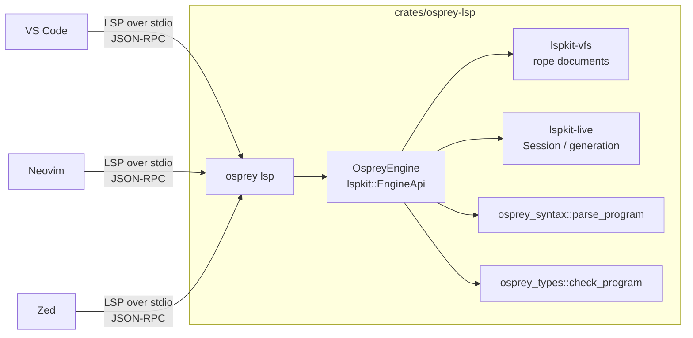

# Language Server & Editor Integrations

> **Engineering spec** (tooling), not part of the `0001`–`0019` language
> reference. One Rust analysis engine serves every editor over LSP.

> **Flavor layer — shared core (AST and above).** The server selects each
> document's flavor through `osprey_syntax::parse_program_for_path(uri, text)`,
> using its `.osp`/`.ospml` extension and leading `// osprey: flavor=` marker
> (`[FLAVOR-SELECT]` in [Language Flavors](0023-LanguageFlavors.md)). Parsing
> lowers both surfaces to `osprey_ast::Program`; diagnostics, hover, completion,
> signature help, and navigation operate on that AST without inspecting flavor.

## Status

| Surface                                          | State                                                                                                                                                           |
| ------------------------------------------------ | --------------------------------------------------------------------------------------------------------------------------------------------------------------- |
| Language server (`osprey lsp`, Rust on `lspkit`) | **Shipped** — replaced the TypeScript server ([#137](https://github.com/Nimblesite/osprey/pull/137)).                                                           |
| VS Code extension (`nimblesite.osprey`)          | **Shipped** — per-platform VSIX bundling a version-matched compiler.                                                                                            |
| Flavor-aware answers (`[LSP-FLAVOR-RENDER]`)     | **Shipped** — hover, completion and signature help resolve and present in the document's authoring flavor; a marker/extension conflict is a `flavor-error` diagnostic. |
| Debugger (`osprey --debug` + DAP)                | Planned / in progress — source-level native debugging via DWARF + LLDB-DAP; see [Debugger](0021-Debugger.md) and [Plan 0012](../plans/0012-osprey-debugger.md). |
| Open VSX                                         | Planned.                                                                                                                                                        |
| Neovim                                           | Planned. The server is editor-agnostic; only a client recipe is missing.                                                                                        |
| Zed                                              | Planned (`shipwright-zed`).                                                                                                                                     |
| MCP surface (`lspkit-mcp`)                       | Future — the same `EngineApi` vended as MCP tools.                                                                                                              |

## Architecture: one engine, two surfaces `[LSP-ENGINE]`

The server uses the published [`lspkit`](https://github.com/Nimblesite/lspkit)
crates. One `EngineApi` implementation backs LSP and, later, MCP, sharing live
analysis state.



### Debugger Integration `[DEBUGGER-EDITOR]`

LSP owns diagnostics, symbols, hover, definition, completion, and source
identity. DAP owns breakpoints, stepping, stack frames, scopes, and variables.
Both use the same version-matched `osprey` compiler and must agree on file
identity, line/column encoding, and generated debug metadata.

The server **does not shell out** to `osprey` or scrape stderr. It calls the
compiler front-end directly
([`crates/osprey-lsp/src/diagnostics.rs`](../../crates/osprey-lsp/src/diagnostics.rs)),
so diagnostics, hover, and navigation use the compiler parser and type checker.

Consumed crates:

| Crate           | Used for                                                                                         |
| --------------- | ------------------------------------------------------------------------------------------------ |
| `lspkit`        | `EngineApi` trait + neutral types.                                                               |
| `lspkit-server` | JSON-RPC framing, `Dispatcher`, `Capabilities`, `DiagnosticsBus`/`DiagnosticsSink`, URI helpers. |
| `lspkit-vfs`    | Open-document store, rope incremental edits, `PositionEncoding` negotiation.                     |
| `lspkit-live`   | `Session` generation counter + broadcast.                                                        |

### Reuse lspkit maximally `[LSP-REUSE-LSPKIT]`

Editor-neutral functionality MUST NOT be re-implemented in `osprey-lsp`; it
comes from `lspkit-*`. If a language-agnostic primitive is missing, use a thin
local shim and file an upstream issue; remove the shim when `lspkit` ships it.
Word-at-position, occurrence, and position re-measurement use the shim tracked as
[`lspkit#2`](https://github.com/Nimblesite/lspkit/issues/2); the shim lives in
[`crates/osprey-lsp/src/text.rs`](../../crates/osprey-lsp/src/text.rs).

## Transport `[LSP-TRANSPORT]`

There is **one** server entry point for every editor:

```
osprey lsp
```

It speaks LSP over **stdio** with `Content-Length` framing; there is no socket,
port, or per-editor binary. The subcommand is
implemented in [`crates/osprey-cli/src/main.rs`](../../crates/osprey-cli/src/main.rs)
(delegating to `osprey_lsp::run_stdio`).

## Lifecycle `[LSP-LIFECYCLE]`

Standard LSP handshake and document sync:

- `initialize` → advertise capabilities (`[LSP-CAPABILITIES]`); `initialized`.
- `shutdown` → `exit`. After `shutdown`, requests fail with `EngineError::ShuttingDown`.
- Document sync (incremental, `textDocumentSync: 2`): `didOpen`, `didChange`,
  `didClose`. A `didChange` applies **either** a full replacement **or** a set
  of incremental edits — never an open+change at the same version (which silently
  drops edits). Dropped edits are surfaced, not swallowed.
- `$/cancelRequest` is accepted. Requests are served sequentially;
  request-level concurrency remains a non-goal until profiling shows a need.

## Capabilities `[LSP-CAPABILITIES]`

The server advertises and implements:

| Capability       | Method                            | Notes                                                                                                                                                                                       |
| ---------------- | --------------------------------- | ------------------------------------------------------------------------------------------------------------------------------------------------------------------------------------------- |
| Diagnostics      | `textDocument/publishDiagnostics` | Push, via `DiagnosticsBus`. `[LSP-DIAGNOSTICS]`                                                                                                                                             |
| Hover            | `textDocument/hover`              | Markdown. Functions/builtins → signature; **`let`/`mut` bindings (local _and_ top-level) → their declared or inferred type**; any declaration's `///` docs rendered as prose. `[LSP-HOVER]` |
| Go to definition | `textDocument/definition`         | AST-driven, anchored on the identifier.                                                                                                                                                     |
| Find references  | `textDocument/references`         | Whole-word scan; `includeDeclaration` honored.                                                                                                                                              |
| Document symbols | `textDocument/documentSymbol`     | Flat `DocumentSymbol`s; range on the **name**, not the `fn`/`let`/`type` keyword.                                                                                                           |
| Signature help   | `textDocument/signatureHelp`      | Active-parameter tracking; ignores `,`/`(`/`)` inside strings and `//` comments.                                                                                                            |
| Completion       | `textDocument/completion`         | Keywords/snippets + the document's own declarations.                                                                                                                                        |

## Hover `[LSP-HOVER]`

`textDocument/hover` locates the word through `[LSP-REUSE-LSPKIT]`, walks the
AST for its declaration, and returns Markdown: a fenced signature or
`name: type`, followed by documentation when present. Implemented in
[`crates/osprey-lsp/src/features.rs`](../../crates/osprey-lsp/src/features.rs)
(`hover`) over [`analysis.rs`](../../crates/osprey-lsp/src/analysis.rs)
(`collect_all_symbols`).

Resolution order for the symbol under the cursor:

1. A built-in (`print`, `map`, …) → its reference signature.
2. A user **function** → its `fn name(params) -> ret` signature.
3. A **`let`/`mut` binding** → `[LSP-HOVER-VARIABLES]`.

### Variable hover `[LSP-HOVER-VARIABLES]`

Every binding is hoverable:

- **Collection is deep.** `collect_all_symbols` walks _into_ every
  expression that can contain a block — function bodies, `handle … in …`,
  `match`/`select` arms, lambdas, `spawn`/`await`, interpolations, call
  arguments, list/map/object literals — so a `let` nested anywhere (e.g. inside
  an HTTP handler's `in { … }` block) is found. A cursor-line/“nearest binding
  at or before the cursor” rule resolves shadowing.
- **Type comes from inference when unannotated.** An annotated `let x: T = …`
  shows `x: T`. An unannotated `let x = f()` shows the **inferred** type: the
  checker publishes every `let`'s resolved type keyed by source position
  (`ProgramTypes.lets`, queried via `let_type`), the same position-keyed
  mechanism already used for lambda parameters. The binding position is anchored
  on the declaration's `let`/`mut` keyword so a leading doc comment never shifts
  it. Implemented across
  [`osprey-types`](../../crates/osprey-types/src/check.rs) (`let_tys`) and
  [`osprey-types/src/info.rs`](../../crates/osprey-types/src/info.rs).

### Documentation comments `[LSP-HOVER-DOCS]`

Every declaration form can be documented — `fn`, `let`/`mut`, `type`, `effect`,
`extern`, and `module` — in **both flavors** (`///` in Default, `(** … *)` in
ML). The doc comment is lowered into the structured
[`DocComment`](0026-DocumentationComments.md) on the AST node's `doc` field, and
hover renders it as Markdown (summary, body, then recognised sections) beneath
the signature/type line. See [Documentation Comments](0026-DocumentationComments.md)
for the full model, sigils, sections, and body markup.

**Doc-link hover `[DOC-LINK]`.** A `[Symbol]` intra-doc link inside a doc
comment is itself hoverable: putting the cursor on `[helper]` or
`[Console.emit]` shows the referenced declaration's own hover. Rendering lives
in [`osprey-lsp/src/features.rs`](../../crates/osprey-lsp/src/features.rs)
(`doc_link_target` / `resolve_link`); doc capture lives in
[`osprey-syntax/src/docparse.rs`](../../crates/osprey-syntax/src/docparse.rs)
and each flavor's lowerer.

## Answering in the authoring flavor `[LSP-FLAVOR-RENDER]`

Osprey has two source surfaces ([0023 — Language Flavors](0023-LanguageFlavors.md)),
and both frontends meet at one flavor-blind `osprey_ast::Program`
(`[FLAVOR-BOUNDARY]`). Symbols are therefore collected without any memory of the
spelling that produced them — so the server **re-applies the flavor at the
presentation edge**, and nowhere else.

Every document-scoped feature resolves its flavor with the one
`[FLAVOR-SELECT]` precedence chain — marker > extension > Default — the same
chain the CLI uses. There is exactly one resolver
(`osprey_syntax::resolve_flavor`); a feature that sniffs the extension itself is
a defect, because a `// osprey: flavor=ml` marker must outrank it.

Normative requirements:

- **Hover** renders its code block in the document's flavor: the fence language
  is `osprey` or `osprey-ml` (each is a distinct VS Code language with its own
  TextMate grammar), and the signature is respelled — `fn inc(x: int) -> int`
  in Default is `inc : int -> int` in ML (`[FLAVOR-ML-FN]`, curried and
  right-associated; parameter names belong to the clause head, not the
  signature line). Declaration binders juxtapose: `type Box<T>` is `type Box T`
  (`[FLAVOR-ML-GENERICS]`).
- **Signature help** labels the call in the same spelling.
- **Completion** offers only keywords the flavor actually has, with snippets
  that flavor accepts. ML has **no `fn`, `let`, or `if`** — a definition is a
  bare clause, a binding needs no keyword, and a condition is a `match` on
  `true`/`false` — so completing them would insert plain identifiers and a
  guaranteed parse error. Brace-form snippets are equally invalid under the
  layout parser.
- **A marker/extension conflict is a diagnostic, not a guess.** `[FLAVOR-SELECT]`
  makes the disagreement a hard error and the CLI refuses to build the file; the
  editor reports it (code `flavor-error`, anchored on the marker line) as the
  document's *only* finding, since parsing under a guessed flavor buries the
  real fault under phantom errors.

Rendering lives in
[`osprey-lsp/src/mlrender.rs`](../../crates/osprey-lsp/src/mlrender.rs) — pure,
total string functions over the closed set of spellings the analyzer emits — and
is applied in [`features.rs`](../../crates/osprey-lsp/src/features.rs).

## Position encoding `[LSP-ENCODING]`

The server negotiates `positionEncoding` at `initialize` (default **UTF-16**).
Tree-sitter reports columns as **byte** offsets, so every position crossing the
wire is re-measured into the negotiated encoding
([`crates/osprey-lsp/src/text.rs`](../../crates/osprey-lsp/src/text.rs),
`byte_col_to_encoding`). A client that negotiates UTF-8 must receive UTF-8
offsets; this is not optional.

## Analyzer Lints `[LSP-ANALYZER]`

The server runs style lints over `osprey_ast::Program` and inferred types. Lints
are **flavor-blind** ([FLAVOR-BOUNDARY](0023-LanguageFlavors.md#the-one-law)) and
must fire identically for `.osp` and `.ospml` twins. Each MUST provide a
text-rewriting autofix code action. CI runs the analyzer in deny mode.
**Status: specified; the redundant-symbol rule is first.**

### Redundant symbols `[ANALYZER-REDUNDANT-SYMBOL]`

This lint flags, and its autofix deletes, every redundant type annotation: any annotation
whose type the Hindley-Milner checker already infers
([TYPE-NO-REDUNDANT-ANNOTATION](0004-TypeSystem.md#hindley-milner-inference)).

| Redundant form | Autofix result |
| --- | --- |
| `fn add(a: int, b: int) = a + b` | `fn add(a, b) = a + b` |
| `fn isEven(x) -> bool = (x % 2) == 0` | `fn isEven(x) = (x % 2) == 0` |
| `let n: int = 0` | `let n = 0` |
| `\|x: int\| => x * 2` | `\|x\| => x * 2` |
| ML `add : int -> int` over an inferable `add x = …` | delete the signature line |
| needless `fn main()` / ML `main () =` wrapping a script | unwrap to bare top-level statements |

**Decision procedure.** The annotation is redundant ⇔ re-running inference with
it removed yields the *same* principal type **and** the same lowered AST/IR. The
lint checks the written annotation against the inferred type; if they match and
the annotation is not load-bearing, it reports a `quickfix` that removes the
symbol (and, for a needless `main`, dedents the body — `main` is synthesised from
trailing top-level statements, so the script runs unchanged).

**Never flagged (load-bearing).** The lint must not touch an annotation the
checker cannot infer: an empty literal (`let xs: List<int> = []`), the ambiguous
empty map `{}`, an `extern` boundary, an unconstrained polymorphic variable a
caller must pin, or a return type that *forces* `Result<T, E>` auto-unwrap to `T`
([Result Auto-Unwrapping](0004-TypeSystem.md#result-auto-unwrapping)). Removing
one of these changes the program, so it is not redundant. A `main` that takes
arguments or returns a real exit code is likewise kept.

This lint enforces
[TYPE-NO-REDUNDANT-ANNOTATION](0004-TypeSystem.md#hindley-milner-inference);
the two specs must change together.

## Editor integrations

Every integration is a thin client over `[LSP-TRANSPORT]`. They differ only in
packaging and in how the version-matched binary is sourced (`[EDITOR-VERSIONING]`).

### VS Code `[EDITOR-VSCODE]`

- Extension id `nimblesite.osprey`; client in
  [`vscode-extension/client/src/extension.ts`](../../vscode-extension/client/src/extension.ts)
  spawns `osprey lsp` over stdio.
- Shipped as a **per-platform VSIX** (`darwin-arm64`, `darwin-x64`, `linux-x64`,
  `win32-x64`). Each VSIX **bundles** a version-matched `osprey` binary + runtime
  libs + a stamped `shipwright.json`, verified present inside the package at build
  time.
- Client resolves the server command in priority order: user setting
  (`osprey.server.compilerPath`) → bundled binary → `PATH` (per the Shipwright
  `sources` list in [`shipwright.json`](../../shipwright.json)).
- The debugger contribution is part of the same extension but is not an LSP
  request. It uses the LSP/editor context to resolve the current `.osp` program,
  invokes the version-matched compiler as `osprey --debug --compile`, and starts
  a DAP session (initially `lldb-dap`) against the resulting native binary.
- Pressing F5 MUST start a real debug session. It MUST NOT cancel the debug
  session and shell out to `osprey --run`; that path belongs only to the
  `osprey.run` command.
- Marketplace publication uses **OIDC** (no PAT) — see `[EDITOR-VERSIONING]` and
  the release plan.

### Open VSX `[EDITOR-OPENVSX]`

The same per-platform VSIX is published to [Open VSX](https://open-vsx.org) for
VSCodium, Cursor, Windsurf, and Gitpod users. Open VSX has **no** OIDC support
(as of 2026); it uses a separate long-lived `OVSX_PAT`. The Open VSX job MUST be
independent of the Marketplace job so neither gates the other.

### Neovim `[EDITOR-NEOVIM]`

No VSIX. Neovim runs `osprey lsp` directly via `vim.lsp` / `nvim-lspconfig`:

```lua
vim.lsp.config('osprey', {
  cmd = { 'osprey', 'lsp' },
  filetypes = { 'osprey' },
  root_markers = { '.git', 'osprey.toml' },
})
```

The binary is sourced from the user's `PATH` (Homebrew/Scoop/GitHub release).
Versioning is the installed binary's own version (`[EDITOR-VERSIONING]`); there
is no bundling step.

### Zed `[EDITOR-ZED]`

A Zed extension (Rust compiled to WASM) registers Osprey as a language and
declares its language server command (`osprey lsp`), published to the Zed
extension registry. Version-matching and binary acquisition follow
[`shipwright-zed`](https://github.com/Nimblesite/Shipwright). Like Neovim, the
binary comes from `PATH` or package managers.

## Versioning & supply chain `[EDITOR-VERSIONING]`

All editor integrations obey the
[Shipwright](https://github.com/Nimblesite/Shipwright) version contract — the
extension and the binary it launches MUST be version-matched.

- The binary is the source of truth: `osprey --version` → `osprey X.Y.Z`;
  `osprey --version --json` → the version manifest (`[SWR-VERSION-CLI-OUTPUT]`).
- Components are declared in [`shipwright.json`](../../shipwright.json):
  `osprey` (the CLI — which _is_ the language server, via the `lsp`
  subcommand) and `osprey-vscode`. The component id **must** equal the name the
  binary reports from `osprey --version` (Shipwright matches the probed name
  against the component id), so the CLI component is `osprey`, not
  `osprey-compiler`. The LSP is **not** a separate component; it is
  the same binary, so no separate version surface exists to drift.
- Source version fields stay at `0.0.0-dev`; the real version is stamped from the
  git tag at build time (`[SWR-VERSION-BUILD-STAMPING]`). Hard-coding a version is
  a defect.
- VS Code activation verifies the bundled compiler against the manifest and
  prompts to reinstall on mismatch (`hosts.vscode.onMismatch`). PATH/registry
  sources are verified at startup (`verifyStartup`).
- Marketplace publishing uses GitHub OIDC → Microsoft Entra workload-identity
  federation, with no stored PAT (`[SWR-VSIX-PUBLISH]`, `[SWR-SEC-OIDC-PUBLISH]`).
  Concrete tenant/app identifiers live in the private
  `Nimblesite/NimblesiteDeployment` ops repo; the release wiring is in the plan.

## Conformance

A change to this spec is conformant only if:

1. Every editor still launches the **same** `osprey lsp` stdio server
   (`[LSP-TRANSPORT]`) — no editor-specific analysis logic.
2. New capabilities update both `initialize_result` and the `[LSP-CAPABILITIES]`
   table.
3. Debugger integration keeps static analysis in LSP and runtime control in DAP;
   both must use the same source identity and position model
   (`[DEBUGGER-EDITOR]`, `[LSP-ENCODING]`).
4. VS Code F5 starts a real DAP debug session; it does not proxy to
   `osprey --run` (`[EDITOR-VSCODE]`).
5. No source file hard-codes a version (`[EDITOR-VERSIONING]`).
6. Code implementing a section references its ID in a comment
   (e.g. `// Implements [LSP-CAPABILITIES]`), enforced by `spec-check`.
7. Every document-scoped feature resolves its flavor through the single
   `osprey_syntax::resolve_flavor` chain and presents its answer in that flavor
   (`[LSP-FLAVOR-RENDER]`). A feature that sniffs the file extension itself, or
   that answers a `.ospml` document in Default spelling, is non-conformant.
