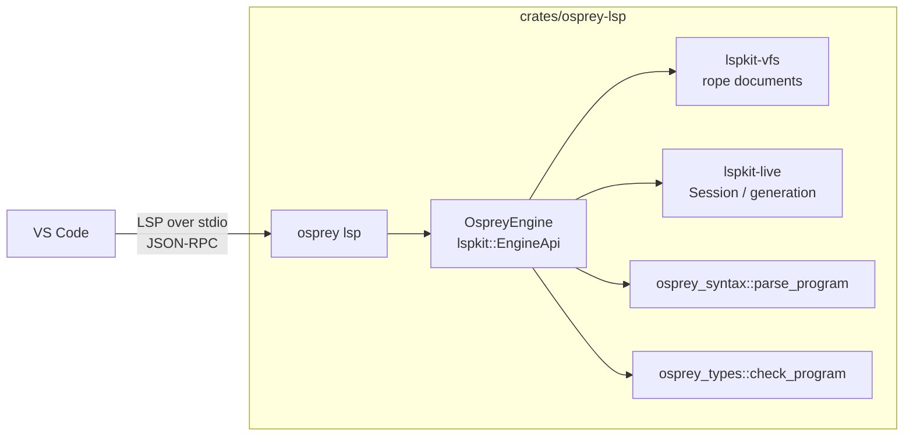

# Language Server & Editor Integrations

> **Engineering spec** (tooling), not part of the `0001`–`0019` language
> reference. One Rust analysis engine serves every editor over LSP.

> **Flavor layer — shared core (AST and above).** The server selects each
> document's flavor through `osprey_syntax::resolve_flavor`,
> using its `.osp`/`.ospml` extension and leading `// osprey: flavor=` marker
> (`[FLAVOR-SELECT]` in [Language Flavors](0023-LanguageFlavors.md)). Parsing
> lowers both surfaces to `osprey_ast::Program`; diagnostics, hover, completion,
> signature help, and navigation operate on that AST without inspecting flavor.

## Status

| Surface                                          | State                                                                                                                                                           |
| ------------------------------------------------ | --------------------------------------------------------------------------------------------------------------------------------------------------------------- |
| Language server (`osprey lsp`, Rust on `lspkit`) | **Shipped** — replaced the TypeScript server ([#137](https://github.com/Nimblesite/osprey/pull/137)).                                                           |
| VS Code extension (`nimblesite.osprey`)          | **Shipped** — per-platform VSIX bundling a version-matched compiler; release automation publishes to Visual Studio Marketplace and Open VSX.                    |
| Flavor-aware answers (`[LSP-FLAVOR-RENDER]`)     | **Shipped** — hover, completion and signature help resolve and present in the document's authoring flavor; a marker/extension conflict is a `flavor-error` diagnostic. |
| Context-aware completion (`[LSP-COMPLETION-CONTEXT]`) | **Shipped** — the list is filtered by cursor position: type annotation, `receiver.` member, `match` pattern, parameter binder, value, declaration. |
| Cross-file resolution (`[LSP-WORKSPACE]`)        | **Shipped** — hover, definition, references, completion and signature help reach every sibling file of the project through the compiler's own loader. |
| Native debugger (`osprey --debug` + DAP)         | **Shipped** — VS Code launches `lldb-dap`; variable presentation remains partial. See [Debugger](0021-Debugger.md).                                             |

## Architecture: one engine behind LSP `[LSP-ENGINE]`

The server uses the published [`lspkit`](https://github.com/Nimblesite/lspkit)
crates. One `EngineApi` implementation owns the open-document state and supplies
the analysis queries consumed by the stdio LSP server.


```mermaid
flowchart LR
  vscode[VS Code]

  vscode -->|LSP over stdio<br/>JSON-RPC| lsp

  subgraph server["crates/osprey-lsp"]
    lsp["osprey lsp"]
    engine["OspreyEngine<br/>lspkit::EngineApi"]
    vfs["lspkit-vfs<br/>rope documents"]
    live["lspkit-live<br/>Session / generation"]
    syntax["osprey_syntax::parse_program"]
    types["osprey_types::check_program"]

    lsp --> engine
    engine --> vfs
    engine --> live
    engine --> syntax
    engine --> types
  end
```

The server **does not shell out** to `osprey` or scrape stderr. It calls the
compiler front-end directly
([`crates/osprey-lsp/src/diagnostics.rs`](../../crates/osprey-lsp/src/diagnostics.rs)),
so diagnostics, hover, and navigation use the compiler parser and type checker.

Consumed crates:

| Crate           | Used for                                                                                         |
| --------------- | ------------------------------------------------------------------------------------------------ |
| `lspkit`        | `EngineApi` trait + neutral types.                                                               |
| `lspkit-server` | JSON-RPC framing, `Dispatcher`, and `DiagnosticsBus`/`DiagnosticsSink`.                         |
| `lspkit-vfs`    | Open-document store, rope incremental edits, position measurement.                              |
| `lspkit-live`   | `Session` generation counter + broadcast.                                                        |

### Reuse lspkit maximally `[LSP-REUSE-LSPKIT]`

Editor-neutral functionality MUST NOT be re-implemented in `osprey-lsp`; it
comes from `lspkit-*`. The remaining word-at-position, occurrence, and position
measurement helpers are isolated in
[`crates/osprey-lsp/src/text.rs`](../../crates/osprey-lsp/src/text.rs).

## Transport `[LSP-TRANSPORT]`

There is **one** server entry point for every editor:

```
osprey lsp
```

It speaks LSP over **stdio** with `Content-Length` framing; there is no socket,
port, or per-editor binary. The subcommand is
implemented in [`crates/osprey-cli/src/main.rs`](../../crates/osprey-cli/src/main.rs)
(delegating to `osprey_lsp::run_stdio`).

## Lifecycle `[LSP-LIFECYCLE]`

Standard LSP handshake and document sync:

- `initialize` → advertise capabilities (`[LSP-CAPABILITIES]`); `initialized`.
- `shutdown` returns `null`; the following `exit` notification terminates the
  stdio loop.
- Document sync (incremental, `textDocumentSync: 2`): `didOpen`, `didChange`,
  `didClose`. A `didChange` applies **either** a full replacement **or** a set
  of incremental edits — never an open+change at the same version (which silently
  drops edits). Dropped edits are surfaced, not swallowed.
- `$/cancelRequest` is accepted. Requests are served sequentially;
  request-level concurrency remains a non-goal until profiling shows a need.

## Capabilities `[LSP-CAPABILITIES]`

The server exposes:

| Capability       | Method                            | Notes                                                                                                                                                                                       |
| ---------------- | --------------------------------- | ------------------------------------------------------------------------------------------------------------------------------------------------------------------------------------------- |
| Diagnostics      | `textDocument/publishDiagnostics` | Push, via `DiagnosticsBus`. `[LSP-DIAGNOSTICS]`                                                                                                                                             |
| Hover            | `textDocument/hover`              | Markdown. Functions/builtins → signature; **`let`/`mut` bindings (local _and_ top-level) → their declared or inferred type**; any declaration's `///` docs rendered as prose. `[LSP-HOVER]` |
| Go to definition | `textDocument/definition`         | AST-driven, anchored on the identifier.                                                                                                                                                     |
| Find references  | `textDocument/references`         | Whole-word scan; `includeDeclaration` honored.                                                                                                                                              |
| Document symbols | `textDocument/documentSymbol`     | Flat `DocumentSymbol`s; range on the **name**, not the `fn`/`let`/`type` keyword.                                                                                                           |
| Signature help   | `textDocument/signatureHelp`      | Active-parameter tracking; ignores `,`/`(`/`)` inside strings and `//` comments. Triggers on the **callee name** as well as inside its parentheses. `[LSP-WORKSPACE]`                       |
| Completion       | `textDocument/completion`         | Position-filtered keywords/snippets + project declarations. `[LSP-COMPLETION-CONTEXT]`, `[LSP-WORKSPACE]`                                                                                    |
| Formatting       | `textDocument/formatting`         | Returns one whole-document edit when formatting changes the buffer, otherwise no edits.                                                                                                    |

## Diagnostics `[LSP-DIAGNOSTICS]`

Opening or changing a document publishes compiler diagnostics for that buffer.
Flavor conflicts are reported alone as `flavor-error`; otherwise syntax errors
short-circuit type checking. A clean parse is assembled and type-checked through
`osprey_project` when the file belongs to a project, while standalone files use
the same single-source assembly path as the CLI. Closing the document removes it
from the live VFS.

## Hover `[LSP-HOVER]`

`textDocument/hover` locates the word through `[LSP-REUSE-LSPKIT]`, walks the
AST for its declaration, and returns Markdown: a fenced signature or
`name: type`, followed by documentation when present. Implemented in
[`crates/osprey-lsp/src/hover.rs`](../../crates/osprey-lsp/src/hover.rs)
over [`analysis.rs`](../../crates/osprey-lsp/src/analysis.rs)
(`collect_all_symbols`).

Resolution order for the symbol under the cursor:

1. A declaration in the open document — including user functions and
   **`let`/`mut` bindings** — with nearest-binding shadowing
   (`[LSP-HOVER-VARIABLES]`).
2. A built-in (`print`, `map`, …) → its reference signature.
3. A **written name that declares nothing** — a parameter or built-in type
   name → `[LSP-HOVER-WRITTEN]`.
4. A symbol declared in a **sibling file** of the project → `[LSP-WORKSPACE]`.

### Variable hover `[LSP-HOVER-VARIABLES]`

Every binding is hoverable:

- **Collection is deep.** `collect_all_symbols` walks _into_ every
  expression that can contain a block — function bodies, `handle … in …`,
  `match`/`select` arms, lambdas, `spawn`/`await`, interpolations, call
  arguments, list/map/object literals — so a `let` nested anywhere (e.g. inside
  an HTTP handler's `in { … }` block) is found. A cursor-line/“nearest binding
  at or before the cursor” rule resolves shadowing.
- **Type comes from inference when unannotated.** An annotated `let x: T = …`
  shows `x: T`. An unannotated `let x = f()` shows the **inferred** type: the
  checker publishes every `let`'s resolved type keyed by source position
  (`ProgramTypes.lets`, queried via `let_type`), the same position-keyed
  mechanism already used for lambda parameters. The binding position is anchored
  on the declaration's `let`/`mut` keyword so a leading doc comment never shifts
  it. Implemented across
  [`osprey-types`](../../crates/osprey-types/src/check.rs) (`let_tys`) and
  [`osprey-types/src/info.rs`](../../crates/osprey-types/src/info.rs).

### Written names `[LSP-HOVER-WRITTEN]`

Not every hoverable name is a declaration. Two are written without ever being
bound by `let`, and both are among the most-hovered tokens in any typed body:

- **A parameter, inside its own function's body.** Its type is its annotation
  when it has one and otherwise the type the checker resolved for that argument
  position (`ProgramTypes::param_types`), so `fn twice(n) = n * 2` hovers `n`
  as `n: int`. Scope is the enclosing declaration: the nearest function
  declared at or above the cursor. A parameter must not answer for a name in a
  *later* declaration.
- **A built-in type name in an annotation** (`int`, `string`, `Result`, …). No
  source file declares these, so there is nothing to navigate to; hover carries
  a one-line summary instead. A **declared** type resolves to its declaration
  and never reaches this table.

Still out of scope: the type of an arbitrary *sub-expression* (the `a + b` in a
body, a call's result). That needs an expression-keyed type table in
`osprey-types` alongside the existing `lets`/`lambdas` maps; the position-keyed
mechanism exists, the expression map does not.

### Documentation comments `[LSP-HOVER-DOCS]`

Every declaration form can be documented — `fn`, `let`/`mut`, `type`, `effect`,
`extern`, and `module` — in **both flavors** (`///` in Default, `(** … *)` in
ML). The doc comment is lowered into the structured
[`DocComment`](0026-DocumentationComments.md) on the AST node's `doc` field, and
hover renders it as Markdown (summary, body, then recognised sections) beneath
the signature/type line. See [Documentation Comments](0026-DocumentationComments.md)
for the full model, sigils, sections, and body markup.

**Doc-link hover `[DOC-LINK]`.** A `[Symbol]` intra-doc link inside a doc
comment is itself hoverable: putting the cursor on `[helper]` or
`[Console.emit]` shows the referenced declaration's own hover. Rendering lives
in [`osprey-lsp/src/hover.rs`](../../crates/osprey-lsp/src/hover.rs)
(`doc_link_target` / `resolve_link`); doc capture lives in
[`osprey-syntax/src/docparse.rs`](../../crates/osprey-syntax/src/docparse.rs)
and each flavor's lowerer.

## Answering in the authoring flavor `[LSP-FLAVOR-RENDER]`

Osprey has two source surfaces ([0023 — Language Flavors](0023-LanguageFlavors.md)),
and both frontends meet at one flavor-blind `osprey_ast::Program`
(`[FLAVOR-BOUNDARY]`). Symbols are therefore collected without any memory of the
spelling that produced them — so the server **re-applies the flavor at the
presentation edge**, and nowhere else.

Every document-scoped feature resolves its flavor with the one
`[FLAVOR-SELECT]` precedence chain — marker > extension > Default — the same
chain the CLI uses. There is exactly one resolver
(`osprey_syntax::resolve_flavor`); a feature that sniffs the extension itself is
a defect, because a `// osprey: flavor=ml` marker must outrank it.

Normative requirements:

- **Hover** renders its code block in the document's flavor: the fence language
  is `osprey` or `osprey-ml` (each is a distinct VS Code language with its own
  TextMate grammar), and the signature is respelled — `fn inc(x: int) -> int`
  in Default is `inc : int -> int` in ML (`[FLAVOR-ML-FN]`, curried and
  right-associated; parameter names belong to the clause head, not the
  signature line). Declaration binders juxtapose: `type Box<T>` is `type Box T`
  (`[FLAVOR-ML-GENERICS]`).
- **Signature help** labels the call in the same spelling.
- **Completion** offers only keywords the flavor actually has, with snippets
  that flavor accepts. ML has **no `fn`, `let`, or `if`** — a definition is a
  bare clause, a binding needs no keyword, and a condition is a `match` on
  `true`/`false` — so completing them would insert plain identifiers and a
  guaranteed parse error. Brace-form snippets are equally invalid under the
  layout parser.
- **A marker/extension conflict is a diagnostic, not a guess.** `[FLAVOR-SELECT]`
  makes the disagreement a hard error and the CLI refuses to build the file; the
  editor reports it (code `flavor-error`, anchored on the marker line) as the
  document's *only* finding, since parsing under a guessed flavor buries the
  real fault under phantom errors.

Rendering lives in
[`osprey-lsp/src/mlrender.rs`](../../crates/osprey-lsp/src/mlrender.rs) and is
applied at the feature boundary.

## Completion is position-filtered `[LSP-COMPLETION-CONTEXT]`

A completion list that ignores the cursor is not merely noisy — it is wrong.
The `fn` snippet expands to a whole function declaration; offered inside a type
annotation it inserts source no flavor parses. Completion therefore classifies
the cursor before answering
([`osprey-lsp/src/context.rs`](../../crates/osprey-lsp/src/context.rs)) and
offers only what is legal there:

| Cursor              | Offered                                                     |
| ------------------- | ----------------------------------------------------------- |
| Declaration/statement | Every keyword of the flavor, plus every visible symbol.    |
| Value (after `=`, `(`, `,`, an operator) | Expression keywords of the active flavor plus every visible symbol: Default offers `if`/`match`; ML offers `match`/`handle`. Declaration forms are withheld. |
| Written type (after `:` or `->`) | Declared types and effects, plus the built-in type names. No keywords, no bindings, no functions. |
| `receiver.` | Only that record's fields — `[LSP-COMPLETION-MEMBER]`.                 |
| `match` arm pattern | Constructors and `_`.                                       |
| A declaration's parameter name | **Nothing.** The author is inventing a name; every suggestion is noise. |

Classification is **lexical, not semantic**: it reads the scrubbed prefix
before the cursor, because a buffer being edited is usually not parsable. String
literals and comments are blanked first, so a `:` inside a string is not an
ascription and a `.` inside a comment is not a field access. Indentation carries
`match`-arm nesting, since Default's braces are optional and ML has none.
Unrecognised contexts fall back to declaration completions; binder and unresolved
member contexts deliberately return no suggestions.

### Member completion `[LSP-COMPLETION-MEMBER]`

After `receiver.`, the list is exactly the fields of the record the receiver
holds — its annotation when written, else its inferred type, read
**structurally** from the checker (a record renders as `{ x: int, y: int }`,
which names no type, so a rendered string cannot be parsed back into a lookup
key). An unresolved receiver yields **nothing**: `origin.` is a promise that
only `origin`'s fields follow, and falling back to the whole symbol table breaks
that promise.

## The project is the unit of analysis `[LSP-WORKSPACE]`

A file is not a program. When the open document belongs to a project — the
nearest ancestor directory holding an `osprey.toml` — hover, go-to-definition,
find-references, completion and signature help resolve against **every** source
file the manifest links, not just the buffer in front of the cursor.

Sibling files are loaded through `osprey_project::load`, the same loader the CLI
and `[LSP-DIAGNOSTICS]` already use: the editor's idea of which files form a
program must not be able to drift from the compiler's. URI/path resolution and
project discovery live once, in
[`osprey-lsp/src/workspace.rs`](../../crates/osprey-lsp/src/workspace.rs).

Normative requirements:

- **The open buffer is searched first.** A local declaration shadows an
  imported one, and the open buffer's *unsaved* text is authoritative for
  itself.
- **A standalone script costs nothing.** No `osprey.toml` means no siblings, no
  load, and no answers invented from files that are part of no program.
- **Find-references reaches the declaration wherever it lives.** A declaring
  file spells the name unqualified (`openSql`) while its callers write the
  qualified path (`Ledger::openSql`), so a whole-word scan alone never arrives;
  the sibling scan adds declaration sites by symbol identity.

## Position encoding `[LSP-ENCODING]`

The server advertises and uses **UTF-16** `positionEncoding`. Tree-sitter
reports columns as **byte** offsets, so every position crossing the wire is
re-measured into UTF-16 units
([`crates/osprey-lsp/src/text.rs`](../../crates/osprey-lsp/src/text.rs),
`byte_col_to_encoding`). The internal helpers remain encoding-parameterized so
conversion behavior can be unit-tested independently of the fixed wire choice.

## Editor integrations

The shipped VS Code integration is a thin client over `[LSP-TRANSPORT]`.

### VS Code `[EDITOR-VSCODE]`

- Extension id `nimblesite.osprey`; client in
  [`vscode-extension/client/src/extension.ts`](../../vscode-extension/client/src/extension.ts)
  spawns `osprey lsp` over stdio.
- Shipped as a **per-platform VSIX** (`darwin-arm64`, `linux-x64`,
  `win32-x64`). Each VSIX **bundles** a version-matched `osprey` binary + runtime
  libs + a stamped `shipwright.json`, verified present inside the package at build
  time.
- Client resolves the server command in priority order: user setting
  (`osprey.server.compilerPath`) → bundled binary → `PATH` (per the Shipwright
  `sources` list in [`shipwright.json`](../../shipwright.json)).
- The extension's native DAP integration is specified in
  [Debugger](0021-Debugger.md); it is separate from the LSP request path.
- Marketplace publication uses **OIDC** (no PAT) — see `[EDITOR-VERSIONING]` and
  the [release workflow](../../.github/workflows/release.yml). Open VSX
  publication uses the same VSIX artifacts and an independent optional-token
  job, so either registry can succeed alone.

## Versioning & supply chain `[EDITOR-VERSIONING]`

The VS Code distributions obey the
[Shipwright](https://github.com/Nimblesite/Shipwright) version contract: the
extension and bundled binary MUST be version-matched.

- The binary is the source of truth: `osprey --version` → `osprey X.Y.Z`;
  `osprey --version --json` → the version manifest (`[SWR-VERSION-CLI-OUTPUT]`).
- Components are declared in [`shipwright.json`](../../shipwright.json):
  `osprey` (the CLI — which _is_ the language server, via the `lsp`
  subcommand) and `osprey-vscode`. The component id **must** equal the name the
  binary reports from `osprey --version` (Shipwright matches the probed name
  against the component id), so the CLI component is `osprey`, not
  `osprey-compiler`. The LSP is **not** a separate component; it is
  the same binary, so no separate version surface exists to drift.
- Source version fields stay at `0.0.0-dev`; the real version is stamped from the
  git tag at build time (`[SWR-VERSION-BUILD-STAMPING]`). Hard-coding a version is
  a defect.
- VS Code activation verifies the bundled compiler against the manifest and
  prompts to reinstall on mismatch (`hosts.vscode.onMismatch`). PATH/registry
  sources are verified at startup (`verifyStartup`).
- Marketplace publishing uses GitHub OIDC → Microsoft Entra workload-identity
  federation, with no stored PAT (`[SWR-VSIX-PUBLISH]`,
  `[SWR-SEC-OIDC-PUBLISH]`).
