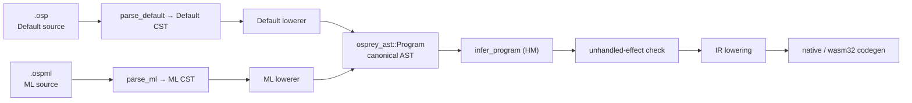
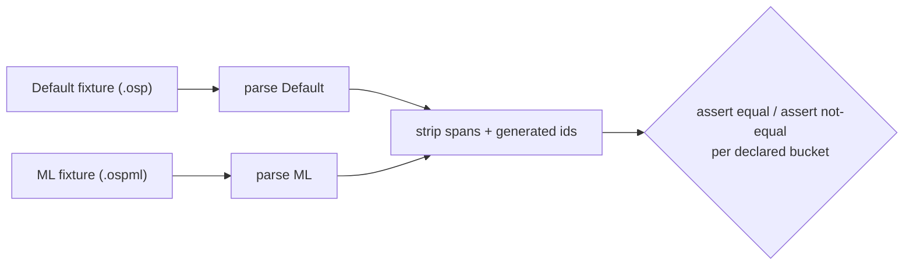

# Language Flavors

Osprey supports more than one **source syntax** over **one language core**. A
*flavor* is a parser-and-lowering profile, not a separate language: every
flavor converges on the same canonical AST before any semantic analysis runs.

The ML surface syntax is specified in
[ML Flavor Syntax](0024-MLFlavorSyntax.md).

## Status

Both frontends are implemented in `crates/osprey-syntax/src/default/` and
`crates/osprey-syntax/src/ml/`. Default uses tree-sitter; ML uses a hand-written
layout lexer, recursive-descent parser, and separate CST-to-AST lowerer. Both
produce `osprey_ast::Program` before type checking or code generation.

`Flavor`, `Parsed.flavor`, `parse_program_with_flavor`, the CLI
`--flavor default|ml` flag, `.ospml`, and the leading
`// osprey: flavor=ml` marker are shipped. First-class handler values and the
`handler`/`do` keywords are not part of the shipped language and are rejected;
both flavors support lexical `handle Effect ... in body` expressions.

## The One Law

`[FLAVOR-BOUNDARY]` **Everything below the canonical AST is a flavor concern.
Everything at or above the canonical AST is a shared-core concern.** The CST —
the concrete spelling of the program — belongs to the flavor. The AST belongs
to the language. The two flavors *meet* at `osprey_ast::Program` and are
indistinguishable from there on.

The rule is strict and one-directional:

> No type checker, effect checker, optimiser, IR lowering, or codegen path may
> inspect which flavor produced a program. If any phase after lowering needs to
> ask *"was this Default syntax or ML syntax?"*, the boundary has leaked and the
> design is wrong.

The only place flavor identity survives past lowering is **diagnostic
rendering** (see [Flavor-Aware Diagnostics](#flavor-aware-diagnostics)): the
*semantic* error is flavor-blind; only the *suggested fix wording* is rendered
in the author's syntax.

This is not "braces are optional" and not "the formatter picks a style." Each
flavor is a complete, self-consistent surface with its own CST node shapes.
They are reconciled by their lowerers, never by a shared grammar.

## Flavors That Exist

| Flavor | Spelling | Blocks | Calls | Currying default | Extension | Spec |
| --- | --- | --- | --- | --- | --- | --- |
| **Default** | C-style | `{ … }` braces | `f(x: a, y: b)` parens + named args | **Off** — explicit only, via function-returning-function values | `.osp` | `0001`–`0022` |
| **ML** | layout | offside-rule indentation | `f a b` whitespace application | **On** — `f x y` curries; uncurried form `f (x, y)` | `.ospml` | [0024](0024-MLFlavorSyntax.md) |

Both flavors are permanent and first-class. The Default flavor is **not**
deprecated and is **not** a transitional dialect. Earlier design drafts proposed
replacing braces with one canonical layout form; that direction is
**superseded** by this spec. Osprey keeps both surfaces and unifies them at the
AST.

## The Pipeline



## Flavor Frontend

`[FLAVOR-FRONTEND]` Each flavor owns its parser, CST, and lowerer. The public
entry point dispatches by `Flavor`; `parse_program` remains the Default
specialisation.

```rust
// crates/osprey-syntax/src/lib.rs
pub enum Flavor {
    Default,
    Ml,
}

pub struct Parsed {
    pub program: Program,          // canonical AST — identical type for every flavor
    pub errors: Vec<SyntaxError>,
    pub flavor: Flavor,          // carried for diagnostic rendering only
}

pub fn parse_program_with_flavor(source: &str, flavor: Flavor) -> Parsed {
    match flavor {
        Flavor::Default => default::parse(source),
        Flavor::Ml => ml::parse_ml(source),
    }
}

/// Unchanged signature — Default stays the default API.
pub fn parse_program(source: &str) -> Parsed {
    parse_program_with_flavor(source, Flavor::Default)
}
```

The dispatch is implemented in `crates/osprey-syntax/src/lib.rs`. Default
lowering consumes tree-sitter nodes; ML parsing and lowering are contained in
`src/ml/`. Shared interpolation helpers accept a flavor-specific fragment
parser, so interpolation uses the surrounding source flavor.

`[FLAVOR-FRONTEND-FS]` **The flavor split is physical, not just logical.** Each
flavor — which is exactly a *(CST, parser, lowerer)* triple — owns its own folder
under `crates/osprey-syntax/src/`, so no flavor's CST handling is scattered
through the crate:

```text
crates/osprey-syntax/src/
  lib.rs        # flavor-agnostic ONLY: Flavor, Parsed, SyntaxError, dispatch + selection
  strings.rs    # flavor-neutral shared helpers: `${…}` splitting, escape resolution
  default/      # Default flavor: tree-sitter CST → AST
    mod.rs      #   parse entry, `parse_tree`, error collection
    lower.rs    #   statements/types/patterns (the `Lowerer`)
    expr.rs     #   expression lowering + Default `${…}` fragment parser
  ml/           # ML flavor: hand-written layout lexer + recursive-descent parser
    mod.rs lexer.rs token.rs parser.rs cst.rs lower.rs
```

`lib.rs` contains selection and dispatch. Flavor-neutral interpolation and
escape handling lives in `strings.rs`; each flavor supplies its own fragment
parser.

## Flavor Selection

`[FLAVOR-SELECT]` The compilation unit's flavor is resolved once, before
parsing, by this precedence (first match wins):

1. **CLI flag** — `osprey app.osp --flavor ml` (or `--flavor default`).
2. **File-level marker** — a leading line comment `// osprey: flavor=ml`
   before code.
3. **Extension** — `.ospml` ⇒ ML, `.osp` ⇒ Default.
4. **Default flavor.**

The marker-and-extension precedence lives in **one** place,
`osprey_syntax::resolve_flavor(flag, path, source)`
(`crates/osprey-syntax/src/lib.rs`), so the CLI and the editor can never drift
to different frontends for the same file. The CLI layers the `--flavor` flag on
top (`parse_args`/`run`, `crates/osprey-cli/src/main.rs`) and passes the result
to `parse_program_with_flavor`. The LSP resolves the same precedence per open
document through `osprey_syntax::parse_program_for_path(uri, text)`, which every
analysis (diagnostics, symbols, hover, completion, signature help, navigation)
routes through. A marker/extension conflict is a hard CLI error and a
`flavor-error` LSP diagnostic; the editor does not parse the document under a
guessed flavor for that diagnostic pass.

**One flavor per compilation unit.** A single `.osp`/`.ospml` file is wholly one
flavor. Cross-flavor *projects* are supported through normal imports (see
[Cross-Flavor Interop](#cross-flavor-interop)); cross-flavor *files* are not.

## The Lowering Contract

`[FLAVOR-LOWER-CONTRACT]` Every flavor lowerer must:

- **Produce canonical AST only.** The output type is `osprey_ast::Program`. A
  lowerer may never invent a node shape that a later phase has to special-case.
- **Preserve source spans.** Generated (desugared) nodes carry the
  `Position` of the source construct they came from, so diagnostics point at real
  text. Nodes with no source span use `position: None`.
- **Preserve documentation comments** (`doc` fields) and **parameter names**.
- **Normalise syntax-only differences** (see the table below) so equivalent
  programs in different flavors produce structurally identical ASTs.
- **Reject unsupported constructs.** A flavor must not invent an AST node or
  silently approximate semantics that the shared core cannot represent.

## Flavor Concern vs Shared-Core Concern

`[FLAVOR-LAYER]` This is the heart of the contract: the exact line between what
a flavor normalises away and what the shared core defines. Most rows lower both
flavors to the **same** canonical AST node (grounded in
`crates/osprey-ast/src/lib.rs`); the **Ordinary function**, **Equational
clauses** and **Call** rows (marked †) pair by *concept* only and deliberately
lower to different shapes — Default flat multi-parameter vs ML curried/nested
chain, and an ML-only clause sugar whose Default twin is the explicit `match`.
See [Currying Canonicalisation](#currying-canonicalisation).

| Concept | Default flavor | ML flavor | Canonical AST node |
| --- | --- | --- | --- |
| Immutable binding | `let x = e` | `x = e` | `Stmt::Let { mutable: false }` |
| Mutable binding | `mut x = e` | `mut x = e` | `Stmt::Let { mutable: true }` |
| Mutation | `x = e` | `x := e` | `Stmt::Assignment` |
| Ordinary function | `fn f(x, y) = e` | `f x y = e`† | `Stmt::Function` / curried `Lambda` chain† |
| Equational clauses | *(none — writes the `match`)* | `f 0 = a` / `f n = b`† | `Stmt::Function` over `Expr::Match`† |
| Lambda | `fn(y) => e` / `\|y\| => e` | `\y => e` | `Expr::Lambda` |
| Ignored parameter | `\|acc, _\| => e` | `\(acc, _) => e` | `Parameter`, generated name |
| Call | `f(x: a, y: b)` | `f a b`† | `Expr::Call` (`named_arguments` vs nested single-arg `Call`)† |
| Block | `{ s; …; e }` | layout block | `Expr::Block { statements, value }` |
| Match | `match v { P => e }` | `match v` + indented arms | `Expr::Match` + `MatchArm` |
| Result default | `e ?: d` | `e ?: d` | `Expr::Match` |
| One-field pattern | `Success { value }` | `Success value` | `Pattern::Constructor { fields: ["value"] }` |
| Union declaration | `type T = A \| B(X, Y)` | `type T = A \| B X Y` | `Stmt::Type` + `TypeVariant` |
| Positional construction | `B(x, y)` | `B x y` | `Expr::TypeConstructor` |
| Record construction | `T { f: v }` | `T` + indented `f = v` | `Expr::TypeConstructor` |
| Record update | `r { f: v }` | layout update | `Expr::Update` |
| Effect declaration | `effect E { op: fn(T)->U }` | `effect E` + `op : T => U` | `Stmt::Effect` + `EffectOperation` |
| Generic type params | `type Box<T>` / `type Feed<out T>` | `type Box T` / `type Feed out T` | `Stmt::Type { type_params: Vec<TypeParam> }` |
| Fn type params | `fn pick<T>(a: T, b: T)` | `pick<T> : (T, T) -> T` + binding | `Stmt::Function { type_params }` |
| Generic effect | `effect Stash<T> { … }` | `effect Stash T` + ops | `Stmt::Effect { type_params }` |
| Effect row w/ args | `!Stash<int>` / `![A<T>, B]` | `! Stash<int>` / `! [A<T>, B]` | `Stmt::Function { effects: Vec<EffectRef> }` |
| Ctor type args | `Box<int> { item: 7 }` | `Box<int>(item = 7)` | `Expr::TypeConstructor { type_args }` |
| Perform | `perform E.op(a)` | `perform E.op a` | `Expr::Perform` |

† See [Currying Canonicalisation](#currying-canonicalisation): Default
`fn f(x, y)` / `f(x: a, y: b)` is one flat multi-parameter function and one
multi-arg `Call`; ML `f x y` / `f a b` is a curried chain and nested single-arg
`Call`s. They share the AST *vocabulary* but are deliberately **not** the same
value. ML's twin for the flat Default forms is the uncurried `f (x, y)` /
`f (a, b)` (parens = argument grouping, not a tuple — Osprey has no tuple type).
**Equational clauses** have no Default spelling at all: they are ML surface sugar
for a `Stmt::Function` whose body is the `Expr::Match` a Default author writes by
hand, so the row pairs a *concept*, not two spellings.

Every row in the table is live. Positional payloads
([TYPE-UNION-POSITIONAL]) are a **shared-core** feature exposed in both flavors,
never ML-only sugar: a payload slot is an `osprey_ast::TypeField` whose declared
name is its decimal index (`"0"`, `"1"`), and a decimal string is not a valid
identifier in either flavor, so a slot is unreachable by name and can never
collide with a user-written field
(`osprey_ast::{positional_field_name, is_positional_field}` are the single
definition and its inverse). `_` parameters
([PARAM-WILDCARD](0003-Syntax.md#expressions)) are legal in both flavors, each
occurrence lowering to a distinct generated name no source can spell, so the pair
keeps its IR-equivalent twin. **Equational clauses** are rewritten CST-to-CST
into the parameter-list-over-`match` form before lowering
(`crates/osprey-syntax/src/ml/clauses.rs`), so the shared core never sees a
clause set and the emitted node is exactly the Default twin's; exactly one
refutable column is supported, and selecting on two is a diagnostic. The
**Result default** row uses the identical `?:` spelling in both flavors. Design
and sequencing are in [plan 0019](../plans/0019-ml-elegance.md).

Anything in that table is a **flavor concern**: the lowerer erases the spelling
difference and nothing downstream can tell which surface was used. Constructs
that have *no* row — because the canonical AST cannot yet express them — are
**shared-core concerns** and are handled in the next two sections.

## Currying Canonicalisation

`[FLAVOR-CURRY]` Currying is the one place the flavors read differently, and it
is still pure lowering — **no type-checker or codegen change is required.**

The canonical type `Type::Fun { params: Vec<Type>, ret: Box<Type> }`
(`crates/osprey-types/src/ty.rs:67`) is flat multi-arity. A *curried* function is
simply a **nested** `Fun`: `int -> int -> int` is
`Fun{[int], Fun{[int], int}}`. A curried *definition* is a chain of one-parameter
`Expr::Lambda` values; a curried *application* is nested one-argument
`Expr::Call`s. All three node forms already exist and already work
(capture-carrying lambdas-as-values are implemented — see
[plan 0002](../plans/0002-codegen-generic-function-values.md)).

So the split is entirely in the lowerers:

- **Default flavor: currying is explicit.** `fn add(x, y) = x + y` lowers to one
  `Stmt::Function` with two parameters. Currying happens only when the author
  writes a function that returns a function:

  ```osprey
  fn addCurried(x) -> (int) -> int = fn(y) => x + y
  ```

  which lowers to a one-parameter `Function` whose body is a one-parameter
  `Lambda`.

- **ML flavor: currying is the default reading.** `add x y = e` with the
  curried signature `add : int -> int -> int` lowers to **the same nested-lambda
  shape** as the Default `addCurried` above — a one-parameter binding returning a
  one-parameter `Lambda`. ML whitespace application `add 1 2` lowers to nested
  single-argument calls `Call(Call(add, [1]), [2])`, each of which is fully
  saturated against a one-parameter `Fun`. Partial application `add 1` is just
  the inner saturated call returning a function value.

- **ML flavor: the uncurried form is explicit too.** When a binding should *not*
  curry, ML writes parenthesised, comma-separated parameters: `add (x, y) = e`
  lowers to a flat two-parameter `Function` — the *same* node as Default
  `fn add(x, y)` — and `add (a, b)` to a single `Call(add, [a, b])`. So ML twins
  *both* Default forms: whitespace `add x y` ↔ Default explicit-curry, parens
  `add (x, y)` ↔ Default multi-parameter.

Because each ML function and each ML application is one-argument, ML currying
maps onto the existing exact-arity checker with **no** partial-application
support added to the core. The ML lowerer does the work; the core stays as-is.

**Saturated calls are a backend optimisation, not an AST change.** A fully
saturated curried application *may* be compiled like a direct multi-argument
call when the target is known (as the original design intended), but the
canonical AST stays curried — nested one-argument `Lambda`/`Call`. Flattening it
to a multi-parameter `Function` is a boundary leak: it makes ML `f x y`
indistinguishable from Default `fn f(x, y)`, which the equivalence buckets
forbid. The sanctioned way to get a flat multi-parameter `Function` in ML is to
*write* the uncurried `f (x, y)` form — never by silently flattening `f x y`.

**Three equivalence buckets** (used by the golden tests below):

- **Equivalent (curried):** Default explicit-curried `addCurried` ≡ ML curried
  `add x y`. Identical canonical AST (modulo names and spans).
- **Equivalent (uncurried):** Default multi-parameter `fn add(x, y)` ≡ ML
  uncurried `add (x, y)`. Both lower to one flat two-parameter `Function` —
  identical canonical AST.
- **Not equivalent:** Default multi-parameter `fn add(x, y)` ≢ ML *curried*
  `add x y`. Different canonical AST — one two-parameter `Function` versus a
  one-parameter `Function` returning a `Lambda`. The test asserts they are *not*
  equal. Conflating them would be the boundary leaking.

## Shared-Core Additions

`[FLAVOR-HANDLER-VALUE]` First-class handler values, a `Handler E` type, and
multi-handler `do` installation are not in the canonical AST or type system.
The ML lexer reserves `handler` and `do`, and the parser rejects them with a
`not yet supported` diagnostic. The shipped handler form in both flavors is the
lexical `Expr::Handler { effect, arms, body }` form.

## Cross-Flavor Interop

`[FLAVOR-INTEROP]` Modules written in different flavors import each other
normally, because exported declarations are canonical AST signatures with stable
parameter names and order. The ABI rule is deliberately honest about the
currying split:

- A **Default** multi-parameter function exports as an ordinary multi-parameter
  function. An ML caller uses the uncurried `f (a, b)` form; whitespace
  `f a b` is a nested curried call and does not change the imported function's
  arity.
- An **ML** curried function exports as a curried function value (a Default
  caller applies it through ordinary function-value calls); an **ML** uncurried
  function `f (x, y)` exports as an ordinary multi-parameter function, identical
  to Default `fn f(x, y)`.
- Records, unions, `Result`, and effects have one canonical type identity
  regardless of source flavor.

## Cross-Flavor Equivalence Tests

`[FLAVOR-TEST]` A flavor system is only honest if equivalence is machine-checked.
For a pair of fixtures meant to mean the same thing, parse both, strip spans and
generated identifiers, and compare canonical ASTs. The harness keys flavor off
extension (`.osp` ⇒ Default, `.ospml` ⇒ ML), reusing the differential machinery
in `crates/diff_examples.sh`.

Two buckets are asserted:

- **Equivalent** — e.g. Default explicit-curried function vs ML curried `f x y`;
  Default multi-parameter `fn f(x, y)` vs ML uncurried `f (x, y)`. Canonical
  ASTs must be equal.
- **Not equivalent** — e.g. Default multi-parameter function vs ML *curried*
  `f x y`. Canonical ASTs must differ.



`[FLAVOR-IR-EQUIV]` A Default twin (`.osp`) and its ML counterpart (`.ospml`)
must emit byte-identical LLVM IR. This is enforced by
`crates/osprey-cli/tests/cross_flavor_ir_equiv.rs`.

**Paired-example convention.** Equivalence fixtures live as real, runnable
examples under `examples/tested/ml/`. Each concept is a triple sharing one stem:

- `<stem>.ospml` — the ML-flavor program (curry-by-default, offside layout).
- `<stem>.osp` — the Default twin, hand-written so it lowers to the *same* AST.
  **The twin matches its original's currying form-for-form:** a curried Default
  `fn f(x) = fn(y) => …` twins ML whitespace `f x y = …`, and an uncurried
  Default `fn f(x, y) = …` twins ML parens `f (x, y) = …`; call syntax
  `toString(y)` mirrors ML whitespace `toString y`. **Neither uses a `main`
  wrapper** — both are bare top-level scripts (`main` is synthesised from
  trailing statements in both flavors, see [FLAVOR-ASSIGN] below), so there is no
  needless `fn main()` and no extra indentation.
- `<stem>.expectedoutput` — **one shared golden file** for both flavors. The
  differential harness (`crates/diff_examples.sh`) resolves a source's golden as
  `<file>.expectedoutput` → OS-specific → `<stem>.expectedoutput`, so a pair
  needs no duplicate golden. The IR test additionally requires every `.ospml` to
  have a `.osp` twin, so the pairing can never silently rot.

`[FLAVOR-ASSIGN]` **Declare-and-bind in one form.** ML spells a value binding
`name = expr` (no keyword); it lowers to the canonical `Let` node — the exact
node Default produces for `let name = expr`. The type is always inferred
(Hindley-Milner), so no annotation is needed or wanted. This holds identically at
module top level and inside a layout block, and the bound value's IR is
byte-identical to the Default `let`.

Twins match currying form-for-form: Default explicit curry pairs with ML
whitespace parameters, and Default flat multi-parameter functions pair with ML
parenthesised parameter lists.

## Resolved Open Questions

The design drafts left these open; this spec settles them.

- **Mixed-flavor projects:** allowed across files (via imports + interop ABI),
  never within a file. One flavor per compilation unit.
- **Flavor selection:** all of CLI flag, file marker, and extension are
  supported, in the precedence above. `.ospml` is the ML extension.
- **First-class brace handler values in Default:** planned. Handler values,
  `Handler E`, and multi-install are deferred shared-core features; the Default
  flavor will gain the brace spelling with them.
- **ML calling Default multi-parameter functions with whitespace application:**
  only as a saturated call; partial application requires a generated curried
  wrapper. The canonical export stays multi-parameter.
- **Positional variant payloads:** promoted to **shared core** and exposed in
  both flavors (`Node(Tree, Tree)` / `Node Tree Tree`), not lowered as ML-only
  sugar. Per [`[FLAVOR-LOWER-CONTRACT]`](#the-lowering-contract) *Refuse
  flavor-only semantic hacks* the sugar route would force the Default twin to
  spell `Node { _0: Tree, _1: Tree }`, putting synthesized identifiers into
  checked-in fixtures and every type-error message. Constructor arity rules,
  including the absence of currying, are normative in
  [TYPE-UNION-POSITIONAL](0003-Syntax.md#type-declarations).
- **Equational clauses in the Default flavor:** rejected. In a layout flavor a
  clause set removes a `match` line *and* an indent level per function; in a
  brace flavor it removes one line and collides with the named-argument rule
  ([Function Calls](0005-FunctionCalls.md#rules) rule 3), which has no spelling
  for an argument matched against a literal. The Default author writes
  `fn f(d) = match d { … }` — already the exact node a clause set lowers to, so
  nothing is lost but the sugar.
- **Result-default spelling:** ML adopts the Default flavor's existing `?:`
  ([Pattern Matching](0007-PatternMatching.md)) rather than gaining a second
  spelling of the same operator — one operator, one spelling, in both flavors.
  It is implemented in the ML lexer and parser alone; there is no new AST node
  and no Default-flavor change. A second, ML-exclusive spelling would leave every
  file using it with no Default twin, and therefore no
  [`[FLAVOR-IR-EQUIV]`](#cross-flavor-equivalence-tests) pair.
- **Formatter conversion between flavors:** the formatter formats *within* a
  flavor. A separate, optional `osprey convert` tool may transliterate one
  flavor to the other; it is not part of the formatter.

## Positioning and Messaging

`[FLAVOR-MESSAGING]` This section is the **authoritative source** for how the
flavor system is described to users — in the root `README.md`, the website
landing page, the VS Code extension README, `examples/README.md`, blog posts,
and any future marketing surface. Public copy must match the technical contract
above; the rules here keep the two in sync so the messaging never overstates the
implementation.

**The one-line positioning.** *One core. Two surfaces. Zero compromise.* Osprey
is a single language — one type checker, one effect system, one runtime, one
standard library, one backend — fronted by two **first-class, permanent**
syntaxes. Neither surface is the diluted one.

- **Default flavor (`.osp`)** — the **populist** surface. C-style braces, `fn`,
  `f(x: a, y: b)` calls with named arguments, `if`/`else if`/`else`
  ([GRAMMAR-IF-ELSE]), the `? :` ternary. It deliberately borrows shapes from
  Kotlin, Swift, Go, Dart, C#, and Java **wherever that aids adoption**: a
  mainstream developer should read a `.osp` file cold and follow it. Every such
  convenience is pure surface — it desugars at lowering, never adding AST.
- **ML flavor (`.ospml`)** — the **uncompromising** surface. Offside-rule
  layout, curry-by-default, whitespace application `f a b`, `\x => e` lambdas,
  `:=` mutation, juxtaposed variant payloads `type Tree = Leaf | Node Tree Tree`,
  and equational clauses `f 0 = a` / `f n = b`. It takes the most elegant
  constructs the ML family ever produced and goes all the way: no braces, no
  C-isms, no concession to mainstream familiarity — a function *is* its
  equations, and a union *is* its juxtaposed payloads. Populist sugar (e.g.
  `if`/`else`) is deliberately **omitted** here — ML writes the `match` directly,
  or lets the clauses write it.

**Strategy (2026-07, supersedes earlier "walk the line" framing).** The Default
flavor no longer balances adoption against ML purity — the two-flavor
architecture removes the need. Default optimizes for **accessibility** and
mainstream adoption; ML optimizes for **extreme elegance** with zero
compromise. Each flavor goes further in its own direction *because* the other
exists, and both still erase to the same canonical AST ([FLAVOR-BOUNDARY]).

**The "no compromise" claim, stated precisely.** The ML flavor is *not* "braces
optional" and the Default flavor is *not* a deprecated transitional dialect (see
[Flavors That Exist](#flavors-that-exist) and [The One Law](#the-one-law)). Each
is a complete, self-consistent CST surface that goes the whole way in its own
direction; they reconcile only at the canonical AST. Messaging may say each
flavor "belongs to your tribe" — the underlying truth is that flavor identity is
erased at lowering, so no group is asked to accept the other's spelling.

**The "same folder, compile together" claim.** This is the
[Cross-Flavor Interop](#cross-flavor-interop) feature: a `.osp` file and a
`.ospml` file in one project import each other because exports are canonical AST
signatures with stable names and order. It is presented as a **core design
feature** of the flavor architecture. The **shipping, demonstrable** mechanism
today is per-file flavor selection ([Flavor Selection](#flavor-selection),
`--flavor` / `.ospml` / marker — implemented and green); see the assumptions
below for the honesty boundary on multi-file builds.

**Honesty rules for all public copy** (NO PLACEHOLDERS extends to marketing):

1. **Status must be stated.** Default remains the most mature surface. Working
   ML constructs have runnable proof in
   `examples/tested/ml/`: layout blocks, curry-by-default + partial application,
   whitespace application, layout `match`, `=`/`mut`/`:=`, `Result` constructor
   patterns (`Success v` / `Error e`), higher-order functions, pipes, and
   `${…}` interpolation.
2. **Distinguish lexical handlers from handler values.** ML `effect`, `perform`,
   lexical `handle … in`, and `resume` forms work today. First-class `handler`
   values and multi-install remain deferred **Phase 0** shared-core work
   ([Shared-Core Additions](#shared-core-additions)).
3. **ML code in copy must be real.** Prefer copying snippets verbatim from the
   tested `examples/tested/ml/` fixtures so every published ML program compiles.
4. **Currying is the one honest difference.** Where the two flavors are compared,
   note that ML `add x y` ≡ Default explicit-curry `fn add(x) = fn(y) => …` and
   ML uncurried `add (x, y)` ≡ Default multi-parameter `fn add(x, y)` at the AST
   (machine-checked, `crates/osprey-cli/tests/cross_flavor_equiv.rs`), while ML
   *curried* `add x y` is deliberately a *different* value from `fn add(x, y)` —
   never imply those two are identical.

### Decision Record and Assumptions (2026-06-30)

A messaging overhaul across the README, website, examples, VS Code extension,
and a launch blog post was executed against this section. Decisions made
autonomously, recorded here per project convention:

- **Positioning chosen:** *One core. Two surfaces. Zero compromise.* with the
  "belongs to your tribe" framing (systems programmers → Default braces; FP
  devotees → ML layout + currying). Rationale: the brief was to entice both
  audiences without alienating either and without implying either surface is
  watered down — which is exactly what [FLAVOR-BOUNDARY](#the-one-law) already
  guarantees technically.
- **Cross-flavor "same folder" framed as a core design feature**, demonstrated
  via the shipping per-file flavor selection rather than a runnable multi-file
  mixed build.
  - **Assumption:** multi-file cross-flavor *imports* follow the
    [Cross-Flavor Interop](#cross-flavor-interop) design but are **not yet
    exercised by a tested example** (`grep` finds no `import`/`module` use under
    `examples/tested/`). Public copy therefore avoids presenting a concrete,
    runnable cross-flavor import program as shipped; it shows the folder/model
    and the per-file selection that is green. When a tested multi-file
    cross-flavor example lands, the copy can be upgraded to "runs today."
- **Effect/handler demos kept in the Default flavor** in all public copy, per
  honesty rule 2, because ML Phase 0 is deferred.
- **ML snippets sourced from `examples/tested/ml/`** so every published ML
  program is byte-for-byte runnable, per honesty rule 3.

### Decision Record and Assumptions — Editor flavor selection (2026-06-30)

The language server (`osprey-lsp`) originally parsed every open document with the
Default frontend, so a `.ospml` file showed spurious syntax errors in the editor
(the `:` of a signature, the `->` of a function type, and the `\` of a lambda all
flagged as errors) even though it compiled and ran correctly from the CLI.
Decisions made autonomously to close that gap:

- **Single source of truth for selection.** `[FLAVOR-SELECT]`'s marker/extension
  precedence and the `resolve_flavor` entry point were moved out of the CLI into
  `osprey-syntax` (`resolve_flavor`, `flavor_from_extension`,
  `parse_program_for_path`). The CLI and the LSP now call the same code, so they
  cannot disagree about a file's flavor. This also removed a duplicated copy of
  the resolution logic (zero-duplication rule).
- **The LSP selects per document by URI.** Every analysis routes through
  `parse_program_for_path(uri, text)`; the document path's extension drives the
  flavor, matching the CLI. A future on-disk project config could refine this,
  but the URI extension is authoritative today.
- **Editor degrades, CLI errors.** A marker/extension conflict is a hard CLI
  error (a build must not silently guess), but in the editor the same conflict
  falls back to Default and surfaces as ordinary diagnostics rather than
  refusing to analyse the buffer — an editor should never go dark on a
  half-typed file.
  - **Assumption:** the document URI carries the real file extension (true for
    `file://` URIs from VS Code). An untitled/in-memory buffer with no `.ospml`
    extension is treated as Default until saved; this matches how the language
    association is registered in the extension.

### Decision Record and Assumptions — Physical flavor folders (2026-06-30)

The Default flavor's CST handling was scattered at the crate root
(`src/lib.rs`, `src/expr.rs`, `src/lower.rs`) while the ML flavor already had its
own `src/ml/` folder. To make `[FLAVOR-BOUNDARY]` visible in the tree and stop
any flavor's parsing/lowering from leaking into shared space, the layout was
divided as `[FLAVOR-FRONTEND-FS]` describes. Decisions made autonomously:

- **Each flavor is a folder.** `src/default/` (tree-sitter) and `src/ml/`
  (hand-written layout) each own their *(CST, parser, lowerer)* triple. `src/lib.rs`
  keeps **only** flavor-agnostic code: the `Flavor` selector, `Parsed`,
  `SyntaxError`, and the dispatch/selection functions.
- **Shared text handling is flavor-neutral, not Default-owned.** `${…}`
  interpolation splitting and backslash-escape resolution moved from
  `expr.rs` into `src/strings.rs`; the ML lowerer now calls
  `crate::strings::{lower_interpolation, unquote}` instead of reaching into the
  Default flavor's folder. The fragment *parser* stays per-flavor (each passes
  its own callback), so no flavor parses another's syntax.
- **Public API preserved.** `parse_program`, `parse_program_with_flavor`,
  `parse_program_for_path`, `resolve_flavor`, `parse_tree`, and `Lowerer` keep
  their signatures and re-export paths; the move is internal and the whole
  workspace builds and tests green.
  - **Assumption:** ML-flavor feature work (the curry-by-default lowering build-out and
    list/record/type surface) continues under `src/ml/` and is unaffected by this
    structural split — the two are orthogonal. The shared seam between the work
    streams is exactly `crate::strings` and the `lib.rs` dispatch.

### Decision Record — Currying + no-main (2026-06-30)

The ML lowering briefly drifted to an **uncurried syntactic skin** (ML `add x y`
flattened to the same multi-parameter `Function` as Default `fn add(x, y)`) to
make byte-identical-IR twinning against *idiomatic* Default examples trivial.
That violated the original design (`docs/designs/language-flavours.md`, commit
`231222cc`: "currying is the default reading", "curried by default"; "uncurried"
appears nowhere). Reconciled autonomously per in-session user mandate ("ML
curries by default"; "the IR does need to be IDENTICAL … wherever the original
curries the ML does the default, wherever the original does not curry the ML twin
does the same"):

- **ML curries by default.** `add x y = e` → curried nested-lambda shape (≡
  Default explicit-curry); `add 1 2` → nested one-argument calls.
- **ML also has an explicit uncurried form** `add (x, y) = e` → a flat
  multi-parameter `Function` (≡ Default `fn add(x, y)`).
- **IR stays byte-identical with no backend currying magic** because each twin
  matches its original form-for-form: curried Default ↔ ML whitespace `f x y`,
  uncurried Default ↔ ML parens `f (x, y)`. Identical AST ⇒ identical IR.
- The canonical AST of `f x y` **stays curried**; flattening it is a boundary
  leak ([FLAVOR-CURRY](#currying-canonicalisation)).
- **No `main` wrapper.** `main` is synthesised from trailing top-level statements
  in *both* flavors (`osprey-codegen`), so paired fixtures are bare top-level
  scripts — no `fn main()`, no needless indentation. A `main` is written only
  when it takes arguments or returns a real exit code.
- Code to revert: `ml/lower.rs` (curried whitespace lowering + add the uncurried
  paren form) and `crates/osprey-cli/tests/cross_flavor_equiv.rs` (assert the
  three buckets above).

## Risks

The dominant risk is an accidental language fork. It is held off by the same six
invariants for every flavor: one type checker, one effect checker, one runtime
semantics, one backend IR, one standard library, and flavor-specific syntax
that lowers *before* semantic analysis. Currying is the canary — both flavors
must end at the same function-value semantics. Any construct that cannot lower
cleanly is promoted to a shared feature ([Shared-Core
Additions](#shared-core-additions)), never smuggled in as a flavor-only node.

## Cross-references

- [ML Flavor Syntax](0024-MLFlavorSyntax.md) — the ML surface reference.
- [spec 0024 References](0024-MLFlavorSyntax.md#references) — verified
  bibliography for the offside rule and the recursive-descent / Pratt
  (precedence-climbing) parsing techniques behind the hand-written ML frontend.
- [Plan 0013 — ML Flavor Frontend](../plans/0013-ml-flavor-frontend.md) — the
  implementation plan and TODO checklists.
- [Syntax](0003-Syntax.md), [Algebraic Effects](0017-AlgebraicEffects.md),
  [Type System](0004-TypeSystem.md) — the Default flavor these build on.
