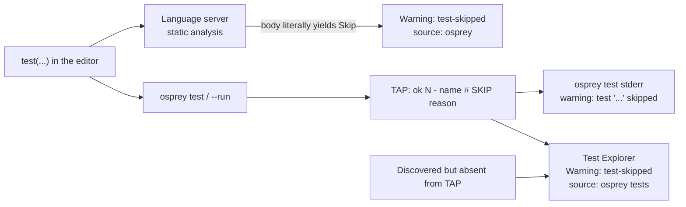

# Testing Framework

A test file is an ordinary program whose evaluated `test(...)` calls run in
evaluation order (top level is the convention); testing adds no DSL, syntax, or
registration step.

Both flavors lower these calls to the same AST and runtime behavior. A case may
use soft assertions and return `Unit`; an ML case may instead return `Verdict`
(`Pass | Fail | Skip`).

## The built-ins

**`[TESTING-BUILTINS]`** The type environment, code generator, and C runtime
provide nine functions.

### `test(name: string, body: fn() -> a) -> Unit` — `[TESTING-BUILTIN-TEST]`

Runs `body` as one named test case and prints exactly one TAP result line for
it. Test cases execute inline, in evaluation order, wherever the `test` call is
evaluated. A test passes when no assertion
inside its body fails; assertions are soft — a failing `expect`/`check` marks
the case failed and execution continues, so one case can report several
mismatches.

The body's return type is polymorphic (`fn() -> a`):

- A `Unit` body reports through its `expect` and `check` calls.
- A `Verdict` body (`[TESTING-VERDICT]`) supplies one outcome for `test` to
  report.

The `body` argument must be a zero-parameter function: an inline lambda
(Default `fn() => …`, ML `\() => …`) or the name of a zero-parameter function.
Any other expression is a compile-time codegen error.

Test cases must not nest: a `test` call evaluated while another case is
running does not run its body — it prints a
`# nested test '<name>' skipped …` diagnostic and fails the enclosing case,
without advancing nested-case counters.

### `expect(actual: any, expected: any) -> Unit` — `[TESTING-BUILTIN-EXPECT]`

Compares the values with actual first (see
[Equality semantics](#equality-semantics)); on
mismatch, records a failure against the enclosing test case (or the whole run
when used outside `test`) and prints a `#` diagnostic line.

### `check(label: string, expected: any, actual: any) -> Unit` — `[TESTING-BUILTIN-CHECK]`

Takes a short label, then **expected before actual**. Its behavior otherwise
matches `expect`.

Both assertions are valid anywhere an expression is — inside `test` bodies,
in helper functions called from tests, or at the top level of a script.

**`[TESTING-SHADOWING]`** Unlike other runtime built-ins, the testing names
(`test`, `expect`, `expectAll`, `expectTrue`, `expectFalse`, `check`, `checkAll`,
`checkTrue`, and `checkFalse`) are not reserved: a user-defined function or `extern`
declaration with the same name shadows the built-in in both the type
environment and codegen dispatch.

A file that shadows `test` declares no test cases, so the editor surfaces none
either: static discovery (`[TESTING-LIST]`), the test-case hover
(`[TESTING-DOC-HOVER]`), and skip warnings (`[TESTING-SKIP-WARNING]`) all treat
its `test(...)` calls as ordinary calls to the user's own function.

## Equality semantics

**`[TESTING-EQUALITY]`** Assertion equality is canonical-string equality
over values with a canonical string rendering: ints, bools, floats, strings,
and `Result`s of those. Both sides render with the same `toString` lowering
used by string interpolation and compare with `strcmp`; the diagnostic shows
exactly the two rendered strings that were compared. A `Result` operand
renders a `Success` as its bare payload and an `Error` as `Error(<message>)`.
Lists, maps, and records are rejected as assertion operands at code generation.
Values of different types that render identically, such as `5` and `"5"`,
compare equal.

### Boolean assertion shortcuts

`expectTrue(actual)` and `expectFalse(actual)` are compact forms of
`expect(actual, true)` and `expect(actual, false)`. `checkTrue(label, actual)`
and `checkFalse(label, actual)` provide the corresponding labeled forms. They
are soft assertions with the same case state, diagnostics, and exit behavior.

### Grouped assertions

`expectAll([condition, ...])` and `checkAll(label, [condition, ...])` accept a
non-empty boolean list literal and record every element as an independent soft
assertion. Evaluation continues through the entire list after failures. The
literal-only form keeps dense test tables allocation-free while preserving one
runtime assertion result per condition.

## ML Verdict model

**`[TESTING-VERDICT]`** An ML test case may return `Verdict`; `test` is its
reporting boundary.

`Verdict` is a user-declared union with three states:

```osprey-ml
type Verdict =
    Pass
    Fail
        reason : string
    Skip
        why : string
```

Verdict helpers use these contracts:

- `check (label, expected, actual) -> Verdict` — `Pass` on equality, else
  `Fail` carrying the labeled mismatch. Polymorphic over the compared type
  (int, string, bool) via the same canonical-string equality as the imperative
  built-in.
- `assume cond -> Verdict` — a false condition yields `Skip`; a true condition
  yields `Pass`.
- `andThen first rest -> Verdict` — combines two verdicts; `Pass` yields `rest`,
  while a first `Fail` or `Skip` is retained. Both arguments are evaluated
  before the call.

`test` recognizes the inferred `Verdict` return type and reports exactly one
outcome. `Pass` records no failure, `Fail` fails the case and prints its reason,
and `Skip` emits the TAP `# SKIP` directive.

**`[TESTING-VERDICT-DECLARED]`** The reporting boundary reads the program's own
declaration rather than assuming the field names above. A state may declare no
payload at all, in which case it reports no reason: `type Verdict = Pass | Fail |
Skip` is a valid declaration, a case answering `Skip` prints a bare `# SKIP`
directive with no reason text, and one answering `Fail` fails the case with an
empty reason. The payload field may also be spelled anything — `Skip(because)`
reports identically to `Skip(why)` — because the binder comes from the
declaration, not from the compiler.

Two shapes are rejected at compile time, each named truthfully:

| Declaration | Rejection |
| --- | --- |
| A state `test` has no report primitive for, e.g. `… \| Todo(string)` | `` `test` reports only the Pass, Fail and Skip states of `Verdict`; it has no report for `Todo` `` |
| A `Fail` or `Skip` carrying more than one field | `` `Verdict` state `Skip` declares 2 fields; `test` reports a single reason `` |

## TAP output protocol

**`[TESTING-TAP]`** A compiled test binary writes
[TAP](https://testanything.org/)-style lines to stdout, interleaved with any
output the program itself prints:

```
ok 1 - addition works
# check 'difference' failed: expected 2, got 3
not ok 2 - subtraction works
ok 3 - overflow guard # SKIP precondition not met
1..3
# tests=3 passed=1 failed=1 skipped=1
```

- One `ok N - name` / `not ok N - name` line per executed test case, numbered
  from 1 in execution order, printed when the case's body finishes.
- A case whose `Verdict` is `Skip` still prints an `ok` line, suffixed with the
  TAP `# SKIP <why>` directive (`[TESTING-VERDICT]`); it counts as skipped,
  neither passed nor failed. A skip with no reason prints the directive bare —
  `ok 3 - overflow guard # SKIP` — never with a trailing space, so the line
  survives a byte-exact golden comparison.
- Each failing assertion prints one `#` diagnostic line at the moment it
  fails: `# expect failed: expected E, got A`,
  `# check 'label' failed: expected E, got A`, or `# fail: <reason>` for a
  reported `Verdict` `Fail`. Diagnostics for a case therefore appear
  immediately *before* its result line.
- A failing assertion outside any test prints its diagnostic and marks the run
  failed without producing a result line. The summary's `failed` count remains
  the number of failed named cases; the out-of-case failure is reflected in the
  exit code.
- After the program's last statement, the runtime epilogue prints the plan
  `1..N` (N = cases executed) and a `# tests=N passed=P failed=F skipped=S`
  summary, including `1..0` when zero cases execute. The epilogue is emitted
  only for programs that use a
  testing built-in; ordinary programs are unaffected.

## Skipped cases are loud

**`[TESTING-SKIP-WARNING]`** A skipped test is never silent. *Skipped* and
*ignored* mean the same thing here — a case that did not report a real verdict —
and neither is allowed to pass unnoticed. Every front end raises a warning for
it. The warnings change no exit codes and no TAP output (`[TESTING-EXIT]` still
governs pass/fail); they exist so a skip is a visible debt rather than a quiet
hole in coverage.

**`[TESTING-SKIP-REASON]`** A skip must name its reason, and the reason decides
how loudly the skip is reported. A skip that names one is a debt a reader can
weigh — who is blocked, on what, and when it ends — so it is a **Warning**. A
skip that names none is a defect: nobody can weigh a hole in coverage whose
cause was never written down, and nothing distinguishes it from a case somebody
parked and forgot. Every front end reports it at **Error** severity instead, and
`osprey test` fails the suite it appears in.

The rule reads the reason, never the declaration. `Skip("")` and the bare `Skip`
of a `Verdict` whose skip state declares no payload (`[TESTING-VERDICT-DECLARED]`)
are the same case — an empty reason — and both are errors. A case that is merely
absent from its run's TAP is not: a filtered run legitimately prints no line for
it, so there is no reason to demand.

The TAP output is unchanged either way (`[TESTING-TAP]`), and so is the test
binary's own exit code (`[TESTING-EXIT]`): an unexplained skip is still a skip,
not a failed assertion. What changes is the runner's verdict on the suite.

| Reason | Reported as | `osprey test` |
| --- | --- | --- |
| `Skip("blocked on #123")` | Warning | suite may pass |
| `Skip("")`, bare `Skip` | Error | suite fails |
| discovered, absent from the TAP | Warning | suite may pass |

A skip is detectable at two different moments, and the two are not
interchangeable:

| | **Static skip** | **Dynamic skip** |
| --- | --- | --- |
| Shape | the case body's result expression *is* the `Skip` constructor | any other path to `Skip` — `assume`, a helper call, a `match` arm, a named function passed as the body |
| Known | at parse time, with no run | only by running the case |
| Reported by | language server, plus both run reporters | the run reporters |



### The static rule — `[TESTING-SKIP-WARNING-STATIC]`

The language server raises a **Warning** diagnostic (code `test-skipped`,
source `osprey`) spanning the `test` call's own line whenever the case body is
a lambda whose **result expression** is the `Skip` constructor. The result
expression is the lambda body itself, or — when that body is a block — the
block's trailing value, recursively. Both flavors are recognised: Default
`fn() => Skip("why")` and ML `\() => Skip "why"`.

The message is `test '<name>' is skipped: <reason>`. When the reason is the
empty string the diagnostic is an **Error** under the same `test-skipped` code —
one rule reported at two strengths (`[TESTING-SKIP-REASON]`) — and its message
is `test '<name>' is skipped with no reason; every skip must name one`. Reasons
and names are carried verbatim, including quotes and non-ASCII text; the span is
measured in the session's position encoding (`[LSP-ENCODING]`).

These bodies are **not** static skips and must raise no warning, because
whether they skip is a run-time question: a `Pass` or `Fail` result, an
assertion body, a call to a helper that returns `Skip`, or a bare function
reference (`test("n", parked)`).

A file that does not parse reports its syntax error alone (`[LSP-DIAGNOSTICS]`)
and raises no skip warnings; a file that parses but is ill-typed reports its
type errors **and** its skip warnings together. Where a declaration shadows the
`test` built-in (`[TESTING-SHADOWING]`) the file declares no cases at all, so
no warning is raised for any call in it.

### The run rules — `[TESTING-SKIP-WARNING-RUN]`

- **`osprey test`** echoes every TAP `# SKIP` directive to stderr as
  `warning: test '<name>' skipped: <reason>`, one line per skipped case, printed
  after that suite's own output replays. A directive carrying no reason is
  instead `error: test '<name>' skipped with no reason; every skip must name
  one`, and that suite counts as failed in `# suites: X passed, Y failed`
  (`[TESTING-SKIP-REASON]`).
- **The VS Code Test Explorer** publishes a diagnostic (code `test-skipped`,
  source `osprey tests`) spanning the case's `test` line for every case a run
  reports `# SKIP`, reason included, and for every discovered case that never
  appears in its run's TAP at all. It is a Warning, except for a `# SKIP` that
  named no reason, which is an Error (`[TESTING-SKIP-REASON]`) reading
  `Test '<name>' was skipped with no reason; every skip must name one`. The two reasons a case can
  be absent — filtered out, or deleted since discovery — are both ignored
  tests, and its message is `Test '<name>' did not run (skipped/ignored)`.
  A case that runs again clears its own warning, a re-parked case replaces its
  message rather than accumulating a second one, and deleting the file clears
  all of its warnings. The span reaches the end of the `test` line so the
  warning renders as a squiggle and not merely as a Problems-panel row. Every
  run profile reports identically: a coverage run neither drops nor duplicates
  the warnings a plain run raises.

A run that fails to compile has no verdicts at all: it reports a compile error
and raises no skip warnings.

### Directive ambiguity — `[TESTING-TAP-AMBIGUITY]`

A test *name* may itself contain `# SKIP`, which makes a raw TAP line
ambiguous: `ok 1 - name with # SKIP inside it` is both a passing case with an
odd name and a skipped case named `name with`. Two rules resolve it, and both
reporters apply them:

1. The directive is always **last** on the line, so the split is taken from the
   right. A skipped case keeps every earlier `# SKIP` as part of its name.
2. A description that matches a **statically discovered name verbatim**
   (`[TESTING-LIST]`) is that case's whole name, so the case ran and no warning
   is due. Only when no discovered name matches is the directive reading
   believed.

A dynamically-named case whose name contains `# SKIP` cannot be discovered and
therefore cannot be disambiguated; it is reported by the directive reading.

## Exit code

**`[TESTING-EXIT]`** A test binary exits `0` when every executed test case
passed or skipped and no out-of-case assertion failed, else `1`. A `Skip`
verdict is not a failure and does not change the exit code. Compile errors keep
their existing CLI exit codes.

The `osprey test` runner aggregates on top of that: it fails a suite whose
binary failed, **and** a suite that skipped a case without naming a reason
(`[TESTING-SKIP-REASON]`). The binary's own exit code is untouched by the second
rule — the runner reads the TAP.

## Test filtering

**`[TESTING-FILTER]`** The environment variable `OSPREY_TEST_FILTER`, when
set and non-empty, selects exactly the test cases whose name equals its value
(exact string match). Non-matching cases are skipped silently: their bodies
do not run, they produce no TAP line, and they do not advance the numbering.
The filter is the single mechanism behind "run one test" in every front end
(CLI `--filter`, Test Explorer single-test runs).

## File naming convention

**`[TESTING-FILE-CONVENTION]`** Test files are named `*.test.osp` (Default)
or `*.test.ospml` (ML). The convention is what `osprey test` directory
discovery and the VS Code Test Explorer glob use. It is a convention, not a
gate — any Osprey program may call the testing built-ins.

## CLI

### `osprey test [path] [--filter <name>] [--quiet] [--coverage] [--coverage-json <path>] [--memory=default|gc|arc]` — `[TESTING-CLI-RUN]`

Runs test files and aggregates results. `path` (default `.`) is either a
single file (run as-is, regardless of naming) or a directory searched
recursively for `[TESTING-FILE-CONVENTION]` files in sorted order. Hidden,
`target`, and `node_modules` directories are skipped; symlinks are not followed.
Each file runs like `osprey <file> --run`, with its TAP output under a
`# file: <path>` header. `--filter` sets `OSPREY_TEST_FILTER` for child
processes. The runner prints `# suites: X passed, Y failed` and exits `1` if a
suite fails to compile, fails to run, or skips a case without naming a reason
(`[TESTING-SKIP-REASON]`), otherwise `0`. An empty discovery set fails with
`no test files found`.

One invocation runs every discovered suite under exactly one memory backend.
`--memory=gc` selects tracing garbage collection, `--memory=arc` selects
Perceus reference counting, and `--memory=default` explicitly selects the
non-reclaiming backend. Omitting `--memory` delegates the choice to the compiler
default.

**`[TESTING-PARALLEL]`** Independent suites compile and run concurrently by
default. Their captured stdout and stderr are replayed in sorted suite order,
so parallel scheduling does not scramble TAP output. The positive-integer
environment setting `OSPREY_TEST_JOBS` limits worker concurrency;
`OSPREY_TEST_JOBS=1` is the serial escape hatch for constrained or diagnostic
runs. An unset value uses the host's available parallelism, with at least two
workers when the corpus contains multiple suites. Invalid or zero values fail
argument validation with exit code `2`.

**`[TESTING-NATIVE-CACHE]`** Native test runs reuse a content-addressed
executable when the suite sources, compiler binary, runtime archive, memory
mode, build kind, compiler command, and optimization setting are unchanged.
The cache key includes both native runtime archives, so built-in HTTP and
WebSocket suites remain cacheable. Named system-library `@link` directives are
part of the source key and remain cacheable. Sources with custom `@linkdir`
search paths bypass the cache because those external inputs cannot be validated
from source alone. A cache miss builds to a process-unique staging path and
publishes atomically, so concurrent runners never execute a partial artifact.

### `osprey <file> --list-tests` — `[TESTING-LIST]`

Static test discovery for editors. Parses the file (skipping the type gate,
like `--symbols`, so discovery works mid-edit) and prints a JSON array of the
statically visible test cases — `test(...)` calls whose first argument is a
string literal, found wherever a call stands as a statement value (top level,
block statements, lambda/handler/match bodies, namespaces, modules):

```json
[{"name":"addition works","line":3,"column":1}]
```

`line`/`column` are 1-based and point at the test call's nearest enclosing
statement — the call's own line in the conventional top-level layout; for a
test that is a function or lambda body, the enclosing declaration's line.
Dynamically named tests (non-literal first argument) still run and report via
TAP; they are not listed statically. A file that shadows the `test` built-in
(`[TESTING-SHADOWING]`) lists nothing at all.

The listed names are also the tie-breaker for an ambiguous TAP line
(`[TESTING-TAP-AMBIGUITY]`): a run reporter compares a result's description
against them before believing a `# SKIP` directive.

### Documented test cases — `[TESTING-DOC]`

A test case is an expression statement, not a declaration, so the grammar
accepts a leading documentation block on any expression statement and the AST
carries it on `Stmt::Expr`. Both surface forms lower to the one `DocComment`
model of spec 0026: `///` in the Default flavor, `(** … *)` in ML.

```osprey
/// Addition is commutative.
///
/// # Since
/// 0.3
test("addition commutes", fn() => expect(add(1, 2), add(2, 1)))
```

A documented case gains two OPTIONAL keys in the `--list-tests` array — absent
entirely when the case carries no documentation, so an undocumented suite's
wire form is unchanged:

```json
[{"name":"addition commutes","line":6,"column":1,
  "summary":"Addition is commutative.",
  "doc":"Addition is commutative.\n\n**Since**\n\n0.3"}]
```

- `summary` is the doc's first paragraph;
- `doc` is the whole comment rendered to Markdown by `[DOC-EXPORT]` — every
  populated `# Parameters` / `# Returns` / `# Raises` / `# Examples` /
  `# See also` / `# Since` / `# Deprecated` section.

Attachment is exact: only the case's OWN statement documents it. A `///` block
on the enclosing `fn` or `let` documents that declaration, and a block above a
`{ … }` documents the block — neither is inherited by a nested case. The
reported `line` stays on the `test(` call, never on the first `///` line, so an
editor's gutter marker does not drift up into the comment.

**`[TESTING-DOC-HOVER]`** The language server answers a hover over the `test`
callee of a documented case with that case's documentation (`**Test:** <name>`
followed by the rendered block) rather than the built-in's generic signature.
An undocumented case still hovers as `**Test:** <name>`; the word `test` used
anywhere else falls through to the ordinary lookup chain, so a user binding
named `test` keeps hovering as itself.

## Line coverage

**`[TESTING-COVERAGE-CLI]`** `osprey test --coverage` builds each suite with
line-coverage instrumentation, runs it, and prints one
`# coverage: P% (covered/total lines) <file>` row per suite (suppressed by
`--quiet`) plus a final `# coverage total: P% (covered/total lines)` row.
Coverage never changes suite outcomes or the exit code.
`--coverage-json <path>` (implies `--coverage`) also writes the merged
machine-readable report **`[TESTING-COVERAGE-JSON]`**:
`{"files":{"<suite path>":{"lines":{"<line>":hits}}}}` — 1-based source
lines, every coverable line present (hit count `0` when unexecuted).

**`[TESTING-COVERAGE-CODEGEN]`** With coverage on
(`osprey_codegen::compile_program_coverage`,
`crates/osprey-codegen/src/coverage.rs`), the coverable-line universe is
seeded from the AST up front — function definition lines and positioned
statements, recursing through blocks, lambdas, match/handler arms, and
module/namespace bodies — so a never-executed (even never-lowered) line
still counts against the total. Lowering bumps a per-line `i64` counter
global inline where control flow reaches it: at each function body entry
(including inline-specialised generic bodies at their call sites) and before
each positioned statement. A generated `__osp_cov_init`, called at the top
of `main` before user code, registers every counter with the runtime.
Coverage builds keep release optimization and emit no DWARF.

**`[TESTING-COVERAGE-RUNTIME]`** `compiler/runtime/coverage_runtime.c`
(dependency-free C11, in every runtime archive) exposes
`osp_cov_register_line(line, &counter)`. Inert unless
**`[TESTING-COVERAGE-ENV]`** `OSPREY_COVERAGE=<path>` names the dump file at
process start; then an exit-time hook writes
**`[TESTING-COVERAGE-DUMP]`**: a `# osprey-coverage v1` header followed by
one `<line> <hits>` row per registered line, ascending, zero-hit rows
included.

Lines are the compiled suite's own 1-based lines. Each suite compiles standalone
and coverage measures that file (`[TESTING-CLI-RUN]`).

## VS Code Test Explorer

**`[TESTING-VSCODE]`** The extension's Testing API integration:

- watches `**/*.test.{osp,ospml}` and obtains each file's child cases from
  `osprey <file> --list-tests`;
- resolves the compiler from `osprey.server.compilerPath`, then the bundled
  platform binary, then `PATH`;
- runs requested files with `osprey <file> --run`, using
  `OSPREY_TEST_FILTER=<name>` for a single case;
- maps TAP results, diagnostics, skips, and non-TAP process failures to test
  items; and
- publishes a `test-skipped` Warning for every case a run skipped or ignored
  (`[TESTING-SKIP-WARNING-RUN]`), into its own `DiagnosticCollection` so the
  warnings reach the Problems panel and the editor gutter without disturbing
  the language server's own diagnostics.

**`[TESTING-COVERAGE-VSCODE]`** Its coverage profile runs
`osprey test <file> --coverage-json <tmp> --quiet`, adding `--filter <name>` for
a single case. It maps `[TESTING-COVERAGE-JSON]` lines to VS Code
`FileCoverage` and per-line `StatementCoverage` entries.

**`[TESTING-DOC-VSCODE]`** Documentation `[TESTING-DOC]` reaches three
surfaces, because VS Code's `TestItem` carries no tooltip of its own:

- the case's whole `doc`, collapsed to a single line, becomes its
  `TestItem.description` — the greyed text the Testing tree renders beside the
  case name. The row truncates it to the panel width, but `description` is also
  the only text the row's hover can show, so the hover must carry the entire
  block: a `description` of just the `summary` showed one line of a
  four-paragraph doc and dropped the rest. `summary` is the fallback when a
  case reports one without a rendered `doc`;
- hovering the `test(...)` call in the editor renders the whole block
  (`[TESTING-DOC-HOVER]`);
- **Osprey: Show Test Documentation** (`osprey.showTestDocumentation`, also on
  the Testing view's item context menu) opens the rendered block, its heading,
  and a `Declared at <file>:<line>` footer as Markdown. It resolves its target
  from an explicit test item first, then from the active editor's cursor —
  the nearest case declared at or above it.

A failing case's peek message leads with its documentation, then the failure,
then the `Context For AI` block, which gains a `- Documentation:` field.
Documentation is refreshed wholesale per file on every resolve, so deleting a
`///` block clears the description on the next discovery.

**`[TESTING-PROFILE]`** A third, non-default run profile — **Profile** — runs
the same discovery, filtering, and TAP mapping as Run, but executes each suite
as `osprey <file> --run --profile` (`[PROF-CLI-RUN]`) inside a per-suite
directory beneath one per-request artifact root, so several suites in one
request cannot overwrite each other's exports. Verdicts are reported exactly as
a plain run reports them; when the suite produced artifacts, the run
additionally opens the flame-graph webview (`[PROF-VSCODE-FLAME]`) and applies
the inline heat decorations (`[PROF-VSCODE-HEAT]`), and appends the suite's
profile summary plus its artifact directory to the run output. A suite that
fails to compile writes no artifacts; the run still reports the compile
failure. The sampling profiler is POSIX-only, matching `[PROF-CLI-RUN]`.

## Runtime

**`[TESTING-RUNTIME]`** The runtime owns case state, filtering, TAP output, and
the final exit code. It exposes begin, assert, Verdict report, end, and finalize
operations to generated code.

**`[TESTING-CODEGEN]`** Code generation calls those runtime operations, skips a
filtered body's branch, reports `Verdict` values, and makes `main` return the
runtime's final status whenever a testing built-in is used.

**Fiber constraint.** Test state uses non-atomic process globals. Assertions in
spawned fibers can
interleave TAP lines or miscount; make assertions on the main fiber after
awaiting fiber results.
