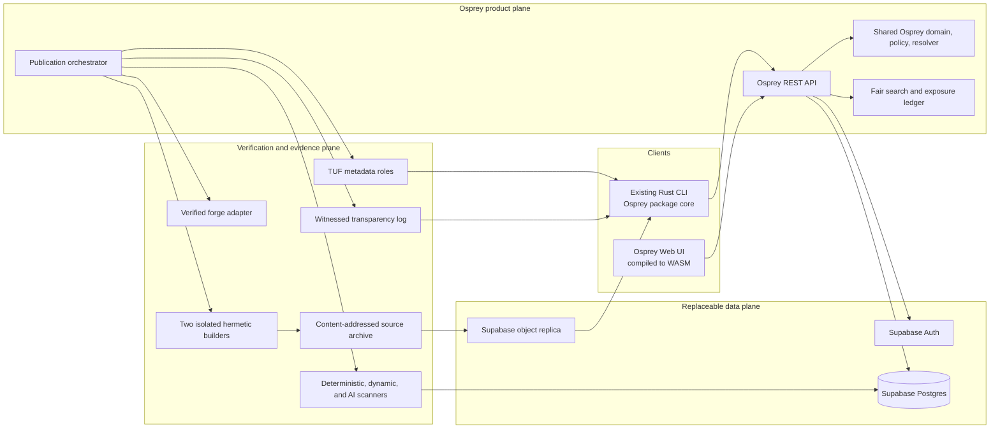
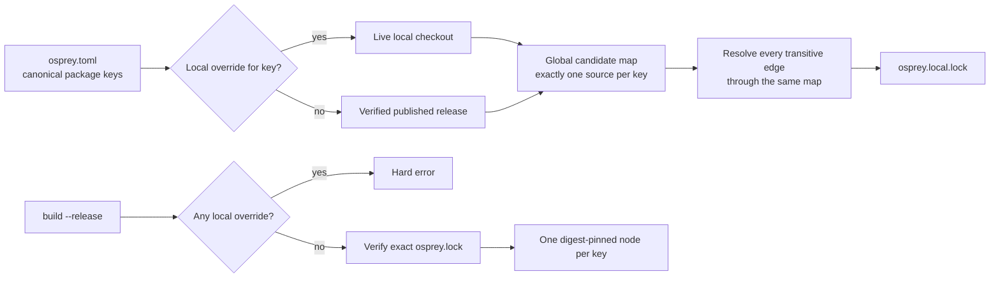

# Osprey Package Registry and Manager

**Status:** normative target; implementation has not started. Delivery is fixed by [plan 0020](../plans/0020-package-manager.md); evidence is in [Package-manager research](../package-manager-research.md).

This specification defines a source-derived, content-addressed package system.
It deliberately rejects uploaded archives, publisher binaries, lifecycle hooks,
SemVer constraints, popularity ranking, and AI-as-authority. Security decisions
come from verifiable evidence; compatibility comes from contracts and checks;
discovery gives relevant new work a measured chance to be seen.

The key words `MUST`, `MUST NOT`, `SHOULD`, and `MAY` are to be interpreted as
described by BCP 14 (RFC 2119 and RFC 8174) when they appear in capitals. A
feature is not implemented merely because this document specifies it.

## Research basis `[PACKAGE-RESEARCH]`

The design follows primary research and current standards, not registry custom:

- Raemaekers, van Deursen, and Visser found that "around one third of all releases introduce at least one breaking change" ([SCAM 2014](https://doi.org/10.1109/SCAM.2014.30)).
  Osprey does not treat a human version label as compatibility proof.
- Dependency solving is "a hard (NP-complete) problem" in non-trivial models ([Abate et al. 2020](https://doi.org/10.1109/SANER48275.2020.9054837)).
  Osprey uses a complete solver and never falls back to a greedy answer.
- The Package Calculus requires "root inclusion, dependency closure, and version uniqueness" ([Gibb et al., ICFP 2026](https://icfp26.sigplan.org/details/icfp-2026-icfp-papers/27/Package-Managers-la-Carte)).
  Osprey makes uniqueness global across published, workspace, and local sources.
- Tests detected only "47% of direct and 35% of indirect artificial faults" ([Hejderup and Gousios 2022](https://doi.org/10.1016/j.jss.2021.111097)).
  Passing tests cannot by itself certify an upgrade.
- TUF targets "defense against key compromise" ([Samuel et al. 2010](https://doi.org/10.1145/1866307.1866315)).
  Osprey uses threshold roles, delegation, expiry, and rollback protection.
- A compromised supply-chain step can modify software ([in-toto, USENIX Security 2019](https://www.usenix.org/conference/usenixsecurity19/presentation/torres-arias)).
  Osprey authenticates every step, not only the final file.
- LastPyMile finds source/package equivalence is commonly assumed ([FSE 2021](https://doi.org/10.1145/3468264.3468592)).
  Osprey instead assembles releases from archived source.
- Rankers owe responsibility to users and "the items being ranked" ([Singh and Joachims, KDD 2018](https://doi.org/10.1145/3219819.3220088)).
  Search accounts for provider exposure without sacrificing intent.
- Coverage "should not be used as a quality target" ([Inozemtseva and Holmes 2014](https://doi.org/10.1145/2568225.2568271)).
  Osprey gives stronger weight to mutation and client tests.
- A strong code model fell from 68.26% F1 on BigVul to 3.09% on PrimeVul ([Ding et al. 2025](https://doi.org/10.1109/ICSE55347.2025.00038)).
  Osprey evaluates AI at realistic base rates and never calls its verdict proof.

The linked corpus records more than fifty peer-reviewed papers, specifications,
and current official controls, with short quotations and their design effects.

## Decided design `[PACKAGE-DECISIONS]`

| Topic | Normative decision |
| --- | --- |
| Versioning | There is no SemVer field or range language. Identity is a release digest; compatibility is an epoch; ordering is a monotonic ordinal. |
| Git | A commit is provenance, never package identity or publication authority. Tags and branches are display-only. |
| Publication | A publisher signs a release intent naming a forge repository, subdirectory, and commit. The registry fetches and assembles the source; uploads are rejected. |
| Binaries | Public packages contain Osprey source and closed-format declared data. Native binaries, native source, object files, arbitrary generators, and install hooks are rejected. |
| Native dependencies | A package declares a system capability. Osprey reports approved OS-provider packages but never downloads them or invokes Homebrew, apt, or another installer. |
| Local development | `osprey use <path>` overlays a canonical package key everywhere in the graph; switching back never edits dependency declarations. |
| Release resolution | Every source, dependency, toolchain, target, policy, and system input is digest-pinned, and each package key occurs exactly once. Local overlays are forbidden. |
| Upgrades | The solver proposes eligible candidates; contract analysis, compilation, client-impact analysis, tests, and security policy decide whether the new lock activates. |
| Backend and frontend | The registry API and shared domain logic are Osprey programs; the web UI is Osprey compiled to WebAssembly. The existing Rust CLI remains the bootstrap host. |
| Initial platform | Supabase supplies Postgres, authentication, and object-storage replicas. It is never a cryptographic trust root. |
| AI | Every submission receives AI review, but AI can only add evidence or quarantine for confirmation. It cannot approve or permanently reject a release by itself. |
| Discovery | Default rank excludes downloads, dependents, stars, impressions, publisher revenue, and sponsorship. Merit plus measured exposure determines order. |

The compatibility epoch intentionally retains the one defensible idea behind a
major version: an explicit incompatible contract lineage. It discards the false
precision of author-asserted minor and patch numbers.

## Goals and exclusions `[PACKAGE-GOALS]`

The system MUST make these operations unsurprising: create a package, publish
from source, add a dependency, explain a conflict, reproduce a build, inspect
trust evidence, and recover from compromise. Anyone with a verified scope MUST
be able to publish without popularity, invitation, payment, or an established
download history.

The public registry is not a general operating-system package manager, binary
distribution service, container registry, secrets store, advertising market, or
remote build-script runner. Private registries MAY relax license visibility;
they MUST NOT weaken identity, provenance, resolver, or client-verification rules.

## Threat model and invariants `[PACKAGE-THREATS]`

Osprey trusts the client verifier, authentic bootstrap root, monotonic local
trust state, anti-rollback UTC for `Current`, and stated primitives. Within budget,
an adversary may simultaneously control every unsigned registry service,
mirror, CDN and datastore; one of three applicable targets keys; two of five
root keys; one of four witnesses; either reference builder; and any scanner or
model. Acceptance fails closed, although confidentiality and availability may
fail. Root integrity is not claimed after three root-key compromises, release
authorization after two applicable targets-key compromises, log accountability
after the log plus two of four witnesses and cross-log are compromised, source
authorization after its publication principal is compromised, or reproduction
when both builders collude. A malicious publisher can author malicious logic
that analysis misses: Osprey guarantees attribution, bounded execution and
auditable evidence, not semantic benignness. Exact ceremonies are in spec 0030.

The following invariants hold even under those assumptions:

1. A release is immutable and named by independently recomputable content.
2. No single online key authorizes a client-visible release or root rotation.
3. Before resolve/fetch/run/activation the client verifies fresh metadata, log,
   source, closure and policy; offline audit reports only `ReproducibleAsOf`.
4. Installing a package executes no package-controlled code.
5. A build consumes only declared, digest-addressed inputs and has no network.
6. No score, popularity signal, database row, or AI verdict creates trust.
7. Replacement and name reuse are impossible; corrections are new evidence or
   new immutable releases.

## Architecture `[PACKAGE-ARCHITECTURE]`



The browser never receives a Supabase service credential and never writes the
database directly. All authorization passes through the Osprey API. Signing
keys live in offline custody or external HSM/KMS services, not Postgres or
Supabase environment variables. Replacing Supabase cannot change a package ID.

Osprey owns domain rules, policy evaluation, API handlers, fair ranking, and UI.
Audited native adapters provide cryptographic primitives, HSM access, forge
protocols, sandbox control, and the existing compiler/CLI bootstrap. There is
one shared Osprey package-core implementation across server, CLI, and WASM.

## Names and ownership `[PACKAGE-NAMES]`

A canonical name is `@scope/name`. Components contain only lowercase ASCII
letters, digits, and interior hyphens; a scope is 1-39 characters and a name is
1-63. Unicode display names are allowed but never resolve. Unscoped names are
invalid, and only the project governance role can publish under `@osprey`.

Scopes are backed by stable principal IDs, not mutable email domains. The
registry warns on skeleton/confusable similarity and quarantines evidence of
impersonation, but similarity alone cannot suppress a legitimate package.
Package names and scopes are permanent tombstones after deletion.

Normal transfer requires signatures from old and new owners, a 30-day public
notice, and a logged finalization. Recovery without the old owner requires a
30-day quarantine plus approval by two of three independent registry-security
custodians. Every ownership and recovery event is transparent and appealable.

## Release identity and compatibility `[PACKAGE-IDENTITY]`

A release is displayed as:

```text
@scope/name@e3.r42#sha256:7c…
```

- `e3` is the registry-assigned compatibility epoch.
- `r42` is the package-wide, strictly increasing release ordinal.
- The digest is the authoritative identity.

The initial release is epoch 1. `osprey publish` claims compatibility with the
current epoch; `osprey publish --breaking` always opens the next epoch. The
registry rejects a compatible claim when public types, values, constructors,
effects, capabilities, FFI ABI, platform/toolchain floor, or machine-checkable
contracts break. A breaking claim bumps the epoch even when analysis finds no
break. Maintainers MUST declare behavior changes that static analysis cannot see.

Tags and human labels MAY be shown beside a release, but manifests, locks, API
selectors, and CLI selectors MUST reject them as constraints. If a hidden break
is discovered later, the bad release is yanked or revoked and an advisory is
logged. Its epoch and digest are never rewritten; the correction is a new
release in a new epoch.

`SourceDigest` hashes a domain-separated canonical tree containing sorted path,
file-mode class, byte length, and SHA-256 of each raw file. Its exact byte
grammar and selected-root rules are fixed by `[PACKAGE-SOURCE-CANONICAL]` in
spec 0030. Symlinks, submodules, LFS pointers, devices, executable bits, path
traversal, case collisions, and non-portable names are rejected.
`ReleaseDigest` covers the package key, epoch, source digest, manifest digest,
and deterministic build-plan digest. Hash envelopes carry an algorithm ID so a
future package-format revision can introduce another algorithm without
reinterpreting existing identifiers.

For a package key, one `ReleaseDigest` maps permanently to one epoch and
ordinal. Repeating the same release envelope returns the original `ReleaseId`
and can only append evidence; it never allocates another ordinal.

## Registry publication, trust, and discovery `[PACKAGE-REGISTRY]`

Source collection, payload policy, the publish sequence, TUF and transparency,
AI review, maintenance evidence, and fair discovery are normative in specs
[0030](0030-PackageRegistryTrustAndDiscovery.md) and
[0032](0032-PackageEvidenceAndDiscovery.md). Both are part of this contract,
not optional service profiles.

## Manifests, system capabilities, and locks `[PACKAGE-MANIFEST]`

The existing `osprey.toml` is the single portable manifest. Published
dependencies name one epoch and a minimum ordinal; upper bounds, SemVer, peer
dependencies, optional dependency features, Git URLs, tags, branches, and path
dependencies are invalid. A dependency always retains its canonical package
key, regardless of whether development obtains its source locally or from the
registry. `min_release = 0` means any release in the epoch; positive values set
an additive-contract floor.

```toml
[project]
name = "ledger"
source_roots = ["src"]
[package]
name = "@finch/ledger"
license = "Apache-2.0"
summary = "Immutable ledger primitives"
keywords = ["ledger", "transactions"]
[dependencies]
"@osprey/http" = { epoch = 2, min_release = 17 }
[system.sqlite]
capability = "sqlite/c-api"
min_revision = 3045000
```

A threshold-signed registry/enterprise catalog—not the publisher—maps a system
capability to approved providers, artifacts, native closures and provenance.
`osprey doctor` uses an authorized read-only host effect and prints that guidance;
it never invokes an installer. SQLite can stay outside the Osprey registry.

Every root-witness lock activates Runtime/Build/Test edges from its selected root
and Runtime/Build, never Test, from non-root nodes. Published libraries attach
that witness lock; consumers resolve their own. The lock uses RFC 8785
canonical JSON and pins the selected-root tree, every package source, manifest,
build plan, dependency edge, compiler/runtime/toolchain, target and flags,
system-provider artifact and its native closure, inferred effect/capability set,
provenance, SBOM, catalog/TUF snapshot, solver policy, and resolution
explanation by identity and digest. There are no floating inputs in a release
lock, and the hermetic build exposes no undeclared environment input.

Before RFC 8785 serialization, scalars, UTC timestamps, every set-like list's
sort/duplicate identity, and each protocol-ordered exception follow
`[PACKAGE-TYPE-INVARIANTS]` in spec 0031. Locks store a structured resolution
proof with stable reason codes; prose and localization remain outside lock data.

Build and run commands never resolve or access the network. They fail when the
manifest and selected lock disagree. `osprey lock` writes only the release lock;
`osprey lock --local` writes only the development lock. `use` atomically changes
the root overlay and development lock through an immutable state generation and
one atomic active-generation pointer. `add`, `remove`, and `update` refresh the
registry-only base and development lock while preserving overlays; removal
deletes that key's override only if it leaves the complete development closure.
A complete solution replaces the release lock,
`publishedBaseLock`, and matching per-key baselines before locals are revalidated;
otherwise both base-lock fields are absent while valid per-key baselines remain;
an invalid retained local aborts everything. A cached release lock remains
reproducible byte for byte after metadata expiry, but is non-activatable until
freshness is re-established. A known revocation blocks normal building and all
activation; only isolated `--audit-revoked` reproduction may consume it.

## Local and published source switching `[PACKAGE-LOCAL-OVERRIDE]`

`osprey use ../local/http` never rewrites `[dependencies]`; it replaces an
existing key. For a new dependency, `osprey add ../local/http [--epoch N]`
resolves a key baseline first: if published, it writes `min_release` equal to
that ordinal and stores its exact `ReleaseId` on the override; if none exists,
it writes zero and is development-only. A complete registry-only solution also
writes the base/release lock; otherwise `publishedBaseLock` is absent. Manifest,
root overlay, optional base, and development lock change atomically. Only the root
`osprey.local.toml` participates.
`osprey use @osprey/http --published` removes the mapping, and `osprey use
--list` shows every active override, baseline, epoch, path, and current source
digest. `osprey use --clear` applies `--published` to every mapping as one
transaction and changes nothing if any baseline cannot activate. Override keys
are unique; `global` means the selected workspace graph, never an account/parent.



```toml
[overrides."@osprey/http"]
path = "../http"
epoch = 2
baseline = "@osprey/http@e2.r17#sha256:7c..."
```

The overlay is package-key based and applies once to the whole graph. If a local
package depends on another key with an active override, that dependency is local;
otherwise it resolves from the signed catalog. Root, transitive, build, and test
edges therefore see the same selected source. An override replaces the published
candidate; it never adds a second instance. Conflicting requirements fail with a
single conflict explanation instead of installing two versions.

Baseline selection uses the existing development lock's published node, else the
exact release-lock node, else one result from the pinned catalog. Its key/epoch
must match and ordinal satisfy every inbound floor. No baseline is valid only
when no eligible release exists and every floor is zero; its epoch defaults to
one, and `--epoch N` is required for another unpublished lineage. A local uses
the same key, passes epoch contracts, has its baseline ordinal or zero, and
cannot impersonate a later release. Explicit
`update` resolves a published base including overlaid keys, replaces matching
baselines and revalidates locals atomically; only `update --breaking` changes an
override epoch, and failure changes nothing. A local manifest change requires
`osprey lock --local`; source edits stay live without re-resolution.

Only the selected root's overlay participates in resolution. Any
`osprey.local.toml` or `osprey.local.lock` inside an overridden package is
ignored. Each development build traverses with no-follow handles, snapshots each
live root/local tree into read-only CAS, and compiles only that snapshot. It
revalidates contracts, effects/capabilities and policy, then emits a signed
receipt with actual source, build-plan, SBOM, environment and output digests. A
live edit never mutates lock topology implicitly.

Development state always records each override's exact replaced `ReleaseId`.
It writes a registry-only base only when the entire manifest has a complete
registry solution. Switching back regenerates only the development lock from
that ID/base plus remaining overlays, preserving unrelated pins and never
updating an ordinal. A baseline-free `add` first needs `osprey lock` after publication. An
exact captured yank may be restored; a missing/revoked baseline preserves the
overlay and fails.

`osprey.local.toml` and `osprey.local.lock` are non-portable development state,
ignored by generated source-control rules and excluded from publication.
`osprey build --release` parses only overlay header/keys; it never follows paths
or local content, and any mapping hard fails. The selected root is the nearest
ancestor with `osprey.toml`; discovery never descends or crosses a filesystem
boundary. Its locks, overlay, and journal are adjacent to that manifest. The root
tree digest excludes those controls, unselected roots, and outputs; every
dependency is a registry `ReleaseId`. A multi-root repository therefore has one
adjacent release lock per root and cannot release-depend on an unpublished
sibling: publish the sibling, then lock the dependent root.

Bare `build`, `run`, `test`, and `docs` always select `osprey.local.lock`, keeping
the root source live, and never resolve. A missing/stale lock fails only with
`osprey lock --local` as remediation. `build --release` alone selects
`osprey.lock` after the empty-overlay preflight.

`osprey build --release` performs no resolution, fallback, substitution, or
network access. It verifies every pinned digest and requires exactly one node for
every package key across the entire build. A missing/mismatched input, unknown
system artifact, active override, duplicate key, stale lock, or unavailable
digest is a hard error. This uniqueness rule has no process-isolation, target,
feature, or tool-dependency exception.

New resolution, fetch, or activation requires unexpired TUF metadata. Offline
reproduction verifies only the bytes and proofs as of the lock's pinned
checkpoint; it cannot assert current non-revocation and its output cannot run or
activate. A known revocation is monotonic: isolated audit reproduction requires
`--audit-revoked`, never activates, never substitutes a graph, and never alters
the bytes being reproduced.

## Complete deterministic resolution `[PACKAGE-RESOLUTION]`

The one resolver is a complete incremental CDCL-backed lexicographic MaxSAT
solver written in Osprey. Package releases become Boolean candidates; catalog,
manifest, target, capability, trust, and uniqueness rules become hard clauses.
Learned incompatibility derivations produce `why` output and minimal conflict
cores. There is no greedy fallback.

Hard constraints require a complete dependency closure, exact epochs, minimum
ordinals, an acyclic package graph, supported target/toolchain, pinned system
capabilities, exactly one selected source per package key across every edge, and
no revoked, quarantined, or policy-blocking release. Fresh candidate selection
also excludes yanks; an exact yanked node already in the current/captured base
remains reproducible and activatable but is never chosen afresh. Local resolution
uses overlays as hard replacements; release resolution excludes them entirely.

For each registry candidate `r`, the core recomputes signed integer cost facts:
`V(r)=sum(roundDiv(severityWeight*reachabilityFactor,10_000))` over non-blocking
advisories. `overdueDays=(overdueMilliseconds+86_399_999) div 86_400_000`, and
`D(r)` sums each `V` term times `min(overdueDays,3_650)`; `U(r)` and `E(r)` count
Unknown checklist and required-evidence items. Let `M` be the greatest ordinal
among eligible releases plus `r` itself when it is a permitted captured yank;
`L(r)=M-ordinal`. Fixed local nodes contribute zero. For graph `G`, minimize:

```text
(sum V, sum D, sum U, sum E, changedIdentities(current,G),
 nonRootPackageCount + systemInputCount, sum L)
```

`changedIdentities` counts package keys/capabilities whose selected identity is
added, removed, or differs. A tuple tie compares package tuples
`(key,epoch,ordinal DESC,digest)` then system tuples
`(capability,provider,revision,digest)` in spec-0031 canonical order.

All time-dependent metrics, including overdue days, are evaluated at the signed
catalog snapshot's `asOf`, never the host clock. Safe downgrades are valid.
Identical root/manifest, current locks, and complete canonical
`ResolutionContext`—catalog/`asOf`, TUF/log, policy, build environment and system
inputs—plus development overlays/local manifests MUST produce byte-identical
locks/proofs. No conflict admits another release of the same package key.

`osprey update` validates the candidate closure by compiling and type/effect
checking it, diffing public API/ABI/contracts, analyzing affected clients,
running unit/integration/property/mutation tests, and reevaluating vulnerability
policy. `osprey update --breaking` evaluates one newer epoch at a time and emits
a migration report; it never silently crosses an epoch.

## Canonical domain types `[PACKAGE-TYPES]`

The normative typeDiagram model, including published releases, local overlays,
selected roots, exact locks, and assessments, is
[Package Domain Model](0031-PackageDomainModel.md). Generated Osprey types MUST
come from that model rather than a handwritten duplicate.

## REST API and command surface `[PACKAGE-API]`

The API is versioned REST/JSON. GraphQL is not part of v1. Public reads include
`GET /v1/search`, `/packages/{scope}/{name}`, `/releases/{digest}`,
`/releases/{digest}/source`, `/evidence`, `/advisories`, `/metadata`, and
`/proofs`. Authenticated writes include `POST /v1/release-intents`, `/yanks`,
`/revocations`, `/transfers`, and `/appeals`. Writes require `Idempotency-Key`;
lists use stable cursor pagination; immutable responses carry digest ETags; and
errors use `application/problem+json` with a stable code and remediation.

The server can preview a resolution, but only the locally verified resolver can
write a trusted lock. The minimal CLI is:

```text
osprey login                         osprey package init
osprey add <key-or-path> [--epoch N] osprey remove @scope/name
osprey lock [--local]                osprey update [--breaking]
osprey use <path> [--epoch N]       osprey use @scope/name --published
osprey use --list|--clear           osprey build --release
osprey fetch                         osprey tree
osprey why @scope/name              osprey audit
osprey verify [--offline]           osprey doctor
osprey build --release [--audit-revoked]
osprey publish [--breaking]         osprey yank <release>
```

`add`, `remove`, `lock`, `update`, and `use` print the graph/source/security
delta before one atomic update. Development output prominently lists local
overrides; release output proves there are none. Conflict output identifies the
smallest incompatible requirements and concrete remediations. Package pages
expose exact source, commit, digest, epoch/ordinal, dependencies,
effects/capabilities, provenance/log proofs, assessment components/confidence,
advisories, and history.

## Conformance gates `[PACKAGE-CONFORMANCE]`

General availability requires all of these, with no waiver path:

- adversarial TUF, threshold-key, rollback, freeze, equivocation, witness, CAS,
  and compromised-mirror test vectors pass in every client;
- resolver property tests prove closure, uniqueness, constraint satisfaction,
  completeness on bounded exhaustive graphs, determinism, and stable conflict
  explanations; differential tests agree with an independent oracle;
- local-overlay tests switch root and transitive packages both directions
  without editing dependency declarations; release tests reject every overlay,
  duplicate key, floating input, stale digest, and unpinned system artifact;
- canonical-source and lock vectors are byte-identical on Linux, macOS, and
  Windows, and two independent builders reproduce every public candidate;
- publication rejects every forbidden payload/hook and withstands archive,
  parser, decompression, and resource-exhaustion corpora;
- scanner evaluation meets the stated production-prior thresholds, with AI
  automatically demoted to advisory when it does not;
- fair-ranking simulations and live propensity audits meet both relevance and
  exposure budgets without popularity inputs;
- disaster exercises rotate root/online keys, revoke a release, restore from
  independent CAS/log replicas, and rebuild the catalog without Supabase;
- an independent security audit closes all critical and high findings.
