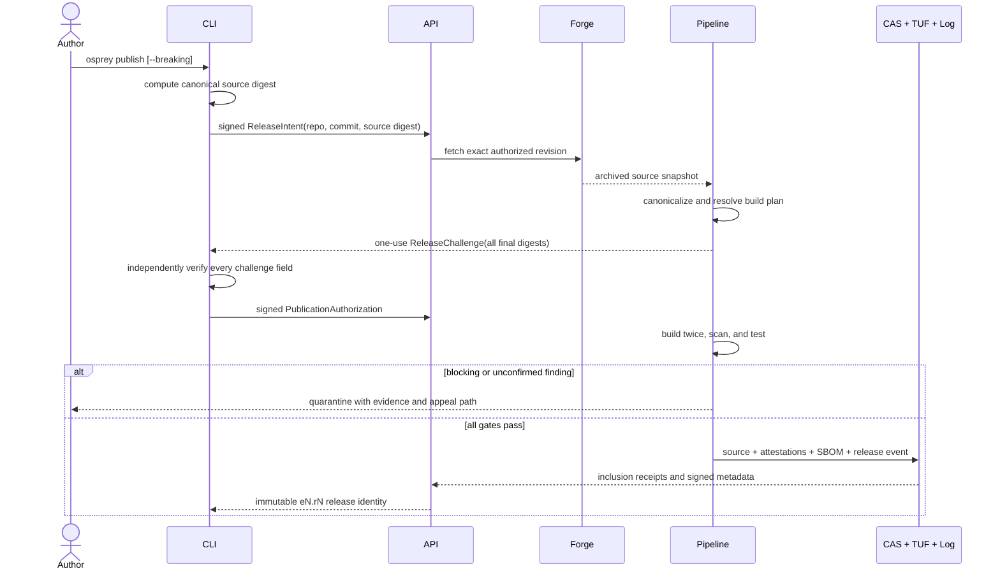

# Package Registry Trust and Discovery

**Status:** normative target. This specification is the registry/security half
of [Osprey Package Registry and Manager](0029-PackageManagement.md). Its
requirements are mandatory for the public registry. The full academic and
standards basis is [annotated here](../package-manager-research.md).

The registry accepts open participation without accepting unverifiable bytes.
It assembles immutable releases from source, records each decision as evidence,
uses AI only inside a measured review pipeline, and distributes attention
without turning prior popularity into permanent dominance.

## Source-derived publication `[PACKAGE-PUBLISH]`



Before first publication, a `RepositoryBinding` fixes package key, subdirectory,
stable forge repository ID, and release branch. Enrollment requires both a scope
publication credential and forge-admin attestation over the same one-use
registry nonce and ten-minute enrollment expiry. Once accepted and logged, that
expiry no longer limits the binding. Rebinding requires both authorities, is
publicly logged, and suspends
publication for 24 hours.

`ReleaseIntent` contains the package key, stable forge repository ID,
subdirectory, full commit ID, forge hash algorithm, publisher-computed canonical
source and manifest digests, compatibility claim, expiry, and nonce. Its detached
envelope carries the credential proof. The registry recomputes the commit object ID, configured release-
branch reachability, manifest digest, and source digest before CAS. A mismatch
is terminal, not a prompt to accept registry bytes. The initial adapter is a
GitHub App; GitLab and Codeberg implement the identical identity contract.

After canonical resolution, the registry assigns a never-reused ordinal and
returns a ten-minute, one-use `ReleaseChallenge` over the exact `ReleaseId`,
frozen CAS object, source, manifest, resolution-context, dependency-lock,
build-plan and release digests, compatibility claim, and both nonces. The CLI
independently recomputes and compares every field, verifies the signed catalog,
policy and context, runs the canonical resolver/build-plan generator, checks
`ReleaseId.digest == releaseDigest`, compatibility and ordinal reservation, and
recomputes both envelopes. It refuses an opaque or unequal field, then returns a
domain-separated
`PublicationAuthorization` over the registry-signed challenge. The pipeline may
consume only that frozen CAS object; re-fetch, substitution, replay, or expiry is
a hard failure. Both signed phases and failure commitments enter the log. No
build, scan, database write, forge assertion, or initial intent substitutes for
final authorization. The first challenge permanently reserves its `ReleaseId`
for that `ReleaseDigest`. Challenge expiry invalidates only that challenge: an
identical retry receives a fresh challenge for the same ID, which is never
assigned to another digest.

Two signature mechanisms are distinct. Human publication uses a WebAuthn
assertion with user presence and verification over the payload digest, registry
RP ID/origin, nonce, and expiry. CI publication uses an ephemeral DSSE key with
a certificate chaining to pinned Fulcio roots and a verified Sigstore bundle.
Policy verifies cryptographically bound issuer, SAN, repository, workflow and
ref certificate fields; Fulcio validates OIDC audience at issuance, but a free
`audience` string is never treated as a certificate claim. OIDC/API tokens,
cookies, and Supabase sessions can authenticate API access but never sign a
publication. Enrollment/rotation/revocation/recovery bind logged stable
principal/scope IDs; `@osprey` requires two of three publication principals.

Signed objects are detached envelopes. `ReleaseIntent`, `ReleaseChallenge`,
`PublicationAuthorization`, and `RepositoryBinding` payloads contain no proof or
signature field and serialize with RFC 8785. Their fixed media types are,
respectively, `application/vnd.osprey.release-intent.v1+json`,
`application/vnd.osprey.release-challenge.v1+json`,
`application/vnd.osprey.publication-authorization.v1+json`, and
`application/vnd.osprey.repository-binding.v1+json`.
DSSE signs the exact PAE bytes `"DSSEv1" SP decimal(len(type)) SP type SP
decimal(len(payload)) SP payload`; lengths count bytes and `SP` is `0x20`.

For WebAuthn, `challenge = base64url(SHA256("osprey.webauthn.v1\0" || PAE))`.
The verifier requires `webauthn.get`, the configured origin/RP-ID hash, user-
presence and user-verification flags, enrolled credential/public key, an
unconsumed nonce and acceptance expiry bound by the payload or referenced signed
challenge, and assertion signature. An envelope lists detached proofs and
stable principals; duplicates are invalid and `@osprey` requires two of its
three enrolled principals. Proofs sort by principal, proof variant, then
credential/attestation/signature digest; `authorizationSetDigest` binds the complete proof
set. `EnvelopeDigest` is SHA-256 of domain string
`osprey.envelope.v1\0` plus RFC-8785 envelope bytes. Proofs never sign or hash a
structure containing themselves.

Publishers cannot upload tarballs or substitute files. The registry fetches the
revision, stores a forge-independent source snapshot, and performs canonical
assembly. Accepted roles are Osprey source, `osprey.toml`, UTF-8 Markdown/plain
documentation, SPDX license text, typeDiagram source, and manifest-declared
data. Format v1 has three closed asset kinds: `Utf8Text` (`.txt`, `.md`, `.csv`,
or `.tsv`, valid UTF-8 without NUL, at most 1 MiB); `Json` (`.json`, strict RFC
8259 without duplicate keys, depth at most 64, at most 1 MiB); and `Png` (`.png`,
valid CRCs, only IHDR/PLTE/tRNS/IDAT/IEND chunks, at most 4,096 by 4,096 and 16
million decoded pixels, at most 8 MiB). Each declaration fixes path, use, kind,
byte length, digest, and any `asset.read` capability.
Media type is derived, never publisher text: `.txt` is `text/plain;charset=utf-8`,
`.md` `text/markdown;charset=utf-8`, `.csv` `text/csv;charset=utf-8`, `.tsv`
`text/tab-separated-values;charset=utf-8`, `.json` `application/json`, and `.png`
`image/png`.

Role mapping is closed: `.osp`/`.ospml` must parse beneath a manifest source or
test root; exactly one root `osprey.toml` must parse; root `README`, `CHANGELOG`,
`SECURITY`, and `CONTRIBUTING` or files below `docs/` may end only in `.md` or
`.txt` and must be UTF-8 without NUL; root `LICENSE`, `LICENSE.txt`, `LICENSE.md`,
or `COPYING` is license text; and `.td` below `types/` must parse as typeDiagram.
Every other file needs a valid asset declaration or rejects the submission.

HTML, CSS, SVG, XML, PDF, JPEG, WebP, fonts, audio, video, archives, databases,
generic octet streams, native/WebAssembly source or binaries, objects,
libraries, package-manager files, and build/generator scripts are rejected.
Assets remain hostile runtime input, use bounded platform parsers, and are served
as attachments with `nosniff`. Expanding the allowlist requires a format revision
and adversarial parser corpus.

Package prose is hostile too. Markdown disables raw HTML and remote media; links
allow only relative registry paths, `https`, and `mailto`, with `javascript`,
`data`, `file`, and redirects to non-HTTPS blocked. Rendering uses a versioned
sanitizer allowlist inside a separate origin/sandbox with CSP `default-src
'none'; img-src 'self'; style-src 'self'`. typeDiagram runs in the publication
sandbox with AST/node/time/memory limits; generated SVG is sanitized and served
as an image, never inline script-capable markup. Search indexes escaped plain
text only. Sanitizer/parser failures quarantine the release.

Each submission is bounded to 10,000 files and 50 MiB, with at most 25 MiB of
assets. Parsing, compilation, tests, and scanners have fixed CPU, memory, output,
and wall-time limits. Tests execute only in a disposable network-denied registry
sandbox; installation never runs them.

### Canonical source tree `[PACKAGE-SOURCE-CANONICAL]`

The tree root is exactly the `ReleaseIntent` subdirectory and contains one root
`osprey.toml` and no nested manifest; sibling roots and forge metadata are outside
it. The digest projection excludes exactly root `osprey.lock`, root
`osprey.local.toml`, root `osprey.local.lock`, and `.osprey/` state/output. The
registry generates the witness lock as evidence outside `SourceDigest`; any
excluded control path present in collected Git rejects publication. Every
remaining entry is included and no ignore file applies.
Symlinks, submodules, LFS pointers, devices, FIFOs, sockets, executable modes,
and hard links reject the tree. An included entry is a non-executable regular file.

A path is an ASCII relative POSIX string. Each non-empty segment matches
`[A-Za-z0-9._-]{1,128}`, is neither `.` nor `..`, and the complete path is at
most 1,024 bytes. Absolute paths, backslashes, controls, trailing separators,
ASCII-case-fold collisions, and Windows device stems `CON`, `PRN`, `AUX`, `NUL`,
`COM1`-`COM9`, or `LPT1`-`LPT9` before any extension are invalid. File bytes are
hashed exactly as stored: no newline, text, or Unicode normalization occurs.

With `u32be` and `u64be` denoting fixed-width unsigned big-endian integers, sort
entries by unsigned path bytes and compute:

```text
entry = u32be(length(path)) || path || 0x00 || u64be(length(file)) || SHA256(file)
envelope = "osprey.source.v1\0" || u32be(entryCount) || entry...
SourceDigest = "sha256:" || lowercaseHex(SHA256(envelope))
```

`0x00` is the sole v1 file-mode class: regular and non-executable. Counts and
lengths are checked before allocation. Duplicate paths or digests with a wrong
algorithm/length fail. Cross-platform golden vectors are normative.

The pipeline produces an SPDX 3.0.1 SBOM, in-toto/DSSE attestations, source and
build provenance, scanner results, test evidence, and two independent reference
build results. The SBOM uses Osprey's pinned SPDX profile, context and schema;
set-like arrays are sorted by their specified identity and the JSON is hashed
after RFC 8785 serialization. Publication requires bit-identical builds from
separately administered build operators and platforms. The registry distributes
canonical source, not those binaries.

## Trust, transparency, and installation `[PACKAGE-TRUST]`

Repository metadata conforms to TUF 1.0.35. Root uses 3-of-5 offline keys and
expires after 365 days. Every release-bearing targets/delegated role uses 2-of-3
HSM keys with 30-day expiry; snapshot expires after seven days and timestamp
after 24 hours. Root, targets, snapshot, timestamp, and delegated keys have
distinct operators, credentials, devices, and control planes. Consistent
snapshots are mandatory.

A delegation cannot lower the 2-of-3 threshold or escape its canonical scope.
Each signer independently verifies final publication authorization, frozen
source, required attestations, policy result, and log receipt; one service
process cannot obtain two shares.

The initial root is embedded in reviewed CLI/compiler source and its version and
five fingerprints are published through the governance repository and DNSSEC.
A client updates root only one version at a time; root `N+1` must verify at the
old 3-of-5 threshold and the new 3-of-5 threshold before replacing `N`. Clients
persist the root and highest-seen version of every role. Version checks detect
rollback and mix-and-match; expiry bounds the accepted freeze window but cannot
make a withholding server available.

Every source acquisition, publication-time resolution, build, test, scan, human
decision, publication, yank, revocation, transfer, and appeal is an in-toto
attestation committed to an append-only Merkle log. Public typed envelopes show
package/release/event kind, policy and attestation digests; sensitive evidence
uses a commitment and controlled later disclosure. Email, OIDC subject, IP, raw
query, private appeal material, scanner excerpt, and embargoed vulnerability
detail are never public log fields. Failed submissions use non-identifying
commitments. Client searches, dependency graphs, local resolutions, and installs
are never logged. A checkpoint contains log ID, tree size, root hash, timestamp,
and signer; the maximum merge delay is ten minutes.

Root policy pins the log operator, external cross-log, Fulcio/Rekor trust roots,
and four witness identities/keys. Witnesses use separate organizations and
control planes. Each polls within five minutes,
verifies consistency from its previous checkpoint, signs the checkpoint, and
submits it to an external cross-log. Publication waits for inclusion plus any
three witness signatures and a cross-log receipt. An honest witness signs at
most one root for a `(logId, treeSize)` pair. Clients verify those objects,
gossip the checkpoint, and require consistency from their stored tree size.
Fewer than two witness compromises therefore cannot bless a fork. A mismatch
halts new publication and activation at the last consistent checkpoint until a
3-of-5 offline-root-signed incident resolution is itself witnessed and
cross-logged. An
online checkpoint older than 24 hours is stale; conflicting roots at one log ID
and tree size create a permanent equivocation alert.

Witnesses reject checkpoint time outside five minutes of their independent
anti-rollback UTC and any time below their stored floor. Clients persist the
greatest witnessed time as `trustedTimeFloor`; `Current` additionally requires a
platform anti-rollback clock at or above that floor. A missing/rolled-back clock
can produce only `ReproducibleAsOf`, never freshness.

Build platforms MUST independently satisfy SLSA v1.2 Build L3: hosted control,
isolated/ephemeral execution, and authentic unforgeable provenance. Osprey adds
separate hermeticity rules: only complete declared CAS closures are visible,
network and host files are denied, and the pinned reproducibility profile fixes
clock, RNG, locale, timezone, environment, filesystem ordering, sandbox image,
kernel ABI, CPU features, compiler/runtime, and target. Two separately
administered operators on distinct build platforms reproduce each output. The
source-assembly snapshot and each reference output are separate provenance
subjects. `@osprey` and privileged packages also meet SLSA Source L4 before GA.
No level is claimed before independent verification. SLSA evidence does not by
itself establish benignness, correctness, hermeticity, or reproducibility.

Installation is: verify fresh metadata and log proofs, verify the locked graph,
fetch CAS blobs from any mirror, hash them locally, materialize into a read-only
cache, then atomically activate the graph. Package content cannot run in any of
those steps. A compromised mirror, API, CDN, or Supabase row cannot make a
conforming client activate content whose trusted metadata, digest, or log proof
fails. It can still steal exposed tokens, leak metadata, manipulate discovery,
withhold updates, deny service, or replay still-valid signed state.

New resolution, fetch, install, run, or activation requires unexpired timestamp
and revocation metadata. An offline release build may reproduce cached bytes and
proofs only as of its pinned checkpoint; it is marked non-activatable and makes
no current non-revocation claim. A known revoked graph requires the isolated
`--audit-revoked` mode, receives no runtime capability, and can never activate.

Verification returns exactly `Current`, `ReproducibleAsOf`, `Revoked`,
`Incomplete`, or `Invalid`. Only fresh online metadata, witnessed proofs, all
digests, and current policy produce `Current`; offline success produces
`ReproducibleAsOf(catalogAsOf, checkpoint)`. Missing evidence is `Incomplete`, a
bad proof/digest is `Invalid`, and monotonic local knowledge of revocation is
`Revoked`. Offline verification never rolls back that local trust state.
The typed bundle in spec 0031 contains exact TUF role states, release-status
records, inclusion and consistency proofs, checkpoint and witness receipts for
the selected graph. Local observation time is reported by `Current.verifiedAt`
but is excluded from the canonical bundle and every deterministic lock digest.

A distinct TUF delegated `release-status` role uses 2-of-3 independent security
HSMs, canonical path `status/{scope}/{name}/{releaseDigest}.json`, 24-hour expiry,
and snapshot/timestamp binding. Each record contains `ReleaseId`, sequence,
`Eligible|Yanked|Revoked`, effective time, reason/advisory digest, previous-record
digest, and role-metadata version. Sequence starts at one and increments exactly;
allowed moves are Eligible-to-Yanked, Eligible-to-Revoked, or Yanked-to-Revoked,
never reverse. Initial eligibility ships with
the target. A yank needs publisher authorization plus the status threshold; a
revocation needs the threshold and a signed advisory. Clients persist the
highest role version, sequence and digest, reject forks/rollback, and require one
fresh exact record per locked release in every `Current` verification bundle.

Releases are never deleted or overwritten. `Yanked` prevents new resolutions
but preserves locked reproducibility. `Revoked` blocks activation because the
release is malicious, compromised, or critically unsafe. Both states, reasons,
and superseding releases are signed and permanently logged.

### Deterministic publication gates `[PACKAGE-PUBLICATION-GATES]`

Publication fails without waiver for invalid authorization/canonical bytes,
provenance or log/TUF proof; build mismatch; compiler/type/effect/contract error;
forbidden/undeclared payload, capability, hook, generator or network attempt;
confirmed malware or active secret; or a Critical/High advisory mapped as
`Confirmed` or `Possible` reachable. A `Compatible` claim with any public
contract break fails; only `--breaking` may create the next epoch.

`ProvenUnreachable` needs a registry-recomputed signed data/control-flow proof.
A suspected secret/malware false positive needs two independent reviewers and a
logged evidence-backed appeal. Those decisions change the finding, never waive
authorization, provenance, reproducibility, payload, capability, contract, or
reachable-vulnerability gates. Unconfirmed conflicts remain quarantined. AI
cannot supply a pass or override. All policy inputs and outcomes are attested.

## Assessment and AI review `[PACKAGE-ASSESSMENT]`

Every submission runs deterministic provenance/signature/manifest checks,
parser/type/effect analysis, secret and license detection, SAST and dependency
intelligence first; model review of every source byte, semantic unit, and the
previous-release diff second; and capability-denied dynamic tests where
applicable third.

Automatic authority is restricted to a network-denied, content-addressed model:
weights, inference runtime/container, deterministic kernels and hardware math
profile, tokenizer, system prompt, tools, chunker, aggregation, threshold,
decoding parameters, RNG-seed derivation, retry/timeout behavior, and policy all
enter one pipeline digest. Mutable provider APIs are advisory-only, regardless
of a claimed revision. Any behavior-affecting change creates a new unqualified
pipeline. The frozen tokenizer chunks by
parsed declaration; an item over 6,144 tokens uses 6,144-token windows with
1,024-token overlap. Every raw source/comment/manifest/documentation token and
AST node appears in a direct-review chunk. Diff and deterministic cross-file
call/data-flow slices are additional chunks, never replacements. A signed
coverage ledger binds file digests, byte/token intervals, AST IDs, chunk order,
and every pipeline/output digest. Omission, truncation, parse/model error,
timeout, or ledger gap keeps the release quarantined.

Source, comments, documentation, and metadata are hostile prompt input. Models
receive no network, credentials, external tools, or mutation authority. Findings
are structured as category, confidence, file, line, evidence excerpt, data-flow
explanation, model/prompt/tool digest, and benchmark-policy version. An AI pass
cannot bypass any gate. A high-confidence finding can quarantine for
deterministic or human confirmation; AI alone cannot publish, revoke, or
permanently reject. Appeals are reviewed without the original model verdict.

A model can trigger automatic quarantine only after a repository-level temporal
evaluation with no training/tuning repository, author, near-duplicate cluster, or
malware-family overlap. The metric unit is one submission: any qualifying
finding makes it positive, while duplicate chunks cannot add votes. Before any
unblinding, policy freezes the pipeline, blocking categories, threshold `t`,
label rules, frame windows, exclusions, and sample sizes. Labels need
authoritative evidence or two independent reviewers plus arbitration.

For attempt `k >= 1`, the natural evaluation frame is the complete signed list of
first-receipt digests in `(asOf - 730 days, asOf - 180 days]` after only those
predeclared overlap exclusions. Its count, log-index range, exclusion output and
Merkle root form `frameDigest`; no post-output exclusion is valid. An independent
evaluator's VRF public key is TUF/log-committed before the window opens. For every
frame item exactly once it evaluates
`VRF_sk("osprey.ai.eval.v1\0" || u64be(k) || frameDigest || receiptDigest)`, sorts
by the full unsigned big-endian output then receipt digest, and takes the first
policy-fixed sample size. The sample stays hidden until the pipeline commitment;
afterward every selection proof, label commitment and exclusion is published.

Each immutable first receipt has one draw; resubmission cannot replace it. Every
committed, failed, withdrawn, or rejected promotion consumes the next logged `k`
and its one-use sample, so neither registry nor model operator can grind outcomes.
All selected items are adjudicated. Qualification requires at least 5,000
malicious and 100,000 benign selected packages, with benign labels observed for
180 days; insufficient data keeps the pipeline advisory.

The adversarial frame is the complete finite output of the policy-pinned
generator/seed range applied to unseen-family malicious bases. An independent red
team commits its Merkle root/count before the pipeline commitment and keeps items
hidden; the same rule with domain `osprey.ai.adversarial.v1` uniformly selects at
least 500. Hand-picked cases are reported but cannot enter the bound.

Production prevalence uses a disjoint domain `osprey.ai.prevalence.v1` and the
complete, unexcluded first-receipt frame for the same signed window. It takes the
first policy-fixed sample of at least 100,000 items and requires at least 50
malicious labels. Set `alpha_k = 1 / (100 * k * (k + 1))`; each of five exact
one-sided finite-population hypergeometric bounds uses tail `alpha_k / 5`.
Because the alpha series sums to 0.01, Bonferroni plus alpha spending bounds by
1% the lifetime probability that any of those five bounds excludes its true
finite-frame rate, without assuming independent metrics or attempts.

At simultaneous confidence at least `1 - alpha_k`, let `R_L` be the malicious-
recall lower bound, `F_U` the benign false-positive upper bound, `A_L` the
adversarial-recall lower bound, and `pi_L`/`pi_U` the production-prevalence lower/
upper bounds. The conservative precision bound is:

```text
P_L = (pi_L * R_L) / ((pi_L * R_L) + ((1 - pi_L) * F_U))
```

Automatic quarantine requires `R_L >= 0.95`, `P_L >= 0.995`,
`F_U <= 0.0001`, and `A_L >= 0.85`. Compare exact values before rendering;
hypergeometric implementation/version and outward rounding to probability
millionths are policy-pinned and covered by golden vectors.

Calibration is diagnostic and cannot qualify authority. With 20 fixed bins
`[j/20,(j+1)/20)` (last includes one) and millionth probabilities, define
`ECE(pi) = sum_j abs((pi/Np)*sum_pos_j(p-1) + ((1-pi)/Nn)*sum_neg_j(p))`.
Here `p` is the exact stored integer divided by 1,000,000, and `Np`/`Nn` are the
positive/negative counts.
Report `max(ECE(pi_L), ECE(pi_U))`, which is the interval maximum because this is
convex in `pi`; calculate as exact rationals and round upward to six decimals.
There is no bootstrap or calibration confidence claim. These gates are Osprey's
risk budget, not a claim made by cited studies.

Reports also include PR-AUC, recall at the operating FPR, false positives per
million, Brier score, log loss, abstention coverage, latency, cost, all bounds,
the frozen production-prior calculation, and label disagreement. Each new model
is shadowed before activation and monitored for drift against the same package-
level threshold. A model below any gate is automatically advisory. The UI says
`No blocking finding`, never `safe`.

## Maintenance evidence `[PACKAGE-MAINTENANCE]`

The exact integer arithmetic, raw observations, normalizers, weights, sample
sufficiency, expiry, missing-data behavior, confidence shrinkage, and display
rules are normative in
[Package Evidence and Fair Discovery](0032-PackageEvidenceAndDiscovery.md).
Every page exposes the five-component vector, confidence vector, evidence and
methodology digest. Missing history is `Unknown` and shrinks toward 70.00; an
observed absent practice is zero. Maintenance never overrides a security gate.
Popularity/activity totals and raw vulnerability count have zero weight.

## Fair discovery `[PACKAGE-DISCOVERY]`

The eligibility filter and exact intent, security, compatibility, maintenance,
merit, exposure, privacy, tie, exploration, publisher-cap and fallback rules are
normative in spec 0032. The fixed merit weights are:

```text
Merit = 0.55 * IntentMatch
      + 0.20 * SecurityEvidence
      + 0.15 * AdjustedMaintenance
      + 0.10 * Compatibility
```

Default search has eight exposure-adjusted merit slots and two security-eligible
exploration slots when ten feasible candidates exist, with no more than two
results per publisher. Downloads, installs, clicks, dependents, stars, revenue,
sponsorship, release-date recency and user fame cannot affect Merit. `Most used` is a separate
explicit sort; pay-to-rank and blended sponsorship are forbidden everywhere.

## Registry conformance `[PACKAGE-REGISTRY-CONFORMANCE]`

Public operation requires adversarial TUF, key-compromise, rollback, freeze,
equivocation, witness, CAS, mirror, prompt-injection, decompression, parser, and
resource-exhaustion suites. Scanner evaluation MUST meet the stated
production-prior thresholds; ranking simulations and live propensity audits MUST
meet both relevance and exposure budgets. Disaster exercises rotate root and
online keys, revoke a release, restore independent CAS/log replicas, and rebuild
the catalog without Supabase. An independent audit MUST close every critical
and high finding before general availability.
