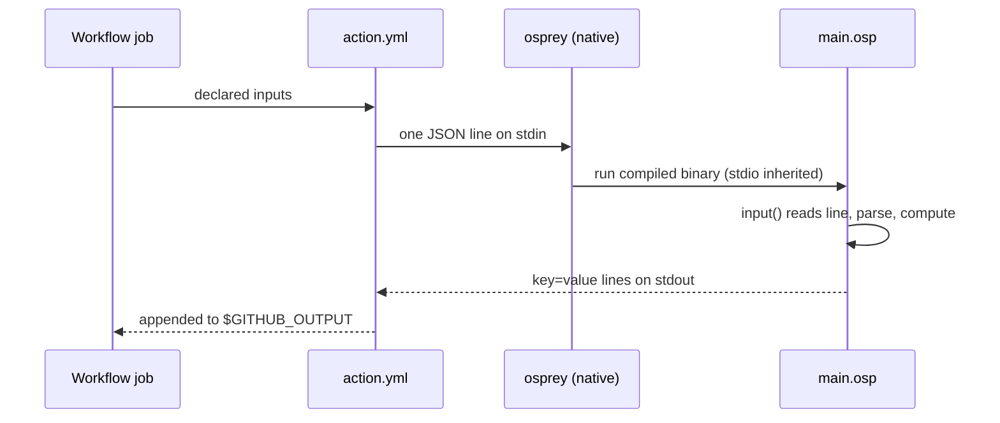

# Osprey GitHub Action

**Status:** normative target; implementation has not started. Delivery is fixed
by [plan 0015](../plans/0015-osprey-github-action.md).

A marketplace-published GitHub Action whose entire behaviour is to ferry a job's
inputs into a co-located Osprey program and surface that program's stdout as the
action's outputs. The `action.yml` is a thin shell; all logic lives in a single
`.osp` file beside it. The action runs the **native** target, because the ferry
depends on the `input` builtin ([BUILTIN-INPUT]) which the wasm runtime excludes
([WASM-TARGET]).

The design is fixed by three properties of the compiler, each verified against
the tree rather than assumed:

1. `osprey <file> --run` executes the compiled binary with **inherited stdio and
   no forwarded argv** — command-line arguments never reach the program.
2. There is **no environment-variable builtin** — an `.osp` program cannot read
   `INPUT_*` or any other env var.
3. The **only** program-visible input channel is stdin, read one line at a time
   by `input` ([BUILTIN-INPUT], `osp_input`).

Everything below follows from those facts.

## Wrapper Contract [GHA-WRAPPER]

The action is a wrapper, not a framework. `action.yml` performs exactly three
duties: serialize the declared `inputs` into one line, invoke the native Osprey
program with that line on stdin, and route the program's stdout to
`$GITHUB_OUTPUT`. The wrapper adds no business logic; a change in action
behaviour is a change to the `.osp` file, never to the YAML.

The `.osp` file is co-located with `action.yml`. Composite packaging resolves it
through `$GITHUB_ACTION_PATH`; Docker packaging bakes it into the image at a
fixed path.

## Input Ferry [GHA-FERRY-STDIN]

Inputs cross into the program on **stdin only**. Because `input` consumes a
single line (it reads to the first `\n`, strips it, and returns `""` on EOF), the
wrapper MUST serialize all inputs into **one line** — canonically a JSON object —
and the program MUST read that one line with a single `input()` call and parse it
with the string builtins ([BUILTIN-STRING-*]). Relying on a fixed sequence of
`input()` calls across multiple lines is forbidden: it is positional, brittle,
and breaks silently when an input is added.

Neither argv nor environment variables are a valid ferry channel. A wrapper that
attempts to pass inputs as process arguments or expects the program to read
`INPUT_*` is a defect.

## IO Contract [GHA-IO-CONTRACT]



```typeDiagram
typeDiagram
alias JsonLine = String
type Payload { json: JsonLine }
type OutputLine { key: String, value: String }
type RunResult { stdout: String, exitCode: Int }
```

- **Input**: one `JsonLine` on stdin. The wrapper builds it from `inputs` and
  passes it via the step's stdin redirect.
- **Output**: the program prints `key=value` lines (one per `OutputLine`) to
  stdout; the wrapper appends stdout to `$GITHUB_OUTPUT`. No consecutive `print`
  calls — a multi-key result is one interpolated string with embedded newlines.
- **Status**: the program's process exit code is the step's success/failure. A
  non-zero exit fails the job; the program returns `Result<T, E>` and maps error
  to a non-zero `main` status rather than panicking.

## Runner Toolchain [GHA-TOOLCHAIN]

Native `--run` lowers the emitted LLVM IR with **clang** (`OSPREY_CC`, the only
driver that consumes textual `.ll`) and links a `libfiber_runtime*.a` archive.
The runner therefore needs three things present: the `osprey` binary, `clang`,
and the matching runtime archive. Packaging exists to satisfy that requirement
without burdening the action's consumer.

## Docker Packaging [GHA-PACKAGING-DOCKER]

The recommended packaging. A `Dockerfile` bakes `osprey`, `clang`, the runtime
archives, and `main.osp` into an image published to GHCR and pinned by digest.
The consumer's runner needs only Docker (standard on `ubuntu-latest`).

```yaml
runs:
  using: docker
  image: docker://ghcr.io/<owner>/<action>@sha256:<digest>
```

Properties: hermetic, reproducible, no per-run install, fast cold start after
the layer cache warms. Constraint: Docker container actions run on Linux runners
only — acceptable for CI jobs. The image build MAY pre-compile `main.osp` to a
native binary so the container start skips codegen entirely; when it does, the
entrypoint still feeds the JSON line on stdin unchanged.

## Composite Packaging [GHA-PACKAGING-COMPOSITE]

The cross-OS alternative. A composite `action.yml` installs the toolchain, then
runs the co-located program:

```yaml
runs:
  using: composite
  steps:
    - shell: bash
      run: |
        printf '%s' "$INPUT_PAYLOAD" \
          | osprey "$GITHUB_ACTION_PATH/main.osp" --run >> "$GITHUB_OUTPUT"
      env:
        INPUT_PAYLOAD: ${{ toJSON(inputs) }}
```

`osprey` is installed via the existing Homebrew tap ([homebrew-package]) on
macOS/Linux or Scoop on Windows; `clang` must be present (preinstalled on the
GitHub-hosted images, otherwise one install step). Properties: runs on all
runner OSes. Cost: a per-run toolchain install unless cached, and a hard
dependency on `clang` being resolvable.

## Marketplace Publication [GHA-MARKETPLACE]

`action.yml` lives at the repository root with `name`, `description`, `author`,
`branding`, typed `inputs`, and `outputs`. Releases are tag-triggered
(`vX.Y.Z`); the Marketplace listing pins to a tag or a commit digest. Version
fields follow the placeholder rule — no hard-coded version in source; the tag
stamps it at build time (Shipwright contract, see [docs/RELEASING.md]).

## Deferred: wasm Packaging [GHA-WASM-DEFERRED]

Non-normative. wasm would give the best distribution story — a committed
`main.wasm` run by a WASI host (wasmtime, or Node's built-in WASI) with **no
Osprey toolchain, clang, or runtime archive on the consumer's runner**. It is
blocked today because the wasm runtime subset ([WASM-TARGET-RUNTIME]) omits
`random_runtime`, so `input` fails to link and the ferry has no channel.

Two unblock paths, either sufficient:

1. Add `input` (a stdin unit split from `random_runtime`, or `random_runtime`
   itself) to `WASM_RT_SRC`. Then `wasmtime main.wasm` with the JSON line on
   stdin works exactly like the native ferry — WASI wires `getchar` to fd 0.
2. Ferry through the existing browser host ABI ([WASM-WEB-ABI]): a Node WASI
   host shim allocates the payload with `osp_alloc`, writes it into linear
   memory, and calls the exported `osprey_web_dispatch(message)`. No runtime
   change, but the wrapper carries a ~30-line JS host.

Until one lands, all packaging is native.

## Verification

- An `tests/regressions/` program that reads one JSON line via `input()`, parses
  it with the string builtins, and prints `key=value` lines — the ferry +
  parse + emit round-trip, checked byte-for-byte by the differential harness
  (`crates/run_test_corpus.sh`).
- `osprey <program>.osp --run < payload.json` reproduces the harness output,
  proving the stdin channel end to end.
- The Docker image builds and its entrypoint reproduces the same output for the
  same JSON line.
