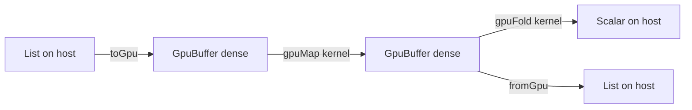

# GPU Computation

**Status: partially implemented.** The typed buffer surface, kernel purity
checking, and the host execution backend exist today. Device code generation
(PTX, Metal, WebGPU) is roadmap work; the staged plan and its detailed
checklist live in [plan 0023](../plans/0023-gpu-computation.md). The
scholarly work each design choice rests on is cited inline and collected in
[References](#references--gpu-research) at the end of this document.

GPU computation in Osprey is a language surface, not a bound library. The
type system separates host data from device-shaped data, and the compiler
proves at compile time that every kernel is pure — a kernel that logs,
performs an effect, or calls something the checker cannot see is a compile
error, not a runtime fault. This is the same machinery that already rejects
an unhandled effect ([0017](0017-AlgebraicEffects.md)), pointed at data
parallelism: parallel-safe by construction, checked before anything runs.



## Buffers — [GPU-BUFFER]

`GpuBuffer<T>` is an opaque, immutable, densely-packed array — the
device-transferable representation of a sequence. It is distinct from
`List<T>`: a list is a persistent structure optimized for sharing; a buffer
is contiguous unboxed storage laid out the way accelerator memcpy and
coalesced access require. Buffers are values like any other — they obey the
same ownership analysis and memory backends as every heap value
([0018](0018-MemoryManagement.md)).

### Element restriction — [GPU-BUFFER-ELEM]

Buffer elements are scalars: `int`, `float`, or `bool`. This is the regular,
first-order device sublanguage that every production functional GPU language
restricts device data to — Futhark ([Henriksen et al., PLDI
2017](https://doi.org/10.1145/3062341.3062354)) and Accelerate ([McDonell et
al., ICFP 2013](https://doi.org/10.1145/2500365.2500595)) both make this
restriction, because representing sum types and pointers on SIMT hardware is
an open research problem (the flattening line of work: [Blelloch, CACM
1996](https://doi.org/10.1145/227234.227246); [Bergstrom et al., PPoPP
2013](https://doi.org/10.1145/2442516.2442525)). Strings, lists, records, and
unions stay on the host side of the boundary; full ADTs and pattern matching
remain available in host code, including the code that builds and consumes
buffers. A non-scalar element is a compile error at the call that would
create it.

## Buffer built-ins

### `toGpu(list: List<T>) -> GpuBuffer<T>` — [GPU-BUFFER-FROM-LIST]

Copies a host list into a dense buffer. `T` must satisfy
[GPU-BUFFER-ELEM].

```osprey
let buf = toGpu([1, 2, 3, 4])
```

```osprey-ml
let buf = toGpu [1, 2, 3, 4]
```

### `fromGpu(buffer: GpuBuffer<T>) -> List<T>` — [GPU-BUFFER-TO-LIST]

Materializes a buffer back into a host list.

### `gpuLength(buffer: GpuBuffer<T>) -> int` — [GPU-BUFFER-LENGTH]

The element count. Constant time.

## Kernels

A *kernel* is the function value passed to a GPU combinator. Kernels are
written as ordinary Osprey functions or lambdas — there is no separate
kernel language, no annotation, and no restrictions beyond purity and the
element restriction at the boundary.

### `gpuMap(buffer: GpuBuffer<T>, kernel: fn(T) -> U) -> GpuBuffer<U>` — [GPU-MAP]

Applies `kernel` independently to every element. Because the checker proves
`kernel` performs no effects, every application is independent by
construction and the combinator is parallelizable without analysis. `U`
must satisfy [GPU-BUFFER-ELEM].

```osprey
fn square(x) = (x * x) ?: 0
let squares = toGpu([1, 2, 3, 4]) |> gpuMap(square)
```

```osprey-ml
square x = (x * x) ?: 0
let squares = toGpu [1, 2, 3, 4] |> gpuMap square
```

### `gpuFold(buffer: GpuBuffer<T>, initial: U, combine: fn(U, T) -> U) -> U` — [GPU-FOLD]

Reduces a buffer to one value. The accumulator must itself be a scalar
([GPU-BUFFER-ELEM]) so the reduction can execute on device hardware; a
record accumulator is a compile error at the `gpuFold` call. The host
backend applies `combine` left-to-right; a device backend may reassociate,
so `combine` should be associative — the compiler does not verify
associativity today, and the documented contract is that a
non-associative combine has backend-dependent results.

```osprey
fn add(a, b) = (a + b) ?: a
let total = toGpu([1, 2, 3, 4]) |> gpuFold(0, add)
```

### `gpuZipWith(a: GpuBuffer<T>, b: GpuBuffer<U>, kernel: fn(T, U) -> V) -> GpuBuffer<V>` — [GPU-ZIPWITH]

Elementwise binary combination — the primitive every vector, tensor, and
particle workload builds on. The result takes the shorter operand's length,
so a ragged pair truncates rather than reading past the end. The kernel is
held to [GPU-KERNEL-PURE] exactly as `gpuMap`'s is.

```osprey
fn dot(xs, ys) = gpuZipWith(xs, ys, fn(x: float, y: float) => x * y)
    |> gpuFold(0.0, fn(a: float, v: float) => a + v)
```

### `gpuIota(n: int) -> GpuBuffer<int>` — [GPU-IOTA]

The index buffer `[0, n)`. Kernels see element values, not positions, so
gather, stencil, and matrix addressing all start from `gpuIota`: map over
the indices and read neighbours with `gpuGet`.

### `gpuGet(buffer: GpuBuffer<T>, index: int) -> Result<T, Error>` — [GPU-GET]

Bounds-checked read of one element at the buffer's element type. An
out-of-bounds index returns `Error` rather than a sentinel value, so a
wrong gather is a visible failure, not silent zeros. Usable inside a kernel
— reading a buffer is pure — which is how a `gpuIota`-driven kernel
expresses matrix rows and stencils.

```osprey
fn at(m, i) = gpuGet(m, i) ?: 0.0
fn rowSum(m, r) = at(m, (r * 3) ?: 0) + at(m, ((r * 3) ?: 1) + 1 ?: 1)
```

### `gpuScan(buffer: GpuBuffer<T>, initial: T, combine: fn(T, T) -> T) -> GpuBuffer<T>` — [GPU-SCAN]

Inclusive prefix scan: element `i` of the result is `combine` folded over
the source through element `i`. Scan is *the* classic parallel primitive —
segmented scans and flag vectors are how nested data parallelism flattens
onto flat hardware ([Blelloch, CACM
1996](https://doi.org/10.1145/227234.227246); [NESL](https://www.cs.cmu.edu/~scandal/nesl.html)).
The associativity contract is `gpuFold`'s: the host backend runs
left-to-right; a device backend may run the work-efficient parallel scan,
so a non-associative combine has backend-dependent results.

### `gpuFilter(buffer: GpuBuffer<T>, predicate: fn(T) -> bool) -> GpuBuffer<T>` — [GPU-FILTER]

Stream compaction: keeps the elements the pure predicate accepts,
preserving source order. The host backend fills a source-length scratch
buffer and publishes the kept prefix; a device backend implements the same
contract with a scan-based compaction.

## Kernel purity — [GPU-KERNEL-PURE]

The compiler rejects any GPU combinator call whose kernel performs an
algebraic effect, directly or through any chain of helpers and lambdas. The
proof reuses the static effect discharge machinery
([EFFECTS-STATIC-DISCHARGE](0017-AlgebraicEffects.md)): the kernel's
operation summary must be empty. Wrapping the call in a handler does not
lift the restriction — a handler makes an effect *dischargeable*, but a
kernel body still cannot leave the device to reach one, so the requirement
is purity, not handledness.

Effect-typed parallelism is the studied way to draw this line: Dex
distinguishes the parallelism-destroying `State` effect from a
parallelism-preserving accumulation effect ([Paszke et al., ICFP
2021](https://arxiv.org/abs/2104.05372)), on effect-system foundations from
Koka ([Leijen, 2014](https://arxiv.org/abs/1406.2061)); which handler
shapes commute with parallel evaluation at all is formalized in "Parallel
Algebraic Effect Handlers" ([Xie et al., ICFP
2024](https://dl.acm.org/toc/pacmpl/2024/8/ICFP)) — the theory closest to
Osprey's handlers. Today's rule is the sound conservative point on that
spectrum: an empty effect row. A parallelism-preserving accumulation
effect, if ever added, must be justified against that work.

The check fails closed: a kernel whose effects the checker cannot prove
(for example, a function value received as a parameter from an unknown call
site, or a closure whose provenance analysis widens out) is rejected with a
`cannot prove GPU kernel pure` error. Passing a named function or an inline
lambda always gives the checker what it needs.

```osprey
effect Log { write: fn(string) -> Unit }
fn loud(x) = {
    perform Log.write("saw it")   // kernel performs Log.write
    x
}
// COMPILE ERROR: GPU kernel must be pure; it performs: Log.write
// let bad = toGpu([1]) |> gpuMap(loud)
```

## Kernel expressiveness

### Kernel forms — [GPU-KERNEL-FORM]

Every pure function form is a valid kernel. Normatively that means all of:
a named top-level function, an inline lambda, a lambda with a **block body
containing local bindings**, a closure capturing enclosing locals (a folded
scalar piped back into a `gpuMap`), and helpers reached from the kernel —
including **recursive** helpers such as a row walk over a flat matrix. The
purity proof ([GPU-KERNEL-PURE]) is the only gate; syntax shape is never
one.

Current implementation gaps, tracked in
[plan 0002](../plans/0002-codegen-generic-function-values.md):

- A block-bodied lambda with an internal `let` fails codegen when used as a
  kernel (the inline-callback path loses the block's local scope:
  `unknown identifier`). Named kernels are the workaround.
- A recursive helper reachable from a kernel — or any recursive function —
  must carry a fully concrete signature; an unannotated one is rejected
  with `annotate its parameters and return type so it is emitted as a real
  function` (fail-closed, `examples/failscompilation/`
  `recursive_generic_needs_annotation.ospo`). The end state is emitting a
  monomorphic definition per instantiation, making the annotations
  optional.

### Kernel element typing — [GPU-KERNEL-ELEM-TYPING]

A kernel's parameter types flow **from the buffer**: in
`gpuMap(buf, kernel)` with `buf: GpuBuffer<float>`, the kernel's parameter
*is* `float`, and bare arithmetic inside the kernel (`a + b`) must type at
`float` — never silently default to `int`. Defaulting is only permissible
when a parameter is genuinely unconstrained by every consuming slot.

Today the checker int-defaults a context-free kernel
(`fn plus(a, b) = a + b` cannot serve a float fold anywhere in the
language), so float kernels need a float literal or signature in scope.
This is a language-wide inference defect, not a GPU rule — tracked as a
Phase 0 defect in
[plan 0022](../plans/0022-arithmetic-totality-audit.md).

### Element conversion — [GPU-CONVERT]

Scalar element types convert **explicitly, inside kernels** — never
implicitly at buffer boundaries. The required primitive is
`toFloat(n: int) -> float` (round-to-nearest-even; exact for
`|n| <= 2^53`), which makes the canonical float-pipeline seed expressible:

```osprey
let xs = gpuIota(100000) |> gpuMap(toFloat)
```

`toFloat` is not implemented yet — float stress workloads iterate literal
buffers until it lands ([plan
0004](../plans/0004-collection-stdlib-completion.md); the builtin registers
in [0012-Built-InFunctions.md](0012-Built-InFunctions.md) with docs
entries like every builtin). The reverse direction already exists as
checked truncation on the arithmetic side and is out of scope for buffers.

## Execution backends

### Host baseline — [GPU-BACKEND-HOST]

Every GPU program has defined, deterministic semantics with no GPU present:
the host backend executes combinators as fused native loops over the dense
buffer, exactly as [Futhark](https://futhark-lang.org)'s `c` backend and
every portability layer provide (fusion as the load-bearing optimization:
[McDonell et al., ICFP 2013](https://doi.org/10.1145/2500365.2500595)).
This is the reference semantics device backends must match, it is what the
differential test harness verifies under every memory backend and on
wasm32, and it is what runs today. The dense unboxed buffer layout is the
same staging layout a device transfer uses, so adopting the surface now
costs nothing when device codegen lands.

### Device backends — [GPU-BACKEND-DEVICE]

Not implemented. The design (staged in [plan
0023](../plans/0023-gpu-computation.md)): device code generation lowers the
same checked combinator calls through a data-parallel pipeline to
accelerator targets, selected at build time like the memory backends are.
The compiler emits target-agnostic textual LLVM IR and hands it to clang
today; the wasm32 target already works as a sibling link driver
(`crates/osprey-cli/src/wasm.rs`), and a device target follows the same
shape: a kernel-extraction pass plus a target driver (NVPTX via clang, then
Metal, then WebGPU/WGSL pairing with the existing wasm target). The
studied alternatives — an MLIR `gpu`/`nvgpu`/`nvvm` pipeline (the substrate
[Mojo](https://arxiv.org/abs/2509.21039) is built on), tile-level IRs
([Triton — Tillet et al., MAPL
2019](https://doi.org/10.1145/3315508.3329973); NVIDIA's open-source
[CUDA Tile IR](https://github.com/NVIDIA/cuda-tile)), and polyhedral
compilation ([PPCG — Verdoolaege et al., TACO
2013](https://doi.org/10.1145/2400682.2400713)) — are weighed in the plan,
not fixed by this spec. Kernel purity and the element restriction exist
precisely so that every program accepted today remains compilable unchanged
when offload arrives.

### Device selection — [GPU-DEVICE]

`gpuDevice() -> string` names the active execution backend. The host
backend reports `"host"`; device backends report device names
(`"cuda:0"`, `"metal:0"`). A program can branch on it, and a benchmark can
record which backend produced its numbers.

Choosing a device is an *effect*, not a global switch — that is roadmap
stage 5's `Gpu` effect, and it is the construct that makes Osprey's GPU
story a language feature rather than a library. Selection becomes lexical,
testable, and capability-checked exactly like every other effect:

```osprey
// Stage 5 surface (design, not yet implemented): the handler chooses the
// execution strategy for everything the region offloads. Kernels stay
// pure; scheduling is the effectful part, so scheduling is what handlers
// control.
handle Gpu.select => "cuda:0" in {
    let scores = embeddings |> gpuMap(normalize) |> gpuZipWith(query, dot)
}
// A test handler pins "host" and the same program runs deterministically
// in CI with no GPU attached.
```

Until stage 5 lands, programs run on the host backend and `gpuDevice()`
truthfully reports it; nothing in the surface changes when real devices
arrive — a handler simply gains the power to pick one.

## Roadmap invariant — [GPU-ROADMAP]

Implementation is staged in [plan
0023](../plans/0023-gpu-computation.md), which carries the stage
descriptions and the detailed TODO checklist. The normative invariant this
spec imposes on every stage: stages ratchet — each keeps `make ci` green
and the differential harness byte-exact, and a later stage must not change
the meaning of any program accepted by an earlier stage.

## References — [GPU-RESEARCH]

The scholarly work Osprey's GPU features are grounded in. Inline citations
above point here; the design decisions these produced are recorded in
[plan 0023](../plans/0023-gpu-computation.md).

**The device sublanguage and functional GPU compilation**

- Henriksen, Serup, Elsman, Henglein, Oancea. *Futhark: Purely Functional
  GPU-Programming with Nested Parallelism and In-Place Array Updates.*
  PLDI 2017. <https://doi.org/10.1145/3062341.3062354> — the blueprint for
  [GPU-BUFFER-ELEM]'s first-order scalar device sublanguage and the host
  backend's reference semantics.
- Henriksen, Thorøe, Elsman, Oancea. *Incremental Flattening for Nested
  Data Parallelism.* PPoPP 2019.
  <https://doi.org/10.1145/3293883.3295707> — why nested parallelism is
  deferred rather than naively flattened.
- Chakravarty, Keller, Lee, McDonell, Grover. *Accelerating Haskell Array
  Codes with Multicore GPUs.* DAMP 2011.
  <https://doi.org/10.1145/1926354.1926358> — type-level host/device
  separation, the model for `GpuBuffer` vs `List`.
- McDonell, Chakravarty, Keller, Lippmeier. *Optimising Purely Functional
  GPU Programs.* ICFP 2013. <https://doi.org/10.1145/2500365.2500595> —
  array fusion as the load-bearing optimization behind [GPU-BACKEND-HOST].

**Parallel primitives and flattening foundations**

- Blelloch. *Programming Parallel Algorithms.* CACM 1996.
  <https://doi.org/10.1145/227234.227246> — scan as the fundamental
  primitive behind [GPU-FOLD]/[GPU-SCAN]; the
  [NESL](https://www.cs.cmu.edu/~scandal/nesl.html) nested-data-parallel
  line.
- Bergstrom, Fluet, Rainey, Reppy, Rosen, Shaw. *Data-Only Flattening for
  Nested Data Parallelism.* PPoPP 2013.
  <https://doi.org/10.1145/2442516.2442525> — the frontier that justifies
  keeping ADTs at the boundary.

**Effects and parallelism**

- Leijen. *Koka: Programming with Row-Polymorphic Effect Types.* MSFP
  2014. <https://arxiv.org/abs/1406.2061> — the effect-system foundation
  Osprey's handlers descend from.
- Paszke, Johnson, Duvenaud, Vytiniotis, Radul, Johnson, Ragan-Kelley,
  Maclaurin. *Getting to the Point: Index Sets and Parallelism-Preserving
  Autodiff for Pointful Array Programming* (Dex). ICFP 2021.
  <https://arxiv.org/abs/2104.05372> — parallelism-preserving vs
  parallelism-destroying effects, the theory behind [GPU-KERNEL-PURE];
  implementation at <https://github.com/google-research/dex-lang>.
- Xie et al. *Parallel Algebraic Effect Handlers.* ICFP 2024 (PACMPL
  8, ICFP issue: <https://dl.acm.org/toc/pacmpl/2024/8/ICFP>) — which
  handler shapes commute with parallel evaluation; governs any future
  relaxation of the empty-effect-row kernel rule and the stage-5 `Gpu`
  effect.

**Device code generation and scheduling**

- Tillet, Kung, Cox. *Triton: An Intermediate Language and Compiler for
  Tiled Neural Network Computations.* MAPL 2019.
  <https://doi.org/10.1145/3315508.3329973> — the tile abstraction; with
  NVIDIA's open-source [CUDA Tile IR](https://github.com/NVIDIA/cuda-tile),
  a candidate escape-hatch level for stage 4+.
- Ragan-Kelley, Barnes, Adams, Paris, Durand, Amarasinghe. *Halide:
  Decoupling Algorithms from Schedules for High-Performance Image
  Processing.* PLDI 2013. <https://doi.org/10.1145/2491956.2462176> — the
  algorithm/schedule separation stage 7's schedule layer follows; the
  autoscheduler is [Adams et al., SIGGRAPH
  2019](https://doi.org/10.1145/3306346.3322967).
- Ikarashi, Bernstein, Reinking, Genc, Ragan-Kelley. *Exo: Externalized
  Rewriting for Hardware Accelerators.* PLDI 2022.
  <https://doi.org/10.1145/3519939.3523446> — user-extensible scheduling.
- Verdoolaege, Juega, Cohen, Gómez, Tenllado, Catthoor. *Polyhedral
  Parallel Code Generation for CUDA* (PPCG). ACM TACO 2013.
  <https://doi.org/10.1145/2400682.2400713>; the tiling/fusion algorithm is
  [Bondhugula et al., PLDI 2008](https://doi.org/10.1145/1375581.1375595)
  (Pluto).
- MLIR GPU dialect stack:
  [`gpu`](https://mlir.llvm.org/docs/Dialects/GPU/),
  [`nvgpu`](https://mlir.llvm.org/docs/Dialects/NVGPU/),
  [`nvvm`](https://mlir.llvm.org/docs/Dialects/NVVMDialect/) — the
  progressive-lowering substrate weighed at stage 4's decision checkpoint.

**Autodiff (stage 7)**

- Elliott. *The Simple Essence of Automatic Differentiation.* ICFP 2018.
  <https://arxiv.org/abs/1804.00746> — the categorical core for a
  functional language's AD.
- Bangaru, Wu, Li, Munkberg, et al. *SLANG.D: Fast, Modular and
  Differentiable Shader Programming.* SIGGRAPH Asia 2023.
  <https://doi.org/10.1145/3618353> — autodiff as a type-system feature
  with compile-time safety, not a library.
- Hu et al. *DiffTaichi: Differentiable Programming for Physical
  Simulation.* ICLR 2020. <https://arxiv.org/abs/1910.00935>; the layout
  decoupling is [Taichi, SIGGRAPH Asia
  2019](https://doi.org/10.1145/3355089.3356506).

**Competitive positioning and portability layers**

- Godoy et al. *Mojo: MLIR-Based Performance-Portable HPC Science Kernels
  on GPUs for the Python Ecosystem.* SC Workshops 2025 (WACCPD).
  <https://arxiv.org/abs/2509.21039> — the measured Mojo baseline stage
  4's benchmark gates target.
- Edwards, Trott, Sunderland. *Kokkos: Enabling Manycore Performance
  Portability.* JPDC 2014. <https://doi.org/10.1016/j.jpdc.2014.07.003> —
  execution/memory-space abstraction for the stage-6 portability story.
