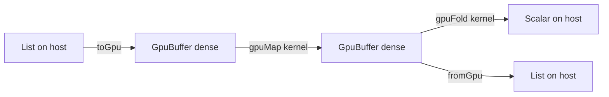

# GPU Computation

**Status: partially implemented.** The typed buffer surface, kernel purity
checking, and the host execution backend exist today. Device code generation
(PTX, Metal, WebGPU) is roadmap work; the staged plan is at the end of this
document. The research foundation behind these choices is
[`gpu.md`](gpu.md).

GPU computation in Osprey is a language surface, not a bound library. The
type system separates host data from device-shaped data, and the compiler
proves at compile time that every kernel is pure — a kernel that logs,
performs an effect, or calls something the checker cannot see is a compile
error, not a runtime fault. This is the same machinery that already rejects
an unhandled effect ([0017](0017-AlgebraicEffects.md)), pointed at data
parallelism: parallel-safe by construction, checked before anything runs.



## Buffers — [GPU-BUFFER]

`GpuBuffer<T>` is an opaque, immutable, densely-packed array — the
device-transferable representation of a sequence. It is distinct from
`List<T>`: a list is a persistent structure optimized for sharing; a buffer
is contiguous unboxed storage laid out the way accelerator memcpy and
coalesced access require. Buffers are values like any other — they obey the
same ownership analysis and memory backends as every heap value
([0018](0018-MemoryManagement.md)).

### Element restriction — [GPU-BUFFER-ELEM]

Buffer elements are scalars: `int`, `float`, or `bool`. This is the regular,
first-order device sublanguage that every production functional GPU language
(Futhark, Accelerate) restricts device data to. Strings, lists, records, and
unions stay on the host side of the boundary; full ADTs and pattern matching
remain available in host code, including the code that builds and consumes
buffers. A non-scalar element is a compile error at the call that would
create it.

## Buffer built-ins

### `toGpu(list: List<T>) -> GpuBuffer<T>` — [GPU-BUFFER-FROM-LIST]

Copies a host list into a dense buffer. `T` must satisfy
[GPU-BUFFER-ELEM].

```osprey
let buf = toGpu([1, 2, 3, 4])
```

```osprey-ml
let buf = toGpu [1, 2, 3, 4]
```

### `fromGpu(buffer: GpuBuffer<T>) -> List<T>` — [GPU-BUFFER-TO-LIST]

Materializes a buffer back into a host list.

### `gpuLength(buffer: GpuBuffer<T>) -> int` — [GPU-BUFFER-LENGTH]

The element count. Constant time.

## Kernels

A *kernel* is the function value passed to a GPU combinator. Kernels are
written as ordinary Osprey functions or lambdas — there is no separate
kernel language, no annotation, and no restrictions beyond purity and the
element restriction at the boundary.

### `gpuMap(buffer: GpuBuffer<T>, kernel: fn(T) -> U) -> GpuBuffer<U>` — [GPU-MAP]

Applies `kernel` independently to every element. Because the checker proves
`kernel` performs no effects, every application is independent by
construction and the combinator is parallelizable without analysis. `U`
must satisfy [GPU-BUFFER-ELEM].

```osprey
fn square(x) = (x * x) ?: 0
let squares = toGpu([1, 2, 3, 4]) |> gpuMap(square)
```

```osprey-ml
square x = (x * x) ?: 0
let squares = toGpu [1, 2, 3, 4] |> gpuMap square
```

### `gpuFold(buffer: GpuBuffer<T>, initial: U, combine: fn(U, T) -> U) -> U` — [GPU-FOLD]

Reduces a buffer to one value. The accumulator must itself be a scalar
([GPU-BUFFER-ELEM]) so the reduction can execute on device hardware; a
record accumulator is a compile error at the `gpuFold` call. The host
backend applies `combine` left-to-right; a device backend may reassociate,
so `combine` should be associative — the compiler does not verify
associativity today, and the documented contract is that a
non-associative combine has backend-dependent results.

```osprey
fn add(a, b) = (a + b) ?: a
let total = toGpu([1, 2, 3, 4]) |> gpuFold(0, add)
```

### `gpuZipWith(a: GpuBuffer<T>, b: GpuBuffer<U>, kernel: fn(T, U) -> V) -> GpuBuffer<V>` — [GPU-ZIPWITH]

Elementwise binary combination — the primitive every vector, tensor, and
particle workload builds on. The result takes the shorter operand's length,
so a ragged pair truncates rather than reading past the end. The kernel is
held to [GPU-KERNEL-PURE] exactly as `gpuMap`'s is.

```osprey
fn dot(xs, ys) = gpuZipWith(xs, ys, fn(x: float, y: float) => x * y)
    |> gpuFold(0.0, fn(a: float, v: float) => a + v)
```

### `gpuIota(n: int) -> GpuBuffer<int>` — [GPU-IOTA]

The index buffer `[0, n)`. Kernels see element values, not positions, so
gather, stencil, and matrix addressing all start from `gpuIota`: map over
the indices and read neighbours with `gpuGet`.

### `gpuGet(buffer: GpuBuffer<T>, index: int) -> Result<T, Error>` — [GPU-GET]

Bounds-checked read of one element at the buffer's element type. An
out-of-bounds index returns `Error` rather than a sentinel value, so a
wrong gather is a visible failure, not silent zeros. Usable inside a kernel
— reading a buffer is pure — which is how a `gpuIota`-driven kernel
expresses matrix rows and stencils.

```osprey
fn at(m, i) = gpuGet(m, i) ?: 0.0
fn rowSum(m, r) = at(m, (r * 3) ?: 0) + at(m, ((r * 3) ?: 1) + 1 ?: 1)
```

### `gpuScan(buffer: GpuBuffer<T>, initial: T, combine: fn(T, T) -> T) -> GpuBuffer<T>` — [GPU-SCAN]

Inclusive prefix scan: element `i` of the result is `combine` folded over
the source through element `i`. The associativity contract is `gpuFold`'s:
the host backend runs left-to-right; a device backend may run the classic
work-efficient parallel scan, so a non-associative combine has
backend-dependent results.

### `gpuFilter(buffer: GpuBuffer<T>, predicate: fn(T) -> bool) -> GpuBuffer<T>` — [GPU-FILTER]

Stream compaction: keeps the elements the pure predicate accepts,
preserving source order. The host backend fills a source-length scratch
buffer and publishes the kept prefix; a device backend implements the same
contract with a scan-based compaction.

## Kernel purity — [GPU-KERNEL-PURE]

The compiler rejects any GPU combinator call whose kernel performs an
algebraic effect, directly or through any chain of helpers and lambdas. The
proof reuses the static effect discharge machinery
([EFFECTS-STATIC-DISCHARGE](0017-AlgebraicEffects.md)): the kernel's
operation summary must be empty. Wrapping the call in a handler does not
lift the restriction — a handler makes an effect *dischargeable*, but a
kernel body still cannot leave the device to reach one, so the requirement
is purity, not handledness.

The check fails closed: a kernel whose effects the checker cannot prove
(for example, a function value received as a parameter from an unknown call
site, or a closure whose provenance analysis widens out) is rejected with a
`cannot prove GPU kernel pure` error. Passing a named function or an inline
lambda always gives the checker what it needs.

```osprey
effect Log { write: fn(string) -> Unit }
fn loud(x) = {
    perform Log.write("saw it")   // kernel performs Log.write
    x
}
// COMPILE ERROR: GPU kernel must be pure; it performs: Log.write
// let bad = toGpu([1]) |> gpuMap(loud)
```

## Kernel expressiveness

### Kernel forms — [GPU-KERNEL-FORM]

Every pure function form is a valid kernel. Normatively that means all of:
a named top-level function, an inline lambda, a lambda with a **block body
containing local bindings**, a closure capturing enclosing locals (a folded
scalar piped back into a `gpuMap`), and helpers reached from the kernel —
including **recursive** helpers such as a row walk over a flat matrix. The
purity proof ([GPU-KERNEL-PURE]) is the only gate; syntax shape is never
one.

Current implementation gaps, tracked in
[plan 0002](../plans/0002-codegen-generic-function-values.md):

- A block-bodied lambda with an internal `let` fails codegen when used as a
  kernel (the inline-callback path loses the block's local scope:
  `unknown identifier`). Named kernels are the workaround.
- A recursive helper reachable from a kernel — or any recursive function —
  must carry a fully concrete signature; an unannotated one is rejected
  with `annotate its parameters and return type so it is emitted as a real
  function` (fail-closed, `examples/failscompilation/`
  `recursive_generic_needs_annotation.ospo`). The end state is emitting a
  monomorphic definition per instantiation, making the annotations
  optional.

### Kernel element typing — [GPU-KERNEL-ELEM-TYPING]

A kernel's parameter types flow **from the buffer**: in
`gpuMap(buf, kernel)` with `buf: GpuBuffer<float>`, the kernel's parameter
*is* `float`, and bare arithmetic inside the kernel (`a + b`) must type at
`float` — never silently default to `int`. Defaulting is only permissible
when a parameter is genuinely unconstrained by every consuming slot.

Today the checker int-defaults a context-free kernel
(`fn plus(a, b) = a + b` cannot serve a float fold anywhere in the
language), so float kernels need a float literal or signature in scope.
This is a language-wide inference defect, not a GPU rule — tracked as a
Phase 0 defect in
[plan 0022](../plans/0022-arithmetic-totality-audit.md).

### Element conversion — [GPU-CONVERT]

Scalar element types convert **explicitly, inside kernels** — never
implicitly at buffer boundaries. The required primitive is
`toFloat(n: int) -> float` (round-to-nearest-even; exact for
`|n| <= 2^53`), which makes the canonical float-pipeline seed expressible:

```osprey
let xs = gpuIota(100000) |> gpuMap(toFloat)
```

`toFloat` is not implemented yet — float stress workloads iterate literal
buffers until it lands ([plan
0004](../plans/0004-collection-stdlib-completion.md); the builtin registers
in [0012-Built-InFunctions.md](0012-Built-InFunctions.md) with docs
entries like every builtin). The reverse direction already exists as
checked truncation on the arithmetic side and is out of scope for buffers.

## Execution backends

### Host baseline — [GPU-BACKEND-HOST]

Every GPU program has defined, deterministic semantics with no GPU present:
the host backend executes combinators as fused native loops over the dense
buffer, exactly as Futhark's `c` backend and every portability layer
provide. This is the reference semantics device backends must match, it is
what the differential test harness verifies under every memory backend and
on wasm32, and it is what runs today. The dense unboxed buffer layout is
the same staging layout a device transfer uses, so adopting the surface now
costs nothing when device codegen lands.

### Device backends — [GPU-BACKEND-DEVICE]

Not implemented. The design (from [`gpu.md`](gpu.md)): device code
generation lowers the same checked combinator calls through a data-parallel
pipeline to accelerator targets, selected at build time like the memory
backends are. The compiler emits target-agnostic textual LLVM IR and hands
it to clang today; the wasm32 target already works as a sibling link driver
(`crates/osprey-cli/src/wasm.rs`), and a device target follows the same
shape: a kernel-extraction pass plus a target driver (NVPTX via clang, then
Metal, then WebGPU/WGSL pairing with the existing wasm target). Kernel
purity and the element restriction exist precisely so that every program
accepted today remains compilable unchanged when offload arrives.

### Device selection — [GPU-DEVICE]

`gpuDevice() -> string` names the active execution backend. The host
backend reports `"host"`; device backends report device names
(`"cuda:0"`, `"metal:0"`). A program can branch on it, and a benchmark can
record which backend produced its numbers.

Choosing a device is an *effect*, not a global switch — that is roadmap
stage 5's `Gpu` effect, and it is the construct that makes Osprey's GPU
story a language feature rather than a library. Selection becomes lexical,
testable, and capability-checked exactly like every other effect:

```osprey
// Stage 5 surface (design, not yet implemented): the handler chooses the
// execution strategy for everything the region offloads. Kernels stay
// pure; scheduling is the effectful part, so scheduling is what handlers
// control.
handle Gpu.select => "cuda:0" in {
    let scores = embeddings |> gpuMap(normalize) |> gpuZipWith(query, dot)
}
// A test handler pins "host" and the same program runs deterministically
// in CI with no GPU attached.
```

Until stage 5 lands, programs run on the host backend and `gpuDevice()`
truthfully reports it; nothing in the surface changes when real devices
arrive — a handler simply gains the power to pick one.

## Implementation roadmap — [GPU-ROADMAP]

Stages ratchet; each keeps `make ci` green and the differential harness
byte-exact. Later stages must not change the meaning of programs accepted
by earlier stages.

1. **Typed surface + host backend** (this spec's implemented scope):
   `GpuBuffer<T>`, the five built-ins, [GPU-BUFFER-ELEM] and
   [GPU-KERNEL-PURE] enforcement, dense-buffer C runtime, corpus +
   rejection tests in both flavors.
2. **Surface completion** (implemented: `gpuZipWith`, `gpuIota`, `gpuGet`,
   `gpuScan`, `gpuFilter`, `gpuDevice`; remaining: buffer literals and
   `Iterator` → `GpuBuffer` fusion so `range |> map |> toGpu` never
   materializes a list).
3. **Kernel extraction**: lower kernels passed to GPU combinators into
   standalone IR functions with explicit scalar signatures (today they are
   inlined into the host loop) — the compiler-side prerequisite for any
   device target, testable with no GPU by diffing extracted-kernel output
   against host-loop output.
4. **First device target — NVPTX**: emit kernel IR compiled by clang to
   PTX, a CUDA-driver launch path in the runtime behind a build flag, and
   buffer transfer using the existing dense layout. Threshold from
   `gpu.md`: within 2× of Futhark/CUDA on stencil and reduction
   micro-benchmarks before promoting the flag.
5. **Effect-selected execution**: a `Gpu` effect whose handler chooses the
   execution strategy per region, making offload a lexical, testable,
   capability-checked decision — the language construct competitors bolt on
   as library calls.
6. **Portability targets**: Metal (macOS CI can actually run it) and
   WebGPU/WGSL beside the wasm target.
7. **Autodiff and schedules**: differentiable kernels and an optional
   Halide-style schedule layer, per the Stage 3 research plan in
   [`gpu.md`](gpu.md).
