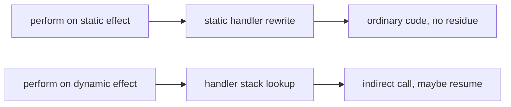

# Staged Effects

**Status: prototype landed, surface not final.** A working prototype
implements [STAGE-DECL], [STAGE-HANDLE-STATIC], the four static-handler
obligations, [STAGE-LOWER], [STAGE-RESIDUE] and [STAGE-SIGNALS-DIRTY] in the
Default flavor (`crates/osprey-ast/src/stage.rs` and `lower_static.rs`), and the
[falsification gate](#falsification-gate--stage-falsify) has been run and
passed. What remains — the ML surface, per-region rules, generic instantiation
identity and everything device-side — is staged in
[plan 0024](../plans/0024-staged-effects.md). This spec extends
[0017-AlgebraicEffects.md](0017-AlgebraicEffects.md); it does not replace it,
and every program that compiles today keeps its meaning
([STAGE-COMPAT](#compatibility--stage-compat)).

An effect already says *what* a function needs from the outside world without
saying *who* provides it. This document adds one more thing to that
declaration: **when the request gets answered.**

Some requests can be answered by the compiler before the program ever runs, so
nothing is left at runtime — no lookup, no continuation, no allocation. Others
have to stay flexible until runtime, because only the running program knows the
answer. Osprey today treats both the same way. Writing the difference down
turns four separate hard problems into one mechanism:

- **GPU.** Code whose requests are all answered early is exactly the code that
  is safe to run on a graphics card. "Can this be a kernel?" stops being a
  guess about whether the optimiser got lucky and becomes a question the
  compiler answers yes or no, naming the offending operation
  ([STAGE-GPU-LEGAL](#gpu-legality--stage-gpu-legal)).
- **WebAssembly.** Requests answered early need no stack switching, so they
  need nothing the browser does not already have
  ([STAGE-WASM](#webassembly--stage-wasm)).
- **User interfaces.** A function's effect row already lists exactly which data
  it reads. That list *is* the set of things whose change should redraw it — no
  dependency arrays, no forgotten dependency
  ([STAGE-SIGNALS](#reactive-signals--stage-signals)).
- **Compiler pipelines.** A statically answered effect is a compiler pass in
  disguise ([STAGE-DIALECT](#effects-as-dialects--stage-dialect)).

## Stage — [STAGE-AXIS]

`[STAGE-AXIS]` Every effect declaration has a **stage**, one of `static` or
`dynamic`. The stage is a property of the *declaration*, so every mention of
that effect in every row carries it, and a row's stage content is readable from
a function's type alone without inspecting any handler.

```typediagram
typeDiagram
alias EffectName = String
alias OperationName = String
union Stage {
  Static { dischargedBy: String }
  Dynamic { dischargedBy: String }
}
type EffectDecl { name: EffectName stage: Stage operations: List<OperationName> }
type RowEntry { effect: EffectName arguments: List<String> stage: Stage }
type EffectRow { entries: List<RowEntry> }
type StageSplit { staticPart: EffectRow dynamicPart: EffectRow }
```

`dynamic` is the default and describes exactly what Osprey does today: the
handler is found at runtime through the handler stack, an arm may capture the
rest of the computation with `resume`, and the operation costs a lookup and an
indirect call.

`static` is the new stage. A static effect's operations never reach the
runtime: the compiler rewrites them away, and a program in which one survives
to code generation is a compiler defect, not a slow program
([STAGE-RESIDUE](#zero-residue--stage-residue)).



## Declaring a stage — [STAGE-DECL]

`[STAGE-DECL]` The `effect` declaration form of
[0017](0017-AlgebraicEffects.md) gains an optional leading `static`. An
undecorated `effect` is dynamic.

```ebnf
effectDecl ::= docComment? "static"? "effect" IDENT ("<" typeParamList ">")? "{" opDecl* "}"
```

```osprey
static effect Parallel {
    forEach: fn(int, fn(int) -> Unit) -> Unit
}

effect Log {
    write: fn(string) -> Unit
}
```

```osprey-ml
static effect Parallel
    forEach : (int, int => Unit) => Unit

effect Log
    write : string => Unit
```

Generic effects keep the instantiation-specific behaviour of
[EFFECTS-GENERIC-INSTANTIATION](0017-AlgebraicEffects.md#generic-effects):
`Signal<Count>` and `Signal<Cursor>` are distinct row entries, distinctly
discharged. Stage is declared once, on the generic declaration, and every
instantiation shares it.

## Static handlers — [STAGE-HANDLE-STATIC]

`[STAGE-HANDLE-STATIC]` A handler region is marked static by writing `static`
after `handle`. A static handler may only handle a static effect, and a static
effect may only be handled by a static handler.

```ebnf
handlerExpr ::= "handle" "static"? IDENT handlerArm+ "in" expr
```

```osprey
let total = handle static Parallel
    forEach n body => rangeApply(n, body)
do sumOfSquares(1000)
```

A static handler is a **rewriting rule**, not a value. Its arms are inlined
into the operation sites they answer, the operation disappears, and the
resulting code is indistinguishable from code that never used an effect. Four
obligations make that rewrite sound; each is checked, and each fails with a
message naming the arm.

`[STAGE-STATIC-TOTAL]` **Total coverage.** A static handler must supply an arm
for every operation of the effect it handles. Partial static handlers are
rejected, because a residual operation has nowhere left to go.

> `static handler for Parallel does not cover operation Parallel.barrier`

`[STAGE-STATIC-TAIL]` **Tail-resumptive only.** An arm may not capture a
continuation. `resume` is permitted only in tail position, where it is
equivalent to the arm returning the operation's result and is compiled as a
plain call. Any other `resume` — a value used after resuming, a resume inside a
branch that continues afterwards — belongs to a dynamic handler.

> `static handler arm Parallel.forEach resumes outside tail position; static`
> `handlers cannot capture a continuation`

`[STAGE-STATIC-MONOTONE]` **Stage monotonicity.** A static handler arm's body
may require static effects only. Answering a compile-time request by making a
runtime request would reintroduce the residue the stage exists to remove.

> `static handler arm Alloc.alloc requires dynamic effect Log.write; static`
> `handler arms may require only static effects`

`[STAGE-STATIC-FINITE]` **Finite unfolding.** Rewriting runs to a fixpoint
under a step bound. Exceeding it is a compile error naming the operation, never
a hang and never a silent fallback to dynamic dispatch.

> `static discharge of Tensor.matmul exceeded the rewrite bound (N steps)`

Handler-owned state ([EFFECTS-HANDLER-STATE](0017-AlgebraicEffects.md#handler-owned-state))
is available to a static handler and is subject to the same rules: a `mut` cell
captured by a static arm is a compile-time-resolved binding when the rewrite
can see every write, and a static handler that would need a heap cell surviving
the rewrite is rejected under [STAGE-STATIC-MONOTONE].

## Rows and discharge — [STAGE-ROW]

`[STAGE-ROW]` Row syntax is unchanged. Because stage is declaration-determined,
`!Parallel` is already a static entry and `!Log` is already a dynamic one, and
the checker splits any row into its static and dynamic parts without extra
annotation.

```osprey
fn shade(px) -> int ![Parallel, Alloc] = ...      // wholly static row
fn report(px) -> int ![Parallel, Log] = ...        // mixed row
```

`[STAGE-ROW-DISCHARGE]` Discharge is otherwise exactly
[EFFECTS-STATIC-DISCHARGE](0017-AlgebraicEffects.md#effectful-function-types):
operation- and instantiation-specific, propagated through helpers, lambdas and
fibers, and required to be empty at program entry. Stage adds one rule: a
static entry may be discharged only by a static handler, and a dynamic entry
only by a dynamic one. There is no implicit promotion in either direction.

The name `[EFFECTS-STATIC-DISCHARGE]` in 0017 refers to *compile-time
checking* of discharge, which applies to both stages. It is unrelated to the
`static` stage introduced here, which additionally requires compile-time
*elimination*. The two are deliberately kept distinct: today's checker proves a
handler exists; a static handler proves no handler is needed at runtime.

## Handlers are lowering passes — [STAGE-LOWER]

`[STAGE-LOWER]` A static handler region is normatively a rewrite over the
canonical AST both flavors lower to
([FLAVOR-BOUNDARY](0023-LanguageFlavors.md#canonical-ast-boundary)). Every
`perform` of the handled effect is replaced by the corresponding arm body with
the operation's arguments substituted for the arm's parameters and the rest of
the computation substituted for a tail `resume`.

`[STAGE-LOWER-ORDER-PHASE]` The rewrite runs **at the flavor boundary**, where
every surface already converges on one canonical program — so it precedes type
checking, code generation, the language server and project assembly alike, and
no consumer can receive an undischarged program. This ordering is load-bearing,
not an implementation convenience: it
is the single reason four separate features need no separate machinery. A
kernel body reaches [GPU-KERNEL-PURE](0034-GPUComputation.md#kernel-purity--gpu-kernel-pure)
with an already-empty row, so the existing purity gate *is* the stage-legality
gate; a `wasm32` build never sees an operation that would need a continuation;
and a function used in both worlds ([STAGE-POLY](#stage-polymorphism--stage-poly))
is checked at each call site after erasure, so no inference over stages is
required. Type errors inside a static arm are reported against the substituted
code, which is the cost of the ordering and is accepted.

`[STAGE-LOWER-ORDER]` Nesting order is pass order. Given nested static
handlers, the innermost region is rewritten first, and its output is the input
to the enclosing one. This is the only ordering guarantee: two static handlers
for disjoint effects at the same nesting level commute, and the compiler may
apply them in either order.

`[STAGE-LOWER-DYNAMIC]` A static rewrite never crosses a dynamic handler
boundary in a way that changes observable order. A static region nested inside
a dynamic one is rewritten in place; the dynamic region's semantics are
untouched.

## Zero residue — [STAGE-RESIDUE]

`[STAGE-RESIDUE]` After static rewriting reaches its fixpoint, the program
contains no `perform` of any static effect and code generation emits no handler
registration for one. Concretely, for a static effect `E`, the emitted LLVM IR
contains no `__osprey_handler_push` or `__osprey_handler_lookup` naming `E` and
no `E` arm thunk. This is an observable, testable property, and it is the
acceptance criterion for the stage rather than a performance aspiration.

The corollary is the cost model users are entitled to rely on: **a static
effect is free.** Not "usually optimised away" — absent.

## Effects as dialects — [STAGE-DIALECT]

[MLIR](https://mlir.llvm.org/) is an LLVM subproject for building compilers out
of **dialects** — named sets of operations at whatever abstraction level suits
the problem — and **progressive lowering**, a pipeline of passes that each
rewrite one dialect into a more concrete one until only machine-level
operations remain. Mojo, Triton and IREE are built on it.

`[STAGE-DIALECT]` The correspondence between that architecture and effect
handlers is exact, and it is the reason one mechanism covers both jobs:

| Osprey | MLIR |
| --- | --- |
| Effect declaration | Dialect |
| Operation in an effect | Operation in a dialect |
| Effect row of a function | Set of dialects the body is written in |
| Static handler region | Conversion / lowering pass |
| [STAGE-STATIC-TOTAL] coverage | Full conversion — every source op has a pattern |
| [STAGE-RESIDUE] | Target legality — no illegal op survives |
| [STAGE-LOWER-ORDER] | Pass pipeline order |
| Dynamic handler | An op that stays, interpreted at runtime |

`[STAGE-DIALECT-INDEPENDENT]` The correspondence is between *designs*. Osprey
does not use MLIR: it emits textual LLVM IR and hands it to clang, and static
discharge is an Osprey-language rewrite over its own canonical AST. That is a
deliberate choice with stated reasons and stated conditions for revisiting it,
recorded in [plan 0024](../plans/0024-staged-effects.md#decision--why-osprey-does-not-use-mlir-today);
whether a *device* path is eventually built on MLIR's `gpu`/`nvgpu`/`nvvm`
stack remains the separate open decision at
[plan 0023](../plans/0023-gpu-computation.md) stage 4. This spec settles
neither.

What the correspondence buys either way is the part that matters to a user:
`Parallel`, `Tensor` and `Alloc` are declared once, in the language, and the
passes that give them meaning are handlers a user can read, replace and test —
not compiler internals a user can only accept.

`[STAGE-DIALECT-PORTABLE]` A conforming implementation may discharge static
handlers by any means that respects this document — including a dialect
conversion pipeline. The four obligations are what make that possible (total
coverage is full conversion, [STAGE-RESIDUE] is target legality,
tail-resumptiveness is what makes an arm expressible as a rewrite pattern), so
no rule here may be tightened in a way that forecloses one.

## GPU legality — [STAGE-GPU-LEGAL]

`[STAGE-GPU-LEGAL]` A function is **GPU-legal** when the dynamic part of its
effect row is empty and every entry of the static part is discharged by a
static handler in scope at the offload boundary.

This generalizes [GPU-KERNEL-PURE](0034-GPUComputation.md#kernel-purity--gpu-kernel-pure),
whose rule is the empty row — the special case where the static part is empty
too. Every kernel accepted today remains accepted, and kernels that allocate,
index a tensor or spawn parallel work become expressible without weakening the
proof, because those requests are answered before the kernel runs.

`[STAGE-GPU-KERNEL]` `kernel` is not a magic block. It is a handler region
whose signature admits only rows satisfying [STAGE-GPU-LEGAL], supplying the
static handlers for the device dialects — `Parallel`, `Alloc`, `Tensor` — that
its body is allowed to use.

```osprey
let frame = kernel
    Parallel forEach n body => deviceGrid(n, body)
    Alloc scratch bytes => deviceShared(bytes)
do gpuMap(pixels, shade)
```

`[STAGE-GPU-DIAG]` A body that is not stage-legal is rejected at the `kernel`
boundary, naming the operations that forced the rejection. The existing
fail-closed message for an unprovable kernel is retained for the case where the
checker cannot see a function value's provenance; stage adds the case where it
can see it and the answer is no.

> `kernel body is not stage-legal; it requires dynamic effects: Log.write`

## WebAssembly — [STAGE-WASM]

`[STAGE-WASM]` Static handlers require no stack switching, so they are
available on every target, including `wasm32`. This closes most of the gap
recorded in [0022-WebAssemblyTarget.md](0022-WebAssemblyTarget.md) and
[EFFECTS-RESUME](0017-AlgebraicEffects.md#resuming-handlers): today WebAssembly
supports direct value-substitution handlers but not the pthread-backed
continuation runtime, so effects that pause and continue work are native-only.

Under staging that limitation becomes a stage boundary rather than a target
boundary. Code whose rows are static compiles to WebAssembly with the same code
generation as native — nothing is deferred to the stack-switching proposal.
Dynamic handlers remain the marked slow path, and a program that needs one on
`wasm32` is rejected with the effect and operation named, exactly as an
unhandled effect is today.

## Reactive signals — [STAGE-SIGNALS]

`[STAGE-SIGNALS]` A reactive value is a generic static effect. Reading it is an
operation; the reactive runtime is a static handler; because that handler is
tail-resumptive, a read compiles to a plain call with nothing captured.

```osprey
type Count { value: int }

static effect Signal<T> {
    read: fn() -> T
}

fn counterLabel() -> string !Signal<Count> = {
    let c = perform Signal<Count>.read()
    "Count: ${c.value}"
}
```

The cost story is real but it is not the point. The point is the row:

`[STAGE-SIGNALS-DIRTY]` The **dependency set** of a computation is the
`Signal<_>` entries of its effect row, and it is exact — the compiler derives
it from the same propagation that already reaches through helpers, lambdas
passed to higher-order functions and fibers. A view function cannot read a
signal it did not declare, and cannot declare one it does not read, because
both are compile errors under
[EFFECTS-STATIC-DISCHARGE](0017-AlgebraicEffects.md#effectful-function-types).
There is no dependency array to keep in sync, no runtime read-tracking, and no
class of bug where a stale value is rendered because a dependency was
forgotten.

`[STAGE-SIGNALS-EXACT]` Exactness holds under stated conditions, and the
compiler must report when they do not hold rather than silently over- or
under-approximating:

- Signal identity is the generic instantiation. `Signal<Count>` and
  `Signal<Cursor>` are distinct dependencies; two signals sharing one payload
  type are one dependency, so a distinct type per signal is the surface
  contract until a dedicated declaration form exists.
- A signal selected at runtime (an index into a collection of signals) widens
  to the whole collection. The widening is reported, not hidden.
- A row variable that is not yet instantiated has no dependency set. The
  dependency set of a stage-polymorphic function is known at each call site,
  not at its definition.

`[STAGE-SIGNALS-REBUILD]` A UI framework consuming this uses the dependency set
as its dirty set directly: when a signal changes, the subtrees to rebuild are
exactly those whose rows contain that signal's instantiation. Nothing in this
spec requires such a framework to exist; what it requires is that the set be
derivable, exact and reportable through the language server so a developer can
see which signals a widget depends on.

## Per-region backends — [STAGE-BACKEND]

`[STAGE-BACKEND]` Because a static handler region is a delimited unit with a
known residual row, backend selection can be a property of a region rather than
of a build. The intended end state is a fast backend for the development loop,
LLVM for release and a device pipeline for kernel regions, chosen per region
and mixed within one program.

This section is the weakest-supported in this document and is marked as such:
Osprey has exactly one backend today (textual LLVM IR handed to clang, with
`wasm32` as a sibling link driver). Per-region selection is contingent on a
second backend existing at all and on kernel extraction landing
([plan 0023](../plans/0023-gpu-computation.md) stage 3). It is recorded here
because staging is what makes it *expressible*, not because it is scheduled.

## Stage polymorphism — [STAGE-POLY]

`[STAGE-POLY]` The load-bearing question is whether one `map` can serve a
kernel and an effectful host context. Under
[STAGE-AXIS](#stage--stage-axis) it can, and it needs no new mechanism: stage
is determined by the effect in the row, so a function that is polymorphic in
its row is automatically polymorphic in stage.

```osprey
fn map(xs, f) = ...        // row of the result is the row of f
```

Instantiated with a static `f`, `map`'s row is static and the call is
GPU-legal; instantiated with a dynamic `f`, it is an ordinary effectful call.
One definition, both worlds, no annotation.

`[STAGE-POLY-ERASURE]` **This costs nothing and was the prototype's main
finding.** Because the rewrite runs before inference
([STAGE-LOWER-ORDER-PHASE](#handlers-are-lowering-passes--stage-lower)), the
checker never sees a function at two stages. It sees the static instantiation
with an empty row and the dynamic instantiation with its ordinary row, and
type-checks each the way it already type-checks any higher-order call. No stage
variable is inferred because no stage survives to be inferred.

The measured result is `tests/regressions/effects/staged_shared.test.osp`: one
unannotated `fn twice(f, x) = f(f(x))`, applied to a callback performing a
static effect and to a callback performing a dynamic one, in the same program.
It compiles and runs. The static call leaves no residue; the dynamic call
dispatches through the handler stack as it always has.

`[STAGE-POLY-PREREQ]` Open effect rows in the Hindley–Milner function type —
the limitation recorded in
[EFFECTS-STATIC-DISCHARGE](0017-AlgebraicEffects.md#effectful-function-types)
and tracked in [plan 0016](../plans/0016-algebraic-effects-and-handlers.md) —
remain worth having, and they are what a *published* higher-order signature
would need to state its row polymorphism. They are not a prerequisite for
stage polymorphism. Nothing in staging depends on them.

`[STAGE-POLY-PARAMETRIC]` The genuinely open case is one effect usable at
*both* stages — a `Log` that is rewritten away inside a kernel and dispatched
dynamically on the host. That requires a stage variable in the effect
declaration and lands in modal / two-level type theory, adjacent to Effekt's
second-class capabilities and Koka's `fun`/`ctl`/`final ctl` handler kinds,
neither of which treats stage as lowering. **Inference over stage variables is
out of scope.** If the case is admitted at all, it is admitted with an explicit
annotation and no inference, and only after
[STAGE-FALSIFY](#falsification-gate--stage-falsify) shows it is needed.

## Compatibility — [STAGE-COMPAT]

`[STAGE-COMPAT]` `effect` without `static` is dynamic, `handle` without
`static` is dynamic, and both mean exactly what they mean today. No existing
program changes meaning, no existing diagnostic changes wording, and the
differential corpus stays byte-exact under every memory backend and on
`wasm32`. Staging is additive surface: a program that never writes `static`
never encounters any rule in this document.

## Falsification gate — [STAGE-FALSIFY]

`[STAGE-FALSIFY]` Three programs decide whether this design survives, and they
are written **before** any implementation work begins:

1. A reactive counter — a view function whose dependency set the compiler
   derives, and a rebuild driven by that set.
2. A matmul kernel — a `kernel` region using `Parallel`, `Alloc` and `Tensor`,
   accepted under [STAGE-GPU-LEGAL] and rejected when a `Log.write` is added.
3. A function used by both — the shared `map` of [STAGE-POLY].

If (3) cannot be typed without inference over stage variables, the design has
hit its wall and this spec is wrong in a way worth knowing early. The gate is
normative: the plan may not proceed past its first stage until all three are
written and their outcome recorded.

## References — [STAGE-RESEARCH]

- Leijen. *Koka: Programming with Row-Polymorphic Effect Types.* MSFP 2014.
  <https://arxiv.org/abs/1406.2061> — the row discipline
  [STAGE-ROW](#rows-and-discharge--stage-row) extends; `fun`/`ctl`/`final ctl`
  are the nearest existing handler-kind distinction to [STAGE-STATIC-TAIL].
- Leijen. *Type Directed Compilation of Row-Typed Algebraic Effects.* POPL
  2017. <https://doi.org/10.1145/3009837.3009872> — compiling handlers by
  type-directed rewriting, the mechanism [STAGE-LOWER] adopts.
- Brachthäuser, Schuster, Ostermann. *Effects as Capabilities: Effect Handlers
  and Lightweight Effect Polymorphism* (Effekt). OOPSLA 2020.
  <https://doi.org/10.1145/3428194> — second-class capabilities, the closest
  existing answer to "which handlers need no runtime representation."
- Xie, Cong, Li, et al. *Compiling Effect Handlers in Capability-Passing
  Style.* ICFP 2020. <https://doi.org/10.1145/3408975> — evidence passing and
  the conditions under which a handler compiles to a direct call.
- Xie et al. *Parallel Algebraic Effect Handlers.* ICFP 2024.
  <https://dl.acm.org/toc/pacmpl/2024/8/ICFP> — which handler shapes commute
  with parallel evaluation; governs any relaxation of [STAGE-GPU-LEGAL].
- Paszke et al. *Getting to the Point* (Dex). ICFP 2021.
  <https://arxiv.org/abs/2104.05372> — parallelism-preserving versus
  parallelism-destroying effects, the precedent for typing offload legality.
- Lattner et al. *MLIR: Scaling Compiler Infrastructure for Domain Specific
  Computation.* CGO 2021. <https://doi.org/10.1109/CGO51591.2021.9370308> —
  progressive lowering and dialect conversion, the correspondence in
  [STAGE-DIALECT].
- Taha, Sheard. *MetaML and Multi-stage Programming with Explicit
  Annotations.* TCS 2000. <https://doi.org/10.1016/S0304-3975(00)00053-0> —
  stage as an explicit type-level annotation, and the reason
  [STAGE-POLY-PARAMETRIC] keeps inference out of scope.
- WebAssembly stack switching proposal.
  <https://github.com/WebAssembly/stack-switching> — the dependency
  [STAGE-WASM] removes for static rows.
