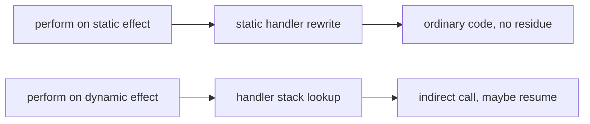
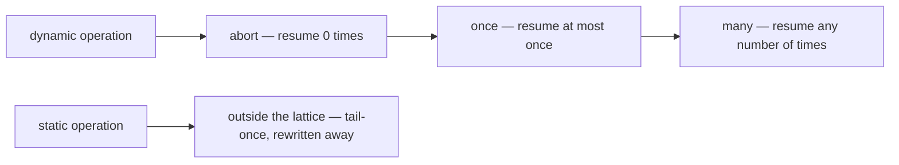

# Staged Effects

**Status: prototype landed, surface not final.** A working prototype
implements [STAGE-DECL], [STAGE-HANDLE-STATIC], the four static-handler
obligations, [STAGE-LOWER], [STAGE-RESIDUE] and [STAGE-SIGNALS-DIRTY] in the
Default and ML flavors (`crates/osprey-ast/src/stage.rs` and `lower_static.rs`), and the
[falsification gate](#falsification-gates--stage-falsify) has been run and
passed. Both flavors also implement kernel regions and explicit instantiated
signal identities. Remaining work includes the full staged-suite ML twin,
rewrite hygiene and validation, dependencies derived from resolved rows,
instantiation-keyed rewriting, and device dialects, tracked in
[plan 0024](../plans/0024-staged-effects.md). This spec extends
[0017-AlgebraicEffects.md](0017-AlgebraicEffects.md); it does not replace it,
and every program that compiles today keeps its meaning
([STAGE-COMPAT](#compatibility--stage-compat)).

The second axis, multiplicity (`[MULTI-*]` and `[MULTI-WASM]`), is specified
here rather than in a document of its own because
[MULTI-STAGE](#relation-to-stage--multi-stage) makes the two axes one
declaration answering two questions, and splitting them would put half of an
effect's declaration surface in each of two files.

Multiplicity declarations and static checks ship in both flavors. The runtime
still rejects `abort` and `many` handlers; safe abandonment, reusable
continuations, and tracing remain tracked in [plan 0028](../plans/0028-resumption-multiplicity.md).

The key words `MUST`, `MUST NOT`, `SHOULD`, and `MAY` are to be interpreted as
described by BCP 14 (RFC 2119 and RFC 8174) when they appear in capitals.

An effect already says *what* a function needs from the outside world without
saying *who* provides it. This document adds two more things to that
declaration: **when the request gets answered**, and **how many times.**

Some requests can be answered by the compiler before the program ever runs, so
nothing is left at runtime — no lookup, no continuation, no allocation. Others
have to stay flexible until runtime, because only the running program knows the
answer. Osprey today treats both the same way. Writing the difference down
turns four separate hard problems into one mechanism:

- **GPU.** Code whose requests are all answered early is exactly the code that
  is safe to run on a graphics card. "Can this be a kernel?" stops being a
  guess about whether the optimiser got lucky and becomes a question the
  compiler answers yes or no, naming the offending operation
  ([STAGE-GPU-LEGAL](#gpu-legality--stage-gpu-legal)).
- **WebAssembly.** Requests answered early need no stack switching, so they
  need nothing the browser does not already have
  ([STAGE-WASM](#webassembly--stage-wasm)).
- **User interfaces.** A function's effect row already lists exactly which data
  it reads. That list *is* the set of things whose change should redraw it — no
  dependency arrays, no forgotten dependency
  ([STAGE-SIGNALS](#reactive-signals--stage-signals)).
- **Compiler pipelines.** A statically answered effect is a compiler pass in
  disguise ([STAGE-DIALECT](#effects-as-dialects--stage-dialect)).

Stage answers *when*, and stops there. What a handler may do with the
continuation — drop it, answer once, answer repeatedly — decides what the
request costs to represent, which targets can run it, and whether re-running
the handled body is safe, and a row that cannot state it leaves all three
unanswerable. So the declaration carries a second axis: **how many times the
request may be answered** ([MULTI-AXIS](#multiplicity--multi-axis)).

## Stage — [STAGE-AXIS]

`[STAGE-AXIS]` Every effect declaration has a **stage**, one of `static` or
`dynamic`. The stage is a property of the *declaration*, so every mention of
that effect in every row carries it, and a row's stage content is readable from
a function's type alone without inspecting any handler.

```typediagram
typeDiagram
alias EffectName = String
alias OperationName = String
union Stage {
  Static { dischargedBy: String }
  Dynamic { dischargedBy: String }
}
union Multiplicity { Abort {} Once {} Many {} }
type OpDecl { name: OperationName multiplicity: Multiplicity replayable: Bool }
type EffectDecl { name: EffectName stage: Stage operations: List<OpDecl> }
type RowEntry { effect: EffectName arguments: List<String> stage: Stage }
type EffectRow { entries: List<RowEntry> }
type StageSplit { staticPart: EffectRow dynamicPart: EffectRow }
```

`dynamic` is the default and describes exactly what Osprey does today: the
handler is found at runtime through the handler stack, an arm may capture the
rest of the computation with `resume`, and the operation costs a lookup and an
indirect call.

`static` is the new stage. A static effect's operations never reach the
runtime: the compiler rewrites them away, and a program in which one survives
to code generation is a compiler defect, not a slow program
([STAGE-RESIDUE](#zero-residue--stage-residue)).



## Declaring a stage — [STAGE-DECL]

`[STAGE-DECL]` The `effect` declaration form of
[0017](0017-AlgebraicEffects.md) gains an optional leading `static`. An
undecorated `effect` is dynamic.

```ebnf
effectDecl ::= docComment? "static"? "effect" IDENT ("<" typeParamList ">")? "{" opDecl* "}"
```

```osprey
static effect Parallel {
    forEach: fn(int, fn(int) -> Unit) -> Unit
}

effect Log {
    write: fn(string) -> Unit
}
```

```osprey-ml
static effect Parallel
    forEach : (int, int => Unit) => Unit

effect Log
    write : string => Unit
```

Generic effects keep the instantiation-specific behaviour of
[EFFECTS-GENERIC-INSTANTIATION](0017-AlgebraicEffects.md#generic-effects):
`Signal<Count>` and `Signal<Cursor>` are distinct row entries, distinctly
discharged. Stage is declared once, on the generic declaration, and every
instantiation shares it.

## Static handlers — [STAGE-HANDLE-STATIC]

`[STAGE-HANDLE-STATIC]` A handler region is marked static by writing `static`
after `handle`. A static handler may only handle a static effect, and a static
effect may only be handled by a static handler.

```ebnf
handlerExpr ::= "handle" "static"? IDENT handlerArm+ "in" expr
```

```osprey
let total = handle static Parallel
    forEach n body => rangeApply(n, body)
do sumOfSquares(1000)
```

A static handler is a **rewriting rule**, not a value. Its arms are inlined
into the operation sites they answer, the operation disappears, and the
resulting code is indistinguishable from code that never used an effect. Four
obligations make that rewrite sound; each is checked, and each fails with a
message naming the arm.

`[STAGE-STATIC-TOTAL]` **Total coverage.** A static handler must supply an arm
for every operation of the effect it handles. Partial static handlers are
rejected, because a residual operation has nowhere left to go.

> `static handler for Parallel does not cover operation Parallel.barrier`

`[STAGE-STATIC-TAIL]` **Tail-resumptive only.** An arm may not capture a
continuation. `resume` is permitted only in tail position, where it is
equivalent to the arm returning the operation's result and is compiled as a
plain call. Any other `resume` — a value used after resuming, a resume inside a
branch that continues afterwards — belongs to a dynamic handler.

> `static handler arm Parallel.forEach resumes outside tail position; static`
> `handlers cannot capture a continuation`

`[STAGE-STATIC-MONOTONE]` **Stage monotonicity.** A static handler arm's body
may require static effects only. Answering a compile-time request by making a
runtime request would reintroduce the residue the stage exists to remove.

> `static handler arm Alloc.alloc requires dynamic effect Log.write; static`
> `handler arms may require only static effects`

`[STAGE-STATIC-FINITE]` **Finite unfolding.** Rewriting runs to a fixpoint
under a step bound. Exceeding it is a compile error naming the operation, never
a hang and never a silent fallback to dynamic dispatch.

> `static discharge of Tensor.matmul exceeded the rewrite bound (N steps)`

Handler-owned state ([EFFECTS-HANDLER-STATE](0017-AlgebraicEffects.md#handler-owned-state))
is available to a static handler and is subject to the same rules: a `mut` cell
captured by a static arm is a compile-time-resolved binding when the rewrite
can see every write, and a static handler that would need a heap cell surviving
the rewrite is rejected under [STAGE-STATIC-MONOTONE].

## Rows and discharge — [STAGE-ROW]

`[STAGE-ROW]` Row syntax is unchanged. Because stage is declaration-determined,
`!Parallel` is already a static entry and `!Log` is already a dynamic one, and
the checker splits any row into its static and dynamic parts without extra
annotation.

```osprey
fn shade(px) -> int ![Parallel, Alloc] = ...      // wholly static row
fn report(px) -> int ![Parallel, Log] = ...        // mixed row
```

`[STAGE-ROW-DISCHARGE]` Discharge is otherwise exactly
[EFFECTS-STATIC-DISCHARGE](0017-AlgebraicEffects.md#effectful-function-types):
operation- and instantiation-specific, propagated through helpers, lambdas and
fibers, and required to be empty at program entry. Stage adds one rule: a
static entry may be discharged only by a static handler, and a dynamic entry
only by a dynamic one. There is no implicit promotion in either direction.

The name `[EFFECTS-STATIC-DISCHARGE]` in 0017 refers to *compile-time
checking* of discharge, which applies to both stages. It is unrelated to the
`static` stage introduced here, which additionally requires compile-time
*elimination*. The two are deliberately kept distinct: today's checker proves a
handler exists; a static handler proves no handler is needed at runtime.

## Handlers are lowering passes — [STAGE-LOWER]

`[STAGE-LOWER]` A static handler region is normatively a rewrite over the
canonical AST both flavors lower to
([FLAVOR-BOUNDARY](0023-LanguageFlavors.md#canonical-ast-boundary)). Every
`perform` of the handled effect is replaced by the corresponding arm body with
the operation's arguments substituted for the arm's parameters and the rest of
the computation substituted for a tail `resume`.

`[STAGE-LOWER-ORDER-PHASE]` The rewrite runs **at the flavor boundary**, where
every surface already converges on one canonical program — so it precedes type
checking, code generation, the language server and project assembly alike, and
no consumer can receive an undischarged program. This ordering is load-bearing,
not an implementation convenience: it
is the single reason four separate features need no separate machinery. A
kernel body reaches [GPU-KERNEL-PURE](0034-GPUComputation.md#kernel-purity--gpu-kernel-pure)
with an already-empty row, so the existing purity gate *is* the stage-legality
gate; a `wasm32` build never sees an operation that would need a continuation;
and a function used in both worlds ([STAGE-POLY](#stage-polymorphism--stage-poly))
is checked at each call site after erasure, so no inference over stages is
required. Type errors inside a static arm are reported against the substituted
code, which is the cost of the ordering and is accepted.

`[STAGE-LOWER-ORDER]` Nesting order is pass order. Given nested static
handlers, the innermost region is rewritten first, and its output is the input
to the enclosing one. This is the only ordering guarantee: two static handlers
for disjoint effects at the same nesting level commute, and the compiler may
apply them in either order.

`[STAGE-LOWER-DYNAMIC]` A static rewrite never crosses a dynamic handler
boundary in a way that changes observable order. A static region nested inside
a dynamic one is rewritten in place; the dynamic region's semantics are
untouched.

## Zero residue — [STAGE-RESIDUE]

`[STAGE-RESIDUE]` After static rewriting reaches its fixpoint, the program
contains no `perform` of any static effect and code generation emits no handler
registration for one. Concretely, for a static effect `E`, the emitted LLVM IR
contains no `__osprey_handler_push` or `__osprey_handler_lookup` naming `E` and
no `E` arm thunk. This is an observable, testable property, and it is the
acceptance criterion for the stage rather than a performance aspiration.

The corollary is the cost model users are entitled to rely on: **a static
effect is free.** Not "usually optimised away" — absent.

## Effects as dialects — [STAGE-DIALECT]

[MLIR](https://mlir.llvm.org/) is an LLVM subproject for building compilers out
of **dialects** — named sets of operations at whatever abstraction level suits
the problem — and **progressive lowering**, a pipeline of passes that each
rewrite one dialect into a more concrete one until only machine-level
operations remain. Mojo, Triton and IREE are built on it.

`[STAGE-DIALECT]` The correspondence between that architecture and effect
handlers is exact, and it is the reason one mechanism covers both jobs:

| Osprey | MLIR |
| --- | --- |
| Effect declaration | Dialect |
| Operation in an effect | Operation in a dialect |
| Effect row of a function | Set of dialects the body is written in |
| Static handler region | Conversion / lowering pass |
| [STAGE-STATIC-TOTAL] coverage | Full conversion — every source op has a pattern |
| [STAGE-RESIDUE] | Target legality — no illegal op survives |
| [STAGE-LOWER-ORDER] | Pass pipeline order |
| Dynamic handler | An op that stays, interpreted at runtime |

`[STAGE-DIALECT-INDEPENDENT]` The correspondence is between *designs*. Osprey
does not use MLIR: it emits textual LLVM IR and hands it to clang, and static
discharge is an Osprey-language rewrite over its own canonical AST. That is a
deliberate choice with stated reasons and stated conditions for revisiting it,
recorded in [plan 0024](../plans/0024-staged-effects.md#decision--why-osprey-does-not-use-mlir-today);
whether a *device* path is eventually built on MLIR's `gpu`/`nvgpu`/`nvvm`
stack remains the separate open decision at
[plan 0023](../plans/0023-gpu-computation.md) stage 4. This spec settles
neither.

What the correspondence buys either way is the part that matters to a user:
`Parallel`, `Tensor` and `Alloc` are declared once, in the language, and the
passes that give them meaning are handlers a user can read, replace and test —
not compiler internals a user can only accept.

`[STAGE-DIALECT-PORTABLE]` A conforming implementation may discharge static
handlers by any means that respects this document — including a dialect
conversion pipeline. The four obligations are what make that possible (total
coverage is full conversion, [STAGE-RESIDUE] is target legality,
tail-resumptiveness is what makes an arm expressible as a rewrite pattern), so
no rule here may be tightened in a way that forecloses one.

## GPU legality — [STAGE-GPU-LEGAL]

`[STAGE-GPU-LEGAL]` A function is **GPU-legal** when the dynamic part of its
effect row is empty and every entry of the static part is discharged by a
static handler in scope at the offload boundary.

This generalizes [GPU-KERNEL-PURE](0034-GPUComputation.md#kernel-purity--gpu-kernel-pure),
whose rule is the empty row — the special case where the static part is empty
too. Every kernel accepted today remains accepted, and kernels that allocate,
index a tensor or spawn parallel work become expressible without weakening the
proof, because those requests are answered before the kernel runs.

`[STAGE-GPU-KERNEL]` `kernel` is not a magic block. It is a handler region
whose signature admits only rows satisfying [STAGE-GPU-LEGAL], supplying the
static handlers for the device dialects — `Parallel`, `Alloc`, `Tensor` — that
its body is allowed to use.

Each arm names its effect, because one region answers several dialects where a
`handle` answers exactly one; the region closes with `in`, as every handler
region does.

```osprey
let frame = kernel
    Parallel forEach n body => deviceGrid(n, body)
    Alloc scratch bytes => deviceShared(bytes)
in gpuMap(pixels, shade)
```

`[STAGE-GPU-DIAG]` A body that is not stage-legal is rejected at the `kernel`
boundary, naming the operations that forced the rejection. The existing
fail-closed message for an unprovable kernel is retained for the case where the
checker cannot see a function value's provenance; stage adds the case where it
can see it and the answer is no.

> `kernel body is not stage-legal; it requires dynamic effects: Log.write`

## WebAssembly — [STAGE-WASM]

`[STAGE-WASM]` Static handlers require no stack switching, so they are
available on every target, including `wasm32`. This closes most of the gap
recorded in [0022-WebAssemblyTarget.md](0022-WebAssemblyTarget.md) and
[EFFECTS-RESUME](0017-AlgebraicEffects.md#resuming-handlers): today WebAssembly
supports direct value-substitution handlers but not the pthread-backed
continuation runtime, so effects that pause and continue work are native-only.

Under staging that limitation becomes a stage boundary rather than a target
boundary. Code whose rows are static compiles to WebAssembly with the same code
generation as native — nothing is deferred to the stack-switching proposal.
Dynamic handlers remain the marked slow path, and a program that needs one on
`wasm32` is rejected with the effect and operation named, exactly as an
unhandled effect is today.

### Multiplicity on wasm32 — [MULTI-WASM]

`[MULTI-WASM]` The WebAssembly stack-switching proposal specifies **one-shot**
continuations only; multi-shot is out of its scope and no path exists by which
`wasm32` acquires it. Multiplicity states that boundary in the row, so a
`wasm32` build decides it from a function's type:

- static and `abort` operations compile, as [STAGE-WASM] already provides —
  neither needs a continuation;
- `once` operations MUST be rejected at compile time with the operation named,
  replacing the `__osprey_coro_*` link failure that
  [WASM-TARGET-EFFECTS](0022-WebAssemblyTarget.md#effect-support-wasm-target-effects)
  records, and become accepted when stack switching is available with no change
  to user code;
- `many` operations MUST be rejected permanently, and the diagnostic MUST say
  so rather than deferring to the target's eventual capabilities.

> `Choice.pick is declared many; multi-shot resumption is not available on`
> `wasm32`

Without multiplicity the arrival of stack switching makes *some* dynamic
effects work on WebAssembly and leaves the rest failing, with the row unable to
say which.

## Reactive signals — [STAGE-SIGNALS]

`[STAGE-SIGNALS]` A reactive value is a generic static effect. Reading it is an
operation; the reactive runtime is a static handler; because that handler is
tail-resumptive, a read compiles to a plain call with nothing captured.

```osprey
type Count { value: int }

static effect Signal<T> {
    read: fn() -> T
}

fn counterLabel() -> string !Signal<Count> = {
    let c = perform Signal<Count>.read()
    "Count: ${c.value}"
}
```

The cost story is real but it is not the point. The point is the row:

`[STAGE-SIGNALS-DIRTY]` The **dependency set** of a computation is the
`Signal<_>` entries of its effect row, and it is exact — the compiler derives
it from the same propagation that already reaches through helpers, lambdas
passed to higher-order functions and fibers. A view function cannot read a
signal it did not declare, and cannot declare one it does not read, because
both are compile errors under
[EFFECTS-STATIC-DISCHARGE](0017-AlgebraicEffects.md#effectful-function-types).
There is no dependency array to keep in sync, no runtime read-tracking, and no
class of bug where a stale value is rendered because a dependency was
forgotten.

`[STAGE-SIGNALS-EXACT]` Exactness holds under stated conditions, and the
compiler must report when they do not hold rather than silently over- or
under-approximating:

- Signal identity is the generic instantiation. `Signal<Count>` and
  `Signal<Cursor>` are distinct dependencies; two signals sharing one payload
  type are one dependency, so a distinct type per signal is the surface
  contract until a dedicated declaration form exists.
- A signal selected at runtime (an index into a collection of signals) widens
  to the whole collection. The widening is reported, not hidden.
- A row variable that is not yet instantiated has no dependency set. The
  dependency set of a stage-polymorphic function is known at each call site,
  not at its definition.
- **Where an instantiation may be written.** A written instantiation *is* the
  identity, so only a `static effect` may carry one at a request or a handler:
  `perform Signal<Count>.read()` and `handle Signal<Count>` name a static
  effect. A **dynamic** effect takes its instantiation from inference and both
  its mention forms omit the arguments — `perform Signal.read()` and
  `handle Signal` — because a runtime handler is installed under a key the
  source did not write. A **row** is the exception in the other direction: it
  states a type, not a mention, so `!Signal<int>` and `![Read<T>, Write<T>]`
  pin their arguments in either stage.

  ```osprey
  effect Stash<T> { take: fn() -> T }

  // Accepted — the row pins, the mentions infer.
  fn held() !Stash<int> = perform Stash.take()
  fn main() = print("${handle Stash take => 9 do held()}")

  // Rejected — `Stash` is dynamic, so neither mention may write `<int>`:
  //   perform Stash<int>.take()
  //   handle Stash<int> take => 9 do ...
  ```

  That a runtime handler key happens to be mangled per instantiation does not
  license the written form: the key is an implementation of the identity, not a
  second way to spell it. Declare `static effect Stash` when the program needs
  to name one instantiation apart from another.

`[STAGE-SIGNALS-REBUILD]` A UI framework consuming this uses the dependency set
as its dirty set directly: when a signal changes, the subtrees to rebuild are
exactly those whose rows contain that signal's instantiation. Nothing in this
spec requires such a framework to exist; what it requires is that the set be
derivable, exact and reportable through the language server so a developer can
see which signals a widget depends on.

## Per-region backends — [STAGE-BACKEND]

`[STAGE-BACKEND]` Because a static handler region is a delimited unit with a
known residual row, backend selection can be a property of a region rather than
of a build. The intended end state is a fast backend for the development loop,
LLVM for release and a device pipeline for kernel regions, chosen per region
and mixed within one program.

This section is the weakest-supported in this document and is marked as such:
Osprey has exactly one backend today (textual LLVM IR handed to clang, with
`wasm32` as a sibling link driver). Per-region selection is contingent on a
second backend existing at all and on kernel extraction landing
([plan 0023](../plans/0023-gpu-computation.md) stage 3). It is recorded here
because staging is what makes it *expressible*, not because it is scheduled.

## Stage polymorphism — [STAGE-POLY]

`[STAGE-POLY]` The load-bearing question is whether one `map` can serve a
kernel and an effectful host context. Under
[STAGE-AXIS](#stage--stage-axis) it can, and it needs no new mechanism: stage
is determined by the effect in the row, so a function that is polymorphic in
its row is automatically polymorphic in stage.

```osprey
fn map(xs, f) = ...        // row of the result is the row of f
```

Instantiated with a static `f`, `map`'s row is static and the call is
GPU-legal; instantiated with a dynamic `f`, it is an ordinary effectful call.
One definition, both worlds, no annotation.

`[STAGE-POLY-ERASURE]` **This costs nothing and was the prototype's main
finding.** Because the rewrite runs before inference
([STAGE-LOWER-ORDER-PHASE](#handlers-are-lowering-passes--stage-lower)), the
checker never sees a function at two stages. It sees the static instantiation
with an empty row and the dynamic instantiation with its ordinary row, and
type-checks each the way it already type-checks any higher-order call. No stage
variable is inferred because no stage survives to be inferred.

The measured result is `tests/regressions/effects/staged_shared.test.osp`: one
unannotated `fn twice(f, x) = f(f(x))`, applied to a callback performing a
static effect and to a callback performing a dynamic one, in the same program.
It compiles and runs. The static call leaves no residue; the dynamic call
dispatches through the handler stack as it always has.

`[STAGE-POLY-PREREQ]` Open effect rows in the Hindley–Milner function type —
the limitation recorded in
[EFFECTS-STATIC-DISCHARGE](0017-AlgebraicEffects.md#effectful-function-types)
and tracked in [plan 0016](../plans/0016-algebraic-effects-and-handlers.md) —
remain worth having, and they are what a *published* higher-order signature
would need to state its row polymorphism. They are not a prerequisite for
stage polymorphism. Nothing in staging depends on them.

`[STAGE-POLY-PARAMETRIC]` The genuinely open case is one effect usable at
*both* stages — a `Log` that is rewritten away inside a kernel and dispatched
dynamically on the host. That requires a stage variable in the effect
declaration and lands in modal / two-level type theory, adjacent to Effekt's
second-class capabilities and Koka's `fun`/`ctl`/`final ctl` handler kinds,
neither of which treats stage as lowering. **Inference over stage variables is
out of scope.** If the case is admitted at all, it is admitted with an explicit
annotation and no inference, and only after
[STAGE-FALSIFY](#falsification-gates--stage-falsify) shows it is needed.

The same erasure argument carries the second axis with no extra mechanism,
except that multiplicity is read off a row that survives to inference rather
than off one that is rewritten away
([MULTI-STAGE-POLY](#relation-to-stage--multi-stage)).

## Multiplicity — [MULTI-AXIS]

`[MULTI-AXIS]` Every operation of a dynamic effect has a **multiplicity**, one
of `abort`, `once` or `many`. Multiplicity is a property of the operation
declaration, so every mention of that operation in every row carries it, and a
row's multiplicity content is readable from a function's type alone without
inspecting any handler.

Stage says when a request is answered. Multiplicity says **how many times.** A
handler that resumes twice re-runs the remainder of the handled computation, so
a body that sends an email sends it twice; a handler that never resumes ends
the computation where it stands. Those are different programs, they cost
different amounts to represent, and they run on different targets. An effect
row that cannot tell them apart is under-specified.

> **Terminology.** The property is *multiplicity*, not *arity*, which in a
> curried language already names a function's parameter count
> ([FLAVOR-ML-FN](0024-MLFlavorSyntax.md#functions-and-currying)). The
> literature's *one-shot* and *multi-shot* are the `once` and `many` points of
> this axis.

Multiplicity is declared per operation while stage is declared per effect. A
static rewrite consumes a whole dialect and MUST cover every operation
([STAGE-STATIC-TOTAL](#static-handlers--stage-handle-static)); a continuation
belongs to one perform site, and operations within one effect legitimately
differ — `Async.await` resumes once, `Async.cancel` aborts, and neither shape
forces the other. This matches discharge, which is already operation-specific
([EFFECTS-STATIC-DISCHARGE](0017-AlgebraicEffects.md#effectful-function-types)).

The three multiplicities form a lattice ordered by what a handler is permitted
to do with the continuation.



A handler for a `many` operation MAY resume zero, one or several times. A
handler for a `once` operation MAY resume zero times or one — `once` is
**affine**, not linear, because dropping a continuation is always the safe
direction. Osprey already relies on that direction: a branch of an arm that
returns without resuming is the sanctioned early exit
([EFFECTS-HANDLER-ARMS](0017-AlgebraicEffects.md#resuming-handlers)), and it is
how [CANCEL-DELIVERY](0036-StructuredConcurrency.md#delivery-decline-to-resume--cancel-delivery)
delivers cancellation. A handler for an `abort` operation MUST NOT resume.

`[MULTI-AXIS-STATIC]` Static effects sit outside the lattice.
[STAGE-STATIC-TAIL](#static-handlers--stage-handle-static) pins them at
exactly-once-in-tail-position, the one point where a continuation need not
exist. A multiplicity written on a static operation MUST be rejected.

> `multiplicity on static effect Parallel.forEach; static operations are`
> `always tail-resumptive`

## Declaring multiplicity — [MULTI-DECL]

`[MULTI-DECL]` The `opDecl` form of
[0017](0017-AlgebraicEffects.md#effect-declarations) carries an optional
leading multiplicity keyword and an optional `replayable`
([MULTI-REPLAY](#replayability--multi-replay)). An undecorated operation is
`once`.

```ebnf
opDecl ::= docComment? ("abort" | "once" | "many")? "replayable"? IDENT ":" fnType
```

```osprey
effect Fail {
    abort fail: fn(string) -> Unit
}

effect Choice<T> {
    many pick: fn(List<T>) -> T
}

effect Log {
    write: fn(string) -> Unit        // once, by default
}

effect Random {
    replayable next: fn() -> int     // once, and safe to re-run
}
```

```osprey-ml
effect Fail
    abort fail : string => Unit

effect Choice T
    many pick : List<T> => T
```

`[MULTI-DECL-ABORT-RESULT]` An `abort` operation's declared result is never
produced: the `perform` waiting for it never returns. Osprey has no bottom type
([0004](0004-TypeSystem.md)), so the declaration still names a result type and
every perform site is still checked against it; the type is unreachable rather
than absent. `Unit` is the convention. Adding a bottom type so
`abort fail: fn(string) -> Never` can be written is a type-system change and is
out of scope for this document.

`once` is the default because it is the shape of nearly every effect a working
program uses, the shape the runtime already enforces
([EFFECTS-RESUME](0017-AlgebraicEffects.md#resuming-handlers)), the shape
WebAssembly will support ([MULTI-WASM](#multiplicity-on-wasm32--multi-wasm)),
and the shape whose safety condition is trivial. `many` is opt-in because its
safety condition is not.

## Handler obligations — [MULTI-HANDLE]

`[MULTI-HANDLE]` A dynamic handler arm for an operation of multiplicity `m` MAY
use `resume` only as `m` permits. The check is syntactic over the arm's
`resume` sites, in the same family as
[STAGE-STATIC-TAIL](#static-handlers--stage-handle-static), and it fails with a
message naming the arm. It is conservative: an arm the checker cannot prove
conforming MUST be rejected, never deferred to a runtime guard. Runtime
one-shot guards are the fallback for a language that cannot see the arm; Osprey
can see the arm, and the guard in
[`compiler/runtime/effects_coro.c`](../../compiler/runtime/effects_coro.c) is a
defensive backstop in the same sense as the generic handler-key null lookup
([EFFECTS-GENERIC-RUNTIME](0017-AlgebraicEffects.md#generic-effects)) — never
the normal rejection path.

`[MULTI-HANDLE-ABORT]` An arm for an `abort` operation MUST NOT contain
`resume`. Its value answers the whole `handle` region and the `perform` never
returns.

> `handler arm Fail.fail resumes; Fail.fail is declared abort`

`[MULTI-HANDLE-ABORT-MODE]` **The declaration selects the arm's mode, not the
arm's syntax.** Osprey otherwise reads mode from syntax: an arm containing no
`resume` substitutes its value for the *operation's* result and the body runs
on ([EFFECTS-HANDLER-ARMS](0017-AlgebraicEffects.md#resuming-handlers)), which
is tail-once, not zero; abandoning is reachable only from a branch of an arm
that resumes elsewhere. For an operation declared `abort` that reading is
inverted: a `resume`-free arm abandons. Reading mode from the declaration is
the correct direction — a mode read from the wrong scope was
[issue #177](https://github.com/Nimblesite/osprey/issues/177) — and an
operation acquires it only by being declared `abort`. Undeclared operations
keep the syntactic rule unchanged
([MULTI-COMPAT](#compatibility--stage-compat)).

`[MULTI-HANDLE-ONCE]` An arm for a `once` operation MUST use `resume` at most
once on every control path. Two `resume` sites on one path are rejected; two on
*different* branches of a `match` are permitted, which is the shape
`tests/regressions/effects/abort_vs_resume.test.osp` already exercises. Osprey
has no loop construct
([BUILTIN-ITER](0010-LoopConstructsAndFunctionalIterators.md)), so the check is
over `match` branches and calls, and the "resume inside a loop" case other
languages must handle does not arise.

> `handler arm Async.await may resume more than once; Async.await is declared`
> `once`

`[MULTI-HANDLE-MANY]` An arm for a `many` operation MAY use `resume` freely,
subject to [MULTI-REPLAY](#replayability--multi-replay).

`[MULTI-HANDLE-MANY-LEXICAL]` **`many` changes the lexical `resume` rule of
[EFFECTS-RESUME](0017-AlgebraicEffects.md#resuming-handlers).** That rule
rejects `resume` inside a lambda declared in an arm, on the ground that such a
lambda has no live arm continuation. For a `many` arm the ground does not hold,
and the rule MUST be relaxed exactly as far as the ground extends: `resume` is
permitted inside a lambda declared in a `many` arm when that lambda is invoked
**before the arm returns** — passed directly to a higher-order function called
by the arm, never stored, returned or captured by anything that outlives the
arm. A lambda that escapes the arm keeps the existing rejection, because its
continuation is dead by the time it runs.

Without this relaxation `many` has no spelling at all: Osprey has no loop, so
resuming once per alternative can only be written as a callback.

```osprey
// The canonical many arm: one resume per alternative, combined functionally.
// The lambda is consumed by fold before the arm returns, so its continuation
// is live at every call.
handle Choice
    pick options => fold(options, 0, |best, option| => max(best, resume(option)))
do search(board)
```

> `resume inside a lambda that outlives handler arm Choice.pick; the`
> `continuation is not live when the lambda runs`

## Replayability — [MULTI-REPLAY]

A `many` handler that resumes a second time re-executes the remainder of the
handled computation, and every effect that remainder performs is performed
again. For a pure remainder that is the point. For a remainder that writes to a
log, charges a card or sends an email, it is a defect that no effect row today
reports.

`[MULTI-REPLAY]` An operation MAY be declared `replayable`, asserting that
performing it twice with the same arguments in the same handler context is
acceptable to the program. Replayability is declared, never inferred, because
it is a statement about the world outside the program.

`[MULTI-REPLAY-CHECK]` A dynamic handler region whose arm for operation `E.op`
may resume more than once — that is, whose multiplicity is `many` — is legal
only if every entry in the handled expression's effect row, other than the
entries of `E` itself, is replayable. The check runs at the handle site and
names the first offending operation.

> `handler for Choice.pick may resume more than once, but the handled`
> `expression requires non-replayable effect Email.send`

Static entries in the row are replayable. After
[STAGE-LOWER](#handlers-are-lowering-passes--stage-lower) they are ordinary
code, and re-running ordinary code is what
[GPU-KERNEL-PURE](0034-GPUComputation.md#kernel-purity--gpu-kernel-pure)
already assumes is harmless; this reuses that gate rather than duplicating it.
Entries of `E` itself are excluded because they route to the same handler,
whose author is the one writing the multi-shot arm and is therefore already
answerable for what re-performing them means.

`[MULTI-REPLAY-COARSE]` The check uses the row of the whole handled expression,
not the row of the code following each `perform` site. A body that sends an
email *before* the multi-shot operation is rejected even though replay would
never reach the send. This is the cost of reading multiplicity from the row
instead of from control flow, and it is deliberate: the remedy is to move the
non-replayable work outside the handler region, which is also the shape that
makes the program's intent legible. It is the same coarseness the closed-program
operation summary already has
([EFFECTS-STATIC-DISCHARGE](0017-AlgebraicEffects.md#effectful-function-types)).

`[MULTI-REPLAY-STATE]` An arm for a `many` operation MUST NOT capture a mutable
binding ([EFFECTS-HANDLER-STATE](0017-AlgebraicEffects.md#handler-owned-state)).
Handler-owned state is a single shared heap cell, so a second resumption would
observe the writes of the first — the source of most multi-shot bugs in every
system that permits it. Osprey rejects the shape instead, and the sanctioned
way to combine resumptions is the value `resume` already returns: it evaluates
to the handled computation's answer, so an arm folds its alternatives
functionally, as the `[MULTI-HANDLE-MANY-LEXICAL]` example does. This also
settles replay of handler state: `State.set` is not replayable, so a body
performing it under a multi-shot handler is already rejected by
[MULTI-REPLAY-CHECK].

> `handler arm Choice.pick captures mutable binding best; a many arm cannot`
> `own state — combine resumptions through the value resume returns`

`[MULTI-REPLAY-FIBER]` A `many` operation MUST NOT be answered across a fiber
boundary. Rows propagate through fibers
([STAGE-ROW-DISCHARGE](#rows-and-discharge--stage-row)) and multiplicity
propagates with them, but a resuming handler serializes each perform for the
full suspend-to-resume round trip
([EFFECTS-FIBER-PERFORM](0017-AlgebraicEffects.md#resuming-handlers)), and a
second resumption of a continuation that spans a spawned fiber has no
serialization order to belong to. The handle site is rejected, naming the
fiber's perform site.

With these rules the two retry shapes type differently. The first retries one
operation with the surrounding state intact — the thing a composed decorator
cannot do:

```osprey
effect Charge { charge: fn(int) -> int }        // once, by default
effect Email  { send: fn(string) -> Unit }      // once, not replayable

// Accepted. Charge.charge is once, so each perform is answered at most once
// and placeOrder's Email.send runs exactly once whether or not the charge was
// retried. The failing branch abandons the region, which once permits, so it
// answers for the whole handle and placeOrder's result type is string
// ([EFFECTS-HANDLER-ARMS]).
let outcome = handle Charge
    charge amount => match settle(amount) {
        Success { value } => resume(value)
        _                 => match settle(amount) {
            Success { value } => resume(value)
            Error { message } => "declined: ${message}"
        }
    }
do placeOrder(order)
```

The second is what a composed decorator would do, and the compiler says why it
is wrong:

```osprey
// Rejected at the handle site: Choice.pick is many, and placeOrder's row
// contains the non-replayable Email.send.
handle Choice
    pick options => fold(options, 0, |best, option| => max(best, resume(option)))
do placeOrder(order)
```

## Cost model — [MULTI-COST]

`[MULTI-COST]` Multiplicity determines the runtime representation of the
continuation, and a program is entitled to rely on this table the way
[STAGE-RESIDUE](#zero-residue--stage-residue) entitles it to rely on "static is
free."

| Multiplicity | Continuation representation | Cost |
| --- | --- | --- |
| static | none — rewritten away | zero |
| `abort` | none — a non-local exit to the handler frame | no suspension at all |
| `once` | one suspended stack, switched to and never switched back | one switch, no copy |
| `many` | a copyable stack segment or a CPS transform | a copy per additional resume |

`once` is satisfied by a suspended stack switched to and never switched back,
which is what native resume already uses
([EFFECTS-RESUME](0017-AlgebraicEffects.md#resuming-handlers)).

`abort` is the row the declaration buys. An arm's mode is otherwise known only
once its body is read, and an arm that resumes on one branch must be able to
resume on any, so abandoning a region pays for a suspension it then throws
away. An operation declared `abort` is known not to resume before its perform
site is compiled, so that site MUST NOT allocate a continuation at all: a
non-local exit to the handler frame is the whole implementation. Removing work,
not naming a shape, is what earns the keyword.

`many` is the only row requiring a continuation that can be re-entered, so it
requires a representation a single suspended stack cannot provide — a copyable
segment or a CPS transform. Reading multiplicity from the declaration is what
confines that cost to `many`: without it every dynamic effect must be
represented pessimistically, because nothing distinguishes the rows.

`[MULTI-COST-ABORT]` A dropped continuation MUST run the `finally` arm of every
handler region it unwinds through
([CANCEL-FINALLY](0036-StructuredConcurrency.md#finalizers--cancel-finally))
and MUST release the heap operands owned by the frames it discards. `once`
being affine means any `once` handler may drop a continuation, not only an
`abort` one, so the obligation covers the ordinary case rather than an exotic
corner, and it holds however the drop arose — an early-exit branch, a
cancellation, or an `abort` operation. Discarding a continuation is not a
licence to discard what its frames own.

## Effect trace — [MULTI-TRACE]

`[MULTI-TRACE]` Dynamic handlers are lexically installed, so the handler
answering each `perform` site is known at compile time. A captured continuation
carries a record of the perform sites it has passed through — a linked list of
static site identifiers, one word per hop.

The runtime exposes that record as an **effect trace** alongside the physical
stack: performed at *site*, handled at *region*, resumed *n* times. For `once`
and `abort` continuations the trace is a straight line. For `many` it is the
only stack corresponding to what the programmer wrote, because the physical
stack after a second resume describes a control path no source line expresses.
Static perform sites are absent from the trace because they are absent from the
program ([STAGE-RESIDUE](#zero-residue--stage-residue)).

The trace MUST be derivable and reportable — through
[DEBUGGER-EFFECT-TRACE](0021-Debugger.md#effect-trace-debugger-effect-trace)
for a paused program and through
[LSP-EFFECT-MULTIPLICITY](0020-LanguageServerAndEditors.md#find-implementations-lsp-implementations-effect-handlers)
for a static one — so a developer can see which perform sites feed a `many`
handler. Whether a debugger consumes it is that tool's choice; deriving it is
not.

## Relation to stage — [MULTI-STAGE]

`[MULTI-STAGE]` Stage and multiplicity are orthogonal axes on one declaration.
Static fixes multiplicity at tail-once and admits no annotation; dynamic
carries the full lattice. The two meet at one diagnostic. A dynamic handler
that covers every operation ([STAGE-STATIC-TOTAL]), whose arms require only
static effects ([STAGE-STATIC-MONOTONE]) and resume only in tail position
([STAGE-STATIC-TAIL]) over operations declared `once`, has met every obligation
a static handler carries and asked for none of them.
[STAGE-ROW-DISCHARGE](#rows-and-discharge--stage-row) forbids implicit
promotion, and this section does not weaken it. What it permits is a
language-server hint:

> `handler for Log is tail-resumptive on every arm; declaring Log static would`
> `remove it from the runtime`

`[MULTI-STAGE-POLY]` Multiplicity inherits the erasure result of
[STAGE-POLY-ERASURE](#stage-polymorphism--stage-poly). Because multiplicity is
read from the declaration, a row-polymorphic function such as `map` is
multiplicity-polymorphic without annotation: instantiated with a `many`
callback its row carries a `many` entry, and any enclosing multi-shot handler
is checked at that instantiation. No multiplicity variable is inferred because
no multiplicity survives to be inferred. Unlike stage, multiplicity is not
erased by a rewrite — a dynamic entry reaches inference intact — so the check
runs on the row the checker already builds rather than before it.

`[MULTI-STAGE-TURN]` A `many` arm's turn spans every resumption. A handler
region is an implicit monitor whose turn ends when the arm returns
([SERIAL-TURN](0036-StructuredConcurrency.md#the-handler-is-the-monitor--serial-turn)),
and an arm that resumes several times has not returned between resumptions, so
the region holds its turn across all of them. This follows from the existing
definition; it is stated because multi-shot resumption is the case in which a
reader is most likely to expect otherwise.

## Compatibility — [STAGE-COMPAT]

`[STAGE-COMPAT]` `effect` without `static` is dynamic, `handle` without
`static` is dynamic, and both mean exactly what they mean today. No existing
program changes meaning, no existing diagnostic changes wording, and the
differential corpus stays byte-exact under every memory backend and on
`wasm32`. Staging is additive surface: a program that never writes `static`
never encounters any rule in that half of this document.

`[MULTI-COMPAT]` An operation without a multiplicity keyword is `once`, which
is what the runtime enforces, so no running program changes meaning.
Multiplicity narrows in exactly one place: a program that resumes one
continuation twice from an undecorated operation aborts at runtime now and MUST
fail [MULTI-HANDLE-ONCE] at compile time instead — the same program rejected
earlier, not a program that stops working. Making it compile means declaring
the operation `many`. Two rules change a meaning rather than a verdict, and
each applies only to a declaration that opts in:
[MULTI-HANDLE-ABORT-MODE](#handler-obligations--multi-handle) to an operation
declared `abort`, and
[MULTI-HANDLE-MANY-LEXICAL](#handler-obligations--multi-handle) to an arm for
one declared `many`. A program that writes none of `abort`, `many` or
`replayable`, and never resumes twice, encounters no rule in this axis.

The narrowing is the correct default. A program that resumes twice without
saying so is the program this axis exists to catch.

## Falsification gates — [STAGE-FALSIFY]

`[STAGE-FALSIFY]` Three programs decide whether the stage axis survives, and
they are written **before** any implementation work begins:

1. A reactive counter — a view function whose dependency set the compiler
   derives, and a rebuild driven by that set.
2. A matmul kernel — a `kernel` region using `Parallel`, `Alloc` and `Tensor`,
   accepted under [STAGE-GPU-LEGAL] and rejected when a `Log.write` is added.
3. A function used by both — the shared `map` of [STAGE-POLY].

If (3) cannot be typed without inference over stage variables, the design has
hit its wall and this spec is wrong in a way worth knowing early. The gate is
normative: the plan may not proceed past its first stage until all three are
written and their outcome recorded.

`[MULTI-FALSIFY]` Four more programs decide the multiplicity axis, under the
same rule — written before implementation, outcome recorded:

1. **Single-op retry.** A `Charge.charge` handler that retries on failure, over
   a body that also performs `Email.send`. Must be accepted, and the email must
   be sent exactly once when the retry succeeds.
2. **Backtracking over impure code.** A `Choice.pick` handler enumerating
   alternatives over that same body. Must be rejected at the handle site,
   naming `Email.send`.
3. **Backtracking over pure code.** The same `Choice.pick` handler over a body
   whose only other effects are `Random.next` (declared `replayable`) and
   static entries. Must be accepted and must produce every alternative. It
   exercises [MULTI-HANDLE-MANY-LEXICAL] and the multi-shot continuation
   [MULTI-COST] requires, so it is the gate's real cost.
4. **Shared `map`.** One unannotated `fn map(xs, f)` applied to a `once`
   callback under a `once` handler and a `many` callback under a `many`
   handler, in the same program. Must compile with no multiplicity annotation
   on `map` — the multiplicity twin of
   `tests/regressions/effects/staged_shared.test.osp`.

If (2) cannot be rejected without control-flow analysis finer than the row —
that is, if [MULTI-REPLAY-COARSE] rejects enough real code that the check would
routinely be turned off — the axis has hit its wall and this spec is wrong in a
way worth knowing early. The gate is normative on the same terms as
[STAGE-FALSIFY]: stage 7 may not proceed until all four are written and their
outcome recorded.

## References — [STAGE-RESEARCH]

- Leijen. *Koka: Programming with Row-Polymorphic Effect Types.* MSFP 2014.
  <https://arxiv.org/abs/1406.2061> — the row discipline
  [STAGE-ROW](#rows-and-discharge--stage-row) extends; `fun`/`ctl`/`final ctl`
  are the nearest existing handler-kind distinction to [STAGE-STATIC-TAIL].
- Leijen. *Type Directed Compilation of Row-Typed Algebraic Effects.* POPL
  2017. <https://doi.org/10.1145/3009837.3009872> — compiling handlers by
  type-directed rewriting, the mechanism [STAGE-LOWER] adopts; Koka's
  `fun`/`ctl`/`final ctl` handler kinds are the nearest existing distinction to
  the multiplicity lattice, and its linear effects the nearest to
  [MULTI-REPLAY].
- Dolan, Eliopoulos, Hillerström, Madhavapeddy, Sivaramakrishnan, White.
  *Concurrent System Programming with Effect Handlers.* TFP 2017.
  <https://doi.org/10.1007/978-3-319-89719-6_6> — one-shot continuations as the
  pragmatic default, and the affine discipline [MULTI-HANDLE-ONCE] adopts.
- Brachthäuser, Schuster, Ostermann. *Effects as Capabilities: Effect Handlers
  and Lightweight Effect Polymorphism* (Effekt). OOPSLA 2020.
  <https://doi.org/10.1145/3428194> — second-class capabilities, the closest
  existing answer to "which handlers need no runtime representation."
- Xie, Cong, Li, et al. *Compiling Effect Handlers in Capability-Passing
  Style.* ICFP 2020. <https://doi.org/10.1145/3408975> — evidence passing and
  the conditions under which a handler compiles to a direct call, and under
  which a one-shot continuation needs no copy ([MULTI-COST]).
- Xie et al. *Parallel Algebraic Effect Handlers.* ICFP 2024.
  <https://dl.acm.org/toc/pacmpl/2024/8/ICFP> — which handler shapes commute
  with parallel evaluation; governs any relaxation of [STAGE-GPU-LEGAL].
- Paszke et al. *Getting to the Point* (Dex). ICFP 2021.
  <https://arxiv.org/abs/2104.05372> — parallelism-preserving versus
  parallelism-destroying effects, the precedent for typing offload legality.
- Lattner et al. *MLIR: Scaling Compiler Infrastructure for Domain Specific
  Computation.* CGO 2021. <https://doi.org/10.1109/CGO51591.2021.9370308> —
  progressive lowering and dialect conversion, the correspondence in
  [STAGE-DIALECT].
- Taha, Sheard. *MetaML and Multi-stage Programming with Explicit
  Annotations.* TCS 2000. <https://doi.org/10.1016/S0304-3975(00)00053-0> —
  stage as an explicit type-level annotation, and the reason
  [STAGE-POLY-PARAMETRIC] keeps inference out of scope.
- WebAssembly stack switching proposal.
  <https://github.com/WebAssembly/stack-switching> — the dependency
  [STAGE-WASM] removes for static rows, and one-shot only, which is the basis
  for [MULTI-WASM].
