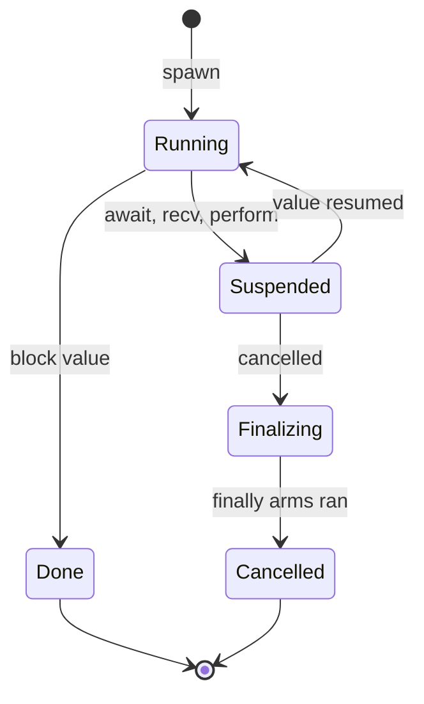
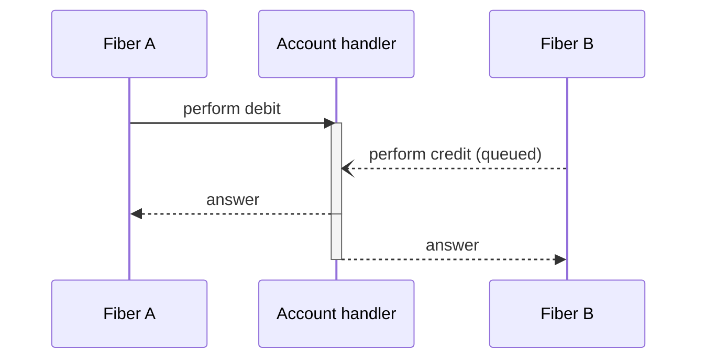

# Structured Concurrency: Cancellation and Turn Isolation

This specification defines scheduling, scopes and cancellation. [Algebraic Effects](0017-AlgebraicEffects.md) defines operation modes, continuation ownership, replay and finalization. Implementation status belongs in [plan 0026](../plans/0026-structured-concurrency.md); basic fiber operations are defined in [Fibers and Concurrency](0011-LightweightFibersAndConcurrency.md).

The key words `MUST`, `MUST NOT`, `SHOULD`, and `MAY` are to be interpreted as
described by BCP 14 (RFC 2119 and RFC 8174) when they appear in capitals. A
feature is not implemented merely because this document specifies it.

## One mechanism

Scopes own concurrent work. Cancellation abandons suspended work with cleanup. Turns serialize access to handler-owned state, and transactions compose several operations. These use the ownership and effect contracts in [Algebraic Effects](0017-AlgebraicEffects.md).

## Part 1 — Scopes and cancellation

### Research basis — [CANCEL-RESEARCH]

Every rule below traces to published work; the [References](#references)
section holds the full citations.

| Decision | Source |
| --- | --- |
| Fibers are owned by a lexical scope; no fiber outlives its scope | Structured concurrency: Smith 2018 (Trio nurseries), Sústrik 2016, Kotlin coroutine scopes (Elizarov et al. 2021), Java `StructuredTaskScope` (JEP 505 preview line), OCaml Eio switches |
| Cancellation is an effect-handler action: drop the continuation, run finalizers | Leijen, TyDe 2017; Ahman & Pretnar, POPL 2021 (interrupts as asynchronous effects) |
| Cancellation lands only at suspension points; pure code is uninterruptible | The inverse of Haskell's asynchronous exceptions (Marlow et al., PLDI 2001), whose "interruptible anywhere, opt out with `mask`" default is this design's cautionary tale |
| Cleanup runs as handler finalization, shielded from further cancellation | Leijen 2018 (deep finalization / Koka `finally`); Trio and Eio shielding |
| Cancelling a client must never corrupt a shared abstraction | Flatt & Findler, PLDI 2004 (kill-safety) |
| Cancellation is not catchable, only finalizable | Kotlin's swallowed-`CancellationException` bug class, deliberately made unrepresentable |

### Scopes own fibers — [CANCEL-SCOPE]

```ebnf
scopeExpr ::= "scope" blockExpr
```

`scope { ... }` evaluates its block with a new fiber scope installed. Every
`spawn` attaches its fiber to the innermost enclosing scope. The scope
expression's value is its block's value, and its type is the block's type —
a scope adds no wrapper.

- **Normal exit:** the scope MUST wait for every child fiber to complete
  before the scope expression produces its value. Work cannot leak past the
  expression that created it.
- **Unwinding exit** (the enclosing fiber is itself cancelled): the scope
  MUST cancel every child, then wait for their finalizers, then continue
  unwinding.
- A `spawn` outside any explicit scope attaches to the **root scope** that
  implicitly encloses program entry. The teardown rule in
  [CONCURRENCY-SPAWN-AWAIT](0011-LightweightFibersAndConcurrency.md#spawn-and-await-concurrency-spawn-await)
  becomes the root scope's normal exit.

```osprey
fn both(u1, u2) = scope {
    let a = spawn fetch(u1)
    let b = spawn fetch(u2)
    "${await(a)} and ${await(b)}"
}
```

```osprey-ml
both u1 u2 = scope
    a = spawn (fetch u1)
    b = spawn (fetch u2)
    "${await a} and ${await b}"
```

### Requesting cancellation — [CANCEL-REQUEST]

`cancel(fiber: Fiber<T>) -> Unit` requests cancellation of one fiber and,
transitively, of every fiber in the scopes it created. The request is
asynchronous and idempotent: it returns immediately, a second request is a
no-op, and cancelling an already completed fiber is a no-op. There is no
handle to the entry fiber, so user code cannot cancel program entry.

```osprey
let answer = scope {
    let ticker = spawn forever(channel)
    let result = compute()
    cancel(ticker)
    result
}
```

Without the `cancel`, this scope's normal exit would wait forever for the
infinite ticker — structured concurrency makes the leak visible at the scope
boundary instead of letting the fiber escape.

### Where cancellation lands — [CANCEL-POINTS]

A fiber observes cancellation only at suspension points: `await`, `send`, `recv`, `sleep`, `yield`, and control operations that suspend. A value operation may reach suspension points through its arm; its transitive requirements remain visible under the canonical row rules.

Code with no suspending operations cannot be interrupted. Long-running computation can use `yield` to permit cancellation. Backends MUST NOT introduce hidden suspension points. Cleanup shielding follows [CANCEL-FINALLY]; effect masking follows [Algebraic Effects](0017-AlgebraicEffects.md).

### Delivery: decline to resume — [CANCEL-DELIVERY]

When a cancelled fiber reaches or is blocked at a suspension point, the runtime MUST NOT deliver a value into it. It abandons the continuation with the cleanup required by [Algebraic Effects](0017-AlgebraicEffects.md) and cancels child scopes under [CANCEL-SCOPE]. Once cleanup completes, the fiber completes as cancelled.



There is no edge from `Running` to `Finalizing`: cancellation never preempts
executing code. And there is no "catch" state: cancellation is **not a value
and not an exception**. No expression can observe it from inside and decide to
keep running; code can only finalize. This makes the Kotlin bug class of a
swallowed `CancellationException` — a fiber that ignores its own cancellation
— unrepresentable rather than discouraged.

Cancellation abandons the owned continuation under [MULTI-COST-ABORT](0017-AlgebraicEffects.md). It does not change the operation's declared mode or multiplicity. Reusable continuations retain the same ownership and cleanup obligations.

### Finalizers — [CANCEL-FINALLY]

Finalizer syntax, lifetime, ordering and behavior under reusable continuations are defined in [Algebraic Effects](0017-AlgebraicEffects.md). Cancellation requests the same cleanup as other abandonment.

While cleanup runs, the fiber is shielded: further cancellation requests MUST NOT interrupt it, including at its suspension points. Shielding ends with cleanup; pending cancellation then continues unwinding. Finalizers SHOULD NOT spawn work and MUST NOT hide unbounded work from the enclosing scope.

### Observing completion — [CANCEL-JOIN]

`await` keeps its type, `Fiber<T> -> T`. Awaiting a fiber that was cancelled
cannot produce a `T`, so cancellation **propagates along the await edge**: the
awaiter itself unwinds as cancelled. Results flow up; cancellation flows down
and across await edges. At program entry, awaiting a cancelled fiber runs the
entry finalizers and exits the process with a nonzero status and a one-line
diagnostic naming the fiber's spawn site.

To observe instead of propagate, `join` is the firewall:

```osprey
type Outcome<T> = Done { value: T } | Cancelled
```

`join(fiber: Fiber<T>) -> Outcome<T>` blocks like `await` but returns the
outcome as ordinary data, forcing a `match` — cancellation handled the way
Osprey handles every other expected condition, as a case the compiler checks.

### Deadlines and races — [CANCEL-DEADLINE]

Timeouts and races are derived forms — sugar over a scope plus `cancel`,
with no additional runtime authority:

```ebnf
withinExpr ::= "within" "(" expr ")" blockExpr
```

- `within(ms) { ... } -> Result<T, TimedOut>` runs its block in a new scope
  with a deadline. On expiry the runtime cancels the scope's children and the
  block's pending suspension, waits for finalizers, and the expression
  evaluates to the `TimedOut` error value. A timeout is expected failure —
  ordinary data, so `?:` and `match` apply.
- `race(a: Fiber<T>, b: Fiber<T>) -> T` waits for the first fiber to complete
  `Done` and cancels the other. It is specified over the channel-selection
  primitive of [plan 0007](../plans/0007-fiber-select.md) and MUST define
  deterministic-mode tie-breaking with it.

```osprey
let page = within(500) { fetch(url) } ?: cachedPage

let nearest = scope {
    race(spawn probe(mirrorA), spawn probe(mirrorB))
}
```

```osprey-ml
page = (within 500 (fetch url)) ?: cachedPage

nearest = scope
    race (spawn (probe mirrorA)) (spawn (probe mirrorB))
```

### Kill-safety — [CANCEL-KILLSAFE]

Cancelling a fiber MUST NOT corrupt any abstraction it shares (Flatt &
Findler, PLDI 2004):

- A fiber cancelled while blocked in `send` or `recv` is removed from the
  channel's wait queue without consuming, duplicating, or losing an element.
- A fiber cancelled while suspended in a handler **turn** ([SERIAL-TURN])
  whose arm is already running lets the turn complete; the answer is
  discarded and the fiber then unwinds. A fiber cancelled while still queued
  for a turn is dequeued without the arm running. Handler state never
  witnesses a half-turn.
- Captured resources are released according to the canonical [continuation ownership rules](0017-AlgebraicEffects.md), under every memory backend.

## Part 2 — Turn isolation: reentrancy and serialization

### Research basis — [SERIAL-RESEARCH]

| Decision | Source |
| --- | --- |
| Shared state lives behind a handler; access is serialized turns | E-language vats and turns (Miller, Tribble & Shapiro 2005); actor one-message-at-a-time (Hewitt; Erlang; Orleans, Bykov et al. 2011) |
| Waiting cycles are rejected statically | Call-cycle deadlocks in actor/grain systems, including Orleans |
| Reentrant operations are asynchronous self-sends only | Erlang's send-to-self; E's eventual sends |
| Multi-operation composition is transactional, with `retry` | Composable memory transactions (Harris, Marlow, Peyton Jones & Herlihy, PPoPP 2005) |
| Serialization implemented by combining, not mutual exclusion | Flat combining (Hendler, Incze, Shavit & Tzafrir, SPAA 2010); MCS queue locks (Mellor-Crummey & Scott 1991) as the fair fallback; Reagents (Turon, PLDI 2012) for lock-free composition |

### The handler is the monitor — [SERIAL-TURN]

A **turn** is an operation's arm evaluation under one logical owner. State mutation follows [EFFECTS-HANDLER-STATE](0017-AlgebraicEffects.md). For each handler region:

- Turns from distinct owners MUST be ordered and must not interleave access to its state.
- Deep resumption retains the logical owner and may re-enter its handler under [MULTI-STAGE-TURN](0017-AlgebraicEffects.md). It must not wait on its own non-reentrant physical lock.
- State changes occur only within a turn. Cancellation of its performer follows [CANCEL-KILLSAFE].

Serialization does not prove that captured resources can be duplicated. Reusable continuations also satisfy the canonical replay and ownership rules.



Concurrent handler installations sharing a captured cell must share its logical state owner or be rejected under [EFFECTS-FIBER-PERFORM](0017-AlgebraicEffects.md). Per-region locking does not establish disjoint state.

### Widen the operation, not the lock — [SERIAL-WIDEN]

One turn is atomic; two turns are not. Check-then-act across two performs is
the classic plan-interference hazard (Miller et al. 2005):

```osprey
let bal = perform Account.balance(from)     // turn 1
perform Account.debit(from, amount)         // turn 2 — bal may be stale
```

The first remedy is design, not synchronization: **make the invariant an
operation.** `Account.transfer(from, to, amount)` is one turn, and one turn
is already atomic. Reaching for `atomic` ([SERIAL-ATOMIC]) or a lock
([SERIAL-FALLBACK]) before widening the operation is a design smell this
specification names so reviews can cite it.

### Static reentrancy discipline — [SERIAL-REENTRANCY]

The **wait graph** records dependencies between distinct logical turn owners, including dependencies reached through helpers and callbacks. Canonical handler selection and masking determine which owner answers an operation.

- A waiting cycle between distinct owners is a compile error naming the cycle. Same-owner deep resumption is permitted and is not a wait edge.
- The escape hatch is declared, not implicit. An operation marked
  `reentrant` MUST return `Unit`, and performing it inside an active turn of
  its own region enqueues a **new** turn instead of nesting — an
  asynchronous self-send in the Erlang and E tradition. `reentrant` edges do
  not close cycles, because they do not wait.

```osprey
effect Mailbox {
    reentrant post: fn(string) -> Unit
    drain: fn() -> string
}
```

```osprey-ml
effect Mailbox
    reentrant post : string => Unit
    drain : Unit => string
```

### Transactional turns — [SERIAL-ATOMIC]

When the invariant genuinely spans operations that cannot be widened —
different effects, a library-owned handler — `atomic` composes several
performs into one logical turn:

```ebnf
atomicExpr ::= "atomic" blockExpr
retryExpr  ::= "retry"
```

```osprey
let receipt = atomic {
    let bal = perform Account.balance(from)
    if bal < amount then retry
    else {
        perform Account.debit(from, amount)
        perform Vault.credit(to, amount)
        Receipt { moved: amount }
    }
}
```

- The block MUST execute as one turn against every region it touches; no
  other turn of any touched region interleaves.
- `retry`, legal only inside `atomic`, abandons the attempt and blocks until
  the state of some touched region changes, then re-runs the block —
  Harris et al.'s composable blocking, so waiting-for-a-condition needs no
  condition variables. (`orElse` composition is a recorded extension, not
  part of this target.)
- The block's row MUST contain
  only turn-safe operations: no `spawn`, `await`, `send`, `recv`, `sleep`,
  and no operation of a handler that performs outside work. A block that
  logs inside `atomic` is a compile error.
- Every repeated attempt satisfies [MULTI-REPLAY](0017-AlgebraicEffects.md), including captured-state and resource obligations. A restricted row alone does not prove safe replay.

### Minimal contention — [SERIAL-CONTENTION]

Serialization is a semantic contract; a mutex around user code is only its
crudest implementation. Backends MUST layer:

1. **No synchronization where none is owed.** A direct-substitution region
   with pure arms and no state has no turns to order; concurrent performs
   proceed with no shared write at all.
2. **Combining, not exclusion, on hot regions.** A stateful region's turn
   queue SHOULD be a flat-combining structure (Hendler et al., SPAA 2010):
   one fiber briefly becomes the combiner and applies queued turns in
   sequence, keeping the state hot in one cache and beating a contended
   lock's cache-line ping-pong under load. The uncontended fast path is a
   single compare-and-swap.
3. **Fair queueing as the general fallback.** Where combining does not
   apply, an MCS-style queue (Mellor-Crummey & Scott 1991) preserves
   ordering with local spinning.

Deterministic mode ([CONCURRENCY-DETERMINISTIC](0011-LightweightFibersAndConcurrency.md#deterministic-execution-concurrency-deterministic))
MUST define one total turn order — spawn order of the performers — so
goldens stay byte-stable.

### The declared fallback — [SERIAL-FALLBACK]

OS mutexes and semaphores remain reachable through the C FFI for code that
interoperates with C libraries that require them. They are the fallback
tier, outside Osprey's safety guarantee like the rest of the FFI
([0019](0019-ForeignFunctionInterface.md)): the compiler cannot see a C
lock, so none of this specification's static guarantees — turn atomicity,
cycle rejection, cancellation shielding — extend across one. Osprey code
SHOULD express serialization as turns and `atomic`, not FFI locks.

## References

- Nathaniel J. Smith. *Notes on structured concurrency, or: Go statement
  considered harmful.* 2018. <https://vorpus.org/blog/notes-on-structured-concurrency-or-go-statement-considered-harmful/>
- Martin Sústrik. *Structured concurrency.* 2016.
- Daan Leijen. *Structured asynchrony with algebraic effects.* TyDe 2017.
- Daan Leijen. *Algebraic effect handlers with resources and deep
  finalization.* MSR-TR-2018-10, 2018.
- Danel Ahman, Matija Pretnar. *Asynchronous effects.* POPL 2021.
- Simon Marlow, Simon Peyton Jones, Andrew Moran, John Reppy. *Asynchronous
  exceptions in Haskell.* PLDI 2001.
- Matthew Flatt, Robert Bruce Findler. *Kill-safe synchronization
  abstractions.* PLDI 2004.
- Mark S. Miller, E. Dean Tribble, Jonathan Shapiro. *Concurrency among
  strangers: programming in E as plan coordination.* TGC 2005.
- Tim Harris, Simon Marlow, Simon Peyton Jones, Maurice Herlihy. *Composable
  memory transactions.* PPoPP 2005.
- Danny Hendler, Itai Incze, Nir Shavit, Moran Tzafrir. *Flat combining and
  the synchronization-parallelism tradeoff.* SPAA 2010.
- John M. Mellor-Crummey, Michael L. Scott. *Algorithms for scalable
  synchronization on shared-memory multiprocessors.* ACM TOCS 1991.
- Aaron Turon. *Reagents: expressing and composing fine-grained concurrency.*
  PLDI 2012.
- Sergey Bykov, Alan Geller, Gabriel Kliot, James Larus, Ravi Pandya, Jorgen
  Thelin. *Orleans: cloud computing for everyone.* SoCC 2011.
- Stephen Dolan, Spiros Eliopoulos, Daniel Hillerström, Anil Madhavapeddy,
  KC Sivaramakrishnan, Leo White. *Concurrent system programming with effect
  handlers.* TFP 2017.
- KC Sivaramakrishnan, Stephen Dolan, Leo White, Tom Kelly, Sadiq Jaffer,
  Anil Madhavapeddy. *Retrofitting effect handlers onto OCaml.* PLDI 2021.
- Roman Elizarov, Mikhail Belyaev, Marat Akhin, Ilmir Usmanov. *Kotlin
  coroutines: design and implementation.* Onward! 2021.
- Sebastian Burckhardt, Alexandro Baldassin, Daan Leijen. *Concurrent
  programming with revisions and isolation types.* OOPSLA 2010. (Recorded as
  a future direction for fork–join state with deterministic merges.)
