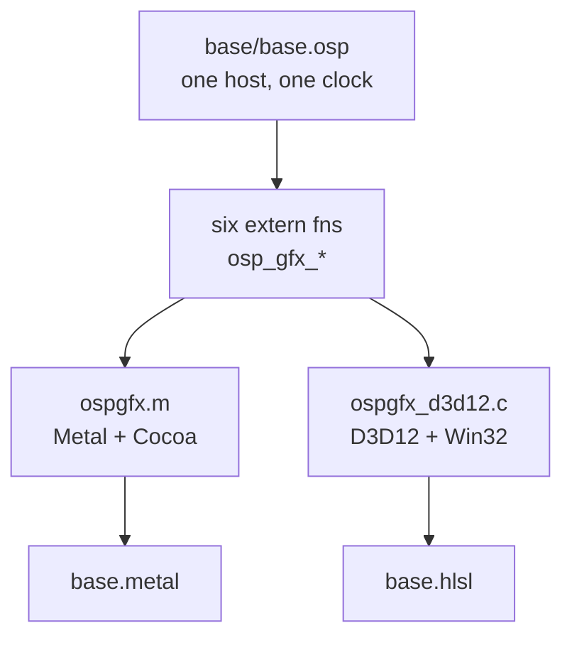

# Osprey graphics examples

Three real-time scenes — `kali`, `opal`, `character` — where Osprey is the host
program and the GPU is the rasteriser. Osprey opens the window, reads the clock,
and recomputes the scene every frame in its own fixed-point arithmetic; a
fragment shader shades every pixel from the parameter slots Osprey pushes into
it.

**The Osprey sources are the same files on every platform.** Not ported, not
conditionally compiled, not `#ifdef`-ed: `base/base.osp` and the three
`scene.osp` entries are byte-identical whether the pixels come out of Metal or
Direct3D 12. A scene names a shader and a fragment entry inside it; each backend
resolves that name into its own dialect. That is the whole arrangement, and
everything below exists to keep it true.



## Layout

```
base/base.osp              the only host: fixed-point trig, motion + look tables
kali|opal|character/       one osprey.toml + one two-line scene.osp each
base.metal                 macOS shader library: 3 named fragment entries
base.hlsl                  the Direct3D 12 twin of base.metal, entry for entry
ospgfx.m                   macOS bridge: Cocoa window, Metal layer
ospgfx_d3d12.h             Windows bridge: shared uniform ABI and context
ospgfx_d3d12_setup.c       Windows bridge: one-time device/swap-chain bring-up
ospgfx_d3d12.c             Windows bridge: the six exported symbols, frame path
```

Both bridges export the same six symbols with the same semantics: values arrive
in 4096ths (`osp_gfx_set`) or thousandths (`osp_gfx_set_milli`), out-of-range
slots are ignored, `osp_gfx_draw` returns 1 while the window lives and 0 once it
closes, and `osp_gfx_ticks` is milliseconds since the window opened.

`base/base.osp` names `examples/graphics/base.metal` on every platform. The
Windows bridge swaps the extension to `.hlsl`, which is why the scene never
learns which GPU API is underneath it.

## Running it

    make graphics                    # kali
    make graphics SCENE=opal
    make graphics SCENE=character

On macOS that builds `libospgfx.dylib` with clang and checks `base.metal` with
`xcrun metal` first. On Windows it must be run from the **MSYS2 UCRT64 shell** —
the same toolchain that builds Osprey's C runtime there — where it builds
`ospgfx.dll` plus the `libospgfx.dll.a` import library that `// @link: ospgfx`
resolves, checks `base.hlsl` with `fxc.exe` when the Windows SDK's compiler is
on `PATH`, and prepends this directory to `PATH` so the DLL is found at run
time. `make graphics GFX_WARN=-Wall` drops `-Werror` if a warning blocks you.

### Building the Windows bridge with MSVC instead

    cl /nologo /O2 /W4 /LD /Fe:examples\graphics\ospgfx.dll ^
       examples\graphics\ospgfx_d3d12.c examples\graphics\ospgfx_d3d12_setup.c

That produces `ospgfx.dll` and `ospgfx.lib`; the `#pragma comment(lib, ...)`
lines in `ospgfx_d3d12_setup.c` pull in d3d12, dxgi, d3dcompiler, dxguid and
user32, so no explicit library list is needed. Linking an Osprey binary against
it needs an MSVC-targeting driver (`OSPREY_CC=clang-cl`, or clang with
`--target=x86_64-pc-windows-msvc`), because `-lospgfx` only resolves
`ospgfx.lib` under that target. The MinGW path above is the tested-by-CI shape;
this one is offered for people already living in an MSVC toolchain.

## Verification status

`base.metal` and `ospgfx.m` are built and observed working on macOS.

**`base.hlsl`, `ospgfx_d3d12.h`, `ospgfx_d3d12_setup.c`, `ospgfx_d3d12.c` and
the Windows half of the Makefile are unverified.** They were written on a macOS
machine with no MSVC, no Windows SDK, no mingw-w64 and no fxc or dxc, so not one
line of them has been compiled, linked or run. They are careful transcription of
the Metal backend against the Direct3D 12 documentation and nothing more. Each
file says so at the top.

Two things in particular are transcription rather than measurement. The HLSL
constant buffer packs the slot array as `float4[6]` because a `float[24]` in a
cbuffer would take a whole 16-byte register per element and silently misread
every slot — the reasoning is written out in `base.hlsl`, but only a running
frame proves it. And `rotationFromTurns` is transposed relative to its Metal
twin, because Metal's `float2x2` takes columns and HLSL's takes rows; a mistake
there compiles cleanly and spins every scene the wrong way.

The two backends are pinned together by
`crates/osprey-cli/tests/graphics_scenes.rs`, which requires every constant
`base.metal` declares to exist in `base.hlsl`, requires the same named fragment
entries and the same slot count in both, and requires the D3D12 bridge to keep
the same six exports and the same two fixed-point scales as `ospgfx.m`. That
catches drift; it does not catch a shader that will not compile.

Pixel-for-pixel identity across the two platforms is **not** claimed. The
arithmetic is transcribed operation for operation, but fxc and Metal's compiler
fold, reassociate and schedule independently, so the two images should be
indistinguishable rather than bit-equal.

## What a Windows CI job should run

Steps 1 to 4 need no display and no GPU. Step 5 needs a desktop session and a
Direct3D 12 adapter.

1. **Compile every shader entry point.** fxc is the same compiler `D3DCompile`
   is, so this checks exactly what the bridge does at run time.

       fxc.exe -nologo -T vs_5_0 -E osp_vertex -Fo check.cso examples\graphics\base.hlsl
       fxc.exe -nologo -T ps_5_0 -E osp_fragment -Fo check.cso examples\graphics\base.hlsl
       fxc.exe -nologo -T ps_5_0 -E osp_fragment_opal -Fo check.cso examples\graphics\base.hlsl
       fxc.exe -nologo -T ps_5_0 -E osp_fragment_character -Fo check.cso examples\graphics\base.hlsl

2. **Build the bridge, warnings fatal** (MSYS2 UCRT64 shell):

       gcc -shared -O2 -Wall -Werror -o examples/graphics/ospgfx.dll \
           examples/graphics/ospgfx_d3d12.c examples/graphics/ospgfx_d3d12_setup.c \
           -Wl,--out-implib,examples/graphics/libospgfx.dll.a \
           -ld3d12 -ldxgi -ld3dcompiler -ldxguid -luser32

3. **Type-check and link the unchanged Osprey scenes.** `--compile` is what
   exercises `// @link: ospgfx` against the import library from step 2.

       target/release/osprey.exe examples/graphics/kali --check
       target/release/osprey.exe examples/graphics/opal --check
       target/release/osprey.exe examples/graphics/character --check
       target/release/osprey.exe examples/graphics/kali --compile

4. **Run the drift guard:**

       cargo test -p osprey-cli --test graphics_scenes

5. **Open a window and draw.** This is the step that actually proves the
   backend, and the only one that needs hardware:

       PATH="$PWD/examples/graphics:$PATH" \
         timeout 20 target/release/osprey.exe examples/graphics/kali --run

   The scene runs until its window is closed, so it needs a timeout, and it
   prints its own frame count and frame rate on the way out — a run that reports
   zero frames means `osp_gfx_open` refused and said why on stderr.
   `D3D12CreateDevice(NULL, ...)` asks for the default hardware adapter, so a
   runner with no D3D12-capable GPU fails here rather than falling back to the
   WARP software rasteriser; that fallback is not implemented.
