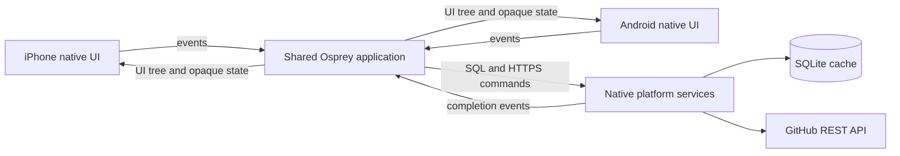
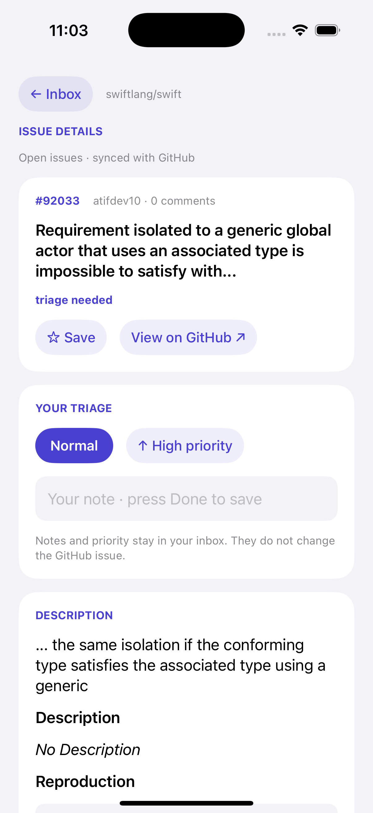
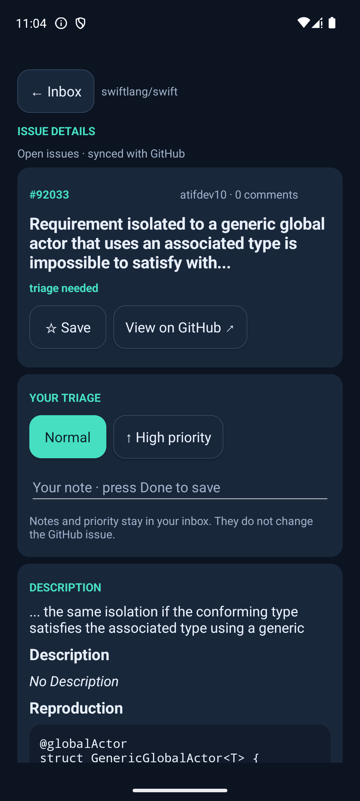

# Osprey Issue Inbox

An iPhone and Android application with shared Osprey state, UI layout, GitHub decoding, and SQLite commands. Browse public repository issues, search titles and authors, open issue details, save issues, add local notes and priorities, and reopen the cached inbox offline. SwiftUI and Android widgets render the same Osprey UI description.

<p align="center">
  
  
</p>

Real captures from the iPhone 17 Pro simulator (left) and Pixel 7 Android emulator (right). iOS shows a completed GitHub refresh; Android shows the same repository restored from SQLite after restart. Physical iPhone verification is recorded in [Validation](#validation).



The native shells contain rendering, transport, and lifecycle code. Application-specific rules, labels, layout, and action definitions live in [`inbox/src/`](inbox/src/). This is an ordinary event-driven Osprey application; no special reactive compiler feature or resumable effect support is required.

## iPhone and simulator

Use an Apple silicon Mac with Xcode, the iOS SDKs, an installed iPhone simulator, and the repository's Rust/LLVM prerequisites. From the repository root:

```sh
make _runtime_ios _runtime_ios_sim
cargo build --release -p osprey-cli
examples/mobile/ios/run.sh ios-sim
examples/mobile/ios/run.sh --smoke
```

Build an unsigned device application with `examples/mobile/ios/run.sh --build ios`. To install a signed build on your connected iPhone:

```sh
OSPREY_DEVELOPMENT_TEAM=YOUR_TEAM_ID examples/mobile/ios/run.sh ios-device
```

Set `OSPREY_DEVICE_ID` to select a physical device, or `OSPREY_SIMULATOR_UDID` to select a simulator. `OSPREY_BIN` selects another compiler binary. The mobile launcher reuses [`../ios/`](../ios/) build/deployment scripts with the shared project, app scheme, and bundle identifier supplied through environment settings.

## Android

The Android application lives in [`android/`](android/), with Kotlin native rendering and a JNI adapter for the generated C interface. It requires JDK 17, Android SDK 34, an installed Android NDK, and an emulator/device running API 26 or later. Its launcher uses a local Gradle installation when available and downloads Gradle 8.7 otherwise. From the repository root:

```sh
make android
examples/mobile/android/run.sh
make android-test
```

`examples/mobile/android/build.sh` builds directly; `examples/mobile/android/run.sh --smoke` runs deterministic fixture and cache-restart checks. Use `--live-smoke` to check actual GitHub responses separately. Set `ANDROID_HOME` or `ANDROID_SDK_ROOT` for the SDK, `ANDROID_NDK_HOME` or `ANDROID_NDK_ROOT` to select an NDK, and `OSPREY_ANDROID_SERIAL` for a particular connected device. The scripts can discover an installed NDK. Set `OSPREY_ANDROID_SKIP_BUILD=1` to install/launch an existing build. The APK includes ARM64 and x86-64 libraries; the launch script requires one connected device unless a serial is supplied.

## Shared application

| Source | Responsibility |
| --- | --- |
| `inbox/src/model.ospml` | Opaque application state and versioned snapshot |
| `inbox/src/update.ospml` | Events, command sequencing, and error handling |
| `inbox/src/annotations.ospml` | Local notes, priorities, and annotation limits |
| `inbox/src/github.ospml` | Repository validation, API URL, response decoding |
| `inbox/src/storage.ospml` | Actual SQLite schema, load/save statements, parameters |
| `inbox/src/view.ospml` | Search, saved filter, counts, and issue presentation |
| `inbox/src/markdown.ospml` | Issue description Markdown to UI nodes and rich spans |
| `inbox/src/ui.ospml` | Native UI tree, labels, layout, and action events |
| `inbox/src/app.ospml`, `main.osp` | Envelope assembly and C-callable scalar start/dispatch wrappers |

`osprey_mobile_start()` and `osprey_mobile_dispatch(model, event)` return JSON containing an opaque model string, structured view, UI tree, and platform commands. Hosts copy the returned string immediately and run emitted SQL/HTTP commands in order. Each completion returns to Osprey as another event. The hosts do not implement issue filtering, bookmarks, SQL selection, or GitHub response decoding.

SQLite stores a versioned inbox snapshot in application storage. A populated cache opens without fetching; Refresh explicitly requests current issues. Successful responses, bookmarks, notes, and priorities are saved. Search/filter choices and the open detail screen remain transient. Failed refreshes keep the previous issues and show the error. Notes and priorities stay in this inbox and never modify the GitHub issue.

Choose Details on a card to read its description and labels, set Normal/High priority, or edit a local note and press Done to save. Descriptions are Markdown: Osprey turns headings, lists, task lists, quotes, fenced code, rules, emphasis, inline code and HTTPS links into UI nodes that both hosts draw natively (`inbox/src/markdown.ospml`). Descriptions show at most 2,000 characters. Notes have the same limit and the cache supports annotations on at most 200 issues.

<p align="center">
  
  
</p>

The detail screen on the iOS simulator (left) and Pixel 7 emulator (right). Layout, labels, selected issue, Markdown rendering, note validation, priority changes, and persistence commands come from Osprey.

The API requests one page of open issues from `swiftlang/swift` initially; enter another `owner/repository` to change it. Osprey excludes pull requests because [GitHub's issue endpoint includes them](https://docs.github.com/en/rest/issues/issues#list-repository-issues). No GitHub credential is required for this public-data example. Authentication, pagination, background refresh, and posting changes to GitHub are not implemented.

## Assertions and diagnostics

From the repository root, `make mobile-domain-test` runs the shared Osprey assertions, `make mobile-ios-test` builds and checks the iOS application, and `make mobile-test` runs shared, iOS, and Android verification together. The combined target requires both platform toolchains and running test devices.

Native smoke tests use a separate SQLite database and exercise the real Osprey archive. iOS uses deterministic HTTP completions to check bound SQL, cache persistence, search, saved filters, bookmarks, detail/annotation events, and visible HTTP failures. It writes `OSPREY_INBOX_SMOKE_OK` to `Documents/inbox-smoke-result.txt`; the launcher requires a fresh result. Android's deterministic smoke exercises the shared app, terminates the process, and verifies its saved cache after restart. Its additional `--live-smoke` mode requires network access and available GitHub rate limits.

For a simulator that already has the app installed, enable local envelope diagnostics with:

```sh
xcrun simctl launch --terminate-running-process booted org.ospreylang.IssueInbox --inbox-diagnostics
xcrun simctl get_app_container booted org.ospreylang.IssueInbox data
```

Use the returned container path to read `Documents/inbox-state.json`. With multiple booted simulators, replace `booted` with the chosen UDID. Adding `--inbox-open-first` opens the first loaded issue automatically, which is how the Markdown detail screenshot is captured with `xcrun simctl io booted screenshot`. Diagnostic output is disabled in ordinary launches.

The native C boundary currently uses the default memory runtime and retains general allocations for the process lifetime. Hosts copy strings but cannot release Osprey allocations through a stable public API yet. Mobile targets reject unsupported features such as resumable effects and built-in native HTTP; platform networking runs through the host command boundary. See the [iOS target](../../docs/specs/0038-iOSTarget.md), [Android target](../../docs/specs/0039-AndroidTarget.md), [application specification](../../docs/specs/0040-ReactiveMobileApplications.md), and [delivery plan](../../docs/plans/0030-reactive-mobile-apps.md).

## Validation

The completed verification run used the actual compiled Osprey application archives:

| Environment | Result |
| --- | --- |
| Physical iPhone 16 | Initial app installed, launched, and passed reactive/SQLite smoke with eight live GitHub issues. The subsequent Markdown build is installed; its launch check awaits an unlocked phone. |
| iPhone simulator | Application build and reactive/SQLite smoke passed; live GitHub data rendered |
| Android ARM64 emulator | C ABI and language checks, reactive/SQLite smoke, process restart, and live GitHub checks passed |
| Android x86-64 | Native archive and APK packaging built; execution was not verified |
| Shared Osprey project | 29 domain checks passed, covering transitions, cache restoration, errors, response correlation, notes, priorities, JSON escaping, and Markdown rendering |

Issue counts reflect that verification run and change with GitHub activity. Run the shared domain checks from the repository root with:

```sh
target/release/osprey examples/mobile/inbox/test --run
```

The iOS and Android commands above reproduce platform builds and smoke checks. Live checks need network access and available GitHub rate limits.

Full repository `make ci` remains failing. Its unchanged Deslop gate reports 9.4% duplication (7,516 of 79,911 lines) against the 5% limit and exits with code 3, stopping CI before later stages. The platform and domain checks above passed independently; they do not mean the full pipeline passed. Deslop writes its detailed report to `target/deslop-report.txt`.
