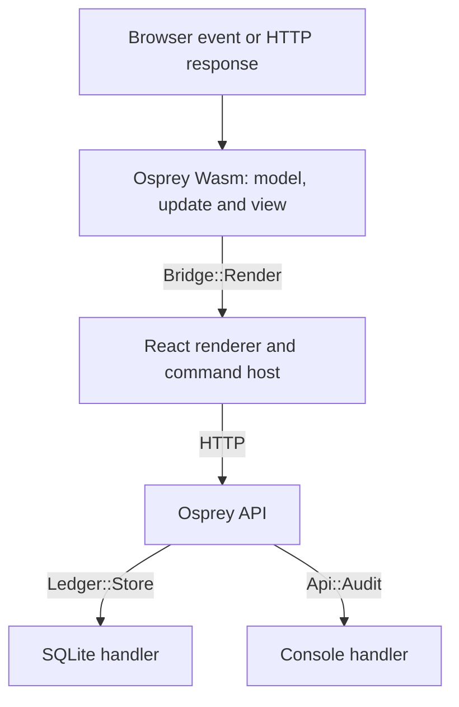

# Talon Bank: algebraic effects across an application

Talon Bank uses callable handlers to choose storage, audit and rendering policies across web, Android and iOS. The native service keeps account data in SQLite; the Osprey WebAssembly client owns routing, validation, state updates and view data. React renders that data and executes HTTP, navigation and focus commands.

## Choose handlers where the app runs

API routes request typed operations such as `perform Ledger::Store.balance id`. They do not receive a database connection. [`Ledger::sqlite`](src/store/ledger.ospml) creates a handler that captures the connection; [`boot`](src/main.ospml) composes it with an audit handler:

```ospml
storage = Ledger::sqlite db
consoleAudit = handler Api::Audit
    log line => print "[audit] ${line}"
consoleAudit (\() => storage (\() => serve db))
```

Constructing a handler installs nothing. Calling it with a callback runs that work under the selected policy. Here, the callback delays `serve db` until both handlers are active. The compiler checks that the called work has handlers for every required operation.

[`Metrics::track`](src/store/metrics.ospml) wraps the same work in a rest-of-block `handle`. Its state module owns the request counter. These two forms share the effects system: use a callable `handler` when a policy should be a value, and `handle` when it should cover the rest of the current block.

Every client uses the value effect, [`Bridge::Render`](client/src/bridge.ospml):

```ospml
export effect Render
    present : string => string

```

`App::start` and `App::receive` accept a render handler, produce an envelope and perform `Render.present` under that handler. The [browser entry points](client/src/main.ospml) select the browser handler for startup and every event. The operation returns the envelope normally to its caller. The browser handler also sends it to JavaScript; the mobile handler returns it through the C ABI to a native renderer. A test can install a recording handler instead of calling the browser import.

[The account tests](test/accounts.test.ospml) exercise a stateful `vault` handler factory: reusing a handler preserves its balance, separate factory calls own separate balances, and a `return` clause converts the workflow's `Outcome` into a testable string. Another handler records whether invalid payments request any storage operation.

## Run

```sh
make bank
```

Open <http://127.0.0.1:18790>. The demo supports accounts, deposits, withdrawals, transfers, a filterable activity ledger and browser navigation. Each run resets the demo SQLite database at `/tmp/talon_bank.db`.

`make bank` rebuilds the browser bundle before serving it. Use `make bank-web` to rebuild only that bundle after changing the client or browser host.

## Native Android and iOS

[The mobile bank](mobile/README.md) uses the same Osprey screens, state transitions, validation, and API as the web client. Android widgets and SwiftUI render the shared view tree with the web palette and a shared Inter font. Both include all five screens, account creation, money movement, journal filtering, notices, and server connection settings.

```sh
make bank-android       # ARM64/x86-64 APK
make bank-ios           # device and simulator apps; requires Xcode
make bank-mobile-domain-test
make bank-android-test  # live API + native UI tests on a connected device/emulator
make bank-ios-test      # live API + iOS simulator tests
```

The API stays on the server. Start it with `make bank`, then follow the [native launch instructions](mobile/README.md). The test targets start and stop their own seeded server.

## Boundaries



| Concern | Implementation |
| --- | --- |
| Storage policy | `src/store/ledger.ospml`: the `Store` contract, SQLite handler factory and SQL operations |
| Audit policy | `src/api/routes.ospml`: mutation events; `src/main.ospml`: console handler |
| Request counts | `src/store/metrics.ospml`: private state and a scoped handler |
| Domain rules | `src/domain/`: whole-cent money behind the `MoneyApi` signature (`Cents` alias, abstract `Amount`), account outcomes and JSON encoding |
| Browser application | `client/src/`: model, update, views and command descriptions |
| Browser output | `client/src/bridge.ospml`: `Render` operation; `client/src/main.ospml`: browser handler |
| Host and build | `web/`: generic React renderer, WASI host and bundle generator |

Transfers commit debit, credit and both journal entries in one SQLite transaction. Refused withdrawals return HTTP 422 and remain in the activity ledger. SQL values use bound parameters; JSON strings are encoded centrally. The browser contains no SQLite implementation: it reaches the ledger through `/api/*`.

Osprey sends one `{model, view, commands}` envelope per render. The host returns the opaque model and a flat event to `osprey_web_dispatch`; see the [host protocol](web/README.md). HTTP diagnostics record request IDs, byte counts and status without financial payloads.

## Checks

| Command | Coverage |
| --- | --- |
| `make bank-test` | Native domain assertions, handler state, return clauses and storage guards |
| `cd examples/projects/modules/web && npm test` | Browser host, protocol, WASI and embedding tests |
| `make bank-e2e` | Real browser, compiled Wasm and native API: accounts, movements, refusals, navigation and rendering |

The deterministic native tour is byte-compared with [`expectedoutput`](expectedoutput) by `crates/osprey-cli/tests/project_e2e.rs`. Browser builds regenerate `src/web/bundle.ospml`; edit its inputs rather than the generated module.

See the [effects guide](../../handlers/README.md), [effects specification](../../../docs/specs/0017-AlgebraicEffects.md), [WebAssembly target](../../../docs/specs/0022-WebAssemblyTarget.md) and [module specification](../../../docs/specs/0025-ModulesAndNamespaces.md).
