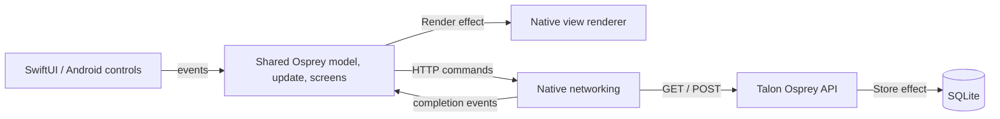

# Talon Bank for Android and iOS

Native Android widgets and SwiftUI render the same Osprey screen definitions as the web bank. All three clients share navigation, state transitions, money validation, account details, forms, activity filters, notices, and the API command protocol. The native apps use the web palette and the same bundled Inter font.

The app includes Overview, Accounts, Move money, Activity, and Security. You can open accounts, deposit, withdraw, transfer, inspect refused overdrafts, search/filter the journal, and refresh. Account data stays in the existing bank service's SQLite database.

## Shared application and handlers

[`app/osprey.toml`](app/osprey.toml) imports the browser client's Osprey modules, excluding its browser-only entry point. Its callable `Bridge::Render` handler returns each `{model, view, commands}` envelope through the native C interface. The same handler contract sends web envelopes to JavaScript. `App::start` and `App::receive` accept the selected handler at the composition boundary; their shared helpers request rendering with `perform`. No bank business rules are reimplemented in Swift or Kotlin.



Native hosts initialize `osprey_main()` once, then call `osprey_talonmobile_start()` and `osprey_talonmobile_dispatch(payload)`. They copy returned strings immediately. Events use the web protocol: a form submits `kind: "submit"`, its ID, and a JSON **string** in `data`; HTTP results use `kind: "http"`, request ID, status, and response body in `data`. The host sends the opaque `model` back with every event.

## Start the API

From the repository root:

```sh
make bank
```

The demo API runs at `http://127.0.0.1:18790`; each server run recreates and seeds `/tmp/talon_bank.db`. Keep this terminal running while using either mobile app. Native connection settings accept a different server origin. For a physical iPhone, that origin must be reachable from the phone; forward the demo service through your development machine's LAN proxy when needed.

## Android

Requires JDK 17, Android SDK 34, NDK 28.2.13676358, and a connected Android device or emulator running API 26 or newer.

```sh
make bank-android
OSPREY_ANDROID_SKIP_BUILD=1 examples/projects/modules/mobile/android/run.sh
```

The build packages ARM64 and x86-64 libraries. The launcher uses `adb reverse tcp:18790 tcp:18790`, so the default loopback URL reaches the development machine from an emulator or USB-connected phone. Set `OSPREY_ANDROID_SERIAL` to choose a device and `TALON_SERVER_URL` to choose another API origin.

The APK is `android/app/build/outputs/apk/debug/app-debug.apk`. The app has its own package, `org.ospreylang.talon`; it can coexist with Issue Inbox.

## iOS

Requires an Apple silicon Mac with Xcode, iOS SDKs, and an installed iPhone simulator. The app requires iOS 16 or later.

```sh
make bank-ios
OSPREY_IOS_SKIP_BUILD=1 examples/projects/modules/mobile/ios/run.sh ios-sim
```

The simulator reaches the Mac's API through the default loopback URL. Change the server in the app's connection settings. For a connected physical phone:

```sh
OSPREY_DEVELOPMENT_TEAM=YOUR_TEAM_ID examples/projects/modules/mobile/ios/run.sh ios-device
```

`OSPREY_SIMULATOR_UDID` and `OSPREY_DEVICE_ID` choose a specific simulator or phone. The app's bundle identifier is `org.ospreylang.TalonBank`.

## Test the apps

Stop the manually running bank server before native acceptance tests. These targets create a fresh seeded server, run the actual native application against it, and clean up their own server process. They refuse to take over an existing bank session.

| Command | Coverage |
| --- | --- |
| `make bank-mobile-domain-test` | Shared Osprey routes, screen data, validation, request payloads, success/refusal/error states, filter/search, handler behavior, and duplicate-submission protection |
| `make bank-android-test` | Android build and instrumentation: native controls, banking journeys, exact API balances, validation, lifecycle restoration, and network failure |
| `make bank-ios-test` | Device/simulator builds, XCTest protocol checks, and simulator UI journeys against the real API |
| `make bank-e2e` | Existing browser tests, verifying changes to shared application modules preserve the web client |

`make bank-mobile-test` runs shared, Android, and iOS checks sequentially; it requires both platform toolchains and test devices. Android instrumentation reports and screenshots live under `android/build/`; iOS produces `.xcresult` bundles with screenshots under `ios/build/ios-sim/`. API build/run logs are in `target/bank-mobile/`.

CI runs shared tests and Android instrumentation in the integration job, and iOS simulator tests in the macOS job.

The underlying mobile C ABI currently uses the default non-reclaiming allocator. Native hosts copy output strings; the compiler does not yet provide a public Osprey allocation-release API.
