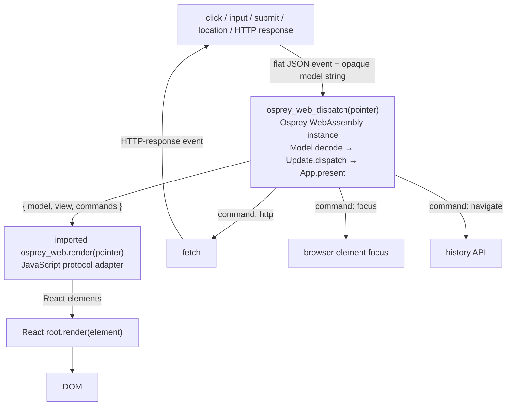
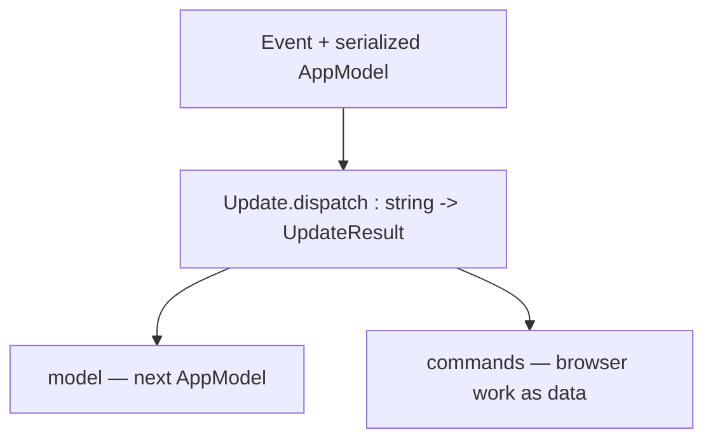
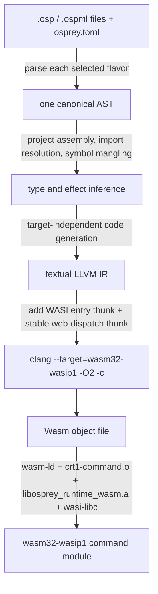

[Talon Bank](https://github.com/Nimblesite/osprey/tree/main/examples/projects/modules) uses algebraic effects for storage, audit logging and browser rendering. Reusable handlers select SQLite and console output on the server, or the browser bridge in the WebAssembly client. Tests replace these implementations around the same application code.

Osprey owns the model, transitions, routes, validation and view description. A JavaScript host executes browser commands and gives the view to React, which updates the DOM. Start with the [effects guide](/docs/effects/) if `handler` and `perform` are new to you.

The host is an application reference in this repository. Its protocol and source can be adapted for another app; there is no published framework package or `osprey new web` scaffold.

## The architecture at a glance



This is a whole-document protocol. Osprey does not call JavaScript once per component or DOM node. It emits one render envelope; JavaScript parses it once; React performs the node-level work on its side of the boundary.

## What each layer owns

| Layer | Owns | Does not own |
|----|----|----|
| Osprey client (`.osp` or `.ospml`) | Serializable model, transitions, routes, validation, view document, command descriptions | DOM nodes, React hooks, `fetch`, browser history |
| Wasm web ABI | UTF-8 string transfer, allocation entry point, stable dispatch export, render/command imports | A component model or networking API |
| JavaScript host | Wasm lifecycle, opaque model retention, event normalization, command execution, telemetry | Domain transitions or page-specific rules |
| React | Element creation and reconciliation inside one root | The authoritative application model |
| Native Osprey server in Talon Bank | HTTP routes, SQLite adapter, storage/audit handlers, embedded assets | Browser rendering |

The server and Wasm client share the bank’s `Money` module. Its signature exposes an integer `Cents` alias and an abstract `Amount`: callers use `Money::fromCents`, `Money::show` and `Money::toCents` while the record representation stays private. The compiler rejects direct construction, field access and passing a raw integer where an amount is required. Native tests cover both source flavors and all three allocators; the browser journeys exercise the same module through WebAssembly.

## The complete startup and event loop

The [client entry point](https://github.com/Nimblesite/osprey/blob/main/examples/projects/modules/client/src/main.ospml) defines the browser-facing dispatcher and `main`:

```osprey-ml
// Browser composition root. The compiler exposes osprey_web_dispatch as a
// callable wasm export; _start invokes main for the initial render.
namespace talon

import talon::App
import talon::Bridge

extern osprey_web_render (payload : string) -> int

browser () = handler Bridge::Render
    present envelope =>
        _rendered = osprey_web_render envelope
        envelope

osprey_web_dispatch payload =
    _envelope = App::receive (browser ()) payload
    0

main () =
    _envelope = App::start (browser ())
    0
```

The sequence is:

1.  The host decodes or fetches the `.wasm` bytes and calls [`WebAssembly.instantiate`](https://developer.mozilla.org/en-US/docs/WebAssembly/Reference/JavaScript_interface/instantiate_static).
2.  It supplies `wasi_snapshot_preview1` plus the `osprey_web.render` and `osprey_web.command` imports.
3.  The host attaches the module's exported linear `memory`, then calls `_start`.
4.  WASI's `_start` reaches Osprey `main`, which passes the `browser ()` handler to `App::start`.
5.  `App::start` runs its render callback under that handler. It creates `Model::initial()` and asks for the initial account and activity data with `Commands::hydrate()`.
6.  `App::present` builds `{model, view, commands}` through `Bridge::present`; its `Render.present` handler calls the imported `osprey_web_render` function.
7.  JavaScript synchronously reads the NUL-terminated JSON string from Wasm memory, stores its opaque `model`, converts `view` to React elements, and calls the React root's `render` method.
8.  After React has been asked to commit, the host executes the envelope's commands. This ordering matters for a focus command whose target has just appeared.
9.  A browser event is flattened to JSON. The host adds the latest model, writes the UTF-8 bytes plus a trailing NUL into Wasm memory, and calls `osprey_web_dispatch`.
10. The dispatcher installs a fresh browser handler, then Osprey decodes the model and event, returns the next model plus commands, and presents a new view. The loop repeats.

Deep-link startup and browser back/forward use the same loop. The host dispatches `{kind:"location",value:window.location.hash}`; Osprey validates the route and selects the page.

## How React fits in

The host creates one React root with [`createRoot`](https://react.dev/reference/react-dom/client/createRoot). For every Osprey render it recursively turns a JSON node into a React element with [`createElement`](https://react.dev/reference/react/createElement):

``` json
{
  "tag": "button",
  "props": {
    "id": "refresh-data",
    "className": "button primary",
    "event": "click",
    "type": "button"
  },
  "children": [
    { "tag": "span", "props": { "className": "button-label" }, "text": "Refresh" }
  ]
}
```

`tag` becomes the first `createElement` argument, filtered DOM props become the second, and text/children become the remaining arguments. Calling `root.render(nextTree)` lets React compare the new tree with the previous one and update the DOM through its normal [render-and-commit lifecycle](https://react.dev/learn/render-and-commit). There is no generated JSX and no bank-specific React component hierarchy.

The adapter chooses a key in this order: `node.key`, `props.key`, `props.id`, then the node's structural path. Stable keys and stable positions allow React to preserve matching DOM nodes; changing them can reset node-local state. See React's explanation of [`key` and state preservation](https://react.dev/learn/preserving-and-resetting-state).

### Events

Osprey declares an event name as data in `props.event` or `props.events`. The adapter installs the corresponding React handler and follows React's normal [event model](https://react.dev/learn/responding-to-events), but sends a small message rather than running domain logic in JavaScript.

| Browser interaction | Message returned to Osprey |
|----|----|
| Click | `{kind:"click", id}` |
| Input/change | `{kind:"input", id, name?, value?}` |
| Submit | `{kind:"submit", id, data}` where `data` is a JSON-encoded `FormData` object |
| Key event | Event kind, element id, and key value |
| Back/forward/deep link | `{kind:"location", value}` |

The adapter prevents default form submission and anchor navigation where it owns the event, then stops propagation. It rejects `dangerouslySetInnerHTML` and DOM props shaped like executable `onX` handlers; events must pass through the declared protocol. Text remains ordinary React text, so React escapes it.

### React state versus Osprey state

The application does not use React `useState`, reducers, or context. That is a deliberate alternative to the patterns in React's [Managing State](https://react.dev/learn/managing-state) guide: application state lives in an Osprey record, while React is the renderer.

The browser still owns genuinely browser-local state:

- uncontrolled input values before a form is submitted;
- the URL and history stack;
- focus and selection;
- in-flight `fetch` requests; and
- bridge telemetry.

If an input must affect application behaviour before submit, follow React's [controlled-input contract](https://react.dev/reference/react-dom/components/input#controlling-an-input-with-a-state-variable): handle its input event and put the value in the Osprey model so the next tree returns that value. If it only matters at submit, the host can leave it uncontrolled in the DOM and serialize the form then.

## The Wasm message ABI

The ABI is intentionally smaller than the application protocol. The compiler and runtime only know how to move strings and expose an entry point; the JSON schema belongs to the host and application.

### Wasm exports consumed by JavaScript

| Export | Purpose |
|----|----|
| `memory` | Shared WebAssembly linear memory |
| `_start` | WASI command-module startup |
| `osp_alloc(length: i64)` | Reserve bytes for a host-to-Wasm message |
| `osprey_web_dispatch(pointer)` | Deliver one event to the Osprey app; exported when that source function exists |

At the JavaScript boundary the `i64` allocation length is normally a `BigInt`. Allocation may grow memory, so the host obtains a fresh `memory.buffer` view after calling `osp_alloc`, copies the message, and then dispatches its pointer.

### JavaScript imports consumed by Wasm

| Import | Purpose |
|----|----|
| `osprey_web.render(pointer)` | Receive a complete render envelope |
| `osprey_web.command(pointer)` | Receive one command or command array outside a render envelope |

Osprey source sees ordinary extern functions:

``` osprey
extern fn osprey_web_render(payload: string) -> int
extern fn osprey_web_command(payload: string) -> int
```

The current Talon client places commands in its render envelope, so it uses the render import for both the view and scheduled work. The separate command import remains available for applications that need it.

### Render envelope

``` json
{
  "model": "{\"route\":\"overview\",\"loading\":\"true\"}",
  "view": { "tag": "main", "props": {}, "children": [] },
  "commands": [
    { "kind": "http", "id": "accounts", "method": "GET", "url": "/api/accounts", "body": "" }
  ]
}
```

`model` is an opaque JSON string from the host's perspective. `view` is the React-neutral element tree. `commands` is an array interpreted after rendering. Every crossing is a NUL-terminated UTF-8 string.

## State management in Osprey

Talon's [`AppModel`](https://github.com/Nimblesite/osprey/blob/main/examples/projects/modules/client/src/model.ospml) is the authoritative application snapshot. It contains route selection, loading flags, notices, modal/menu state, filters, the selected account, and JSON API documents.

The transition shape is explicit:



`Model::decode` reconstructs the record at the start of a dispatch. `Update::dispatch` pattern-matches the event kind and returns an `UpdateResult`. `Model::set` creates a new record with one changed field rather than handing the JavaScript host mutable access to Osprey data. `Model::encode` serializes the next snapshot for the envelope.

The host physically retains that encoded string between Wasm calls, but treats it as opaque. It always adds its latest value at dispatch time. This matters for the two parallel hydration requests: whichever response finishes second sees the model produced after the first response, rather than the boot-time model.

This reference model is intentionally serializable. It is not automatically persisted across reloads or shared between tabs. A host can add session storage, URL encoding, or server persistence, but should version and validate the model instead of assuming old serialized data matches a new app build.

Talon keeps the record deliberately simple: its fields are strings, boolean-like values use `"true"`/`"false"`, and the account/activity documents are escaped JSON strings inside the model JSON. That is an application convention, not a compiler-generated state schema; a reusable framework should replace the stringly protocol with explicit codecs and versioning.

This model loop is also different from an Osprey `state module`. A state module creates handler-owned mutable cells for one installed handler region. Talon's `_start` call finishes before later JavaScript dispatch calls, so such a region would not automatically remain installed around future events. The browser example therefore round-trips an immutable application snapshot instead of relying on durable Wasm-global state.

## Browser work is represented as commands

An update describes work; JavaScript performs it:

``` osprey-ml
module Commands
    export hydrate : Unit -> string
    hydrate () = Json::arr (
        http "accounts" "GET" "/api/accounts" "" + "," +
        http "activity" "GET" "/api/activity" "")
```

The current host understands three command kinds:

| Command | Host action | Completion path |
|----|----|----|
| `http` | Same-origin `fetch`; adds an `X-Osprey-Request-Id` | Dispatches `{kind:"http",id,status,data}` with raw response text |
| `focus` | Focuses an element on the next animation frame | No return event |
| `navigate` | Calls `history.pushState` or `replaceState` | Osprey has already changed its route; later back/forward emits `location` |

This command pattern keeps `Update::dispatch` deterministic for a given event and model. It also keeps browser APIs outside the Wasm module's import surface. Adding a capability means defining a command schema, implementing it in the host, defining its completion event when needed, and testing both directions.

## Algebraic effects: what runs where

The server declares `Ledger::Store` for storage and `Api::Audit` for logging. `Ledger::sqlite db` creates a callable storage handler capturing the database. The startup boundary composes it with the audit handler:

```osprey-ml
storage = Ledger::sqlite db
consoleAudit = handler Api::Audit
    log line => print "[audit] ${line}"
consoleAudit (\() => storage (\() => serve db))
```

Creating either handler installs nothing. Calling it with a callback installs it while that work runs. Tests supply an in-memory store, reuse it across operations, and create independent stores for separate scenarios. The surrounding `Metrics::track` block supplies the request counter.

The client uses the same handler model for its rendering boundary. In [`Bridge`](https://github.com/Nimblesite/osprey/blob/main/examples/projects/modules/client/src/bridge.ospml):

```osprey-ml
export effect Render
    present : string => string

// The browser-only main file installs this policy.
browser () = handler Bridge::Render
    present envelope =>
        _rendered = osprey_web_render envelope
        envelope
```

`Bridge::present` builds the envelope and calls `perform Render.present envelope`. Both startup and the exported event dispatcher install the `browser ()` handler around the application callback. A test can replace the render operation and inspect that envelope without invoking the JavaScript host.

Browser commands such as `http`, `focus` and `navigate` remain JSON data inside the envelope. JavaScript executes them and returns asynchronous HTTP results as new events. A value handler returns the render result immediately; it does not suspend Osprey until the network responds.

### Target support

Callable value handlers, rest-of-block `handle` and static interpretation work on WebAssembly. `handle static` removes effect dispatch during compilation; dynamic value handlers use the runtime handler stack. The compiler checks operation types and missing handlers before generating code.

Dynamic `control` operations require native continuation support and are rejected for WebAssembly and mobile targets. General independently quantified effect rows remain unfinished; the current checker follows operation requirements through the closed program. See [feature status](/status/#algebraic-effects) and [plan 0016](https://github.com/Nimblesite/osprey/blob/main/docs/plans/0016-algebraic-effects-and-handlers.md).

## How an Osprey project becomes `.wasm`



The Wasm driver adds `__main_void`, which WASI's `_start` calls, and adds a stable `osprey_web_dispatch` forwarding thunk when project assembly has mangled the source function name. `wasm-ld` always exports `osp_alloc` and exports the dispatcher when present.

The output is a WASI Preview 1 command module, not a `wasm32-unknown-unknown` library. The Talon host supplies a small browser WASI implementation for process arguments/environment, clocks, random bytes, stdout, and scheduler calls. Unsupported calls return `ENOSYS`. Browser HTTP still uses JavaScript `fetch`; it is not a WASI socket call from Osprey.

### Wasm memory today

Osprey values and strings live in ordinary WebAssembly linear memory. The current `libosprey_runtime_wasm.a` is built with `memory_runtime.c`, whose allocator delegates to `malloc`; escaping allocations are not reclaimed during the instance's lifetime, although LLVM can eliminate provably non-escaping allocations at `-O2`.

The native `--memory=gc` and `--memory=arc` runtime archives are not selected by the current Wasm driver. Passing one of those flags alongside `--target=wasm32` does not change the linked Wasm archive today. Osprey also does not target the WebAssembly GC proposal. Long-lived browser applications should therefore measure linear-memory growth and avoid retaining needlessly large serialized models or render documents.

## Build and run Talon Bank

You need Node.js 20 or later, the Osprey compiler toolchain, `clang` with the Wasm backend, `wasm-ld`, and a WASI sysroot. On macOS, the repository's expected Wasm dependencies are:

``` bash
brew install lld wasi-libc
```

From the repository root:

``` bash
# Compile the Osprey client, bundle React/host/CSS, and embed the Wasm bytes.
make bank-web

# Rebuild the browser bundle, run the native Osprey server, and open the app.
make bank
```

The application is served at `http://127.0.0.1:18790`. The generated `examples/projects/modules/src/web/bundle.ospml` contains the minified CSS and JavaScript, including base64-encoded Wasm. It is generated source: change the client, host, or styles and rerun `make bank-web` rather than editing it.

The example's web build performs four jobs:

1.  esbuild bundles React, the host, and CSS for the browser;
2.  `osprey examples/projects/modules/client --target=wasm32 --compile` builds the multi-file client project;
3.  the embed script replaces one sentinel with the Wasm bytes; and
4.  it generates an Osprey `Bundle` module whose `style()` and `script()` values the native server returns as `/app.css` and `/app.js`.

Embedding is a deployment choice, not an ABI requirement. A static host could serve the `.wasm`, JavaScript, and CSS separately and fetch the Wasm bytes at startup.

## Build your own app

A minimal project follows the same boundaries:

``` text
my-app/
  client/
    osprey.toml
    src/
      main.ospml       # main + osprey_web_dispatch
      model.ospml      # serializable application state
      update.ospml     # Event × Model -> Model × Commands
      view.ospml       # JSON element-document constructors
      commands.ospml   # browser work as data
      bridge.ospml     # envelope + osprey_web_render extern
  web/
    src/
      host.js          # Wasm lifecycle and command interpreter
      protocol.js      # JSON node -> React element
      wasi.js          # minimal WASI Preview 1 host
      index.jsx
```

Start by adapting the reference host rather than installing it from npm; the package is private and still contains Talon-specific names, error copy, and telemetry. Keep the ABI functions and protocol adapter generic as you replace those details.

Compile a directory project by pointing the compiler at the directory that contains `osprey.toml`:

``` bash
osprey path/to/my-app/client --target=wasm32 --compile -o path/to/app.wasm
```

Then bundle or load the module with a host that supplies its WASI and `osprey_web` imports. Serve the app over HTTP rather than opening an HTML file directly; browser module loading and `fetch` are origin-based.

When extending the framework:

- keep one authoritative serializable model;
- keep `update` free of direct browser calls and return command data;
- assign stable ids or keys to nodes whose DOM-local state must survive;
- add commands and completion events in pairs;
- validate messages at both sides of the Wasm boundary;
- keep large binary data out of JSON render envelopes; and
- add a migration rule before persisting model strings across releases.

## Source tour

| Concern | Reference implementation |
|----|----|
| Composition and page selection | [`client/src/app.ospml`](https://github.com/Nimblesite/osprey/blob/main/examples/projects/modules/client/src/app.ospml) |
| Serializable model | [`client/src/model.ospml`](https://github.com/Nimblesite/osprey/blob/main/examples/projects/modules/client/src/model.ospml) |
| Event transitions | [`client/src/update.ospml`](https://github.com/Nimblesite/osprey/blob/main/examples/projects/modules/client/src/update.ospml) |
| View constructors | [`client/src/ui.ospml`](https://github.com/Nimblesite/osprey/blob/main/examples/projects/modules/client/src/ui.ospml) |
| Browser commands | [`client/src/commands.ospml`](https://github.com/Nimblesite/osprey/blob/main/examples/projects/modules/client/src/commands.ospml) |
| Render boundary | [`client/src/bridge.ospml`](https://github.com/Nimblesite/osprey/blob/main/examples/projects/modules/client/src/bridge.ospml) |
| Wasm + React lifecycle | [`web/src/host.js`](https://github.com/Nimblesite/osprey/blob/main/examples/projects/modules/web/src/host.js) |
| Element/event protocol | [`web/src/protocol.js`](https://github.com/Nimblesite/osprey/blob/main/examples/projects/modules/web/src/protocol.js) |
| Browser WASI shim | [`web/src/wasi.js`](https://github.com/Nimblesite/osprey/blob/main/examples/projects/modules/web/src/wasi.js) |
| Compile/bundle pipeline | [`web/scripts/build.mjs`](https://github.com/Nimblesite/osprey/blob/main/examples/projects/modules/web/scripts/build.mjs) |
| Wasm ABI runtime | [`compiler/runtime/web_runtime.c`](https://github.com/Nimblesite/osprey/blob/main/compiler/runtime/web_runtime.c) |
| Compiler Wasm linker | [`crates/osprey-cli/src/wasm.rs`](https://github.com/Nimblesite/osprey/blob/main/crates/osprey-cli/src/wasm.rs) |

## Current limitations

- The host is a reference implementation, not a versioned public web package.
- The JSON view, event, command, and model schemas are application conventions rather than compiler-checked framework types, and there is no protocol-version negotiation.
- Rendering sends the complete view document and serializes the model on every event; there is no incremental Wasm-side component protocol.
- The renderer is client-only. It uses `createRoot`, not server rendering or `hydrateRoot`, so initial app content is not pre-rendered HTML.
- WebAssembly rejects unsupported fibers, socket HTTP/WebSocket, process, terminal and arbitrary C imports before code generation. Approved browser imports and supported host filesystem operations remain available.
- Dynamic control handlers require native continuation support; value-operation handlers work on Wasm.
- The current Wasm runtime uses the non-reclaiming allocator, so a long-lived app must watch linear-memory growth.
- Routing is hash-based only. The example has no pathname deep links, route parameters, query parser, or React Router integration.
- HTTP commands run concurrently without cancellation, timeout, or stale-response generation checks; applications with overlapping requests must add those policies.
- React protects text and the adapter blocks raw HTML/callback props, but the host still trusts protocol-provided tags, URLs, and most DOM properties. Treat view documents as trusted application output, not sanitized third-party input.
- The example protocol is JSON and synchronous at the boundary. Very large or high-frequency payloads may need a narrower or binary protocol, but that is not implemented by the reference host.

## Testing the full stack

``` bash
# JavaScript protocol, host, embedding, and WASI unit tests
cd examples/projects/modules/web
npm test

# Compile the real Osprey client/server and drive it in Chromium
cd ../../../..
make bank-e2e

# Compiler Wasm ABI/linker tests
cargo test -p osprey-cli wasm::tests
```

The browser suite covers Wasm boot, route changes, HTTP round trips, model updates, forms, responsive navigation, bridge telemetry, and injection-safe text rendering. The compiler's Wasm differential suite separately compares the portable Osprey examples with their native expected output.

## Native Android and iOS

The [native Talon Bank apps](https://github.com/Nimblesite/osprey/tree/main/examples/projects/modules/mobile) reuse these Osprey screens, validation, state transitions, and command descriptions. SwiftUI and Android widgets render the same view tree; a mobile handler returns its envelope through the C ABI. They connect to the same bank API, with native form controls and a shared font and palette. See the mobile README for build commands and platform test results.

## Related documentation

- [WebAssembly target specification](/spec/0022-webassemblytarget/)
- [Algebraic effects guide](/docs/effects/)
- [Algebraic effects specification](/spec/0017-algebraiceffects/)
- [Modules, namespaces, and state modules](/spec/0025-modulesandnamespaces/)
- [Memory-management backends](/spec/0018-memorymanagement/)
- [React `createRoot`](https://react.dev/reference/react-dom/client/createRoot)
- [React `createElement`](https://react.dev/reference/react/createElement)
- [React render and commit](https://react.dev/learn/render-and-commit)
- [React event handling](https://react.dev/learn/responding-to-events)
- [React controlled inputs](https://react.dev/reference/react-dom/components/input#controlling-an-input-with-a-state-variable)
- [React state preservation and keys](https://react.dev/learn/preserving-and-resetting-state)
