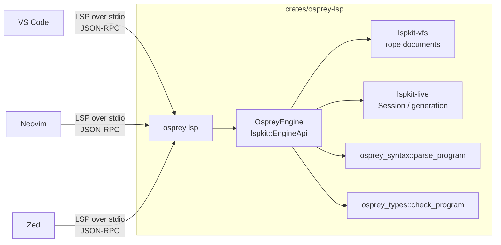
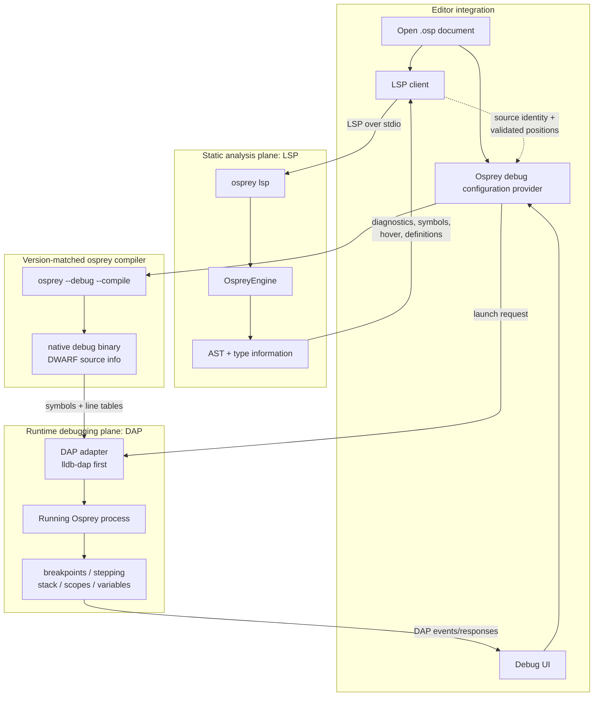
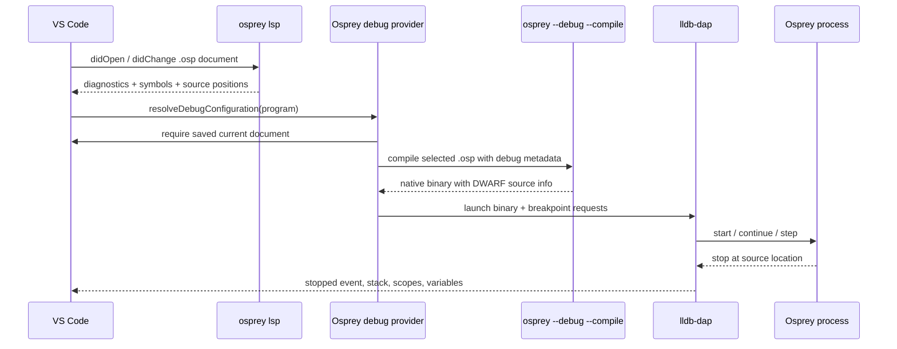

# Language Server & Editor Integrations

> **Engineering spec** (tooling), not part of the `0001`–`0019` language
> reference. It defines how Osprey is presented to editors: one language server,
> many front-ends.

This spec governs the Osprey language server and every editor integration built
on it — VS Code today, Neovim and Zed next. The guiding rule: **one engine,
many surfaces.** Analysis is computed once, in-process, by a single Rust binary;
every editor is a thin client over the same LSP transport.

> **Flavor layer — shared core (AST and above).**  The language server is the
> one component that must *select* a flavor per document: it parses through
> `osprey_syntax::parse_program_for_path(uri, text)`, which resolves the flavor
> from the `.osp`/`.ospml` extension plus a leading `// osprey: flavor=` marker
> (`[FLAVOR-SELECT]` in [Language Flavors](/spec/0023-languageflavors/)), so a
> `.ospml` document is analysed by the ML frontend rather than misreported as
> broken Default syntax. Past that parse, every feature — diagnostics, hover,
> completion, signature help, navigation — runs flavor-blind over the canonical
> `osprey_ast::Program`; nothing downstream of lowering knows which surface
> ([Default](/spec/0023-languageflavors/) or [ML](/spec/0024-mlflavorsyntax/)) produced
> it.

## Status

| Surface                                          | State                                                                                                                                                           |
| ------------------------------------------------ | --------------------------------------------------------------------------------------------------------------------------------------------------------------- |
| Language server (`osprey lsp`, Rust on `lspkit`) | **Shipped** — replaced the TypeScript server ([#137](https://github.com/Nimblesite/osprey/pull/137)).                                                           |
| VS Code extension (`nimblesite.osprey`)          | **Shipped** — per-platform VSIX bundling a version-matched compiler.                                                                                            |
| Debugger (`osprey --debug` + DAP)                | Planned / in progress — source-level native debugging via DWARF + LLDB-DAP; see [Debugger](/spec/0021-debugger/) and [Plan 0012](https://github.com/Nimblesite/osprey/blob/main/docs/plans/0012-osprey-debugger.md). |
| Open VSX                                         | Planned.                                                                                                                                                        |
| Neovim                                           | Planned. The server is editor-agnostic; only a client recipe is missing.                                                                                        |
| Zed                                              | Planned (`shipwright-zed`).                                                                                                                                     |
| MCP surface (`lspkit-mcp`)                       | Future — the same `EngineApi` vended as MCP tools.                                                                                                              |

## Architecture: one engine, two surfaces `[LSP-ENGINE]`

The server is built on the [`lspkit`](https://github.com/Nimblesite/lspkit)
crates — the published `lspkit-*` building blocks, not a fork. Its headline
contract is **"one engine, two surfaces"**: a single `EngineApi` implementation
backs both an LSP server and (later) an MCP server, so live analysis state is
computed once and vended two ways.



The engine threads each open document's path into `osprey_syntax`, so the
parse entry point is the flavor-selecting `parse_program_for_path` rather than
a fixed-flavor parse; the resolved flavor is invisible to `osprey_types` and
everything else above the AST (`[FLAVOR-SELECT]`, see
[Language Flavors](/spec/0023-languageflavors/)).

### Debugger Integration `[DEBUGGER-EDITOR]`

The debugger fits into the editor architecture through the LSP-backed analysis
plane. LSP remains the source-of-truth plane for diagnostics, symbols, hover,
definition, completion, and source identity. A debug launch uses that same
source model, but runtime control is carried over DAP: breakpoints, stepping,
stack frames, scopes, and variables. Both planes are rooted in the same
version-matched `osprey` compiler, so they must agree on file identity,
line/column encoding, and generated debug metadata.



During a VS Code launch, the LSP is already live and has the current document
snapshot. The debug provider must use that editor/LSP context to choose the
program, save or reject dirty state, compile a debug binary, and then hand
runtime control to DAP.



Key consequence: the server **does not shell out** to the `osprey` binary or
scrape stderr. It calls the compiler front-end directly
([`crates/osprey-lsp/src/diagnostics.rs`](https://github.com/Nimblesite/osprey/blob/main/crates/osprey-lsp/src/diagnostics.rs)),
so diagnostics, hover, and navigation share the compiler's own parser and type
checker. There is exactly one source of truth.

Crates consumed (all from crates.io, pinned via the workspace):

| Crate           | Used for                                                                                         |
| --------------- | ------------------------------------------------------------------------------------------------ |
| `lspkit`        | `EngineApi` trait + neutral types.                                                               |
| `lspkit-server` | JSON-RPC framing, `Dispatcher`, `Capabilities`, `DiagnosticsBus`/`DiagnosticsSink`, URI helpers. |
| `lspkit-vfs`    | Open-document store, rope incremental edits, `PositionEncoding` negotiation.                     |
| `lspkit-live`   | `Session` generation counter + broadcast.                                                        |

### Reuse lspkit maximally `[LSP-REUSE-LSPKIT]`

Anything editor-neutral is taken from `lspkit-*`, never re-implemented in
`osprey-lsp`. When a needed primitive is **language-agnostic but missing**
upstream, the rule is: use a thin local shim **and file an issue** so the shim
can be deleted once `lspkit` ships it — the local copy is a temporary bridge,
not a fork. The current example is word-at-position / occurrence / position
re-measurement (used by hover, references, signature help): these are pure text
primitives with no Osprey specifics, so they belong in `lspkit-vfs`. Tracked as
[`lspkit#2`](https://github.com/Nimblesite/lspkit/issues/2); the shim lives in
[`crates/osprey-lsp/src/text.rs`](https://github.com/Nimblesite/osprey/blob/main/crates/osprey-lsp/src/text.rs) and is
marked for removal on resolution.

## Transport `[LSP-TRANSPORT]`

There is **one** server entry point for every editor:

```
osprey lsp
```

It speaks LSP over **stdio** with `Content-Length` framing. No socket, no port,
no per-editor binary. An editor integration is configured by pointing its LSP
client at this command; nothing else is editor-specific. The subcommand is
implemented in [`crates/osprey-cli/src/main.rs`](https://github.com/Nimblesite/osprey/blob/main/crates/osprey-cli/src/main.rs)
(delegating to `osprey_lsp::run_stdio`).

## Lifecycle `[LSP-LIFECYCLE]`

Standard LSP handshake and document sync:

- `initialize` → advertise capabilities (`[LSP-CAPABILITIES]`); `initialized`.
- `shutdown` → `exit`. After `shutdown`, requests fail with `EngineError::ShuttingDown`.
- Document sync (incremental, `textDocumentSync: 2`): `didOpen`, `didChange`,
  `didClose`. A `didChange` applies **either** a full replacement **or** a set
  of incremental edits — never an open+change at the same version (which silently
  drops edits). Dropped edits are surfaced, not swallowed.
- `$/cancelRequest` is accepted. Requests are served sequentially: Osprey
  single-file ASTs parse in microseconds, so request-level concurrency is a
  deliberate non-goal until profiling shows a need.

## Capabilities `[LSP-CAPABILITIES]`

The server advertises and implements:

| Capability       | Method                            | Notes                                                                                                                                                                                       |
| ---------------- | --------------------------------- | ------------------------------------------------------------------------------------------------------------------------------------------------------------------------------------------- |
| Diagnostics      | `textDocument/publishDiagnostics` | Push, via `DiagnosticsBus`. `[LSP-DIAGNOSTICS]`                                                                                                                                             |
| Hover            | `textDocument/hover`              | Markdown. Functions/builtins → signature; **`let`/`mut` bindings (local _and_ top-level) → their declared or inferred type**; any declaration's `///` docs rendered as prose. `[LSP-HOVER]` |
| Go to definition | `textDocument/definition`         | AST-driven, anchored on the identifier.                                                                                                                                                     |
| Find references  | `textDocument/references`         | Whole-word scan; `includeDeclaration` honored.                                                                                                                                              |
| Document symbols | `textDocument/documentSymbol`     | Flat `DocumentSymbol`s; range on the **name**, not the `fn`/`let`/`type` keyword.                                                                                                           |
| Signature help   | `textDocument/signatureHelp`      | Active-parameter tracking; ignores `,`/`(`/`)` inside strings and `//` comments.                                                                                                            |
| Completion       | `textDocument/completion`         | Keywords/snippets + the document's own declarations.                                                                                                                                        |

Capabilities are the contract clients rely on; adding one means updating
`initialize_result` in
[`crates/osprey-lsp/src/wire.rs`](https://github.com/Nimblesite/osprey/blob/main/crates/osprey-lsp/src/wire.rs) **and** this
table.

## Hover `[LSP-HOVER]`

`textDocument/hover` answers "what is the thing under my cursor?" entirely from
the AST + the type checker — never by shelling out. The word under the cursor is
located with the shared text primitives (`[LSP-REUSE-LSPKIT]`); the matching
declaration is found by walking the parsed program, and the reply is Markdown: a
fenced code line (the signature or `name: type`) optionally followed by the
declaration's documentation as prose. Implemented in
[`crates/osprey-lsp/src/features.rs`](https://github.com/Nimblesite/osprey/blob/main/crates/osprey-lsp/src/features.rs)
(`hover`) over [`analysis.rs`](https://github.com/Nimblesite/osprey/blob/main/crates/osprey-lsp/src/analysis.rs)
(`collect_all_symbols`).

Resolution order for the symbol under the cursor:

1. A built-in (`print`, `map`, …) → its reference signature.
2. A user **function** → its `fn name(params) -> ret` signature.
3. A **`let`/`mut` binding** → `[LSP-HOVER-VARIABLES]`.

### Variable hover `[LSP-HOVER-VARIABLES]`

Every binding is hoverable, not just top-level declarations:

- **Collection is deep.** `collect_all_symbols` walks _into_ every
  expression that can contain a block — function bodies, `handle … in …`,
  `match`/`select` arms, lambdas, `spawn`/`await`, interpolations, call
  arguments, list/map/object literals — so a `let` nested anywhere (e.g. inside
  an HTTP handler's `in { … }` block) is found. A cursor-line/“nearest binding
  at or before the cursor” rule resolves shadowing.
- **Type comes from inference when unannotated.** An annotated `let x: T = …`
  shows `x: T`. An unannotated `let x = f()` shows the **inferred** type: the
  checker publishes every `let`'s resolved type keyed by source position
  (`ProgramTypes.lets`, queried via `let_type`), the same position-keyed
  mechanism already used for lambda parameters. The binding position is anchored
  on the declaration's `let`/`mut` keyword so a leading doc comment never shifts
  it. Implemented across
  [`osprey-types`](https://github.com/Nimblesite/osprey/blob/main/crates/osprey-types/src/check.rs) (`let_tys`) and
  [`osprey-types/src/info.rs`](https://github.com/Nimblesite/osprey/blob/main/crates/osprey-types/src/info.rs).

### Documentation comments `[LSP-HOVER-DOCS]`

Every declaration form can be documented — `fn`, `let`/`mut`, `type`, `effect`,
`extern`, and `module` — in **both flavors** (`///` in Default, `(** … *)` in
ML). The doc comment is lowered into the structured
[`DocComment`](/spec/0026-documentationcomments/) on the AST node's `doc` field, and
hover renders it as Markdown (summary, body, then recognised sections) beneath
the signature/type line. See [Documentation Comments](/spec/0026-documentationcomments/)
for the full model, sigils, sections, and body markup.

```osprey
/// The greeting shown to the operator on connect.
let banner = "hello"
```

Hovering `banner` shows `banner: string` followed by _"The greeting shown to the
operator on connect."_

**Doc-link hover `[DOC-LINK]`.** A `[Symbol]` intra-doc link inside a doc
comment is itself hoverable: putting the cursor on `[helper]` or
`[Console.emit]` shows the referenced declaration's own hover. Rendering lives
in [`osprey-lsp/src/features.rs`](https://github.com/Nimblesite/osprey/blob/main/crates/osprey-lsp/src/features.rs)
(`doc_link_target` / `resolve_link`); doc capture lives in
[`osprey-syntax/src/docparse.rs`](https://github.com/Nimblesite/osprey/blob/main/crates/osprey-syntax/src/docparse.rs)
and each flavor's lowerer.

## Position encoding `[LSP-ENCODING]`

The server negotiates `positionEncoding` at `initialize` (default **UTF-16**).
Tree-sitter reports columns as **byte** offsets, so every position crossing the
wire is re-measured into the negotiated encoding
([`crates/osprey-lsp/src/text.rs`](https://github.com/Nimblesite/osprey/blob/main/crates/osprey-lsp/src/text.rs),
`byte_col_to_encoding`). A client that negotiates UTF-8 must receive UTF-8
offsets; this is not optional.

## Analyzer Lints `[LSP-ANALYZER]`

The language server is also Osprey's **analyzer**: beyond type and effect errors
it runs a set of **style lints** that keep source minimal and idiomatic. Lints
are computed on the canonical `osprey_ast::Program` plus the inferred type
tables, so they are **flavor-blind** ([FLAVOR-BOUNDARY](/spec/0023-languageflavors/#the-one-law))
— one lint fires identically for a `.osp` and its `.ospml` twin — and each ships
a **code action (autofix)** so the editor rewrites the offending text in one
keystroke. CI runs the same analyzer in deny mode, so a lint is a hard failure,
not a hint. **Status: specified; the redundant-symbol rule below is the first to
be implemented.**

### Redundant symbols `[ANALYZER-REDUNDANT-SYMBOL]`

**The first and highest-priority analyzer rule.** Osprey is terse in *both*
flavors; a symbol the compiler can derive on its own is noise. This lint flags —
and its autofix **deletes** — every **redundant type annotation**: any annotation
whose type the Hindley-Milner checker already infers
([TYPE-NO-REDUNDANT-ANNOTATION](/spec/0004-typesystem/#hindley-milner-inference)).

| Redundant form | Autofix result |
| --- | --- |
| `fn add(a: int, b: int) = a + b` | `fn add(a, b) = a + b` |
| `fn isEven(x) -> bool = (x % 2) == 0` | `fn isEven(x) = (x % 2) == 0` |
| `let n: int = 0` | `let n = 0` |
| `\|x: int\| => x * 2` | `\|x\| => x * 2` |
| ML `add : int -> int` over an inferable `add x = …` | delete the signature line |
| needless `fn main()` / ML `main () =` wrapping a script | unwrap to bare top-level statements |

**Decision procedure.** The annotation is redundant ⇔ re-running inference with
it removed yields the *same* principal type **and** the same lowered AST/IR. The
lint checks the written annotation against the inferred type; if they match and
the annotation is not load-bearing, it reports a `quickfix` that removes the
symbol (and, for a needless `main`, dedents the body — `main` is synthesised from
trailing top-level statements, so the script runs unchanged).

**Never flagged (load-bearing).** The lint must not touch an annotation the
checker cannot infer: an empty literal (`let xs: List<int> = []`), the ambiguous
empty map `{}`, an `extern` boundary, an unconstrained polymorphic variable a
caller must pin, or a return type that *forces* `Result<T, E>` auto-unwrap to `T`
([Result Auto-Unwrapping](/spec/0004-typesystem/#result-auto-unwrapping)). Removing
one of these changes the program, so it is not redundant. A `main` that takes
arguments or returns a real exit code is likewise kept.

This lint is the enforcement arm of
[TYPE-NO-REDUNDANT-ANNOTATION](/spec/0004-typesystem/#hindley-milner-inference); the
two specs move together.

## Editor integrations

Every integration is a thin client over `[LSP-TRANSPORT]`. They differ only in
packaging and in how the version-matched binary is sourced (`[EDITOR-VERSIONING]`).

### VS Code `[EDITOR-VSCODE]`

- Extension id `nimblesite.osprey`; client in
  [`vscode-extension/client/src/extension.ts`](https://github.com/Nimblesite/osprey/blob/main/vscode-extension/client/src/extension.ts)
  spawns `osprey lsp` over stdio.
- Shipped as a **per-platform VSIX** (`darwin-arm64`, `darwin-x64`, `linux-x64`,
  `win32-x64`). Each VSIX **bundles** a version-matched `osprey` binary + runtime
  libs + a stamped `shipwright.json`, verified present inside the package at build
  time.
- Client resolves the server command in priority order: user setting
  (`osprey.server.compilerPath`) → bundled binary → `PATH` (per the Shipwright
  `sources` list in [`shipwright.json`](https://github.com/Nimblesite/osprey/blob/main/shipwright.json)).
- The debugger contribution is part of the same extension but is not an LSP
  request. It uses the LSP/editor context to resolve the current `.osp` program,
  invokes the version-matched compiler as `osprey --debug --compile`, and starts
  a DAP session (initially `lldb-dap`) against the resulting native binary.
- Pressing F5 MUST start a real debug session. It MUST NOT cancel the debug
  session and shell out to `osprey --run`; that path belongs only to the
  `osprey.run` command.
- Marketplace publication uses **OIDC** (no PAT) — see `[EDITOR-VERSIONING]` and
  the release plan.

### Open VSX `[EDITOR-OPENVSX]`

The same per-platform VSIX is published to [Open VSX](https://open-vsx.org) for
VSCodium, Cursor, Windsurf, and Gitpod users. Open VSX has **no** OIDC support
(as of 2026); it uses a separate long-lived `OVSX_PAT`. The Open VSX job MUST be
independent of the Marketplace job so neither gates the other.

### Neovim `[EDITOR-NEOVIM]`

No VSIX. Neovim runs `osprey lsp` directly via `vim.lsp` / `nvim-lspconfig`:

```lua
vim.lsp.config('osprey', {
  cmd = { 'osprey', 'lsp' },
  filetypes = { 'osprey' },
  root_markers = { '.git', 'osprey.toml' },
})
```

The binary is sourced from the user's `PATH` (Homebrew/Scoop/GitHub release).
Versioning is the installed binary's own version (`[EDITOR-VERSIONING]`); there
is no bundling step.

### Zed `[EDITOR-ZED]`

A Zed extension (Rust compiled to WASM) registers Osprey as a language and
declares its language server command (`osprey lsp`), published to the Zed
extension registry. Version-matching and binary acquisition follow
[`shipwright-zed`](https://github.com/Nimblesite/Shipwright). Like Neovim, the
binary comes from `PATH`/package managers, not a bundle.

## Versioning & supply chain `[EDITOR-VERSIONING]`

All editor integrations obey the
[Shipwright](https://github.com/Nimblesite/Shipwright) version contract — the
extension and the binary it launches MUST be version-matched.

- The binary is the source of truth: `osprey --version` → `osprey X.Y.Z`;
  `osprey --version --json` → the version manifest (`[SWR-VERSION-CLI-OUTPUT]`).
- Components are declared in [`shipwright.json`](https://github.com/Nimblesite/osprey/blob/main/shipwright.json):
  `osprey` (the CLI — which _is_ the language server, via the `lsp`
  subcommand) and `osprey-vscode`. The component id **must** equal the name the
  binary reports from `osprey --version` (Shipwright matches the probed name
  against the component id), so the CLI component is `osprey`, not
  `osprey-compiler`. The LSP is **not** a separate component; it is
  the same binary, so no separate version surface exists to drift.
- Source version fields stay at `0.0.0-dev`; the real version is stamped from the
  git tag at build time (`[SWR-VERSION-BUILD-STAMPING]`). Hard-coding a version is
  a defect.
- VS Code activation verifies the bundled compiler against the manifest and
  prompts to reinstall on mismatch (`hosts.vscode.onMismatch`). PATH/registry
  sources are verified at startup (`verifyStartup`).
- Marketplace publishing uses GitHub OIDC → Microsoft Entra workload-identity
  federation, with no stored PAT (`[SWR-VSIX-PUBLISH]`, `[SWR-SEC-OIDC-PUBLISH]`).
  Concrete tenant/app identifiers live in the private
  `Nimblesite/NimblesiteDeployment` ops repo; the release wiring is in the plan.

## Conformance

A change to this spec is conformant only if:

1. Every editor still launches the **same** `osprey lsp` stdio server
   (`[LSP-TRANSPORT]`) — no editor-specific analysis logic.
2. New capabilities update both `initialize_result` and the `[LSP-CAPABILITIES]`
   table.
3. Debugger integration keeps static analysis in LSP and runtime control in DAP;
   both must use the same source identity and position model
   (`[DEBUGGER-EDITOR]`, `[LSP-ENCODING]`).
4. VS Code F5 starts a real DAP debug session; it does not proxy to
   `osprey --run` (`[EDITOR-VSCODE]`).
5. No source file hard-codes a version (`[EDITOR-VERSIONING]`).
6. Code implementing a section references its ID in a comment
   (e.g. `// Implements [LSP-CAPABILITIES]`), enforced by `spec-check`.